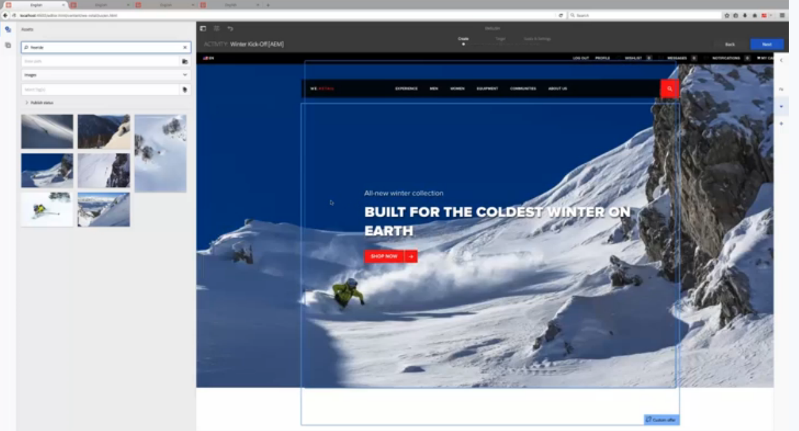

# 在多個網站中使用目標內容{#working-with-targeted-content-in-multisites}

如果您需要管理目標內容，例如網站之間的活動、體驗和選件，則可針對目標內容運用AEM內建的多網站支援。

>[!NOTE]
>
>使用目標內容的多網站支援是一項進階功能。 若要使用此功能，您應熟悉[多網站管理員](/help/sites-administering/msm.md)以及[Adobe Target整合](/help/sites-administering/target.md)與AEM。

本檔案說明下列項目：

* 提供目標內容AEM多網站支援的簡短概述。
* 說明如何連結網站（以一個品牌）的一些可能使用案例。
* 提供行銷人員如何使用此功能的範例逐步說明。
* 有關如何對目標內容實作多網站支援的詳細指示。

若要設定網站分享個人化內容的方式，您必須執行下列步驟：

1. [建立新區](#creating-new-areas) 域或 [將新區域建立為即時副本](#creating-new-areas)。區域包含可用於頁面&#x200B;*area*&#x200B;的所有活動；即元件定位於頁面上的位置。 建立新區域會建立空白區域，而建立新區域作為即時副本可讓您跨網站結構繼承內容。

1. [將您的網站或頁](#linking-sites-to-an-area) 面連結至某個區域。

您可以隨時暫停或還原繼承。 此外，如果您不想暫停繼承，也可以建立本機體驗。 預設情況下，除非您另有指定，否則所有頁面都使用「主版區域」。

## 目標內容{#introduction-to-multisite-support-for-targeted-content}的多網站支援簡介

目標內容的多網站支援可立即使用，且可讓您從透過MSM管理的主版頁面推送目標內容至本機即時副本，或讓您管理此類內容的全域和本機修改。

您可以在&#x200B;**區域**&#x200B;中管理此操作。 區域會區隔不同網站中使用的目標內容（活動、體驗和選件），並提供MSM型機制，以建立及管理目標內容的繼承與網站繼承。 如此一來，您就不必按照AEM 6.2之前的要求，在繼承的網站中重新建立目標式內容。

在某個區域中，只有連結至該區域的活動會推送至即時副本。 預設情況下，將選中「主區域」(Master Area)。 建立其他區域後，您可以將這些區域連結至您的網站或頁面，以指出要推播的目標內容。

網站或即時副本連結至某個區域，其中包含該網站或即時副本上需要使用的活動。 依預設，網站或即時副本連結會連結至主版區域，但您也可以連結除主版區域以外的其他區域。

>[!NOTE]
>
>對目標內容使用多網站支援時，請注意下列事項：
>
>* 使用轉出或即時副本時，需要MSM授權。
>* 使用與Adobe Target同步時，需要Adobe Target授權。

>

## 使用案例{#use-cases}

您可以根據您的使用案例，透過多種方式為目標內容設定多網站支援。 本節說明此功能在理論上如何搭配一個品牌運作。 此外，在[範例中：根據地理定位內容](#example-targeting-content-based-on-geography)，您可以看到在多個網站中定位內容的實際應用程式。

目標內容會包裝在所謂區域中，定義網站或頁面的範圍。 這些區域是在品牌層級定義。 一個品牌可包含多個區域。 品牌之間的區域可以不同。 雖然一個品牌可能只包含主版區域，因此會在所有品牌間共用，但另一個品牌可能包含多個品牌（例如，依地區）。 因此，品牌不需要反映它們之間的一組區域。

透過目標內容的多網站支援，例如，您可以有兩個（或多個）具有&#x200B;**一個**&#x200B;品牌的網站，其中一個品牌如下：

* 完全&#x200B;*distinct*&#x200B;的一組目標內容 — 編輯其中的目標內容不會影響另一個內容。 連結至不同區域的網站會讀取和寫入其自己設定的區域。 例如：

   * 站點A連結到區域X
   * 站點B連結到區域Y

* *共用*&#x200B;目標內容集 — 其中一個編輯對這兩個網站確實有直接影響；您可以讓兩個網站參照相同區域來設定此設定。 連結至相同區域的網站會在此區域內共用目標內容。 例如：

   * 站點A連結到區域X
   * B站點連結到X區

* 透過MSM從其他網站繼承&#x200B;*的不同目標內容集* — 內容可從主版統一推出至即時副本。 例如：

   * 站點A連結到區域X
   * 站點B連結到區域Y（區域X的即時副本）

您也可以在一個網站中使用&#x200B;**多個**&#x200B;品牌，其複雜度可能比此範例更高。

>[!NOTE]
>
>如需更多技術了解此功能，請參閱[如何架構目標內容的多網站管理](/help/sites-authoring/technical-multisite-targeted.md)。

## 範例：根據地理{#example-targeting-content-based-on-geography}定位內容

針對目標內容使用多網站可讓您共用、轉出或隔離個人化內容。 為了更好地說明如何使用此功能，請考慮您要根據地理位置控制如何推出目標內容的案例，如下列案例所示：

根據地理位置，相同網站有四個版本：

* **美國**&#x200B;網站位於左上角，是主網站。 在此範例中，它會以「定位」模式開啟。
* 此網站的其他三個版本為&#x200B;**Canada**、**Great Britain**&#x200B;和&#x200B;**Australia**，這三個版本均為即時副本。 這些網站會以「預覽」模式開啟。

每個網站會分享地理區域的個人化內容：

* 加拿大與美國共用主區。
* 大英國與歐洲地區相連，從主地區繼承。
* 澳大利亞因為位於南半球，季節性產品不適用，所以有自己的個性化內容。

在北半球，我們建立了一個冬季活動，但在男性觀眾中，北美的市場營銷人員想要一個不同的冬季影像，所以他/她在美國的網站上改變了它。

重新整理索引標籤後，加拿大網站會變更為新影像，而我們不需採取任何動作。 它這樣做是因為它與美國共用主區域。 在大不列顛和澳大利亞的網站上，形象並不改變。

行銷人員想要將這些變更轉出至歐洲地區，並點選或按一下「轉出頁面」**，轉出即時副本](/help/sites-administering/msm-livecopy.md)。 [**&#x200B;重新整理索引標籤後，大不列顛網站會有新影像，因為歐洲區域會從主版區域繼承（轉出後）。

澳洲網站中的影像維持不變，這是所需的行為，因為現在是澳洲的夏季，行銷人員不想變更該內容。 澳大利亞的站點不會更改，因為它不與任何其他區域共用一個區域，也不是另一區域的即時副本。 行銷人員不必擔心澳大利亞網站的目標內容會被覆寫。

此外，對於面積是主版區域即時副本的大不列顛，您可以透過活動名稱旁的綠色指標查看繼承狀態。 如果繼承了活動，則除非掛起或分離即時副本，否則無法修改該活動。

您隨時可以暫停繼承或完全分離繼承。 您也可以一律新增只能供該體驗使用的本機體驗，而不暫停繼承。

>[!NOTE]
>
>如需更多技術了解此功能，請參閱[如何架構目標內容的多網站管理](/help/sites-authoring/technical-multisite-targeted.md)。

### 建立新區域與建立新區域為livecopy {#creating-a-new-area-versus-creating-a-new-area-as-livecopy}

在AEM中，您可以選擇建立新區域或將新區域建立為LiveCopy。 建立新區域會將活動和屬於這些活動的任何項目（例如選件、體驗等）分組。 當您想要建立一組完全不同的目標內容，或想要共用一組目標內容時，可以建立新區域。

不過，如果您已透過兩個網站之間的MSM設定繼承，則您可能想繼承活動。 在此情況下，您會將新區域建立為即時副本，其中Y是X的即時副本，因此也會繼承所有活動。

>[!NOTE]
>
>預設轉出會在頁面是連結至區域（其本身是連結至頁面藍圖之區域的即時副本）的即時副本時，觸發目標內容的後續轉出。

例如，在下圖中，有四個網站共用主版區域（以及屬於該區域的所有活動），一個網站有一個區域是某個區域的即時副本，因此在轉出時會共用活動，而另一個網站完全獨立（因此需要一個區域來執行其活動）。

若要在AEM中達成此目標，請執行下列動作：

* 站點A連結到主版區域 — 無需建立區域。 預設情況下，在AEM中會選取「主版區域」。 網站A和B共用活動等。
* 站點B連結到主版區域 — 無需建立區域。 預設情況下，在AEM中會選取「主版區域」。 網站A和B共用活動等。
* 站點C連結到繼承區域，該區域是主版區域 — 將區域建立為即時副本的即時副本，您可以在其中根據主版區域建立即時副本。 轉出時，繼承區域會繼承主區域中的活動。
* 站點D連結到其自己的隔離區 — 建立區域，在此處建立一個全新區域，但尚未定義任何活動。 隔離區域不會與任何其他網站共用活動。

## 建立新區域{#creating-new-areas}

區域可以橫跨活動和選件。 在其中一個區域（例如活動）中建立區域後，您也可以在另一個區域（例如選件）中使用該區域。

>[!NOTE]
>
>當您點選或按一下品牌名稱，直到您建立其他區域為止，預設會收合名為「主版區域」 **的** 「預設區域」。然後，當您在「活動」或「選件」控制台中選 **取品牌** 時，您會看到「 **區域****** 」控制台。

要建立新區域，請執行以下操作：

1. 導覽至「 **個人化** >活動 **** 」或「選 **件** 」，然後導覽至您的品牌。
1. 點選或按一下「**建立區域**」。

   

1. 按一下&#x200B;**Area**&#x200B;圖示，然後按一下&#x200B;**Next**。
1. 在&#x200B;**Title**&#x200B;欄位中，輸入新區域的名稱。 （可選）選擇標籤。
1. 點選或按一下&#x200B;**建立**。

   AEM會重新導向至品牌視窗，視窗中會列出任何已建立的區域。 如果「主版區域」以外還有其他區域，則您可以直接在「品牌」主控台中建立區域。

   

## 將區域建立為Live Copy {#creating-areas-as-live-copies}

您可以建立一個區域作為即時副本，以便跨網站結構繼承目標內容。

要將區域建立為LiveCopy:

1. 導覽至「 **個人化** >活動 **** 」或「 **選件** 」，然後導覽至您的品牌。
1. 點選或按一下「將區域建立為即時副本」**。**

   

1. 選取您要製作即時副本的區域，然後按一下&#x200B;**Next**。

   

1. 在「名 **稱** 」欄位中，輸入即時副本的名稱。依預設，會包含子頁面；選中「排除子頁 **面」核取方塊** ，以排除它們。

   

1. 在&#x200B;**轉出設定**&#x200B;下拉式選單中，選取適當的設定。

   如需每個選項的說明，請參閱[已安裝的轉出設定](/help/sites-administering/msm-sync.md#installed-rollout-configurations)。

   有關Live Copy的詳細資訊，請參閱[建立和同步Live Copy](/help/sites-administering/msm-livecopy.md)。

   >[!NOTE]
   >
   >將頁面轉出至即時副本，且為Blueprint頁面設定的區域也是為頁面即時副本設定的區域的Blueprint時，LiveAction **personalizationContentRollout**&#x200B;會觸發同步subRollout，此為&#x200B;**標準設定轉出**&#x200B;的一部分。

1. 點選或按一下&#x200B;**建立**。

   AEM會重新導向至品牌視窗，視窗中會列出任何已建立的區域。 如果「主版區域」之外還有其他區域，則可以直接從品牌視窗建立區域。

   

## 將站點連結到區域{#linking-sites-to-an-area}

您可以將區域連結至頁面或網站。 區域會由所有子頁面繼承，除非這些頁面是由子頁面上的對應覆蓋。 不過，通常您是在網站層級連結。

當您連結時，只有選取區域中的活動、體驗和選件可供使用。 這可防止意外混合獨立管理的內容。 如果未設定其他區域，則會使用每個品牌的主區域。

>[!NOTE]
>
>參考相同區域的頁面或網站會使用&#x200B;*same*&#x200B;共用的活動、體驗和選件集。 編輯由多個網站共用的活動、體驗或選件會影響所有網站。

要將站點連結到區域，請執行以下操作：

1. 導覽至您要連結至區域的網站（或頁面）。
1. 選取網站或頁面，然後點選或按一下「**檢視屬性**」。
1. 點選或按一下&#x200B;**個人化**&#x200B;標籤。
1. 在&#x200B;**品牌**&#x200B;功能表中，選取您要連結區域的品牌。 選取品牌後，「區域參考」**功能表中會顯示可用區域。**

   

1. 從&#x200B;**Area Reference**&#x200B;下拉式選單中選取區域，然後點選或按一下&#x200B;**Save**。

   

## 正在分離目標內容的即時副本或掛起繼承{#detaching-live-copy-or-suspending-inheritance-of-targeted-content}

您可能想要暫停或分離目標內容的繼承。 會針對每個活動暫停或分離即時副本。 例如，您可能想要修改活動中的體驗，但如果該活動仍連結至繼承的復本，則您無法修改體驗或任何活動的屬性。

暫停即時副本會暫時中斷繼承，但您日後可以還原繼承。 分離即時副本會永久中斷繼承。

您可以在活動中還原目標內容，以暫停或分離其繼承。 如果頁面或網站連結至即時副本的區域，您可以檢視活動的繼承狀態。

繼承自其他網站的活動會在活動名稱旁標示為綠色。 暫停的繼承會標示為紅色，而本機建立的活動沒有圖示。

>[!NOTE]
>
>* 您只能在活動中暫停或分離即時副本。
>* 您不需要暫停或分離即時副本來擴充繼承的活動。 您一律可以為該活動建立&#x200B;**new**&#x200B;本機體驗和選件。 如果要修改現有活動，則需要暫停繼承。

>

### 掛起繼承{#suspending-inheritance}

若要暫停或分離活動中目標內容的繼承：

1. 導覽至您要分離或暫停繼承的頁面，然後點選或按一下模式下拉式選單中的&#x200B;**目標定位**。
1. 如果您的頁面連結至即時副本的區域，您會看到繼承狀態。 點選或按一下&#x200B;**開始鎖定目標**。
1. 若要暫停活動，請執行下列其中一項操作：

   1. 選取活動的元素，例如對象。 AEM會自動顯示「暫停即時副本」確認方塊。 （您可以在整個鎖定目標程式中點選或按一下任何元素，以暫停即時副本。）
   1. 從工具列的下拉式選單中選取「暫停即時副本」 **。**

   

1. 點選或按一下「**暫停**」以暫停活動。 已暫停的活動會以紅色標示。

   

### 中斷繼承{#breaking-inheritance}

若要中斷活動中目標內容的繼承：

1. 導覽至您要從主版分離即時副本的頁面，然後點選或按一下模式下拉式選單中的&#x200B;**目標定位**。
1. 如果您的頁面連結至即時副本的區域，您會看到繼承狀態。 點選或按一下&#x200B;**開始鎖定目標**。
1. 從工 **具列的下拉式選單中選取「分離即時副本** 」。AEM會確認您要分離即時副本。
1. 點選或按一下「**分離**」以從活動中分離即時副本。 分離後，不再顯示關於繼承的下拉式功能表。 活動現在是本機活動。

   

## 還原目標內容的繼承{#restoring-inheritance-of-targeted-content}

如果您已暫停活動中目標內容的繼承，則可以隨時還原。 不過，如果您已分離即時副本，則無法還原繼承。

若要還原活動中目標內容的繼承：

1. 導覽至您要還原繼承的頁面，然後點選或按一下模式下拉式選單中的&#x200B;**目標定位**。
1. 點選或按一下&#x200B;**開始鎖定目標**。
1. 從工 **具列的下拉式選單選取「繼續即時副本** 」。

   

1. 點選或按一下&#x200B;**繼續**&#x200B;以確認您要繼續即時副本繼承。 如果您繼續繼承，對目前活動所做的任何修改都會遺失。

## 刪除區域{#deleting-areas}

刪除區域時，將刪除該區域中的所有活動。 AEM會在您刪除區域之前發出警告。 如果您確實刪除了網站連結的區域，此品牌的對應會自動重新對應至主版區域。

刪除區域：

1. 導覽至「**個人化** > **活動**&#x200B;或「**選件**」，然後導覽至您的品牌。
1. 點選或按一下您要刪除之區域旁的圖示。
1. 點選或按一下&#x200B;**Delete**，然後確認您要刪除區域。
