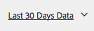

# 檢視頁面分析資料{#seeing-page-analytics-data}

使用頁面分析資料來評估頁面內容的成效。

## 從主控台可見的Analytics {#analytics-visible-from-the-console}

頁面分析資料顯示在Sites主控台的[清單檢視](/help/sites-authoring/basic-handling.md#list-view)中。 當頁面以清單格式顯示時，預設會提供下列欄：

* 頁面檢視
* 獨特訪客
* 頁面逗留時間

每一欄會顯示目前報告期間的值，也會指出值自上一個報告期間以來是否有所增減。 您看到的資料每12小時更新一次。

>[!NOTE]
>
>若要變更更新期間，[設定匯入間隔](/help/sites-administering/adobeanalytics-connect.md#configuring-the-import-interval)。

1. 開啟&#x200B;**網站**&#x200B;主控台；例如[http://localhost:4502/sites.html/content](http://localhost:4502/sites.html/content)
1. 在工具列的最右側（右上角），按一下圖示以選取&#x200B;**清單檢視** （顯示的圖示將取決於[目前檢視](/help/sites-authoring/basic-handling.md#viewing-and-selecting-resources)）。

1. 再次，在工具列的最右側（右上角），按一下圖示，然後選取&#x200B;**檢視設定**。 **設定資料行**&#x200B;對話方塊開啟。 進行任何必要的變更，並透過&#x200B;**更新**&#x200B;確認。

   

### 選取報告期間 {#selecting-the-reporting-period}

選取Analytics資料出現在Sites Console上的報告期間：

* 最近 30 天的資料
* 最近 90 天的資料
* 今年的資料

目前的報告期間會顯示在網站主控台的工具列上（在頂端工具列的右側）。 使用下拉式清單來選取所需的報表期間。

### 設定可用的資料欄 {#configuring-available-data-columns}

analytics-administrators使用者群組的成員可以設定Sites主控台，讓作者檢視額外的Analytics欄。

>[!NOTE]
>
>當頁面的樹狀結構包含與不同Adobe Analytics雲端設定相關聯的子項時，您無法為頁面設定可用的資料欄。

1. 在清單檢視中，使用檢視選擇器（工具列右側），選取&#x200B;**檢視設定**，然後&#x200B;**新增自訂分析資料**。

   

1. 選取您要在Sites主控台中公開給作者的量度，然後按一下[新增]。**&#x200B;**

   顯示的欄是從Adobe Analytics中擷取的。

   

### 從Sites開啟內容分析 {#opening-content-insights-from-sites}

從Sites主控台開啟[內容分析](/help/sites-authoring/content-insights.md)以進一步調查頁面有效性。

1. 在Sites主控台中，選取您要檢視其內容深入分析的頁面。
1. 在工具列上，按一下Analytics和Recommendations圖示。

   

## 從頁面編輯器可見的Analytics (Activity Map) {#analytics-visible-from-the-page-editor-activity-map}

>[!NOTE]
>
>如果您的網站已設定[Activity Map](/help/sites-administering/adobeanalytics-connect.md#configuring-for-the-activity-map)，便會顯示此專案。

>[!NOTE]
>
>Activity Map的資料擷取自Adobe Analytics。

當您的網站已[設定為Adobe Analytics](/help/sites-administering/adobeanalytics-connect.md)時，您可以使用[模式Activity Map](/help/sites-authoring/author-environment-tools.md#page-modes)來檢視相關資料。 例如：

### 存取Activity Map {#accessing-the-activity-map}

選取[Activity Map](/help/sites-authoring/author-environment-tools.md#page-modes)模式後，系統會要求您輸入Adobe Analytics認證。

顯示&#x200B;**Analytics**&#x200B;浮動工具列；您可以：

* 使用雙箭號(**>**)變更工具列格式
* 切換頁面詳細資料（眼睛圖示）
* 配置Activity Map設定（cog圖示）
* 選取要顯示的分析（各種下拉式選取器）
* 結束Activity Map並關閉工具列(x)

### 選取要顯示的分析 {#selecting-the-analytics-to-show}

您可以使用各種條件來選取要顯示的分析資料，以及應如何顯示：

* **標準**/**即時**

* 事件型別
* 使用者群組
* **泡泡圖**/**漸層**/**獲益者和損失者**/**關閉**

* 要顯示的期間

### 設定Activity Map {#configuring-the-activity-map}

使用&#x200B;**顯示設定**&#x200B;圖示開啟&#x200B;**Activity Map設定**&#x200B;對話方塊。

**Activity Map設定**&#x200B;對話方塊在三個索引標籤上提供一系列選項：

* 一般

   * 報表套裝
   * 頁面名稱
   * 語言
   * 標籤覆蓋圖表示方式
   * 標簽字型大小
   * 漸層顏色
   * 泡泡顏色
   * 顏色漸層根據
   * 漸層透明度

* 標準

   * 顯示（連結型別和數目）
   * 隱藏未收到點選之連結的覆蓋圖

* 即時

   * 顯示排名最前的（獲益者或損失者）
   * 排除最後%
   * 自動更新（資料和期間）
