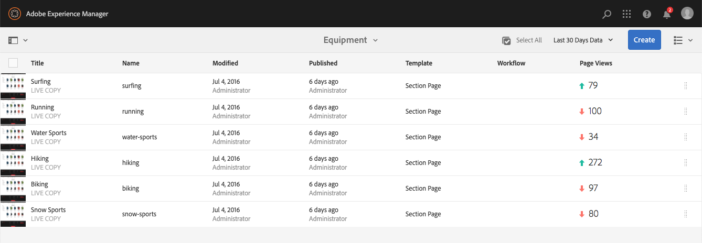

# 檢視頁面分析資料{#seeing-page-analytics-data}

使用頁面分析資料來評估頁面內容的有效性。

## 從主控台顯示的分析 {#analytics-visible-from-the-console}

頁面分析資料會顯示在 [網站主控台的](/help/sites-authoring/basic-handling.md#list-view) 「清單檢視」中。 當頁面以清單格式顯示時，預設情況下可使用以下列：

* 頁面檢視
* 獨特訪客
* 頁面逗留時間

每個欄會顯示目前報告期間的值，並指出該值自上一個報告期間以來是否增加或減少。 您看到的資料每12小時更新一次。

>[!NOTE]
>
>若要變更更新期間，請 [設定匯入間隔](/help/sites-administering/adobeanalytics-connect.md#configuring-the-import-interval)。

1. 開啟 **Sites** Console;例如 [https://localhost:4502/sites.html/content](https://localhost:4502/sites.html/content)
1. 在工具列的最右側（右上角），按一下或點選圖示以選取「清單檢視」( **List View** )(顯示的圖示將視目前 [的檢視而定](/help/sites-authoring/basic-handling.md#viewing-and-selecting-resources))。

1. 同樣地，在工具列的最右側（右上角），按一下或點選圖示，然後選取「檢視 **設定」**。 將會 **開啟「配置列** 」對話框。 進行任何必要的變更，並使用「更新」 **進行確認**。

   

### 選擇報告期 {#selecting-the-reporting-period}

選取Analytics資料會顯示在Sites主控台上的報表時段：

* 最近 30 天的資料
* 最近 90 天的資料
* 今年的資料

目前的報告時段會顯示在Sites主控台的工具列（頂端工具列的右側）上。 使用下拉式清單來選擇所需的報表時段。

### 配置可用資料列 {#configuring-available-data-columns}

分析管理員使用者群組的成員可以設定「網站」主控台，讓作者可以查看額外的Analytics欄。

>[!NOTE]
>
>當頁面樹狀結構包含與不同Adobe Analytics雲端設定相關聯的子系時，您無法設定頁面的可用資料欄。

1. 在清單檢視中，使用檢視選擇器（工具列右側），選取檢 **視設定** , **然後新增自訂分析資料**。

   

1. 在「網站」主控台中，選取您要向作者公開的量度，然後按一下「新 **增」**。

   顯示的欄會從Adobe Analytics擷取。

   

### 從網站開啟內容見解 {#opening-content-insights-from-sites}

從 [Sites主控台開啟Content Insight](/help/sites-authoring/content-insights.md) ，以進一步調查頁面效能。

1. 在「網站」主控台中，選取您要查看其內容分析的頁面。
1. 在工具列上，按一下「Analytics and Recommendations」圖示。

   

## 從頁面編輯器(Activity Map)可見的分析 {#analytics-visible-from-the-page-editor-activity-map}

>[!CAUTION]
>
>由於Adobe Analytics API中的安全性變更，無法再使用AEM中包含的Activity Map版本。
>
>現在 [應使用Adobe Analytics提供的](https://docs.adobe.com/content/help/en/analytics/analyze/activity-map/getting-started/get-started-users/activitymap-install.html) ActivityMap外掛程式。
