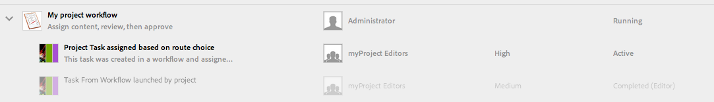

# 使用專案工作流程{#working-with-project-workflows}

現成可用的專案工作流程包括：

* **專案核准工作流程** -此工作流程可讓您指派內容給使用者、檢閱，然後核准。
* **請求啟動** -請求啟動的工作流程。
* **請求著陸頁面** -此工作流程請求著陸頁面。
* **請求電子郵件** -請求電子郵件的工作流程。
* **產品像片拍攝和產品像片拍攝（商務）** -將資產與產品對應
* **DAM建立和翻譯復本與DAM建立語言復本** -為資產和檔案夾建立翻譯的二進位檔、中繼資料和標籤。

根據您選擇的專案範本，您有特定的工作流程可用：

|  | **簡單專案** | **媒體專案** | **產品像片拍攝專案** | **翻譯專案** |
|---|:-:|:-:|:-:|:-:|
| 請求復本 |  | x |  |  |
| 產品像片拍攝 |  | x | x |  |
| 產品像片拍攝（商務） |  |  | x |  |
| 專案核准 | x |  |  |  |
| 請求啟動 | x |  |  |  |
| 請求著陸頁面 | x |  |  |  |
| 要求電子郵件 | x |  |  |  |
| DAM Create Language Copy&amp;ast; |  |  |  | x |
| DAM Create and Translate Language Copy&amp;ast; |  |  |  | x |

>[!NOTE]
>
>&amp;ast;這些工作流程不是從「專案」中的「工 **作流程** 」方塊啟動。 請參 [閱建立資產的語言副本。](/help/sites-administering/tc-manage.md)

不論您選擇何種工作流程，啟動和完成工作流程的步驟都相同。 只有步驟會變更。

您可以直接在「專案」中啟動工作流程（DAM建立語言副本或DAM建立和翻譯語言副本除外）。 有關項目中任何未完成任務的資訊列在「任 **務** 」表徵圖中。 需要完成的任務的通知會顯示在用戶表徵圖旁邊。

如需在AEM中使用工作流程的詳細資訊，請參閱下列：

* [參與工作流程](/help/sites-authoring/workflows-participating.md)
* [將工作流程套用至頁面](/help/sites-authoring/workflows-applying.md)
* [設定工作流程](/help/sites-administering/workflows.md)

本節說明適用於「專案」的工作流程。

## 請求複製工作流程 {#request-copy-workflow}

此工作流程可讓您向使用者請求手稿，然後加以核准。 要啟動請求複製工作流，請執行以下操作：

1. 在您的媒體專案中，選取「工 **作流程」方塊中的** +登入，然後選取「請求復 **制工作流程」******。
1. 輸入手稿標題和您所請求內容的簡短摘要。 如果適用，請輸入目標字數、任務優先順序和到期日。

   

1. 按一下&#x200B;**「建立」**。工作流程開始。 該任務將顯示在「任 **務** 」表徵圖中。

   

## 產品像片拍攝工作流程 {#product-photo-shoot-workflow}

Creative project將詳細說明產品像片拍攝工作流程（不論是商務還是非商務） [的相關內容](/help/sites-authoring/managing-product-information.md)。

## 專案核准工作流程 {#project-approval-workflow}

在「專案核准」工作流程中，您會指派內容給使用者、檢閱，然後核准內容。

1. 在您的「簡單」專案中，選取「工 **`+`** 作流程」方塊中的簽 **名** ，然後選取「專案 **核准工作流程」**。
1. 輸入標題，然後從「團隊」(Team)清單中選擇要將其分配給誰。 如果適用，請輸入說明、內容路徑、任務優先順序和到期日。

   

1. 按一下&#x200B;**「建立」**。工作流程開始。 該任務將顯示在「任 **務** 」表徵圖中。

   

## 請求啟動工作流程 {#request-launch-workflow}

此工作流程可讓您要求啟動。

1. 在您的「簡單」專案中，選取「工 **作流程」方塊中的** +登入，然後選取「請求啟 **動工作流程」******。
1. 輸入啟動的標題並提供啟動來源路徑。 您也可以新增說明和即時日期（如果適用）。 根據您希望啟動的行為方式，選擇「繼承來源頁面即時資料」或「排除子頁面」。

   

1. 按一下&#x200B;**「建立」**。工作流程開始。 **工作流將出現在「工**&#x200B;作流&#x200B;**」清單中(按一下省略**&#x200B;號……)。(在「工 **作流程** 」表徵圖上)。

## 請求著陸頁面工作流程 {#request-landing-page-workflow}

此工作流程可讓您請求著陸頁面。

1. 在您的「簡單」專案中，選 **取「工作流程** 」圖格中的+ **登入** ，然後選取「請求著陸頁面工作流程」。
1. 輸入著陸頁面的標題和父路徑。 如果適用，請輸入即時日期或選擇您登陸頁面的檔案。

   

1. 按一下&#x200B;**「建立」**。工作流程開始。 該任務將顯示在「任 **務** 」表徵圖中。

## 要求電子郵件工作流程 {#request-email-workflow}

此工作流程可讓您要求電子郵件。 它與出現在「電子郵件」方塊中的工作 **流程** 相同。

1. 在您的「媒體」或「簡單」專案中，選取「工 **作流程」方塊中的** + **簽名** ，然後選取「請 **求電子郵件工作流程」**。
1. 輸入電子郵件標題，以及促銷活動和範本路徑。 此外，您還可以提供名稱、說明和即時日期。

   

1. 按一下&#x200B;**「建立」**。工作流程開始。 該任務將顯示在「任 **務** 」表徵圖中。

   

## 建立（和翻譯）資產的語言複製工作流程 {#create-and-translate-language-copy-workflow-for-assets}

「建 **立語言副本** 」和「 **建立和翻譯語言副本」工作流程在「建立資產的語**[言副本」中有詳細說明。](/help/assets/translation-projects.md)
