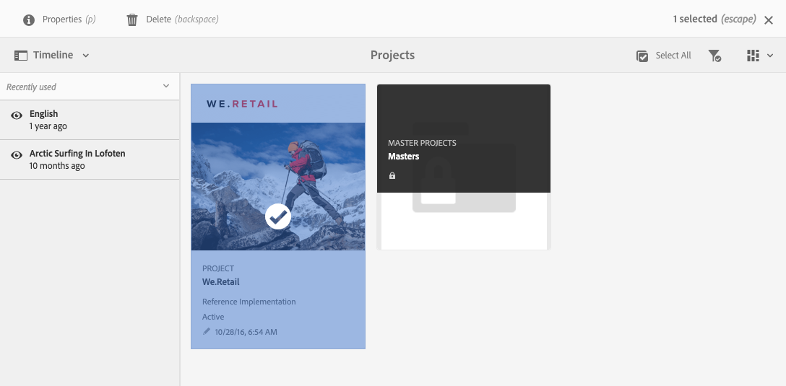
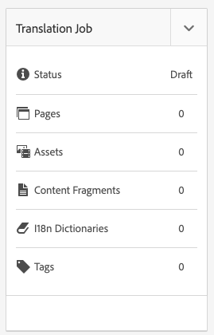

# 專案 {#projects}

項目允許您將資源分組到一個實體中。 通用的共用環境使管理項目變得輕鬆。 可以與項目關聯的資源類型稱為「AEM磁貼」。 磁貼可包括項目和團隊資訊、資產、工作流和其他類型的資訊，如中所述 [項目磁貼。](#project-tiles)

作為用戶，您可以：

* 建立和刪除項目
* 將內容和資產資料夾與項目關聯
* 從項目中刪除內容連結

## 訪問要求 {#access-requirements}

項目標準AEM功能，不需要任何附加設定。

但是，對於項目中的用戶在使用項目時要查看其他用戶/組，例如在建立項目、建立任務/工作流或查看和管理團隊時，這些用戶需要具有對的讀取權限 `/home/users` 和 `/home/groups`。

最簡單的方法就是 **項目用戶** 組讀取訪問權限 `/home/users` 和 `/home/groups`。

## 項目控制台 {#projects-console}

項目控制台是您訪問和管理項目的位AEM置。

「項目」控制台與中的其他控AEM制台類似，允許對單個項目執行許多操作，並調整項目視圖。

### 切換模式 {#modes}

可以使用滑軌選擇器在控制台模式之間進行更改。

#### 僅限內容 {#content-only}

開啟控制台時，「僅內容」是預設模式。 它將顯示您的所有項目。

#### 時間軸 {#timeline}

時間線視圖允許您選擇單個項目並查看其上的活動。 使用滑軌選擇器或熱鍵 `alt+1` 中。

### 切換視圖 {#views}

您可以使用視圖選擇器在將項目視為大磁貼（預設）、將項目視為清單或在日曆上進行更改。

### 篩選您的視圖 {#filter}

您可以使用篩選器在所有項目和僅活動的項目之間切換。

### 選擇和查看項目 {#selecting}

將滑鼠懸停在項目磁貼上並按一下複選標籤，以選擇項目。

通過按一下項目以細化項目的詳細資訊，查看項目的詳細資訊。

### 建立新項目 {#creating}

按一下 **建立** 的子菜單。

## 項目磁貼 {#project-tiles}

項目由您希望一起管理的不同類型的資訊組成。 此資訊由不同的 **磁貼**。

您可以擁有與項目關聯的以下磁貼。

* [資產](#assets)
* [資產收集](#asset-collections)
* [體驗](#experiences)
* [連結](#links)
* [項目資訊](#project-info)
* [團隊](#team)
* [著陸頁面](#landing-pages)
* [電子郵件](#emails)
* [工作流程](#workflows)
* [啟動](#launches)
* [任務](#tasks)

按一下任意磁貼右上角的下拉菜單，向磁貼添加更多資料。

按一下任意磁貼右下角的橢圓按鈕，在其關聯控制台中開啟磁貼的資料。

### 資產 {#assets}

在 **資產** 平鋪，可以收集用於特定項目的所有資產。

您直接在磁貼中上載資產。

### 資產收集 {#asset-collections}

與資產類似，您可以添加 [資產收集](/help/assets/manage-collections.md) 直接到你的項目。 在資產中定義收款。

按一下「新增系列」 **並從清單中選取適當的系列** ，即可新增系列。

### 體驗 {#experiences}

的 **體驗** 磁貼允許您向項目添加移動應用、網站或發佈。

這些表徵圖指示表示哪種體驗。

* 網站
* Mobile應用

### 連結 {#links}

的 **連結** 磁貼允許您將外部連結與項目關聯。

可以使用易於識別的名稱命名連結並更改縮略圖。

### 專案資訊 {#project-info}

的 **項目資訊** 磁貼提供有關項目的一般資訊，包括說明、項目狀態（非活動或活動）、到期日期和成員。 此外，還可以添加項目縮略圖，該縮略圖顯示在主「項目」頁面上。

### 翻譯工作 {#translation-job}

的 **翻譯作業** 磁貼是您開始翻譯的位置，也是您查看翻譯狀態的位置。

要設定翻譯，請參閱文檔 [建立翻譯項目。](/help/assets/translation-projects.md)

### 團隊 {#team}

在此磁貼中，可以指定項目團隊的成員。 編輯時，可以輸入團隊成員的名稱並分配用戶角色。

您可以添加和刪除團隊成員。 此外，您還可以編輯 [用戶角色](#userroles) 分配給團隊成員。

### 著陸頁面 {#landing-pages}

的 **登錄頁** 磁貼允許您請求新登錄頁。

此工作流在文檔中介紹[建立登錄頁工作流。](/help/sites-authoring/projects-with-workflows.md#request-landing-page-workflow)

### 電子郵件 {#emails}

的 **電子郵件** 磁貼可幫助您管理電子郵件請求。 開始 **電子郵件請求** 工作流。

有關詳細資訊，請參見 [請求電子郵件工作流。](/help/sites-authoring/projects-with-workflows.md#request-email-workflow)

### 工作流程 {#workflows}

您可以啟動項目的工作流。 如果有工作流正在運行，則其狀態顯示在 **工作流** 平鋪。

根據您建立的項目，有不同的工作流可用。

這些內容在 [使用項目工作流。](/help/sites-authoring/projects-with-workflows.md)

### 啟動 {#launches}

的 **啟動** 磁貼顯示使用 [請求啟動工作流。](/help/sites-authoring/projects-with-workflows.md)

### 任務 {#tasks}

任務允許您監視任何與項目相關的任務（包括工作流）的狀態。 有關任務的詳細資訊，請參閱 [使用任務](/help/sites-authoring/task-content.md)。

## 項目模板 {#project-templates}

模板是啟動項目的基礎。 提AEM供這些標準項目模板。

* **媒體項目**  — 這是媒體相關活動的參考示例項目。 它包括多個與媒體相關的項目角色，還包括與媒體內容相關的工作流。
* **[產品照片拍攝項目](/help/sites-authoring/managing-product-information.md)**  — 這是管理電子商務相關產品照片的參考示例。
* **[翻譯項目](/help/sites-administering/translation.md)**  — 這是管理與翻譯相關活動的參考示例。 它包括基本角色和用於管理翻譯的工作流。
* **簡單項目**  — 這是任何不適合其他類別的項目的參考示例。 它包括三個基本角色和四個一般工AEM作流。

根據您選擇的模板，您在項目中可以使用不同的選項，如提供的用戶角色和工作流。

## 項目中的用戶角色 {#user-roles-in-a-project}

不同的用戶角色在項目模板中定義，使用的原因有二：

1. 權限：用戶角色分為以下三個類別之一：觀察者、編輯者、所有者。 例如，攝影師或文案撰寫人將具有與編輯者相同的權限。 權限決定用戶可以對項目中的內容執行什麼操作。
1. 工作流：工作流確定項目中為誰分配了任務。 任務可以與項目角色關聯。 例如，可以將任務分配給攝影師，以便所有具有攝影師角色的團隊成員都將獲得該任務。

所有項目都支援以下預設角色，以便您管理安全和控制權限。

| 角色 | 說明 | 權限 | 組成員身份 |
|---|---|---|---|
| 觀察者 | 此角色中的用戶可以查看項目詳細資訊，包括項目狀態。 | 項目的只讀權限 | `workflow-users` 群組 |
| 編輯者 | 此角色中的用戶可以上載和編輯項目的內容。 | 對項目、關聯元資料和相關資產的讀和寫訪問 上載快照清單、照片拍攝以及審閱和批准資產的權限 寫入權限 `/etc/commerce` 修改特定項目的權限 | `workflow-users` 群組 |
| 擁有者 | 此角色中的用戶可以建立項目、在項目中啟動工作，並將批准的資產移到生產資料夾。 項目中的所有其他任務也可由所有者查看和執行。 | 寫入權限 `/etc/commerce` | `dam-users` 組以能夠建立項目 `project-administrators` 可建立項目和移動資產 |

對於創意項目，還提供了諸如攝影師的附加角色。 您可以使用這些角色為特定項目導出自定義角色。

### 自動建立組 {#auto-group-creation}

當您建立專案並將使用者新增至各種角色時，系統會自動建立與專案相關的群組，以管理相關的權限。

例如，名為Myproject的專案會有三個群組 **Myproject Owners**、 **Myproject Editors**、 **Myproject Obsertors**。

如果刪除了項目，則只有選擇了相應選項，才會刪除這些組 [刪除項目時。](/help/sites-authoring/touch-ui-managing-projects.md#deleting-a-project) 管理員還可以手動刪除 **工具** > **安全** > **組**。

## 其他資源 {#additional-resources}

有關使用項目的詳細資訊，請參閱以下附加文檔：

* [管理專案](/help/sites-authoring/touch-ui-managing-projects.md)
* [使用任務](/help/sites-authoring/task-content.md)
* [使用專案工作流程](/help/sites-authoring/projects-with-workflows.md)
* [創意項目與PIM整合](/help/sites-authoring/managing-product-information.md)
