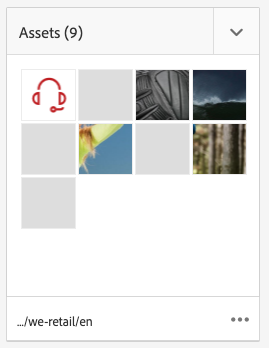
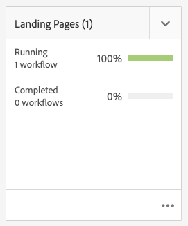

# 專案 {#projects}

專案可讓您將資源群組到一個實體中。共同的共用環境使您的專案容易管理。您可以與專案相關聯的資源類型在 AEM 中稱為圖磚。圖磚可能包括專案和團隊資訊、資產、工作流程和其他類型的資訊，如[專案圖磚](#project-tiles)中詳細所述。

身為使用者，您可以：

* 建立和刪除專案
* 將內容和資產資料夾與專案建立關聯
* 從專案中刪除內容連結

## 存取需求 {#access-requirements}

專案標準AEM功能，不需要任何額外設定。

不過，若要讓專案中的使用者在使用專案時查看其他使用者/群組（例如建立專案、建立工作/工作流程或檢視和管理團隊時），這些使用者必須具有讀取存取權 `/home/users` 和 `/home/groups`.

最簡單的方法就是 **專案 — 使用者** 群組讀取存取權 `/home/users` 和 `/home/groups`.

## 專案主控台 {#projects-console}

專案主控台是您在 AEM 中存取和管理專案的地方。

「專案」主控台類似於AEM中的其他主控台，可允許對個別專案執行數個動作，並調整您對專案的檢視。

### 切換模式 {#modes}

您可以使用邊欄選取器來在主控台模式之間變更。

#### 僅限內容 {#content-only}

開啟主控台時，「僅內容」是預設模式。 它會顯示您的所有專案。

#### 時間軸 {#timeline}

時間軸檢視可讓您選取個別專案並檢視其上的活動。 使用邊欄選取器或快捷鍵 `alt+1` 來變更此檢視。

### 切換您的檢視 {#views}

您可以使用檢視選取器，在以大圖磚（預設值）檢視專案、以清單或日曆檢視專案之間進行變更。

### 篩選檢視 {#filter}

您可以使用篩選器，在所有專案和僅限使用中的專案之間切換。

### 選取和檢視專案 {#selecting}

將滑鼠游標移至專案方塊上並按一下核取記號，以選取專案。

按一下專案以深入了解其詳細資訊，即可檢視專案的詳細資訊。

### 建立新專案 {#creating}

按一下 **建立** 來新增專案。

## 專案圖磚 {#project-tiles}

項目由您希望一起管理的不同類型資訊組成。 此資訊由不同的 **圖磚**.

您可以將以下圖磚與您的專案相關聯。

* [資產](#assets)
* [資產集合](#asset-collections)
* [體驗](#experiences)
* [連結](#links)
* [專案資訊](#project-info)
* [團隊](#team)
* [登陸頁面](#landing-pages)
* [電子郵件](#emails)
* [工作流程](#workflows)
* [Launch](#launches)
* [任務](#tasks)

按一下任何圖磚右上角的下拉式功能表，以新增更多資料至圖磚。

按一下任何圖磚右下角的點按鈕，在其相關的主控台中開啟圖磚的資料。

### 資產 {#assets}

在&#x200B;**資產**&#x200B;圖磚中，您可以收集所有要用於特定專案的資產。

您直接將資產上傳到圖磚。

### 資產集合 {#asset-collections}

與資產類似，您可以將[資產集合](/help/assets/manage-collections.md)直接新增到您的專案中。您在 Assets 中定義集合。

按一下&#x200B;**新增系列**，並從清單中選取適當的系列，即可新增系列。

### 體驗 {#experiences}

此 **體驗** 圖磚可讓您新增行動應用程式、網站或出版物至專案。

圖示會指出要呈現的體驗類型。

* 網站
* 行動應用程式

### 連結 {#links}

此 **連結** 圖磚可讓您將外部連結與專案建立關聯。

您可以使用易於識別的名稱為連結命名，也可以變更縮圖。

### 專案資訊 {#project-info}

此 **專案資訊** 「表徵圖」(tile)提供有關項目的一般資訊，包括說明、項目狀態（非活動或活動）、到期日和成員。 此外，您可以加入專案縮圖，它顯示在主要專案頁面上。

### 翻譯工作 {#translation-job}

此 **翻譯工作** 「圖磚」是您開始翻譯的位置，也是您查看翻譯狀態的位置。

要設定翻譯，請參閱文檔 [建立翻譯專案。](/help/assets/translation-projects.md)

### 團隊 {#team}

在此圖磚中，您可以指定專案團隊的成員。編輯時，您可以輸入團隊成員的姓名並指派使用者角色。

您可以在團隊中新增和刪除團隊成員。此外，您可以編輯指派給團隊成員的[使用者角色](#userroles)。

### 登陸頁面 {#landing-pages}

此 **登錄頁面** 圖磚可讓您要求新的登錄頁面。

此工作流程在檔案中有說明[建立登錄頁面工作流程。](/help/sites-authoring/projects-with-workflows.md#request-landing-page-workflow)

### 電子郵件 {#emails}

此 **電子郵件** 「 」圖磚可協助您管理電子郵件的請求。 它會開始 **電子郵件請求** 工作流程。

如需詳細資訊，請參閱 [要求電子郵件工作流程。](/help/sites-authoring/projects-with-workflows.md#request-email-workflow)

### 工作流程 {#workflows}

您可以開始專案的工作流程。 如果有任何工作流程在執行中，其狀態會顯示在 **工作流程** 方塊。

視您建立的專案而定，有不同的工作流程可供使用。

相關說明請參閱[使用專案工作流程](/help/sites-authoring/projects-with-workflows.md)。

### Launch {#launches}

此 **啟動** 圖磚會顯示已透過 [請求啟動工作流程。](/help/sites-authoring/projects-with-workflows.md)

### 任務 {#tasks}

任務可讓您監控任何專案相關任務的狀態，包括工作流程。如需任務的詳細資訊，請參閱[使用任務](/help/sites-authoring/task-content.md)。

## 專案範本 {#project-templates}

範本是開始專案的基礎。 AEM提供這些標準專案範本。

* **媒體專案**  — 此為媒體相關活動的參考範例專案。 它包含數個與媒體相關的專案角色，也包含與媒體內容相關的工作流程。
* **[產品像片拍攝專案](/help/sites-authoring/managing-product-information.md)**  — 此為管理電子商務相關產品攝影的參考範例。
* **[翻譯專案](/help/sites-administering/translation.md)**  — 這是管理翻譯相關活動的參考範例。 它包含基本角色，並包含管理翻譯的工作流程。
* **簡單專案**  — 這是任何不適合其他類別的專案的參考範例。 其中包括三個基本角色和四個一般AEM工作流程。

根據您選取的範本，您在專案中可以使用不同的選項，例如提供的使用者角色和工作流程。

## 專案中的使用者角色 {#user-roles-in-a-project}

項目模板中定義了不同的用戶角色，其使用原因有二：

1. 權限：使用者角色分為下列三個類別之一：觀察者、編輯、所有者。 例如，攝影師或文案撰寫者擁有與編輯相同的權限。 權限決定使用者可對專案內容進行的操作。
1. 工作流程：工作流程會決定專案中指派工作的人員。 任務可以與專案角色相關聯。例如，任務可以分配給攝影師，這樣所有具有攝影師角色的團隊成員都將獲得該任務。

所有專案都支援下列預設角色，可讓您管理安全性和控制權限。

| 角色 | 說明 | 權限 | 群組會籍 |
|---|---|---|---|
| 觀察者 | 擁有此角色的使用者可以檢視專案詳細資料，包括專案狀態。 | 專案的唯讀權限 | `workflow-users` 群組 |
| 編輯者 | 擁有此角色的使用者可以上傳和編輯專案的內容。 | 專案、相關中繼資料和相關資產的讀取和寫入存取權 上傳照片清單、像片拍攝，以及檢閱和核准資產的權限 寫入權限 `/etc/commerce` 修改特定專案的權限 | `workflow-users` 群組 |
| 所有者 | 此角色的使用者可以建立專案、起始專案中的工作，以及將已核准的資產移至生產資料夾。 項目中的所有其他任務也可由所有者查看和執行。 | `/etc/commerce` 的寫入權限 | `dam-users` 群組，以便建立專案 `project-administrators` 群組，以建立專案和移動資產 |

對於創意專案，也提供攝影師等其他角色。 您可以使用這些角色來衍生特定專案的自訂角色。

### 自動建立群組 {#auto-group-creation}

當您建立專案並將使用者新增至各種角色時，系統會自動建立與專案相關的群組，以管理相關的權限。

例如，名為Myproject的專案會有三個群組 **Myproject Owners**、 **Myproject Editors**、 **Myproject Obsertors**。

如果刪除項目，則只有在您選擇適當的選項時，才會刪除這些組 [刪除專案時。](/help/sites-authoring/touch-ui-managing-projects.md#deleting-a-project) 管理員也可以手動刪除 **工具** > **安全性** > **群組**.

## 其他資源 {#additional-resources}

如需使用專案的詳細資訊，請參閱下列其他檔案：

* [管理專案](/help/sites-authoring/touch-ui-managing-projects.md)
* [使用任務](/help/sites-authoring/task-content.md)
* [使用專案工作流程](/help/sites-authoring/projects-with-workflows.md)
* [創意專案與PIM整合](/help/sites-authoring/managing-product-information.md)
