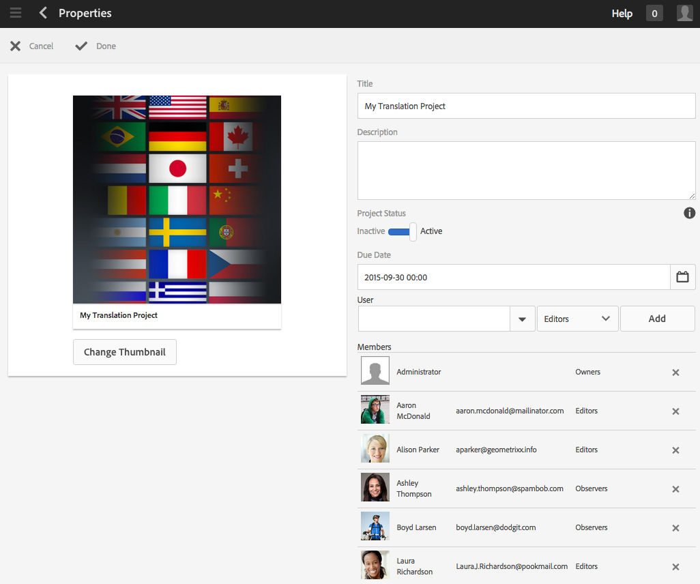
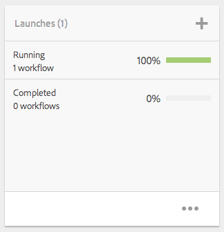

# 專案{#projects}

專案可讓您將資源群組至一個實體。 共用的共用環境讓您輕鬆管理專案。 您可與專案關聯的資源類型在AEM中稱為「拼貼」。 拼貼可能包括項目和團隊資訊、資產、工作流程和其他類型的資訊，如項目拼貼中的詳 [細說明。](#project-tiles)

>[!CAUTION]
>
>如果專案中的使用者在使用專案功能（例如建立專案、建立工作／工作流程、查看和管理團隊）時要查看其他使用者／群組，這些使用者必須擁有 **/home** /users **和/home/groups的讀取存取權**。 實作此項目最簡單的方式，是讓專 **案使用者群組** (projects-users **group)可讀取** /home/users和**/home/groups**。

身為使用者，您可以執行下列動作：

* 建立專案
* 將內容和資產資料夾關聯至專案
* 刪除專案
* 從專案移除內容連結

請參閱下列其他主題：

* [管理專案
   ](/help/sites-authoring/touch-ui-managing-projects.md)
* [使用任務](/help/sites-authoring/task-content.md)
* [使用專案工作流程](/help/sites-authoring/projects-with-workflows.md)
* [創意專案與PIM整合](/help/sites-authoring/managing-product-information.md)

## 專案主控台 {#projects-console}

專案主控台是您在AEM中存取和管理專案的地方。

* 選取 **時間軸** ，然後選取專案以檢視其時間軸。
* 按一下／點選 **「選取** 」以進入選取模式。
* 按一 **下「建立** 」以新增專案。
* **切換作用中專案** ，可讓您在所有專案之間切換，而只在作用中的專案之間切換。
* **顯示統計視圖** ，可讓您查看與任務完成有關的項目統計資訊。

## 專案圖格 {#project-tiles}

使用「專案」，您可以將不同類型的資訊與專案建立關聯。 這些稱為 **Tiles**。 本節將介紹每個表徵圖及其包含的資訊類型。

您可以有下列與專案相關聯的圖格。 以下各節將對每項說明：

* 資產和資產收集
* 體驗
* 連結
* 專案資訊
* 團隊
* 著陸頁面
* 電子郵件
* 工作流程
* 啟動
* 任務

### 資產 {#assets}

在「資 **產** 」方塊中，您可以收集您用於特定專案的所有資產。

您直接在方塊中上傳資產。 此外，如果您有動態媒體附加元件，也可以建立影像集、回轉集或混合媒體集。

### 資產集合 {#asset-collections}

與資產類似，您可以直接將 [資產收集](/help/assets/managing-collections-touch-ui.md) 新增至專案。 您可在資產中定義系列。

按一下「新增系列」 **並從清單中選取適當的系列** ，即可新增系列。

### 體驗 {#experiences}

「體 **驗** 」方塊可讓您將行動應用程式、網站或出版物新增至專案。

這些圖示會指出所呈現的體驗類型：網站、行動應用程式或出版物。 按一下+號或按一下「新增體驗」 **並選取體驗類型** ，以新增體驗。

選取縮圖的路徑，並變更體驗的縮圖（如果適用）。 體驗會在「體驗」方塊中 **分組** 。

### 連結 {#links}

「連結」方塊可讓您將外部連結與專案建立關聯。

您可以使用易於辨識的名稱來命名連結，並變更縮圖。

### 專案資訊 {#project-info}

「項目資訊」表徵圖提供有關項目的一般資訊，包括說明、項目狀態（非活動或活動）、到期日和成員。 此外，您還可以新增專案縮圖，此縮圖會顯示在主要的「專案」頁面上。

可以從此表徵圖（或更改其角色）和「團隊」表徵圖中指派和刪除團隊成員。

### 翻譯工作 {#translation-job}

「翻譯工作」表徵圖是您開始翻譯的位置，也是您查看翻譯狀態的位置。 要設定翻譯，請參閱創 [建翻譯項目](/help/assets/translation-projects.md)。

按一下翻譯工作卡底部的省略 **號** ，在翻譯工作流程中查看資產。 翻譯工作清單還顯示資產元資料和標籤的條目。 這些項目表示資產的中繼資料和標籤也會翻譯。

### 團隊 {#team}

在此方塊中，您可以指定專案團隊的成員。 編輯時，您可以輸入團隊成員的名稱並指派用戶角色。

您可以從團隊中新增和刪除團隊成員。 此外，您還可以編輯指 [派給團隊成員](#userroles) 的用戶角色。

### 著陸頁面 {#landing-pages}

「著 **陸頁面** 」方塊可讓您請求新的著陸頁面。

此工作流程在「建立著 [陸頁面」工作流程中說明](/help/sites-authoring/projects-with-workflows.md#request-landing-page-workflow)。

### 電子郵件 {#emails}

「電 **子郵件** 」方塊可協助您管理電子郵件要求。 它會啟動「要求電子郵件」工作流程。

「請求電子郵件」工作流程中 [會說明更多資訊。](/help/sites-authoring/projects-with-workflows.md#request-email-workflow)

### 工作流程 {#workflows}

您可以指派專案以遵循特定工作流程。 如果有工作流程正在執行，則其狀態會顯示在「專案」的「工 **作流程** 」方塊中。

您可以指派專案以遵循特定工作流程。 視您選擇的專案而定，您有不同的工作流程可用。

在「使用專案工作 [流程」中說明。](/help/sites-authoring/projects-with-workflows.md)

### 啟動 {#launches}

「啟動」方塊會顯示已透過「請求啟動」工作流程要求的 [任何啟動。](/help/sites-authoring/projects-with-workflows.md)

### 任務 {#tasks}

Tasks可讓您監控任何專案相關工作的狀態，包括工作流程。 使用任務時，將詳細 [介紹任務](/help/sites-authoring/task-content.md)。

## 專案範本 {#project-templates}

AEM隨附3種不同的範本：

* 簡單專案——任何不符合其他類別的專案的參考範例（全部皆可）。 它包含三個基本角色（擁有者、編輯和觀察員）和四個工作流程（專案核准、請求啟動、請求著陸頁面和請求電子郵件）。
* 媒體專案——媒體相關活動的參考範例專案。 它包含數個媒體相關專案角色（攝影師、編輯、文案撰稿人、設計人員、擁有者和觀察者）。 此外，它還包含兩個與媒體內容相關的工作流程- 「請求文案」（用於請求和檢閱文字）和「產品像片拍攝」（用於管理與產品相關的像片）
* [產品像片拍攝專案](/help/sites-authoring/managing-product-information.md) -管理電子商務相關產品攝影的參考範例。 其中包括攝影師、編輯、像片製作人員、擁有者、創意總監、社交媒體行銷人員、行銷經理、審閱者和觀察者的角色。
* [翻譯項目](/help/sites-administering/translation.md) -用於管理翻譯相關活動的參考示例。 它包含三個基本角色（擁有者、編輯和觀察者）。 它包含兩個可在「工作流」使用者介面中存取的工作流程。

根據您選取的範本，您有不同的選項可供使用，尤其是使用者角色和工作流程。

## 專案中的使用者角色 {#user-roles-in-a-project}

不同的用戶角色在項目模板中設定，其用途主要有以下兩個原因：

1. 權限. 用戶角色分為以下三個類別：觀察者、編輯者、擁有者。 例如，攝影師或文案撰稿人將擁有與編輯相同的權限。 權限決定使用者對專案中的內容可以做什麼。
1. 工作流程. 工作流程會決定專案中指派給誰的工作。 這些任務可以與項目角色關聯。 例如，可以將任務指派給「攝影師」，這樣所有具有「攝影師」角色的團隊成員都將獲得該任務。

所有專案都支援下列預設角色，讓您管理安全性和控制權限：

<table>
 <tbody>
  <tr>
   <td>
<strong>角色</strong>
 </td>
   <td>
<strong>說明</strong>
 </td>
   <td>
<strong>權限</strong>
 </td>
   <td>
<strong>群組會籍</strong>
 </td>
  </tr>
  <tr>
   <td>
觀察者
 </td>
   <td>
此角色的用戶可以查看項目詳細資訊，包括項目狀態。
 </td>
   <td>
專案的唯讀權限
 </td>
   <td>
workflow-users群組
 </td>
  </tr>
  <tr>
   <td>
編輯者
 </td>
   <td>
此角色的使用者可以上傳和編輯專案的內容。
 
 
 </td>
   <td>
    <ul>
     <li>對專案、相關中繼資料和相關資產的讀取和寫入存取權。</li>
     <li>上傳像片清單、像片拍攝以及審閱與核准資產的權限</li>
     <li>/etc/commerce的寫入權限</li>
     <li>對特定項目具有修改權限</li>
    </ul> </td>
   <td>
workflow-users群組
 </td>
  </tr>
  <tr>
   <td>
所有者
 </td>
   <td>
此角色的用戶可以啟動項目。 擁有者可以建立專案、在專案中開始工作，以及將已核准的資產移至「生產」檔案夾。 雖然項目中的所有其他任務也可以由所有者查看和執行。
 </td>
   <td>
    <ul>
     <li>/etc/commerce的寫入權限</li>
    </ul> </td>
   <td>
    <ul>
     <li>DAM使用者群組（以建立專案）</li>
     <li>專案管理員群組（以便能夠移動資產）</li>
    </ul> </td>
  </tr>
 </tbody>
</table>

對於創意專案，也會提供其他角色——例如攝影師-。 您可以使用這些角色來衍生特定專案的自訂角色。

>[!NOTE]
>
>當您建立專案並將使用者新增至各種角色時，系統會自動建立與專案相關的群組，以管理相關的權限。 例如，名為Myproject的專案會有三個群組 **Myproject Owners**、 **Myproject Editors**、 **Myproject Obsertors**。 不過，如果刪除專案，這些群組不會自動刪除。 管理員需要手動刪除「工具 **>安全** 性 **>** 群組 ****」。
