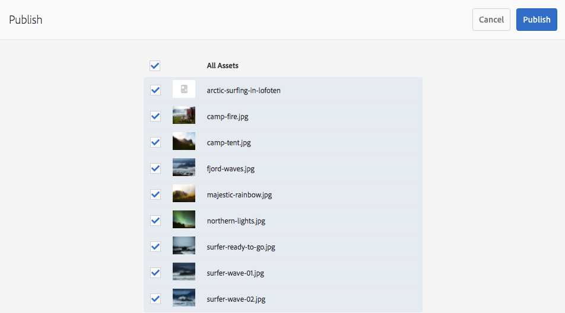

# 發佈頁面 {#publishing-pages}

在您建立並檢閱了製作環境中的內容後， [在你的公共網站上公佈](/help/sites-authoring/author.md#concept-of-authoring-and-publishing) （您的發佈環境）。

這稱為發佈頁面。 如果您想從發佈環境中移除頁面，即為取消發佈。 發佈和取消發佈頁面時，製作環境仍可供進一步變更，直到您刪除為止。

您也可以立即發佈/取消發佈頁面，或在日後預先定義的日期/時間發佈。

>[!NOTE]
>
>與發佈相關的某些術語可能會混淆：
>
>* **發佈/取消發佈**
   >  這些是可讓您的內容在您的發佈環境（或不可）上公開的動作的主要辭彙。
>
>* **啟用/停用**
   >  這些詞語等同於發佈/取消發佈。
>
>* **複製/複製**
   >  這些技術術語說明資料（例如頁面內容、檔案、程式碼、使用者註解）在某個環境間移動的情形，例如發佈或反向複製使用者註解時。
>

>[!NOTE]
>
>如果您沒有發佈特定頁面所需的權限：
>
>* 系統會觸發工作流程，通知您發佈請求的適當人員。
>* 此 [工作流程可能已自訂](/help/sites-developing/workflows-models.md#main-pars-procedure-6fe6) 由您的開發團隊負責。
>* 系統會短暫顯示訊息，通知您工作流程已觸發。
>

## 發佈頁面 {#publishing-pages-1}

您可以根據您的位置發佈：

* [從頁面編輯器](/help/sites-authoring/publishing-pages.md#publishing-from-the-editor)
* [從網站主控台](/help/sites-authoring/publishing-pages.md#publishing-from-the-console)

### 從編輯器發佈 {#publishing-from-the-editor}

如果您正在編輯頁面，則可直接從編輯器發佈頁面。

1. 選取 **頁面資訊** 圖示來開啟功能表，然後 **發佈頁面** 選項。

   

1. 視頁面是否有需要發佈的參考而定：

   * 如果沒有要發佈的參考，則會直接發佈頁面。
   * 如果頁面有需要發佈的參考，這些將列在 **發佈** 嚮導中，您可以在其中：

      * 指定哪些資產/標籤/等等 您想要與頁面一起發佈，然後使用 **發佈** 來完成此程式。

      * 使用 **取消** 中止動作。

   

1. 選取 **發佈** 會將頁面複製到發佈環境。 在頁面編輯器中，會顯示資訊橫幅以確認發佈動作。

   

   在主控台中檢視相同頁面時，更新的發佈狀態會顯示。

   

>[!NOTE]
>
>從編輯器發佈是淺層發佈，亦即只會發佈/發佈選取的頁面/頁面，而不會發佈任何子頁面。

>[!NOTE]
>
>由存取的頁面 [別名](/help/sites-authoring/editing-page-properties.md#advanced) 無法發佈。 編輯器中的發佈選項僅適用於透過其實際路徑存取的頁面。

### 從主控台發佈 {#publishing-from-the-console}

在網站主控台中，有兩個發佈選項：

* [快速發佈](/help/sites-authoring/publishing-pages.md#quick-publish)
* [管理發佈](/help/sites-authoring/publishing-pages.md#manage-publication)

#### 快速發佈 {#quick-publish}

**快速發佈** 是供簡單的案例使用，且會立即發佈選取的頁面，而不需進行任何進一步互動。 因此，任何未發佈的參考也會自動發佈。

若要使用快速發佈來發佈頁面：

1. 在網站主控台中選取頁面，然後按一下 **快速發佈** 按鈕。

   

1. 在快速發佈對話方塊中，按一下 **發佈** 或按一下「 **取消**. 請記住，所有未發佈的參考也會自動發佈。

   

1. 發佈頁面時，會顯示確認發佈的警報。

>[!NOTE]
>
>「快速發佈」是淺層發佈，亦即只會發佈/發佈選取的頁面/頁面，而不會發佈任何子頁面。

#### 管理發佈 {#manage-publication}

**管理出版物** 提供比「快速發佈」更多的選項，可包含子頁面、自訂參考、開始任何適用的工作流程，以及提供可在稍後發佈的選項。

若要使用管理出版物來發佈或取消發佈頁面：

1. 在網站主控台中選取頁面，然後按一下 **管理出版物** 按鈕。

   

1. 「管 **理出版物** 」嚮導將啟動。第一步， **選項**，可讓您：

   * 選擇發佈或取消發佈所選頁面。
   * 選擇立即或稍後執行該操作。

   稍後發佈會啟動工作流程，以在指定時間發佈選取的頁面。 反之，稍後取消發佈會開始工作流程，以在特定時間取消發佈選取的頁面。

   如果您想要取消稍後發佈/取消發佈，請前往 [工作流程主控台](/help/sites-administering/workflows.md) 終止相應的工作流。

   

   按一下 **下一個** 繼續。

1. 在「管理出版物」精靈的下一個步驟中， **範圍**，您可以定義發佈/取消發佈的範圍，例如包含以包含子頁面和/或包含參考。

   

   您可以使用「新 **增內容** 」按鈕，在要發佈的頁面清單中新增其他頁面，以防您在啟動「管理出版物」精靈之前未選取其中一個頁面。

   按一下「新增內容」按鈕會啟動 [路徑瀏覽器](/help/sites-authoring/author-environment-tools.md#path-browser) 允許選取內容。

   選取所需頁面，然後按一下 **選擇** 要將內容添加到嚮導，請**取消**取消選擇並返回嚮導。

   返回精靈，您可以選取清單中的項目，以設定其其他選項，例如：

   * 包括其子女。
   * 從選取項目中移除它。
   * 管理其已發佈的參考。

   

   按一下 **包括子項** 開啟對話方塊，讓您：

   * 僅包含直接子項.
   * 僅包含修改過的頁面.
   * 僅包含已發佈的頁面.

   按一下 **新增** 根據選擇選項將子頁添加到要發佈或取消發佈的頁清單中。 按一下 **取消** 取消選擇並返回嚮導。

   

   返回嚮導，您將根據您在「包含子項」對話框中選擇的選項查看添加的頁。

   您可以查看和修改要為頁面發佈或取消發佈的參照，方法是選取該參照，然後按一下 **發佈的參考** 按鈕。

   

   此 **發佈的參考** 對話框顯示所選內容的參考。 預設會選取所有欄位，且會發佈/取消發佈，但您可以取消勾選以加以設定，以便不會納入動作中。

   按一下 **完成** 儲存變更或 **取消** 取消選擇並返回嚮導。

   回到精靈里， **參考** 欄將會更新，以反映您要發佈或取消發佈的參考選項。

   

1. 按一下 **發佈** 完成。

   在網站主控台中，通知訊息會確認發佈。

1. 如果發佈的頁面與工作流程相關聯，最後可能會顯示 **工作流程** 發佈精靈的步驟。

   >[!NOTE]
   >
   >此 **工作流程** 步驟將根據您的使用者可能擁有或可能沒有的權限顯示。 請參閱 [本頁上的前幾個備注](/help/sites-authoring/publishing-pages.md#main-pars-note-0-ejsjqg-refd) 關於發佈權限， [管理工作流程存取權](/help/sites-administering/workflows-managing.md) 和 [將工作流程套用至頁面](/help/sites-authoring/workflows-applying.md#main-pars-text-5-bvhbkh-refd) 以取得詳細資訊。

   資源會依觸發的工作流程分組，而每個指定選項可：

   * 定義工作流程的標題。
   * 保留工作流程套件，前提是工作流程已 [多資源支援](/help/sites-developing/workflows-models.md#configuring-a-workflow-for-multi-resource-support).
   * 如果選擇了保留工作流包的選項，則定義工作流包的標題。

   按一 **下「發佈** 」或「 **稍後發佈** 」以完成出版。

   

## 取消發佈頁面 {#unpublishing-pages}

取消發佈頁面會將其從您的發佈環境中移除，讓讀者無法再使用它。

在 [發佈方式類似](/help/sites-authoring/publishing-pages.md#publishing-pages)，可取消發佈一或多個頁面：

* [從頁面編輯器](/help/sites-authoring/publishing-pages.md#unpublishing-from-the-editor)
* [從網站主控台](/help/sites-authoring/publishing-pages.md#unpublishing-from-the-console)

### 從編輯器取消發佈 {#unpublishing-from-the-editor}

編輯頁面時，如果要取消發佈該頁面，請選取 **取消發佈頁面** 在 **頁面資訊** 菜單，就像你 [發佈頁面](/help/sites-authoring/publishing-pages.md#publishing-from-the-editor).

>[!NOTE]
>
>由存取的頁面 [別名](/help/sites-authoring/editing-page-properties.md#advanced) 無法取消發佈編輯器中的。 編輯器中的發佈選項僅適用於透過其實際路徑存取的頁面。

### 從主控台取消發佈 {#unpublishing-from-the-console}

和你一樣 [使用管理出版物選項進行發佈](/help/sites-authoring/publishing-pages.md#manage-publication)，您也可以使用它來取消發佈。

1. 在網站主控台中選取頁面，然後按一下 **管理出版物** 按鈕。
1. 「管 **理出版物** 」嚮導將啟動。在第一個步驟中， **選項**，選擇「取消發佈」(Unpublish **)，而非「發佈」(Publish)的預設** 選項 ****。

   

   就像稍後發佈會啟動工作流程以在指定時間發佈此版本的頁面一樣，稍後停用會啟動工作流程以在特定時間取消發佈選取的頁面或頁面。

   如果您想要取消稍後發佈/取消發佈，請前往 [工作流程主控台](/help/sites-administering/workflows.md) 終止相應的工作流。

1. 若要完成取消發佈，請依您的操作，繼續透過精靈 [發佈頁面](/help/sites-authoring/publishing-pages.md#manage-publication).

## 發佈和取消發佈樹 {#publishing-and-unpublishing-a-tree}

當您輸入或更新相當多的內容頁面時（所有頁面都位於相同的根頁面下），在一個動作中發佈整個樹狀結構會較為容易。

您可以使用 [管理出版物](/help/sites-authoring/publishing-pages.md#manage-publication) 選項，以執行此操作。

1. 在網站主控台中，選取您要發佈或取消發佈之樹狀結構的根頁面，然後選取 **管理出版物**.
1. 「管 **理出版物** 」嚮導將啟動。選擇要發佈或取消發佈，以及何時發生，然後選取 **下一個** 繼續。
1. 在 **範圍** 步驟，選取根頁面並選取 **包括子項**.

   

1. 在 **包括子項** 對話框，取消選中選項：

   * 僅包含直接子項
   * 僅包含已發佈的頁面

   預設會選取這些選項，因此您必須記得取消選取這些選項。 按一下 **新增** 確認內容並將其新增至發佈/取消發佈。

   

1. 此 **管理出版物** 嚮導列出要查看的樹的內容。 您可以新增其他頁面或移除那些選取的頁面，以進一步自訂選取項目。

   

   請記住，您也可以檢閱要透過 **發佈的參考** 選項。

1. [正常地繼續管理出版物嚮導](#manage-publication) 完成樹的發佈或取消發佈。

## 確定發佈狀態 {#determining-publication-status}

您可以判斷頁面的發佈狀態：

* 在 [sites console上的資源概觀資訊](/help/sites-authoring/basic-handling.md#viewing-and-selecting-resources)

   

   發佈狀態會顯示在 [網站主控台](/help/sites-authoring/basic-handling.md#card-view)[的卡片](/help/sites-authoring/basic-handling.md#column-view)、欄和 [清單檢視中](/help/sites-authoring/basic-handling.md#list-view) 。

* 在 [時間表](/help/sites-authoring/basic-handling.md#timeline)

   

* 在 [頁面資訊功能表](/help/sites-authoring/author-environment-tools.md#page-information) 編輯頁面時

   
