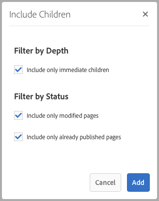
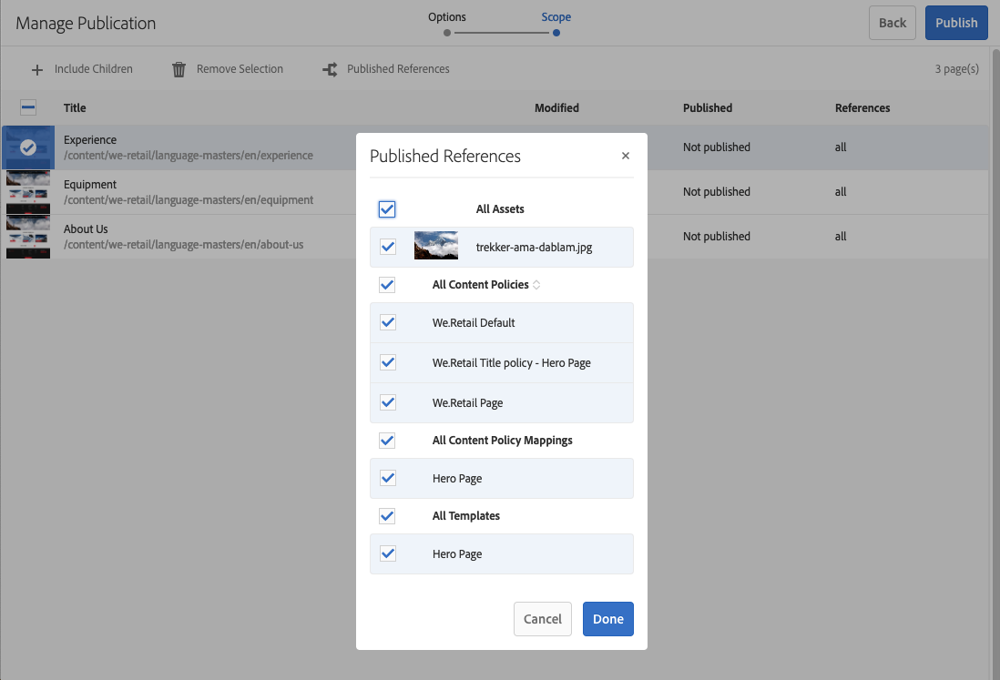
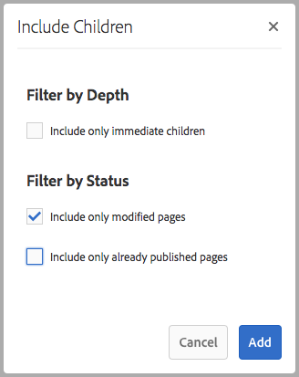

# 發佈頁面 {#publishing-pages}

在您於作者環境中建立並檢閱內容後，[讓內容可在您的公用網站](/help/sites-authoring/author.md#concept-of-authoring-and-publishing) （您的發佈環境）上使用。

這稱為發佈頁面。 從發佈環境中移除頁面時，系統會將其稱為取消發佈。 發佈和取消發佈頁面時，作者環境仍會提供進一步的變更，直到您刪除它為止。

您也可以立即發佈/取消發佈頁面，或在預先定義的未來日期/時間發佈/取消發佈頁面。

>[!NOTE]
>
>可能會混淆與發佈相關的某些術語：
>
>* **Publish /取消發佈**
>  這些是讓您的內容在發佈環境中公開使用（或不公開使用）的動作主要詞語。
>
>* **啟用/停用**
>  這些辭彙與發佈/取消發佈同義。
>
>* **復寫/復寫**
>  這些是技術術語，說明資料（例如頁面內容、檔案、程式碼、使用者註解）從一個環境移動到另一個環境，例如發佈或反向複製使用者註解時。
>

>[!NOTE]
>
>如果您沒有發佈特定頁面所需的許可權：
>
>* 系統會觸發工作流程，將您要發佈的請求通知適當人員。
>* 您的開發團隊可能已自訂此[工作流程](/help/sites-developing/workflows-models.md#main-pars-procedure-6fe6)。
>* 系統會顯示簡短的訊息，通知您工作流程已觸發。
>

## 發佈頁面 {#publishing-pages-1}

根據您的位置，您可以發佈：

* [從頁面編輯器](/help/sites-authoring/publishing-pages.md#publishing-from-the-editor)
* [從網站主控台](/help/sites-authoring/publishing-pages.md#publishing-from-the-console)

### 從編輯器發佈 {#publishing-from-the-editor}

如果您正在編輯頁面，可以直接從編輯器發佈頁面。

1. 選取&#x200B;**頁面資訊**&#x200B;圖示以開啟功能表，然後選取&#x200B;**Publish頁面**&#x200B;選項。

   

1. 視頁面是否有需要發佈的參照而定：

   * 如果沒有要發佈的引用，則會直接發佈頁面。
   * 如果頁面含有需要發佈的參考，這些參考將會列在&#x200B;**Publish**&#x200B;精靈中，您可以在其中執行下列其中一項作業：

      * 指定要與頁面一起發佈的資產或標籤，然後使用&#x200B;**Publish**&#x200B;完成程式。

      * 使用&#x200B;**取消**&#x200B;中止動作。

   

1. 選取&#x200B;**Publish**&#x200B;會將頁面復寫至發佈環境。 在頁面編輯器中，會顯示確認發佈動作的資訊橫幅。

   

   在主控台中檢視相同頁面時，會顯示更新的發佈狀態。

   

>[!NOTE]
>
>從編輯器發佈是淺層發佈，也就是說，僅發佈選定的一個或多個頁面，不發佈任何子頁面。

>[!NOTE]
>
>無法發佈編輯器中由[別名](/help/sites-authoring/editing-page-properties.md#advanced)存取的頁面。 編輯器中的Publish選項僅適用於透過實際路徑存取的頁面。

### 從主控台發佈 {#publishing-from-the-console}

在網站主控台中，有兩個發佈選項：

* [快速發佈](/help/sites-authoring/publishing-pages.md#quick-publish)
* [管理發佈](/help/sites-authoring/publishing-pages.md#manage-publication)

#### 快速發佈 {#quick-publish}

**快速Publish**&#x200B;適用於簡單案例，可立即發佈選取的頁面，無需任何進一步的互動。 因此，任何未發佈的參考也會自動發佈。

若要使用Quick Publish發佈頁面：

1. 在網站主控台中選取一個或多個頁面，然後按一下&#x200B;**快速Publish**&#x200B;按鈕。

   

1. 在「快速Publish」對話方塊中，按一下&#x200B;**Publish**&#x200B;以確認出版物，或按一下&#x200B;**取消**&#x200B;以取消出版物。 請記住，任何未發佈的參考也會自動發佈。

   

1. 發佈頁面時，畫面會顯示確認發佈的警報。

>[!NOTE]
>
>快速Publish是淺層發佈，也就是說，只會發佈選定的一個或多個頁面，而不會發佈任何子頁面。

#### 管理發佈 {#manage-publication}

**管理出版物**&#x200B;提供比「快速Publish」更多的選項，允許包含子頁面、自訂參考和啟動任何適用的工作流程，並提供在以後的日期發佈的選項。

若要使用「管理發布」來發佈或取消發佈頁面：

1. 在網站主控台中選取一個或多個頁面，然後按一下&#x200B;**管理出版物**&#x200B;按鈕。

   

1. 「管 **理出版物** 」嚮導將啟動。第一個步驟&#x200B;**選項**&#x200B;可讓您：

   * 選擇發佈或取消發佈選取的頁面。
   * 選擇現在或稍後採取該動作。

   稍後發佈會啟動工作流程，以在指定時間發佈選取的一或多個頁面。 相反地，稍後取消發佈會啟動工作流程，以在特定時間取消發佈選取的一個或多個頁面。

   如果您要稍後再取消發佈/取消發佈，請移至[工作流程主控台](/help/sites-administering/workflows.md)以終止對應的工作流程。

   

   按一下[下一步]****&#x200B;繼續。

1. 在「管理出版物」精靈的下一個步驟&#x200B;**範圍**&#x200B;中，您可以定義發佈/取消發佈的範圍，例如，包含子頁面和/或包含參考。

   

   您可以使用「新 **增內容** 」按鈕，在要發佈的頁面清單中新增其他頁面，以防您在啟動「管理出版物」精靈之前未選取其中一個頁面。

   按一下[新增內容]按鈕會啟動[路徑瀏覽器](/help/sites-authoring/author-environment-tools.md#path-browser)以允許選擇內容。

   選取必要的頁面，然後按一下[選取]將內容加入精靈，或按一下[**取消**]取消選取並返回精靈。****

   回到精靈，您可以選取清單中的專案以設定其進一步的選項，例如：

   * 包括其子項。
   * 將其從選取範圍中移除。
   * 管理其已發佈的引用。

   

   按一下「**包含子項**」會開啟對話方塊，讓您：

   * 僅包含直接子項。
   * 僅包含已修改的頁面。
   * 僅包含已發佈的頁面。

   按一下&#x200B;**新增**，根據選取選項將子頁面新增至要發佈或取消發佈的頁面清單。 按一下&#x200B;**取消**&#x200B;以取消選取並返回精靈。

   

   回到精靈後，您會看到根據您在「包含子項」對話方塊中選擇的選項新增的頁面。

   您可以檢視並修改某個頁面要發佈或取消發佈的引用，方法是選取該頁面，然後按一下&#x200B;**已發佈引用**&#x200B;按鈕。

   

   **已發佈的參考**&#x200B;對話方塊會顯示所選內容的參考。 預設會選取這些變數，並將予以發佈/取消發佈，但您可以取消勾選以取消選取，以便這些變數不會包含在動作中。

   按一下&#x200B;**完成**&#x200B;以儲存您的變更，或按一下&#x200B;**取消**&#x200B;以取消選取並返回精靈。

   回到精靈，**參考**&#x200B;欄將會更新，以反映您選取的要發佈或取消發佈的參考。

   

1. 按一下&#x200B;**Publish**&#x200B;以完成。

   回到網站主控台，系統會傳送通知訊息確認發佈。

1. 如果發佈的頁面與工作流程相關聯，它們可能會顯示在發佈精靈的最後一個&#x200B;**工作流程**&#x200B;步驟中。

   >[!NOTE]
   >
   >根據使用者可能擁有也可能沒有的許可權，顯示&#x200B;**工作流程**&#x200B;步驟。 如需詳細資訊，請參閱此頁面](/help/sites-authoring/publishing-pages.md#main-pars-note-0-ejsjqg-refd)上的[上一頁關於發佈許可權和[管理工作流程的存取權](/help/sites-administering/workflows-managing.md)以及[將工作流程套用至頁面](/help/sites-authoring/workflows-applying.md#main-pars-text-5-bvhbkh-refd)的備註。

   資源會依觸發的工作流程分組，每個指定選項用於：

   * 定義工作流程的標題。
   * 保留工作流程封裝，前提是工作流程具有[多重資源支援](/help/sites-developing/workflows-models.md#configuring-a-workflow-for-multi-resource-support)。
   * 如果已選擇保留工作流程封裝的選項，則定義工作流程封裝的標題。

   按一 **下「發佈** 」或「 **稍後發佈** 」以完成出版。

   

## 取消發佈頁面 {#unpublishing-pages}

取消發佈頁面會將其從發佈環境中移除，因此不再開放給您的讀者使用。

以類似發佈](/help/sites-authoring/publishing-pages.md#publishing-pages)的[方式，可以取消發佈一或多個頁面：

* [從頁面編輯器](/help/sites-authoring/publishing-pages.md#unpublishing-from-the-editor)
* [從網站主控台](/help/sites-authoring/publishing-pages.md#unpublishing-from-the-console)

### 從編輯器中取消發佈 {#unpublishing-from-the-editor}

編輯頁面時，如果您要取消發佈該頁面，請選取&#x200B;**頁面資訊**&#x200B;功能表中的&#x200B;**取消發佈頁面**，就像您[發佈頁面](/help/sites-authoring/publishing-pages.md#publishing-from-the-editor)一樣。

>[!NOTE]
>
>無法取消發佈編輯器中由[別名](/help/sites-authoring/editing-page-properties.md#advanced)存取的頁面。 編輯器中的Publish選項僅適用於透過實際路徑存取的頁面。

### 從主控台取消發佈 {#unpublishing-from-the-console}

如同您[使用[管理出版物]選項發佈](/help/sites-authoring/publishing-pages.md#manage-publication)一樣，您也可以使用它來取消發佈。

1. 在網站主控台中選取一個或多個頁面，然後按一下&#x200B;**管理出版物**&#x200B;按鈕。
1. 「管 **理出版物** 」嚮導將啟動。在第一個步驟中， **選項**，選擇「取消發佈」(Unpublish **)，而非「發佈」(Publish)的預設** 選項 ****。

   

   正如稍後發佈會啟動工作流程，以在指定時間發佈此版本的頁面一樣，稍後停用也會啟動工作流程，以在指定時間取消發佈選取的一或多個頁面。

   如果您要稍後再取消發佈/取消發佈，請移至[工作流程主控台](/help/sites-administering/workflows.md)以終止對應的工作流程。

1. 若要完成取消發佈，請繼續完成精靈，就像您要[發佈頁面](/help/sites-authoring/publishing-pages.md#manage-publication)一樣。

## 發佈和取消發佈樹狀結構 {#publishing-and-unpublishing-a-tree}

當您輸入或更新了相當數量的內容頁面時 — 所有這些頁面都位於同一個根頁面下 — 在一個動作中發佈整個樹狀結構會比較容易。

您可以使用網站主控台上的[管理出版物](/help/sites-authoring/publishing-pages.md#manage-publication)選項來執行此動作。

1. 在網站主控台中，選取您要發佈或取消發佈的樹狀目錄根頁面，然後選取&#x200B;**管理出版物**。
1. 「管 **理出版物** 」嚮導將啟動。選擇發佈或取消發佈，以及應該發生的時間，並選取&#x200B;**下一步**&#x200B;以繼續。
1. 在&#x200B;**領域**&#x200B;步驟中，選取根頁面並選取&#x200B;**包含子項**。

   

1. 在&#x200B;**包含子項**&#x200B;對話方塊中，取消勾選選項：

   * 僅包含直接子項
   * 僅包含已發佈的頁面

   預設會選取這些選項，因此您必須記得取消選取它們。 按一下&#x200B;**[新增**]以確認並將內容新增至發佈/取消發佈。

   

1. **管理出版物**&#x200B;精靈會列出樹狀結構的內容以供檢閱。 您可以新增其他頁面或移除選取的頁面，以進一步自訂選取範圍。

   

   請記住，您也可以透過&#x200B;**已發佈的參考**&#x200B;選項檢閱要發佈的參考。

1. [繼續正常的[管理發布]精靈](#manage-publication)，以完成發佈或取消發佈樹狀結構。

## 決定發佈狀態 {#determining-publication-status}

您可以決定頁面的發佈狀態：

* 在網站主控台](/help/sites-authoring/basic-handling.md#viewing-and-selecting-resources)的[資源概觀資訊中

  

  發佈狀態會顯示在 [網站主控台](/help/sites-authoring/basic-handling.md#card-view)[的卡片](/help/sites-authoring/basic-handling.md#column-view)、欄和 [清單檢視中](/help/sites-authoring/basic-handling.md#list-view) 。

* 在[時間表](/help/sites-authoring/basic-handling.md#timeline)中

  

* 在[頁面資訊功能表](/help/sites-authoring/author-environment-tools.md#page-information)中，編輯頁面時

  
