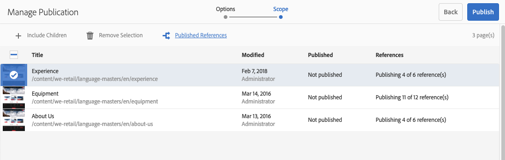

# 發佈頁面 {#publishing-pages}

在作者環境中建立並檢閱內容後，其目標是[將它發佈至您的公共網站](/help/sites-authoring/author.md#concept-of-authoring-and-publishing)（您的發佈環境）。

這稱為發佈頁面。 當您想從發佈環境中移除頁面時，稱為取消發佈。 發佈和取消發佈頁面時，在作者環境中仍可使用頁面進行進一步變更，直到您刪除為止。

您也可以立即發佈／取消發佈頁面，或在未來的預先定義日期／時間發佈／取消發佈頁面。

>[!NOTE]
>
>與發佈相關的某些術語可能會混淆：
>
>* **發佈／取消發佈**
   >  這些是讓您的內容在發佈環境（或非）上公開提供之動作的主要條款。
   >
   >
* **啟用／停用**
   >  這些詞語與publish/unpublish同義。
   >
   >
* **複製／複製**
   >  這些技術術語描述資料（例如頁面內容、檔案、程式碼、使用者註解）在某個環境之間的移動，例如發佈或反向複製使用者註解時。
>

>[!NOTE]
>
>如果您沒有發佈特定頁面的必要權限：
>
>* 系統會觸發工作流程，通知您發佈請求的適當人員。
>* 此[工作流程可能已由您的開發團隊自訂](/help/sites-developing/workflows-models.md#main-pars-procedure-6fe6)。
>* 系統會短暫顯示訊息，通知您工作流程已觸發。

>

## 發佈頁面 {#publishing-pages-1}

視您的位置而定，您可以發佈：

* [從頁面編輯器](/help/sites-authoring/publishing-pages.md#publishing-from-the-editor)
* [從站點控制台](/help/sites-authoring/publishing-pages.md#publishing-from-the-console)

### 從編輯器{#publishing-from-the-editor}發佈

如果您正在編輯頁面，則可直接從編輯器發佈頁面。

1. 選擇&#x200B;**頁面資訊**&#x200B;圖示以開啟功能表，然後選擇&#x200B;**發佈頁面**&#x200B;選項。

   

1. 視頁面是否有需要發佈的參考而定：

   * 如果沒有要發佈的參考，頁面將直接發佈。
   * 如果頁面有需要發佈的參考，這些參考將列在&#x200B;**Publish**&#x200B;精靈中，您可以在其中：

      * 指定哪些資產／標籤／等。 您想要與頁面一起發佈，然後使用&#x200B;**Publish**&#x200B;完成程式。

      * 使用&#x200B;**Cancel**&#x200B;中止動作。

   

1. 選擇&#x200B;**Publish**&#x200B;會將頁面複製到發佈環境。 在頁面編輯器中，會顯示確認發佈動作的資訊橫幅。

   

   在控制台中查看相同頁面時，更新的發佈狀態可見。

   

>[!NOTE]
>
>從編輯器發佈是淺層發佈，即僅會發佈選定的頁面／頁面，而未發佈任何子頁面。

### 從控制台{#publishing-from-the-console}發佈

在網站主控台中，有兩種發佈選項：

* [快速發佈](/help/sites-authoring/publishing-pages.md#quick-publish)
* [管理發佈](/help/sites-authoring/publishing-pages.md#manage-publication)

#### 快速發佈 {#quick-publish}

**快速發** 布(Quick Publish)功能，以處理簡單的案例，並立即發佈選取的頁面，毋需進一步互動。因此，任何未發佈的參考也會自動發佈。

若要使用「快速發佈」來發佈頁面：

1. 在站點控制台中選擇頁面或頁面，然後按一下&#x200B;**快速發佈**&#x200B;按鈕。

   

1. 在「快速發佈」對話方塊中，按一下&#x200B;**Publish**&#x200B;確認出版物，或按一下&#x200B;**Cancel**&#x200B;取消以確認出版物。 請記住，任何未發佈的參考也會自動發佈。

   

1. 發佈頁面時，會顯示確認發佈的警報。

>[!NOTE]
>
>「快速發佈」是淺層發佈，即僅會發佈所選頁面／頁面，且未發佈任何子頁面。

#### 管理發佈 {#manage-publication}

**「管** 理發佈」提供的選項比「快速發佈」更多，允許包含子頁面、自訂參照、啟動任何適用的工作流程，以及提供稍後發佈的選項。

若要使用「管理出版物」來發佈或取消發佈頁面：

1. 在站點控制台中選擇頁或頁，然後按一下&#x200B;**管理出版物**&#x200B;按鈕。

   

1. 「管 **理出版物** 」嚮導將啟動。第一個步驟&#x200B;**Options**&#x200B;可讓您：

   * 選擇發佈或取消發佈所選頁面。
   * 選擇立即或稍後採取該動作。

   稍後發佈會啟動工作流程，以在指定時間發佈選取的頁面。 相反地，稍後取消發佈會啟動工作流程，在特定時間取消發佈選取的頁面。

   如果您想在稍後取消發佈／取消發佈，請前往[工作流控制台](/help/sites-administering/workflows.md)以終止對應的工作流。

   

   按一下&#x200B;**Next**&#x200B;繼續。

1. 在「管理出版物」嚮導&#x200B;**Scope**&#x200B;的下一步中，您可以定義出版物／取消出版物的範圍，例如包含子頁面和／或包含引用。

   

   您可以使用「新 **增內容** 」按鈕，在要發佈的頁面清單中新增其他頁面，以防您在啟動「管理出版物」精靈之前未選取其中一個頁面。

   按一下「新增內容」按鈕會啟動[路徑瀏覽器](/help/sites-authoring/author-environment-tools.md#path-browser)以允許選取內容。

   選擇所需頁面，然後按一下&#x200B;**選擇**&#x200B;將內容添加到嚮導，或按一下**取消**取消選擇並返回嚮導。

   回到精靈中，您可以選取清單中的項目，以設定其他選項，例如：

   * 包括其子系。
   * 從選取範圍中移除它。
   * 管理其已發佈的參考。

   

   按一下&#x200B;**包含子代**&#x200B;將開啟一個對話框，允許您：

   * 僅包含直接子項.
   * 僅包含修改過的頁面.
   * 僅包含已發佈的頁面.

   按一下「新增」，將子頁面新增至要發佈或未發佈的頁面清單，以根據選擇選項。 ****&#x200B;按一下&#x200B;**取消**&#x200B;取消選擇並返回嚮導。

   

   返回到嚮導時，您會根據您在「包含子項」對話框中選擇的選項看到添加的頁。

   通過選擇要發佈或未發佈的頁面的引用，然後按一下&#x200B;**發佈的引用**&#x200B;按鈕，可以查看和修改該頁面的引用。

   

   **發佈參考**&#x200B;對話方塊顯示所選內容的參考。 依預設，這些檔案都已選取，而且會發佈／取消發佈，但您可以取消勾選，以便將它們排除在動作中。

   按一下&#x200B;**Done**&#x200B;保存更改，或按一下&#x200B;**Cancel**&#x200B;取消選擇並返回嚮導。

   在精靈中，**References**&#x200B;欄將會更新，以反映您選擇的要發佈或未發佈的參考。

   

1. 按一下「**發佈**」以完成。

   在站點控制台中，通知消息將確認發佈。

1. 如果發佈頁面與工作流程相關聯，則它們可能顯示在發佈精靈的最終&#x200B;**Workflows**&#x200B;步驟中。

   >[!NOTE]
   >
   >**Workflows**&#x200B;步驟將根據您的用戶可能擁有或可能沒有的權限顯示。 如需詳細資訊，請參閱本頁[上一份有關發佈權限的附註](/help/sites-authoring/publishing-pages.md#main-pars-note-0-ejsjqg-refd)，以及[管理工作流程存取權](/help/sites-administering/workflows-managing.md)和[將工作流程套用至頁面](/help/sites-authoring/workflows-applying.md#main-pars-text-5-bvhbkh-refd)。

   資源會依觸發的工作流程和每個指定選項分組，以：

   * 定義工作流的標題。
   * 保留工作流包，前提是工作流具有[多資源支援](/help/sites-developing/workflows-models.md#configuring-a-workflow-for-multi-resource-support)。
   * 如果選擇了保留工作流包的選項，則定義工作流包的標題。

   按一 **下「發佈** 」或「 **稍後發佈** 」以完成出版。

   

## 取消發佈頁面{#unpublishing-pages}

取消發佈頁面會將其從您的發佈環境中移除，如此讀者就無法再使用它。

以[類似publishing](/help/sites-authoring/publishing-pages.md#publishing-pages)的方式，可以取消發佈一或多個頁面：

* [從頁面編輯器](/help/sites-authoring/publishing-pages.md#unpublishing-from-the-editor)
* [從站點控制台](/help/sites-authoring/publishing-pages.md#unpublishing-from-the-console)

### 從編輯器{#unpublishing-from-the-editor}取消發佈

編輯頁面時，如果您想要解除發佈該頁面，請在&#x200B;**頁面資訊**&#x200B;功能表中選擇&#x200B;**解除發佈頁面**，就像您發佈頁面[一樣。](/help/sites-authoring/publishing-pages.md#publishing-from-the-editor)

### 從控制台{#unpublishing-from-the-console}取消發佈

就像您[使用「管理出版物」選項來發佈](/help/sites-authoring/publishing-pages.md#manage-publication)一樣，您也可以使用它來解除發佈。

1. 在站點控制台中選擇頁或頁，然後按一下&#x200B;**管理出版物**&#x200B;按鈕。
1. 「管 **理出版物** 」嚮導將啟動。在第一個步驟中， **選項**，選擇「取消發佈」(Unpublish **)，而非「發佈」(Publish)的預設** 選項 ****。

   

   就像稍後發佈會啟動工作流程以在指定時間發佈此版本的頁面一樣，稍後停用會啟動工作流程以在特定時間解除發佈選取的頁面。

   如果您想在稍後取消發佈／取消發佈，請前往[工作流控制台](/help/sites-administering/workflows.md)以終止對應的工作流。

1. 要完成取消發佈，請像[發佈頁面](/help/sites-authoring/publishing-pages.md#manage-publication)一樣繼續嚮導。

## 發佈和取消發佈樹{#publishing-and-unpublishing-a-tree}

當您輸入或更新大量內容頁面（所有頁面都位於相同的根頁面下）時，在單一動作中發佈整個樹狀結構會比較容易。

您可以使用站點控制台上的[管理出版物](/help/sites-authoring/publishing-pages.md#manage-publication)選項來執行此操作。

1. 在站點控制台中，選擇要發佈或取消發佈的樹的根頁，然後選擇&#x200B;**管理出版物**。
1. 「管 **理出版物** 」嚮導將啟動。選擇發佈或取消發佈，並選擇應該發生的時間，然後選擇&#x200B;**Next**&#x200B;繼續。
1. 在&#x200B;**Scope**&#x200B;步驟中，選擇根頁並選擇&#x200B;**包含子項**。

   

1. 在&#x200B;**包含子代**&#x200B;對話方塊中，取消勾選下列選項：

   * 僅包含直接子項
   * 僅包含已發佈的頁面

   這些選項預設為選取，因此您必須記得取消選取。 按一下&#x200B;**添加**&#x200B;以確認內容並將其添加到出版物／取消出版物。

   

1. **管理出版物**&#x200B;嚮導列出要查看的樹的內容。 您可以新增其他頁面或移除選取的頁面，進一步自訂選取範圍。

   

   請記住，您也可以查看要通過&#x200B;**發佈引用**&#x200B;選項發佈的引用。

1. [以標準方式繼續「管](#manage-publication) 理出版物」嚮導，以完成樹的出版物或取消出版物。

## 確定發佈狀態{#determining-publication-status}

您可以確定頁面的發佈狀態：

* 在站點控制台](/help/sites-authoring/basic-handling.md#viewing-and-selecting-resources)上的[資源概述資訊中

   

   發佈狀態會顯示在 [網站主控台](/help/sites-authoring/basic-handling.md#card-view)[的卡片](/help/sites-authoring/basic-handling.md#column-view)、欄和 [清單檢視中](/help/sites-authoring/basic-handling.md#list-view) 。

* 在[時間軸](/help/sites-authoring/basic-handling.md#timeline)中

   

* 編輯頁面時，在[頁面資訊功能表](/help/sites-authoring/author-environment-tools.md#page-information)中

   
