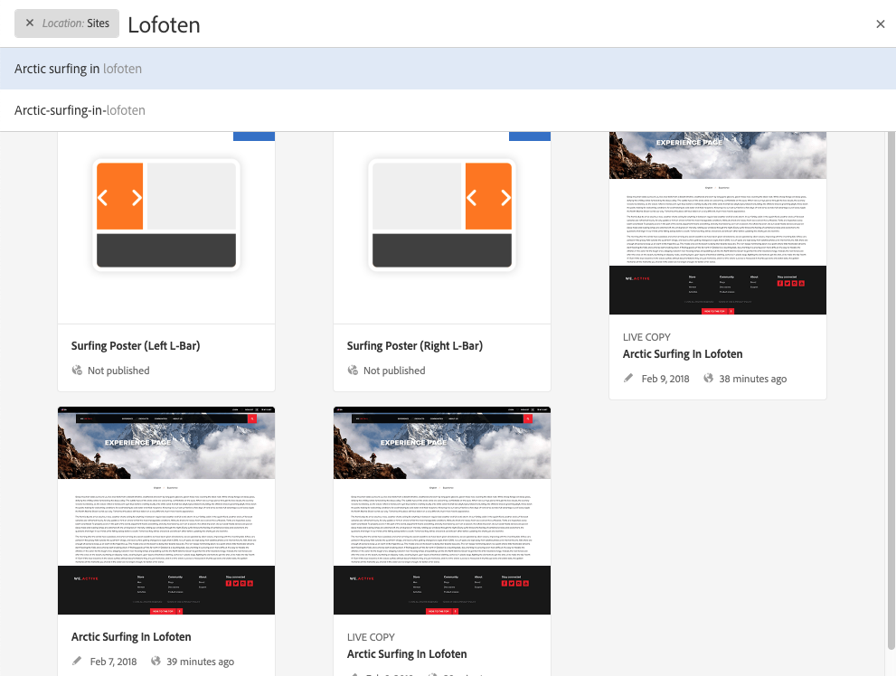
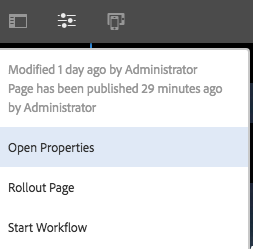
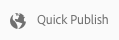

# 編寫頁面的快速指南{#quick-guide-to-authoring-pages}

這些程式是AEM中編寫頁面內容之關鍵動作的快速指南（高階）。

他們：

* 不是全面涵蓋。
* 提供詳細檔案的連結。

如需有關使用AEM編寫內容的完整詳細資訊，請參閱：

* [作者的第一步](/help/sites-authoring/first-steps.md)
* [編寫頁面](/help/sites-authoring/page-authoring.md)

## 幾個快速提示 {#a-few-quick-hints}

在概述具體內容之前，以下是值得記住的一小組一般提示和提示。

### Sites Console {#sites-console}

* **建立**

   * 此按鈕適用於許多控制台——顯示的選項會隨情境而改變，因此可能會隨情境而改變。

* 重新排序資料夾中的頁面

   * 這可在「清單檢視」 [中完成](/help/sites-authoring/basic-handling.md#list-view)。 將應用更改並在其他視圖中可見。

#### 頁面編寫 {#page-authoring}

* 導覽連結

   * ***當您處於「編輯」模式時*** ，無法使用 **連結** 。 若要使用連結進行導覽，您需 [要使用下列任一項](/help/sites-authoring/editing-content.md#previewing-pages) :

      * [預覽模式](/help/sites-authoring/editing-content.md#preview-mode)
      * [以已發佈狀態檢視](/help/sites-authoring/editing-content.md#view-as-published)

* 版本不是從頁面編輯器啟動／建立的；現在可從Sites主控台(透過選取資源的 **「建立** 」 [或「時間軸](/help/sites-authoring/basic-handling.md#timeline) 」)完成。

>[!NOTE]
>
>有許多鍵盤快速鍵可讓製作體驗更輕鬆。
>
>* [編輯頁面時的鍵盤快速鍵](/help/sites-authoring/page-authoring-keyboard-shortcuts.md)
>* [控制台的鍵盤快速鍵](/help/sites-authoring/keyboard-shortcuts.md)
>

### 尋找您的頁面 {#finding-your-page}

尋找頁面有多方面；您可以導覽和／或搜尋：

1. 開啟 **Sites** 主控台(使用全域導覽中的 **Sites** 選項  -當您選取Adobe Experience Manager連結（左上）時，會觸發（下拉式）此選項。

1. 點選／按一下適當頁面，向下導覽樹狀結構。 頁面資源的呈現方式取決於您使用的檢視——卡 [片、清單或欄](/help/sites-authoring/basic-handling.md#viewing-and-selecting-resources):

   

1. 使用標題中的導 [覽路徑標示瀏覽樹狀結構](/help/sites-authoring/basic-handling.md#theheaderwithbreadcrumbs)，讓您返回選取的位置：

   

1. 您也可以 [搜尋](/help/sites-authoring/search.md) 頁面。 您可以從顯示的結果中選取您的頁面。

   

### 建立新頁面 {#creating-a-new-page}

要 [建立新頁](/help/sites-authoring/managing-pages.md#creating-a-new-page):

1. [導覽至您要建立新頁面的位置](#finding-your-page) 。
1. 使用「 **建立** 」圖示，然後從清 **單中選取「頁面** 」:

   

1. 這會開啟精靈，引導您收集建立新頁面時 [所需的資訊](/help/sites-authoring/managing-pages.md#creating-a-new-page)。 請依照螢幕上的指示進行。

### 選取您的頁面以執行進一步動作 {#selecting-your-page-for-further-action}

您可以選取頁面，以便對其採取動作。 選擇頁面會自動更新工具列，以便顯示與該資源相關的操作。

如何選取頁面取決於您在主控台中使用的檢視：

1. 欄檢視:

   * 點選／按一下所需資源的縮圖——縮圖將覆蓋在勾選標籤上，以顯示已選取。

1. 清單檢視:

   * 點選／按一下所需資源的縮圖——縮圖將覆蓋在勾選標籤上，以顯示已選取。

1. 卡片檢視:

   * 通過選擇所需資 [源，進入選擇模式](/help/sites-authoring/basic-handling.md#viewingandselectingyourresources) :

      * 行動裝置：點選並按住
      * 案頭：快速 [動作](/help/sites-authoring/basic-handling.md#quick-actions) -勾選圖示：
   

   * 卡片將覆蓋上勾號，以顯示已選取頁面。
   >[!NOTE]
   >
   >一旦進入選擇模式， **「選取** 」圖示（勾選）將變更為「取消 **選取** 」圖示（交叉）。

### 快速動作（僅限卡片檢視／案頭） {#quick-actions-card-view-desktop-only}

[您可使用](/help/sites-authoring/basic-handling.md#quick-actions) :

1. [導覽至您要對](#finding-your-page) 「頁面」採取動作的頁面。
1. 將滑鼠指標暫留在代表您所需資源的資訊卡上；快速操作將顯示：

   

### 編輯您的頁面內容 {#editing-your-page-content}

若要編輯您的頁面：

1. [導覽至您要編輯的頁面](#finding-your-page) 。
1. [使用「編輯（鉛筆）](/help/sites-authoring/managing-pages.md#opening-a-page-for-editing) 」圖示開啟您的頁面進行編輯：

   

   您可從以下任一位置存取此項：

   * [適當資源的快速動作（僅限卡片檢視／案頭）](#quick-actions-card-view-desktop-only) 。
   * 選取頁面時 [的工具列](#selectiingyourpageforfurtheraction)。

1. 當編輯器開啟時，您可以：

   * [新增補償至您的頁面](/help/sites-authoring/editing-content.md#inserting-a-component) :

      * 開啟側面板
      * 選擇元件頁籤(組 [件瀏覽器](/help/sites-authoring/author-environment-tools.md#components-browser))
      * 將所需元件拖曳至您的頁面。
      側面板可以開啟（和關閉）:
   

   * [編輯頁面上現有元件的內容](/help/sites-authoring/editing-content.md#edit-configure-copy-cut-delete-paste) :

      * 使用點選或按一下來開啟元件工具列。 使用「編 **輯** （鉛筆）」圖示開啟對話方塊。
      * 使用點選並按住或按兩下，開啟元件的就地編輯器。 將顯示可用的操作（對於某些元件，這將是有限的選擇）。
      * 若要查看所有可用動作，請進入全螢幕模式：
   

   * [配置現有元件的屬性](/help/sites-authoring/editing-content.md#component-edit-dialog)

      * 使用點選或按一下來開啟元件工具列。 使用 **Configure** （扳手）圖示開啟對話方塊。
   * [移動元件](/help/sites-authoring/editing-content.md#moving-a-component) :

      * 將所需元件拖曳至其新位置。
      * 使用點選或按一下來開啟元件工具列。 視需要 **使用** 「剪 **下」** 、「貼上」圖示。
   * [複製（並貼上）](/help/sites-authoring/editing-content.md#edit-configure-copy-cut-delete-paste) :

      * 使用點選或按一下來開啟元件工具列。 視需要 **使用** 「復 **制」** 、「貼上」圖示。
   >[!NOTE]
   >
   >您可以 **將元件** 「貼入」至相同的頁面或不同的頁面。 如果貼到在剪下／複製操作之前已開啟的其他頁面，則該頁面需要重新整理頁面。

   * [刪除](/help/sites-authoring/editing-content.md#edit-configure-copy-cut-delete-paste) a component:

      * 使用點選或按一下來開啟元件工具列，然後使用「刪 **除** 」圖示。
   * [新增註解](/help/sites-authoring/annotations.md#annotations) 至頁面：

      * 選取「注 **解** 」模式（語音泡泡圖示）。 使用「添加註 **釋** （加號）」表徵圖添加註釋。 使用右上角的X退出注釋模式。
   

   * [預覽頁面](/help/sites-authoring/editing-content.md#preview-mode) （以檢視它在發佈環境中的顯示方式）

      * 從工 **具列中** ，選取「預覽」。
   * 使用「編輯」下拉選擇器返回編輯模式(或選 **擇其他模** 式)。
   >[!NOTE]
   >
   >若要在內容中使用連結進行導覽，您必須使用「預 [覽」模式](/help/sites-authoring/editing-content.md#preview-mode)。

### 編輯頁面屬性 {#editing-the-page-properties}

編輯頁面屬性有兩種（主要） [方法](/help/sites-authoring/editing-page-properties.md):

* 從Sites控 **制台** :

   1. [導覽至您要發佈的頁面](#finding-your-page) 。
   1. 從以下任 **一位置** ，選擇「屬性」表徵圖：

      * [適當資源的快速動作（僅限卡片檢視／案頭）](#quick-actions-card-view-desktop-only) 。
      * 選取頁面時 [的工具列](#selectiingyourpageforfurtheraction)。
   

   1. 將顯示頁面屬性。 您可以視需要進行更新，然後使用「儲存」來保存這些

* 編輯 [頁面時](#editing-your-page-content):

   1. 開啟「頁 **面資訊** 」功能表。
   1. 選擇「 **開啟屬性** 」(Open Properties)以開啟用於編輯屬性的對話框。
   

### 發佈您的頁面（或取消發佈） {#publishing-your-page-or-unpublishing}

發佈頁面的主要方 [法有](/help/sites-authoring/publishing-pages.md) （以及取消發佈）:

* 從Sites控 **制台** :

   1. [導覽至您要發佈的頁面](#finding-your-page) 。
   1. 從以下任 **一欄選取** 「快速發佈」圖示：

      * [適當資源的快速動作（僅限卡片檢視／案頭）](#quick-actions-card-view-desktop-only) 。
      * 選取頁面時的 [工具列](#selectiingyourpageforfurtheraction) (也提供稍後 [發佈的存取權](/help/sites-authoring/publishing-pages.md#main-pars-title-12))。
   

* 編輯 [頁面時](#editing-your-page-content):

   1. 開啟「頁 **面資訊** 」功能表。
   1. 選擇 **發佈頁面**。
   

* 從主控台取消發佈頁面只能透過「管理出版物 **** 」選項完成，此選項只能在工具列上使用（不能透過快速動作）。

   「取 **消發佈頁面** 」選項仍可透過編輯器中 **的「頁面資訊** 」功能表使用。

   

   如需詳 [細資訊，請參閱](/help/sites-authoring/publishing-pages.md#unpublishing-pages) 「發佈頁面」。

### 移動、複製和貼上或刪除頁面 {#move-copy-and-paste-or-delete-your-page}

這些動作都可由下列項目觸發：

1. [導覽至您要移動](#finding-your-page) 、複製和貼上或刪除的頁面。
1. 選擇複製（然後貼上）、移動或刪除圖示（視需要），使用下列任一項：

   * [所需資源的快速動作（僅限卡片檢視／案頭）](#quick-actions-card-view-desktop-only) 。
   * 選取頁面時 [的工具列](#selecting-your-page-for-further-action)。
   然後，請依您的動作：

   * 複製:

      * 然後，您需要導覽至新位置並貼上。
   * 移動:

      * 嚮導將開啟，以收集移動頁面所需的資訊。 依照螢幕上的指示進行。
   * 刪除:

      * 系統會要求您確認動作。
   >[!NOTE]
   >
   >「刪除」不能作為「快速操作」使用。

### 鎖定頁面（然後解除鎖定） {#locking-your-page-then-unlocking}

[鎖定頁面](/help/sites-authoring/editing-content.md#locking-a-page) ，會使其他作者無法在您執行時使用頁面。 您可以找到「鎖定（和解除鎖定）」圖示／按鈕：

* 選取頁面時 [的工具列](#selecting-your-page-for-further-action)。
* 編輯 [頁面時，「頁面資訊](#editing-the-page-properties) 」下拉式功能表。
* 編輯頁面時的頁面工具列（當頁面鎖定時）

例如，鎖定表徵圖如下所示：

### 存取頁面參考 {#accessing-page-references}

[可在「參考邊欄](/help/sites-authoring/author-environment-tools.md#references) 」中快速存取頁面的參考。

1. 使用 **工具欄** （在選擇頁面之前或之後）選 [擇「參照」(References](#selecting-your-page-for-further-action)):

   

   顯示了參考類型清單：

   

1. 點選／按一下所需的參考類型，以顯示更多詳細資訊，並（在適當時）採取進一步的動作。

### 建立頁面版本 {#creating-a-version-of-your-page}

若要建立 [頁面](/help/sites-authoring/working-with-page-versions.md) 的版本：

1. 若要開啟時間軸邊欄，請使用工 **[具列圖示](/help/sites-authoring/basic-handling.md#timeline)**(選取頁面之前或[之後](#selecting-your-page-for-further-action))選取時間軸：

   

1. 點選／按一下「時間軸」欄右下方的向上箭頭，以顯示額外的按鈕，包括「另 **存為版本」**。

   

1. 選擇 **另存為版本**，然 **後建立**。

### 還原／比較頁面版本 {#restoring-comparing-a-version-of-your-page}

在還原和／或比較頁面版本時，會使用相同的基本機制：

1. 使用 **[工具列圖](/help/sites-authoring/basic-handling.md#timeline)**示(在選取頁面之前或之[後)選取時間軸](#selecting-your-page-for-further-action):

   

   如果您的頁面版本已儲存，這將列在時間軸中。

1. 點選／按一下您要復原的版本——這將顯示其他動作按鈕：

   * **還原為此版本**

      * 版本將被還原。
   * **顯示差異**

      * 開啟頁面時，會反白顯示兩個版本的差異。
