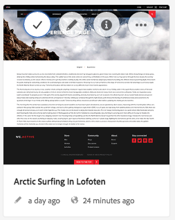

# 製作頁面的快速指南{#quick-guide-to-authoring-pages}

這些程式旨在作為在AEM中編寫頁面內容關鍵動作的快速指南（高層級）。

上述功能為：

* 不是為了提供完整的涵蓋範圍。
* 提供詳細檔案的連結。

如需使用AEM編寫的完整詳細資訊，請參閱：

* [作者的首要步驟](/help/sites-authoring/first-steps.md)
* [製作頁面](/help/sites-authoring/page-authoring.md)

## 一些快速提示 {#a-few-quick-hints}

在概略介紹具體內容之前，請先參閱以下小冊子，其中收錄一些值得牢記的一般秘訣和提示。

### 網站主控台 {#sites-console}

* **建立**

   * 此按鈕在許多主控台中都有提供 — 顯示的選項會區分大小寫，因此可視情況而有所不同。

* 在資料夾中重新排序頁面

   * 您可以在中完成此作業 [清單檢視](/help/sites-authoring/basic-handling.md#list-view). 變更會套用並顯示在其他檢視中。

#### 頁面製作 {#page-authoring}

* 導覽連結

   * ***連結無法用於導覽*** 當您在 **編輯** 模式。 若要使用連結導覽，您必須 [預覽頁面](/help/sites-authoring/editing-content.md#previewing-pages) 使用：

      * [預覽模式](/help/sites-authoring/editing-content.md#preview-mode)
      * [以已發佈狀態檢視](/help/sites-authoring/editing-content.md#view-as-published)

* 無法從頁面編輯器啟動/建立版本；現在，可以從網站主控台完成(透過 **建立** 或 [時間表](/help/sites-authoring/basic-handling.md#timeline) （針對選取的資源）。

>[!NOTE]
>
>有數種鍵盤快速鍵可讓您更輕鬆進行撰寫體驗。
>
>* [編輯頁面時的鍵盤快速鍵](/help/sites-authoring/page-authoring-keyboard-shortcuts.md)
>* [主控台的鍵盤快速鍵](/help/sites-authoring/keyboard-shortcuts.md)
>

### 尋找您的頁面 {#finding-your-page}

尋找頁面有許多方面；您可以導覽及/或搜尋：

1. 開啟 **網站** 主控台(使用 **網站** 中的選項 [全域導覽](/help/sites-authoring/basic-handling.md#global-navigation)) — 這會在您選取Adobe Experience Manager連結（左上方）時觸發（下拉式清單）。

1. 點選/按一下適當的頁面，在樹狀結構中向下導覽。 頁面資源的呈現方式取決於您使用的檢視 —  [卡片、清單或欄](/help/sites-authoring/basic-handling.md#viewing-and-selecting-resources)：

   

1. 瀏覽樹狀結構，使用 [標頭中的階層連結](/help/sites-authoring/basic-handling.md#theheaderwithbreadcrumbs)，可讓您返回所選位置：

   

1. 您也可以 [搜尋](/help/sites-authoring/search.md) 用於頁面。 您可以從顯示的結果中選取您的頁面。

   

### 建立新頁面 {#creating-a-new-page}

至 [建立頁面](/help/sites-authoring/managing-pages.md#creating-a-new-page)：

1. [導覽至該位置](#finding-your-page) 建立頁面的位置。
1. 使用 **建立** 圖示，然後選取 **頁面** 從清單：

   

1. 這會開啟精靈，引導您收集以下專案所需的資訊： [建立您的新頁面](/help/sites-authoring/managing-pages.md#creating-a-new-page). 請依照熒幕上的指示操作。

### 選取您的頁面以採取進一步動作 {#selecting-your-page-for-further-action}

您可以選取頁面以便對其執行動作。 選取頁面會自動更新工具列，以便顯示該資源相關的動作。

如何選取頁面取決於您在主控台中使用的檢視：

1. 欄檢視:

   * 點選/按一下所需資源的縮圖 — 縮圖上將覆蓋一個勾號，表示已選取該縮圖。

1. 清單檢視:

   * 點選/按一下所需資源的縮圖 — 縮圖上將覆蓋一個勾號，表示已選取該縮圖。

1. 卡片檢視:

   * 進入選擇模式的方法有： [選取所需的資源](/help/sites-authoring/basic-handling.md#viewingandselectingyourresources) 替換為：

      * 行動裝置：點選並按住
      * 桌上型電腦： [快速動作](/help/sites-authoring/basic-handling.md#quick-actions)  — 勾選圖示：

   

   * 卡片上將覆蓋一個勾號，表示已選取頁面。

   >[!NOTE]
   >
   >在選擇模式中 **選取** 圖示（勾號）將變更為 **取消選取** 圖示（十字形）。

### 快速動作（僅限卡片檢視/案頭） {#quick-actions-card-view-desktop-only}

[快速動作](/help/sites-authoring/basic-handling.md#quick-actions) 可用：

1. [導覽至頁面](#finding-your-page) 您要對其執行動作。
1. 將滑鼠指標停留在代表所需資源的卡片上；會顯示快速動作：

   

### 編輯您的頁面內容 {#editing-your-page-content}

1. [導覽至頁面](#finding-your-page) 您想要編輯。
1. [開啟您的頁面以進行編輯](/help/sites-authoring/managing-pages.md#opening-a-page-for-editing) 使用編輯（鉛筆）圖示：

   

   您可透過下列任一方式存取此專案：

   * [快速動作（僅限卡片檢視/案頭）](#quick-actions-card-view-desktop-only) 以取得適當的資源。
   * 工具列，當 [已選取頁面](#selectiingyourpageforfurtheraction).

1. 編輯器開啟時，您可以：

   * [新增元件至您的頁面](/help/sites-authoring/editing-content.md#inserting-a-component) 作者：

      * 開啟側面板
      * 選取「元件」標籤( [元件瀏覽器](/help/sites-authoring/author-environment-tools.md#components-browser))
      * 將必要的元件拖曳到頁面上。

     側面板的開啟（和關閉）方式：

     

   * [編輯現有元件的內容](/help/sites-authoring/editing-content.md#edit-configure-copy-cut-delete-paste) 在頁面上：

      * 使用點選或按一下來開啟元件工具列。 使用 **編輯** （鉛筆）圖示以開啟對話方塊。
      * 使用點選並按住或按兩下滑鼠鍵開啟元件的就地編輯器。 會顯示可用的動作（對於某些元件而言，為有限的選取範圍）。
      * 若要檢視所有可用動作，請使用以下方法進入全熒幕模式：

     

   * [設定現有元件的屬性](/help/sites-authoring/editing-content.md#component-edit-dialog)

      * 使用點選或按一下來開啟元件工具列。 使用 **設定** （扳手）圖示以開啟對話方塊。

   * [移動元件](/help/sites-authoring/editing-content.md#moving-a-component) 兩者之一：

      * 將所需元件拖曳至其新位置。
      * 使用點選或按一下來開啟元件工具列。 使用 **剪下** 則 **貼上** 圖示視需要顯示。

   * [複製（和貼上）](/help/sites-authoring/editing-content.md#edit-configure-copy-cut-delete-paste) 元件：

      * 使用點選或按一下來開啟元件工具列。 使用 **複製** 則 **貼上** 圖示視需要。

   >[!NOTE]
   >
   >您可以 **貼上** 元件至相同頁面或不同頁面。 如果貼上至剪下/復製作業前已開啟的其他頁面，則需要重新整理該頁面。

   * [刪除](/help/sites-authoring/editing-content.md#edit-configure-copy-cut-delete-paste) 元件：

      * 點選或按一下以開啟元件工具列，然後使用 **刪除** 圖示。

   * [新增註解](/help/sites-authoring/annotations.md#annotations) 移至頁面：

      * 選取 **註解** 模式（語音泡泡圖示）。 使用新增附註 **新增註解** （加號）圖示。 使用右上方的X退出附註模式。

     

   * [預覽頁面](/help/sites-authoring/editing-content.md#preview-mode) （檢視其顯示在發佈環境中的方式）

      * 選取 **預覽** 工具列中的。

   * 使用返回編輯模式（或選取其他模式） **編輯** 下拉式選取器。

   >[!NOTE]
   >
   >若要使用內容中的連結導覽，您必須使用 [預覽模式](/help/sites-authoring/editing-content.md#preview-mode).

### 編輯頁面屬性 {#editing-the-page-properties}

有兩種（主要）方法 [編輯頁面屬性](/help/sites-authoring/editing-page-properties.md)：

* 從 **網站** 主控台：

   1. [導覽至頁面](#finding-your-page) 您要發佈。
   1. 選取 **屬性** 圖示來自：

      * [快速動作（僅限卡片檢視/案頭）](#quick-actions-card-view-desktop-only) 以取得適當的資源。
      * 工具列，當 [已選取頁面](#selectiingyourpageforfurtheraction).

  

   1. 畫面隨即顯示頁面屬性。 您可以視需要進行更新，然後使用「儲存」來儲存這些專案

* 時間 [編輯您的頁面](#editing-your-page-content)：

   1. 開啟 **頁面資訊** 功能表。
   1. 選取 **開啟屬性** 以開啟對話方塊來編輯屬性。

  

### 發佈頁面（或取消發佈） {#publishing-your-page-or-unpublishing}

有兩種主要方法 [發佈您的頁面](/help/sites-authoring/publishing-pages.md) （以及取消發佈）：

* 從 **網站** 主控台：

   1. [導覽至頁面](#finding-your-page) 您要發佈。
   1. 選取 **快速發佈** 圖示來自：

      * [快速動作（僅限卡片檢視/案頭）](#quick-actions-card-view-desktop-only) 以取得適當的資源。
      * 工具列，當 [已選取頁面](#selectiingyourpageforfurtheraction) (也可讓您存取 [稍後發佈](/help/sites-authoring/publishing-pages.md#main-pars-title-12))。

  

* 時間 [編輯您的頁面](#editing-your-page-content)：

   1. 開啟 **頁面資訊** 功能表。
   1. 選取 **發佈頁面**.

  

* 從主控台取消發佈頁面只能透過「管理出版物 **** 」選項完成，此選項只能在工具列上使用 (不能透過快速動作)。

  此 **取消發佈頁面** 選項仍可透過 **頁面資訊** 功能表。

  

  另請參閱 [發佈頁面](/help/sites-authoring/publishing-pages.md#unpublishing-pages) 以取得詳細資訊。

### 移動、複製並貼上或刪除您的頁面 {#move-copy-and-paste-or-delete-your-page}

這些動作都可由以下動作觸發：

1. [導覽至頁面](#finding-your-page) 您想要移動、複製和貼上或刪除。
1. 選擇複製 (然後貼上) 、移動或刪除圖示 (視需要)，使用下列任一項：

   * [快速動作（僅限卡片檢視/案頭）](#quick-actions-card-view-desktop-only) 以取得所需資源。
   * 工具列，當 [已選取頁面](#selecting-your-page-for-further-action).

   接著，視您的動作而定：

   * 複製:

      * 導覽至新位置並貼上。

   * 移動:

      * 精靈會開啟，以收集移動頁面所需的資訊。 請依照熒幕上的指示操作。

   * 刪除:

      * 系統會要求您確認動作。

   >[!NOTE]
   >
   >「刪除」不適用於「快速動作」。

### 鎖定頁面（然後解鎖） {#locking-your-page-then-unlocking}

[鎖定頁面](/help/sites-authoring/editing-content.md#locking-a-page) ，會使其他作者無法在您執行時使用頁面。您可以找到「鎖定 (和解除鎖定) 」圖示/按鈕：

* 工具列，當 [已選取頁面](#selecting-your-page-for-further-action).
* 此 [頁面資訊下拉式功能表](#editing-the-page-properties) 編輯頁面時。
* 編輯頁面（頁面已鎖定）時的頁面工具列

例如，鎖定圖示看起來像這樣：

### 存取頁面參照 {#accessing-page-references}

[快速存取引用](/help/sites-authoring/author-environment-tools.md#references) 至某個頁面或從某個頁面可在參考邊欄中使用。

1. 選取 **引用** 使用工具列圖示（在之前或之後） [選取您的頁面](#selecting-your-page-for-further-action))：

   

   此時會顯示參考型別清單：

   

1. 點選/按一下所需的參考型別以顯示更多詳細資訊，並（在適當時）採取進一步動作。

### 建立頁面的版本 {#creating-a-version-of-your-page}

若要建立 [版本](/help/sites-authoring/working-with-page-versions.md) ，共頁：

1. 若要開啟「時間軸」邊欄，請選取 **[時間表](/help/sites-authoring/basic-handling.md#timeline)** 使用工具列圖示（在之前或之後） [選取您的頁面](#selecting-your-page-for-further-action))：

   

1. 點選/按一下「時間軸」欄右下方的向上箭頭，以顯示其他按鈕，包括 **另存為版本**.

   

1. 選取 **另存為版本**，然後 **建立**.

### 還原/比較頁面版本 {#restoring-comparing-a-version-of-your-page}

還原及/或比較頁面版本時，會使用相同的基本機制：

1. 選取 **[時間表](/help/sites-authoring/basic-handling.md#timeline)** 使用工具列圖示（在之前或之後） [選取您的頁面](#selecting-your-page-for-further-action))：

   

   如果頁面的某個版本已儲存，則會列在時間軸中。

1. 點選/按一下您要還原的版本 — 這會顯示其他動作按鈕：

   * **還原為此版本**

      * 版本已還原。

   * **顯示差異**

      * 頁面開啟時會反白顯示兩個版本之間的差異。
