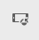

# 回應式版面{#responsive-layout}

通AEM過使用 **佈局容器** 元件。

這提供了段落系統，允許您在響應網格中定位元件。 此網格可根據設備/窗口大小和格式重新排列佈局。 該元件與 [**佈局** 模式](/help/sites-authoring/responsive-layout.md#defining-layouts-layout-mode)，允許您根據設備建立和編輯響應性佈局。

佈局容器：

* 提供水準對齊網格，以及將元件並排放置到網格中並定義它們應在何時折疊/重排的功能。
* 使用預定義的斷點（如電話、平板電腦等） 以定義相關設備/方向所需的內容行為。

   * 例如，可以定制元件大小或在特定設備上是否可以看到元件。

* 可以嵌套以允許列控制。

然後，用戶可以看到如何使用模擬器為特定設備呈現內容。

>[!CAUTION]
>
>儘管佈局容器元件在標準UI中可用，但其全部功能僅在啟用觸摸的UI中可用且受支援。

使AEM用多種機制實現頁面的響應式佈局：

* [**佈局容器**](#adding-a-layout-container-and-its-content-edit-mode) 元件

   此元件在 [元件瀏覽器](/help/sites-authoring/author-environment-tools.md#components-browser) 並提供一個網格段落系統，允許您在響應網格中添加和定位元件。 也可以將其設定為頁面上的預設段落系統。

* [**佈局模式**](/help/sites-authoring/responsive-layout.md#defining-layouts-layout-mode)

   佈局容器放置在頁面上後，您可以使用 **佈局** 在響應網格中定位內容的模式。

* [**模擬器**](#selecting-a-device-to-emulate)
這允許您建立和編輯響應性網站，這些網站通過交互調整元件大小來根據設備/窗口大小重新排列佈局。 然後，用戶可以查看如何使用模擬器呈現內容。

利用這些響應網格機制，您可以：

* 使用斷點根據設備寬度（與設備類型和方向相關）定義不同的內容佈局。
* 使用這些相同的斷點和內容佈局，確保您的內容能夠響應案頭上瀏覽器窗口的大小。
* 使用水準對齊網格，允許您將元件放置在網格中，根據需要調整尺寸，並定義它們應折疊/重排到並排或上/下的時間。
* 隱藏特定設備佈局的元件。
* 實現列控制。

根據您的項目，佈局容器可能用作頁面的預設段落系統，或用作可通過元件瀏覽器（或兩者）添加到頁面的元件。

>[!NOTE]
>
>Adobe提供 [GitHub文檔](https://adobe-marketing-cloud.github.io/aem-responsivegrid/) 作為可提供給前端開發人員的引用，允許他們使用外部的AEM網格AEM，例如在為將來站點建立靜態HTML模型AEM時。

>[!NOTE]
>
>通過模板上的配置啟用上述機制的使用。 請參閱 [配置響應佈局](/help/sites-administering/configuring-responsive-layout.md) 的上界。

## 佈局定義、設備模擬和斷點 {#layout-definitions-device-emulation-and-breakpoints}

在建立網站內容時，您希望確保顯示的內容與用於查看內容的設備相適應。

AEM允許您根據設備寬度定義佈局：

* 模擬器使您能夠在一系列設備上模擬這些佈局。 除設備類型外，還選擇 **旋轉裝置** 選項。
* 斷點是分隔佈局定義的點。

   * 它們有效地定義了使用特定佈局的任何設備的最大寬度（以像素為單位）。
   * 斷點通常對選擇的設備有效，取決於其顯示的寬度。
   * 斷點的範圍將向左延伸，直到下一個斷點。
   * 您不能具體選擇斷點，選擇設備和方向將自動選擇相應的斷點。

設備 **案頭**，它沒有特定寬度，與預設斷點（即上次配置的斷點之上的所有內容）相關。

>[!NOTE]
>
>可以為每個設備定義斷點，但這將大大增加佈局定義和維護所需的工作量。

使用模擬器時，選擇特定設備進行模擬和佈局定義，並且相關斷點也將突出顯示。 您所做的任何佈局更改都將適用於應用斷點的其他設備，即位於活動斷點標籤左側但位於下一個斷點標籤之前的任何設備。

例如，當您選擇設備時 **iPhone6+** （定義寬度為540像素），用於模擬和佈局，斷點 **電話** （定義為768像素）也將激活。 您對 **iPhone6** 將適用於以下設備 **電話** 斷點，例如 **iPhone5** （定義為320像素）。

## 選擇要模擬的設備 {#selecting-a-device-to-emulate}

1. 開啟所需的頁面進行編輯。 例如：

   `http://localhost:4502/editor.html/content/we-retail/us/en/experience.html`

1. 選擇 **模擬器** 表徵圖：

   

1. 將開啟模擬器工具欄。

   

   模擬器工具欄顯示其他佈局選項：

   * **旋轉裝置**  — 允許您將設備從垂直（縱向）方向旋轉到水準（橫向）方向，反之亦然。

    

   * **選擇設備**  — 定義要從清單中模擬的特定設備（有關詳細資訊，請參閱下一步）

   

1. 要選擇要模擬的特定設備，您可以：

   * 使用「選擇設備」表徵圖並從下拉選擇器中進行選擇。
   * 點擊/按一下模擬器工具欄中的設備指示器。

   

1. 選擇特定設備後，您可以：

   * 查看所選設備的活動標籤，如 **iPad。**
   * 請參閱相應的活動標籤 [斷點](/help/sites-authoring/responsive-layout.md#layout-definitions-device-emulation-and-breakpoints) 例如 **平板電腦。**

   

   * 藍色虛線表示 *折疊* 為所選設備(此處 **iPhone6**)。

   

   * 折頁還可以視為分頁符(不要與 [斷點](/help/sites-authoring/responsive-layout.md#layout-definitions-device-emulation-and-breakpoints))。 此處顯示是為了便於顯示用戶在滾動之前將在設備上看到的內容部分。
   * 如果要模擬的設備的高度高於螢幕大小，則不顯示折線的線。
   * 為方便作者而顯示折疊，而不顯示在已發佈的頁面上。

## 新增版面容器及其內容 (編輯模式) {#adding-a-layout-container-and-its-content-edit-mode}

A **佈局容器** 是段落制度：

* 包含其他元件。
* 定義佈局。
* 響應更改。

>[!NOTE]
>
>如果尚不可用， **佈局容器** 必須明確 [已為段落系統/頁激活](/help/sites-administering/configuring-responsive-layout.md) (例如，通過 [**設計** 模式](/help/sites-authoring/default-components-designmode.md))。

1. 「配 **置容器** 」是元件瀏覽器中的標準 [元件](/help/sites-authoring/author-environment-tools.md#components-browser)。從這裡，您可以將其拖曳至頁面上的必要位置，之後您將看到「拖曳元件至此處 **** 」預留位置。
1. 然後，可將元件添加到佈局容器。 這些元件將保存實際內容：

   

## 選擇佈局容器並對其執行操作（編輯模式） {#selecting-and-taking-action-on-a-layout-container-edit-mode}

與其他元件一樣，您可以選擇並對佈局容器(當在 **編輯** 模式):

>[!CAUTION]
>
>由於佈局容器是段落系統，刪除元件將同時刪除佈局網格和容器內保存的所有元件（及其內容）。

1. 如果滑鼠懸停或點擊網格佔位符，則顯示操作菜單。

   

   您需要選擇 **父級** 的雙曲餘切值。

   

1. 如果佈局元件是嵌套的，請選擇 **父級** 選項顯示一個下拉選項，允許您選擇嵌套佈局容器或其父項。

   將滑鼠移到下拉清單中的容器名稱上時，其輪廓將顯示在頁面上。

   * 最低的嵌套佈局容器將以黑色輪廓。
   * 下一個最低的嵌套佈局容器將呈深灰色。
   * 每個連續的容器都會有較淺的灰色。

   

1. 這將突出顯示整個網格及其內容。 將顯示操作工具欄，您可以從中選擇操作，如 **刪除。**

   

## 定義佈局（佈局模式） {#defining-layouts-layout-mode}

>[!NOTE]
>
>可以為每個佈局定義單獨的佈局 [斷點](#layout-definitions-device-emulation-and-breakpoints) （由模擬設備類型和方向確定）。

要配置使用佈局容器實現的響應網格的佈局，您需要使用 **佈局** 的子菜單。

**佈局** 模式可以通過兩種方式啟動。

* 使用工具列 [中的模式選單](/help/sites-authoring/author-environment-tools.md#page-modes) ，然後選擇「 **版面模式」**

   * 選取「 **版面** 」模式，就像切換至「編輯 **」模式或「** 定位 **** 」模式。
   * **配置模式** (Layout **mode)會維持持續性，而且您必須先透過模式選取器** 選取其他模式，才能離開「配置」模式。

* 當 [編輯單個元件。](/help/sites-authoring/editing-content.md#edit-component-layout)

   * 使用 **佈局** 選項，可切換到 **佈局** 的子菜單。
   * **佈局** 模式在編輯元件時仍然存在，並恢復為 **編輯** 模式將焦點更改到另一個元件。

在佈局模式下，可以在網格上執行各種操作：

* 使用藍點調整內容元件的大小。 調整大小將始終與網格對齊。 調整背景網格大小時，將顯示以幫助對齊：

   

   >[!NOTE]
   >
   >當元件(如 **影像** 已調整大小。

* 按一下/點擊內容元件，工具欄允許您：

   * **父級**

      允許您選擇整個佈局容器元件，以便對整體執行操作。

   * **浮動至新行**

      元件將根據網格中可用的空間移動到新行。

   * **隱藏元件**

      元件將變為不可見（可以從佈局容器的工具欄恢復）。
   

* 在 **佈局** 模式，您可以點擊/按一下 **將元件拖動到此處** 的子菜單。 這將顯示此模式的工具欄。

   工具欄將根據佈局元件的狀態和屬於它的元件的不同選項。 例如：

   * **父級**  — 選擇父元件。

   

   * **顯示隱藏元件**  — 顯示所有或單個元件。 數字表示當前隱藏的元件數。計數器顯示隱藏的元件數。

   

   * **還原斷點佈局**  — 還原為預設佈局。 這意味著不會強加自定義佈局。

   

   * **浮動到新行**  — 如果間距允許，將元件上移一個位置。

   

   * **隱藏元件**  — 隱藏當前元件。

   

   >[!NOTE]
   >
   >在上例中，浮點和隱藏操作可用，因為此佈局容器嵌套在父佈局容器中。

   * **取消隱藏元件**
選擇要顯示操作工具欄的父元件 
**顯示隱藏元件** 的雙曲餘切值。 在此示例中，隱藏了兩個元件。
   

   選取「顯 **示隱藏的元件** 」(Show hidden components)選項，會以藍色顯示目前隱藏在原始位置的元件。

   

   選擇 **全部恢復** 將取消隱藏所有隱藏的元件。
