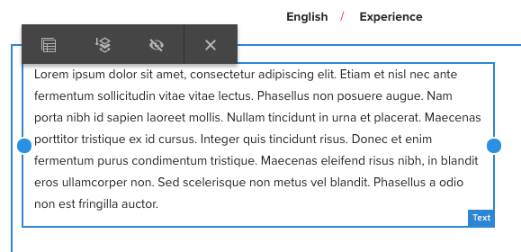

# 回應式版面{#responsive-layout}

AEM可讓您使用 **版面容器** 元件。

這提供了段落系統，可讓您在回應式格線中定位元件。 此網格可根據設備/窗口大小和格式重新排列佈局。 該元件與 [**版面** 模式](/help/sites-authoring/responsive-layout.md#defining-layouts-layout-mode)，可讓您根據裝置建立和編輯回應式版面。

版面容器：

* 提供與網格的水準對齊，以及將元件並排放置到網格中並定義元件何時應折疊/重流的功能。
* 使用預先定義的斷點（例如手機、平板電腦等） 來定義相關裝置/方向之內容的必要行為。

   * 例如，您可以自訂元件大小，或特定裝置上是否可看見元件。

* 可巢狀化以允許欄控制。

然後，使用者可以透過模擬器查看特定裝置呈現內容的方式。

>[!CAUTION]
>
>雖然傳統UI中提供「版面容器」元件，但觸控式UI僅提供並支援其完整功能。

AEM使用組合機制來實現頁面的回應式版面：

* [**版面容器**](#adding-a-layout-container-and-its-content-edit-mode) 元件

   此元件可在 [元件瀏覽器](/help/sites-authoring/author-environment-tools.md#components-browser) 和提供格線段落系統，可讓您在回應式格線內新增和定位元件。 也可將其設為頁面上的預設段落系統。

* [**佈局模式**](/help/sites-authoring/responsive-layout.md#defining-layouts-layout-mode)

   版面容器放置在頁面上後，即可使用 **版面** 模式來定位回應式格線內的內容。

* [**模擬器**](#selecting-a-device-to-emulate)
這可讓您透過互動方式調整元件大小，來建立和編輯回應式網站，以根據裝置/視窗大小重新排列版面。 然後，使用者就可以看到使用模擬器呈現內容的方式。

使用這些回應式格線機制，您可以：

* 使用斷點根據設備寬度（與設備類型和方向相關）定義不同的內容佈局。
* 使用這些相同的斷點和內容佈局來確保內容對案頭上的瀏覽器窗口大小有響應。
* 使用水準對齊網格，可讓您將元件置於網格中，根據需要調整大小，並定義元件何時應折疊/重排以並排或在上/下。
* 隱藏特定設備佈局的元件。
* 實現列控制。

根據您的專案，版面容器可能會作為頁面的預設段落系統，或作為可透過元件瀏覽器（或兩者）新增至頁面的元件。

>[!NOTE]
>
>Adobe提供 [GitHub檔案](https://adobe-marketing-cloud.github.io/aem-responsivegrid/) 回應式版面的參考，可提供給前端開發人員，讓他們在AEM外部使用AEM格線，例如為未來的AEM網站建立靜態HTML模型時。

>[!NOTE]
>
>模板上的配置可啟用上述機制的使用。 請參閱 [設定回應式配置](/help/sites-administering/configuring-responsive-layout.md) 以取得更多資訊。

## 佈局定義、設備模擬和斷點 {#layout-definitions-device-emulation-and-breakpoints}

建立網站內容時，您需要確定顯示的內容與用來檢視內容的裝置相適當。

AEM可讓您根據裝置寬度定義配置：

* 模擬器可讓您在一系列裝置上模擬這些配置。 除了裝置類型外，選取的方向為 **旋轉裝置** 選項，可以在寬度更改時影響選定的斷點。
* 斷點是分隔佈局定義的點。

   * 它們使用特定版面有效定義任何裝置的最大寬度（以像素為單位）。
   * 斷點通常對於選擇的設備有效，取決於其顯示器的寬度。
   * 斷點的範圍向左延伸，直到下一個斷點。
   * 不能具體選擇斷點，選擇設備和方向將自動選擇相應的斷點。

裝置 **案頭**，它沒有特定寬度，與預設斷點（即上次配置斷點上的所有內容）相關。

>[!NOTE]
>
>可以為每個單個設備定義斷點，但這將大大增加佈局定義和維護所需的工作量。

使用模擬器時，您為模擬和佈局定義選擇了特定設備，並將突出顯示相關斷點。 您所做的任何佈局更改都將適用於斷點應用到的其他設備，即位於活動斷點標籤左側、但位於下一個斷點標籤之前的任何設備。

例如，當您選取裝置時 **iPhone 6 Plus** （定義為寬度為540像素），用於模擬和佈局，斷點 **電話** （定義為768像素）也會啟動。 您為 **iPhone 6** 將適用於 **手機** 斷點，如 **iPhone 5** （定義為320像素）。

## 選擇要模擬的設備 {#selecting-a-device-to-emulate}

1. 開啟所需的頁面進行編輯。 例如：

   `http://localhost:4502/editor.html/content/we-retail/us/en/experience.html`

1. 選取 **模擬器** 圖示：

   

1. 模擬器工具欄將開啟。

   

   模擬器工具列顯示其他版面選項：

   * **旋轉裝置**  — 可讓您將裝置從垂直（縱向）方向旋轉為水準（橫向）方向，反之亦然。

    

   * **選擇設備**  — 定義要從清單模擬的特定設備（有關詳細資訊，請參閱下一步）

   

1. 若要選取要模擬的特定裝置，您可以執行下列任一動作：

   * 使用「選取裝置」圖示，然後從下拉式選取器中選取。
   * 點選/按一下模擬器工具列中的裝置指示器。

   

1. 選取特定裝置後，您可以：

   * 查看所選設備的活動標籤，例如 **iPad。**
   * 請參閱適當的活動標籤 [斷點](/help/sites-authoring/responsive-layout.md#layout-definitions-device-emulation-and-breakpoints) 例如 **平板電腦。**

   

   * 藍色虛線代表 *折疊* (此處為 **iPhone 6**)。

   

   * 折頁也可視為分頁符(請勿與 [斷點](/help/sites-authoring/responsive-layout.md#layout-definitions-device-emulation-and-breakpoints))（針對內容）。 此畫面會隨即顯示，以方便顯示使用者在捲動前將在裝置上看到的內容。
   * 如果要模擬的設備的高度高於螢幕大小，則不會顯示折線。
   * 折頁會為作者方便而顯示，不會顯示在已發佈的頁面上。

## 新增版面容器及其內容 (編輯模式) {#adding-a-layout-container-and-its-content-edit-mode}

A **版面容器** 是段落系統，可：

* 包含其他元件。
* 定義版面。
* 回應變更。

>[!NOTE]
>
>若尚未可用，則 **版面容器** 必須明確 [為段落系統/頁面啟動](/help/sites-administering/configuring-responsive-layout.md) (例如，透過 [**設計** 模式](/help/sites-authoring/default-components-designmode.md))。

1. 「配 **置容器** 」是元件瀏覽器中的標準 [元件](/help/sites-authoring/author-environment-tools.md#components-browser)。從這裡，您可以將其拖曳至頁面上的必要位置，之後您將看到「拖曳元件至此處 **** 」預留位置。
1. 然後，您可以將元件新增至版面容器。 這些元件將包含實際內容：

   

## 在佈局容器上選擇和執行操作（編輯模式） {#selecting-and-taking-action-on-a-layout-container-edit-mode}

與其他元件一樣，您可以選取「版面容器」，然後對「版面容器」採取動作（剪下、複製、刪除）(當位於 **編輯** 模式):

>[!CAUTION]
>
>由於佈局容器是段落系統，因此刪除元件將同時刪除佈局網格和容器內保存的所有元件（及其內容）。

1. 如果您滑鼠或點選格線預留位置，則會顯示動作功能表。

   

   您必須選取 **父級** 選項。

   

1. 如果嵌套了佈局元件，請選擇 **父級** 選項會顯示下拉式選項，讓您選取巢狀配置容器或其父項。

   將滑鼠移至下拉式清單中的容器名稱上時，其外框會顯示在頁面上。

   * 最低巢狀佈局容器將以黑色外框。
   * 下一個最低的巢狀版面容器將以深灰色顯示。
   * 每個連續的容器都會有較淺的灰色。

   

1. 這將會反白顯示整個格線及其內容。 將會顯示動作工具列，您可在其中選取動作，例如 **刪除。**

   

## 定義佈局（佈局模式） {#defining-layouts-layout-mode}

>[!NOTE]
>
>您可以為每個 [斷點](#layout-definitions-device-emulation-and-breakpoints) （由模擬設備類型和方向確定）。

若要設定以「配置容器」實作的回應式格線的配置，您需要使用 **版面** 模式。

**版面** 模式可透過兩種方式啟動。

* 使用工具列 [中的模式選單](/help/sites-authoring/author-environment-tools.md#page-modes) ，然後選擇「 **版面模式」**

   * 選取「 **版面** 」模式，就像切換至「編輯 **」模式或「** 定位 **** 」模式。
   * **配置模式** (Layout **mode)會維持持續性，而且您必須先透過模式選取器** 選取其他模式，才能離開「配置」模式。

* 當 [編輯個別元件。](/help/sites-authoring/editing-content.md#edit-component-layout)

   * 使用 **版面** 選項（在元件的「快速操作」菜單中），可以切換到 **版面** 模式。
   * **版面** 模式在編輯元件時持續存在，並回復為 **編輯** 模式，以便焦點變更至其他元件。

在版面模式中時，您可以在格線上執行各種動作：

* 使用藍點調整內容元件的大小。 重新調整大小將始終靠齊網格。 調整背景網格大小時，將顯示以輔助對齊：

   

   >[!NOTE]
   >
   >當元件(例如 **影像** 調整大小。

* 按一下/點選內容元件，工具列可讓您：

   * **父級**

      可讓您選取整個版面容器元件，以對整體採取動作。

   * **浮動至新行**

      元件將根據網格中的可用空間移動到新行。

   * **隱藏元件**

      元件將變為不可見（可從佈局容器的工具欄還原）。
   

* 在 **版面** 模式，您可以點選/按一下 **拖曳元件至此** 來選取整個元件。 這會顯示此模式的工具列。

   工具列會根據版面元件的狀態及其所屬元件而有不同的選項。 例如：

   * **父級**  — 選擇父元件。

   

   * **顯示隱藏的元件**  — 顯示所有或個別元件。 數字表示當前隱藏的元件數。計數器顯示隱藏的元件數。

   

   * **恢復斷點佈局**  — 還原為預設配置。 這表示不會強加自訂版面。

   

   * **浮點到新行**  — 如果間距允許，將元件上移。

   

   * **隱藏元件**  — 隱藏當前元件。

   

   >[!NOTE]
   >
   >在上例中，浮點和隱藏操作是可用的，因為此「佈局容器」嵌套在父「佈局容器」中。

   * **取消隱藏元件**
選取父元件以顯示動作工具列，並搭配 
**顯示隱藏的元件** 選項。 在此示例中，隱藏了兩個元件。
   

   選取「顯 **示隱藏的元件** 」(Show hidden components)選項，會以藍色顯示目前隱藏在原始位置的元件。

   

   選取 **全部還原** 會取消隱藏所有隱藏的元件。
