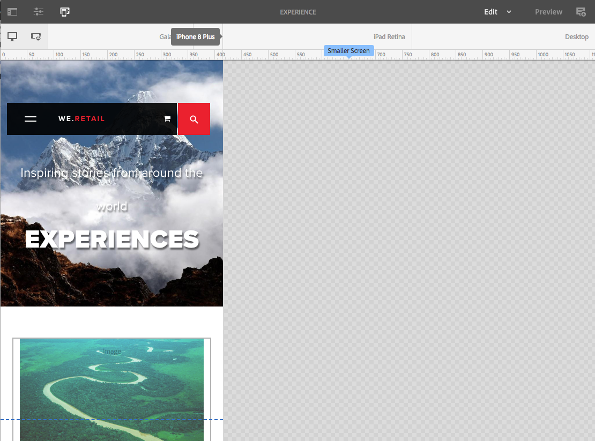

# 回應式版面{#responsive-layout}

Adobe Experience Manager可讓您使用&#x200B;**配置容器**&#x200B;元件，為您的頁面實現回應式配置。

>[!TIP]
>
>本檔案提供內容作者可用的配置容器功能概觀。
>
>對於網站管理員和開發人員，有關如何設定網站配置容器的詳細資訊，請參閱檔案[設定配置容器和配置模式。](/help/sites-authoring/responsive-layout.md)

## 概觀 {#overview}

**配置容器**&#x200B;元件提供段落系統，讓您在回應式格線中放置元件。 此格線可根據裝置/視窗大小和格式重新排列版面。 此元件可搭配&#x200B;[**配置**&#x200B;模式](/help/sites-authoring/responsive-layout.md#defining-layouts-layout-mode)使用，讓您建立和編輯相依於裝置的回應式配置。

配置容器：

* 提供水準貼齊格點，以及可並排將元件置入格點，並定義它們何時應摺疊/重排。
* 使用預先定義的中斷點（例如，手機、平板電腦等），讓您為相關裝置/方向定義內容的必要行為。

   * 例如，您可以自訂元件大小，或是否在特定裝置上可看見元件。

* 可巢狀化以允許欄控制項。

之後，使用者可以使用模擬器檢視內容將如何針對特定裝置呈現。

>[!CAUTION]
>
>雖然「配置容器」元件可用於傳統UI，但其完整功能僅在觸控式UI中提供並支援。

AEM使用多種機制組合，為您的頁面實現回應式佈局：

* [**配置容器**](#adding-a-layout-container-and-its-content-edit-mode)&#x200B;元件

  此元件可在[元件瀏覽器](/help/sites-authoring/author-environment-tools.md#components-browser)中使用，並提供格線段落系統，讓您在回應式格線內新增及放置元件。 它也可以設定為您的頁面上的預設段落系統。

* [**佈局模式**](/help/sites-authoring/responsive-layout.md#defining-layouts-layout-mode)

  將配置容器放置到頁面上後，您就可以使用&#x200B;**配置**&#x200B;模式在回應式格線內放置內容。

* [**模擬器**](#selecting-a-device-to-emulate)
這可讓您建立及編輯回應式網站，這些網站會透過以互動方式調整元件大小，根據裝置/視窗大小重新安排版面。 之後，使用者可以使用模擬器檢視內容的呈現方式。

利用這些回應式格點機制，您可以：

* 根據裝置寬度（與裝置型別和方向相關），使用中斷點來定義不同的內容配置。
* 使用這些相同的中斷點和內容版面配置來確保您的內容會回應案頭上瀏覽器視窗的大小。
* 使用水準靠齊格點，讓您可以在格點中放置元件、視需要調整大小，以及定義它們何時應該摺疊/重排成並排或上下對齊/重排。
* 隱藏特定裝置配置的元件。
* 實現欄控制。

根據您的專案，可能會將「版面容器」用作頁面的預設段落系統，或用作可透過元件瀏覽器新增至頁面的元件（或同時用作兩者）。

>[!NOTE]
>
>Adobe提供回應式佈局的[GitHub檔案](https://adobe-marketing-cloud.github.io/aem-responsivegrid/)，前端開發人員可參考該檔案，以便在AEM外部使用AEM格線，例如為未來的AEM網站建立靜態HTML模型時。

>[!NOTE]
>
>在範本上設定即可使用上述機制。 如需進一步資訊，請參閱[設定回應式配置](/help/sites-administering/configuring-responsive-layout.md)。

## 配置定義、裝置模擬和中斷點 {#layout-definitions-device-emulation-and-breakpoints}

建立網站內容時，您想要確保內容顯示方式適合用來檢視內容的裝置。

AEM可讓您根據裝置的寬度定義版面：

* 模擬器可讓您在多種裝置上模擬這些版面。 除了裝置型別之外，由&#x200B;**旋轉裝置**&#x200B;選項選取的方向，可能會隨著寬度變更而影響選取的中斷點。
* 中斷點是區分配置定義的點。

   * 它們實際上會定義任何使用特定版面配置之裝置的最大寬度（以畫素為單位）。
   * 中斷點通常適用於一系列選取的裝置，視其顯示器的寬度而定。
   * 中斷點的範圍會向左延伸，直到下一個中斷點為止。
   * 您無法明確地選取中斷點，選取裝置和方向將會自動選取適當的中斷點。

沒有特定寬度的裝置&#x200B;**案頭**&#x200B;與預設中斷點（亦即高於上次設定的中斷點）有關。

>[!NOTE]
>
>您可以為每個個別裝置定義中斷點，但這會大幅增加定義和維護版面配置所需的工作。

使用模擬器時，您可以選取特定裝置來模擬和定義版面，相關的中斷點也會反白顯示。 您所做的任何配置變更都將適用於中斷點套用的其他裝置，亦即位於作用中中斷點標籤左側、但下一個中斷點標籤前的任何裝置。

例如，當您選取裝置&#x200B;**iPhone 6 Plus** （定義寬度為540畫素）進行模擬和配置時，也會啟用中斷點&#x200B;**電話** （定義為768畫素）。 您對&#x200B;**iPhone 6**&#x200B;所做的任何配置變更將適用於&#x200B;**電話**&#x200B;中斷點下的其他裝置，例如&#x200B;**iPhone 5** （定義為320畫素）。

## 選取要模擬的裝置 {#selecting-a-device-to-emulate}

1. 開啟進行編輯所需的頁面。 例如：

   `http://localhost:4502/editor.html/content/we-retail/us/en/experience.html`

1. 從頂端工具列選取&#x200B;**模擬器**&#x200B;圖示：

   

1. 模擬器工具列隨即開啟。

   

   模擬器工具列會顯示其他版面配置選項：

   * **旋轉裝置** — 可讓您將裝置從垂直（縱向）方向旋轉至水準（橫向）方向，反之亦然。

      

   * **選取裝置** — 從清單中定義要模擬的特定裝置（請參閱下一個步驟以取得詳細資料）

     

1. 若要選取要模擬的特定裝置，您可以：

   * 使用「選取裝置」圖示，並從下拉式選取器選取。
   * 按一下模擬器工具列中的裝置指示器。

   

1. 選取特定裝置後，您可以：

   * 檢視所選裝置的作用中標籤，例如&#x200B;**iPad。**
   * 檢視適當[中斷點](/help/sites-authoring/responsive-layout.md#layout-definitions-device-emulation-and-breakpoints)的作用中標籤，例如&#x200B;**平板電腦。**

   

   * 藍色虛線代表所選裝置(此處為&#x200B;*iPhone 6*)的&#x200B;**折**。

   

   * 摺頁也可以視為內容的分頁符號（不要與[中斷點](/help/sites-authoring/responsive-layout.md#layout-definitions-device-emulation-and-breakpoints)混淆）。 這項顯示是為了方便使用者在捲動前在裝置上看到的內容部分。
   * 如果模擬的裝置高度高於熒幕大小，則不會顯示折線。
   * 顯示摺頁是為了方便作者使用，不會顯示在已發佈的頁面上。

## 新增版面容器及其內容（編輯模式） {#adding-a-layout-container-and-its-content-edit-mode}

**配置容器**&#x200B;是段落系統，該系統：

* 包含其他元件。
* 定義版面。
* 回應變更。

>[!NOTE]
>
>如果尚未可用，則必須為段落系統/頁面&#x200B;**明確**&#x200B;啟動[配置容器](/help/sites-administering/configuring-responsive-layout.md) （例如，使用&#x200B;[**設計**&#x200B;模式](/help/sites-authoring/default-components-designmode.md)）。

1. 「配 **置容器** 」是元件瀏覽器中的標準 [元件](/help/sites-authoring/author-environment-tools.md#components-browser)。從這裡，您可以將其拖曳至頁面上的必要位置，之後您將看到「拖曳元件至此處 **&#x200B;**&#x200B;」預留位置。
1. 然後，您可以將元件新增至版面容器。 這些元件將儲存實際內容：

   

## 選取配置容器並對其執行動作（編輯模式） {#selecting-and-taking-action-on-a-layout-container-edit-mode}

與其他元件一樣，您可以選取配置容器，然後對其執行剪下、複製、刪除等動作（在&#x200B;**編輯**&#x200B;模式中）：

>[!CAUTION]
>
>由於版面容器是段落系統，刪除元件將會同時刪除版面格線以及容器內容納的所有元件（及其內容）。

1. 如果您將滑鼠移到或選取格點預留位置，則會顯示動作選單。

   

   您必須選取&#x200B;**Parent**&#x200B;選項。

   

1. 如果配置元件為巢狀配置，選取&#x200B;**Parent**&#x200B;選項會顯示下拉式選項，可讓您選取巢狀配置容器或其父項。

   將滑鼠移至下拉式清單中的容器名稱上方時，其外框會顯示於頁面上。

   * 最低的巢狀配置容器將會以黑色外框。
   * 下一個最低的巢狀配置容器將以深灰色顯示。
   * 後續的每個容器都會以較淺的灰色顯示。

   

1. 這將會反白顯示整個格線及其內容。 動作工具列隨即顯示，您可在其中選取動作，例如&#x200B;**刪除。**

   

## 定義版面（版面模式） {#defining-layouts-layout-mode}

>[!NOTE]
>
>您可以為每個[中斷點](#layout-definitions-device-emulation-and-breakpoints)定義個別的配置（由模擬的裝置型別和方向決定）。

若要設定以配置容器實作的回應式格線的配置，您必須使用&#x200B;**配置**&#x200B;模式。

**配置**&#x200B;模式可以兩種方式啟動。

* 使用工具列 [中的模式選單](/help/sites-authoring/author-environment-tools.md#page-modes) ，然後選擇「 **版面模式」**

   * 選取「 **版面** 」模式，就像切換至「編輯 **」模式或「** 定位 **&#x200B;**&#x200B;」模式。
   * **配置模式** (Layout **mode)會維持持續性，而且您必須先透過模式選取器** 選取其他模式，才能離開「配置」模式。

* 當[編輯個別元件時。](/help/sites-authoring/editing-content.md#edit-component-layout)

   * 使用元件快速動作功能表中的&#x200B;**配置**&#x200B;選項，即可切換至&#x200B;**配置**&#x200B;模式。
   * 編輯元件時，**配置**&#x200B;模式持續存在，一旦焦點變更為其他元件，就會回復到&#x200B;**編輯**&#x200B;模式。

在版面模式中，您可以在格線上執行各種動作：

* 使用藍點調整內容元件的大小。 調整大小永遠靠齊格點。 調整大小時，背景格點會顯示，以協助對齊：

  

  >[!NOTE]
  >
  >在調整&#x200B;**影像**&#x200B;等元件的大小時，比例和比率將維持不變。

* 按一下內容元件，工具列可讓您：

   * **父系**

     可讓您選取整個版面容器元件，以便對整體執行動作。

   * **浮動至新行**

     元件將會移至新的一行，視格線內的可用空間而定。

   * **隱藏元件**

     元件將變得不可見（可以從版面容器的工具列還原）。

  

* 在&#x200B;**配置**&#x200B;模式中，您可以按一下&#x200B;**將元件拖曳到這裡**&#x200B;以選取整個元件。 這將會顯示此模式的工具列。

  根據配置元件及其所屬元件的狀態，工具列將具有不同的選項。 例如：

   * **父系** — 選取父系元件。

     

   * **顯示隱藏的元件** — 顯示所有或個別元件。 數字表示目前有多少個隱藏的元件。計數器顯示隱藏的元件數目。

     

   * **還原中斷點配置** — 還原為預設配置。 這表示不會強制使用自訂版面。

     

   * **浮動到新行** — 如果間距允許，將元件向上移動一個位置。

     

   * **隱藏元件** — 隱藏目前的元件。

     

     >[!NOTE]
     >
     >在上述範例中，浮動和隱藏動作可供使用，因為此配置容器是巢狀內嵌於上層配置容器中。

   * **取消隱藏元件**
選取父元件以顯示包含&#x200B;**顯示隱藏元件**&#x200B;選項的動作工具列。 在此範例中，隱藏了兩個元件。

     

  選取「顯 **示隱藏的元件** 」(Show hidden components)選項，會以藍色顯示目前隱藏在原始位置的元件。

  

  選取&#x200B;**全部還原**&#x200B;將取消隱藏所有隱藏的元件。
