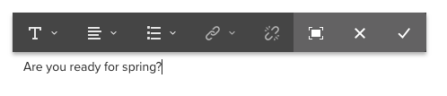

# 使用RTF編輯器來製作內容 {#use-rich-text-editor-to-author-content}

RTF編輯器(RTE)是將文字內容插入AEM的基本建置區塊。 它構成了各種元件的基礎，包括：

* 文字
* 文字影像
* 表格

## 就地編輯 {#in-place-editing}

只要點選或按一下，選取文字型元件即會顯示 [元件工具列](/help/sites-authoring/editing-content.md#edit-configure-copy-cut-delete-paste) 和任何元件一樣。

點選/按一下再次點選或最初使用慢速雙點/按一下選取元件時，將會開啟就地編輯功能，並有其專屬的工具列。 您可以在此編輯內容，並變更基本格式。

此工具列提供下列選項：

* **格式**:這可讓您設定粗體、斜體和底線。
* **清單**:通過此操作，可以建立項目符號或編號清單，或設定縮進。
* **超連結**
* **取消連結**
* **全螢幕**
* **關閉**
* **儲存**

## 全螢幕編輯 {#full-screen-editing}

對於文字元件，請從工具列點選全螢幕模式  開啟RTF編輯器並隱藏其餘的頁面內容。

全螢幕模式會顯示您可用於編寫的所有已設定選項。 可用性是選項 [取決於設定](/help/sites-administering/rich-text-editor.md).

其他RTF編輯器選項包括：

* **錨點**:在文字中建立錨點，以後可以連結至/參照。
* **向左對齊文字**
* **文字置中**
* **向右對齊文字**

按一下最小化圖示，關閉全螢幕模式。

>[!NOTE]
>
>將巢狀清單從Microsoft Word複製到RTE可能會產生不一致的結果，且在將文字貼入RTE後可能需要手動調整。
