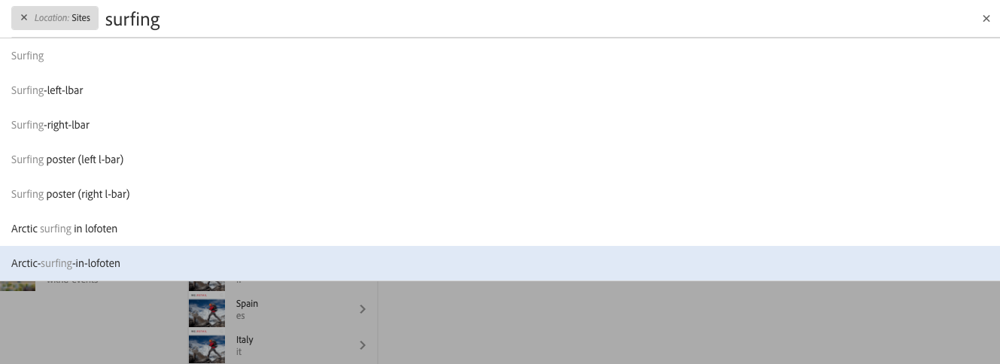
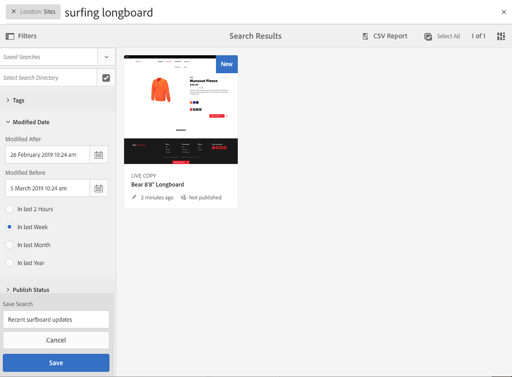

# 搜尋{#searching}

AEM的製作環境提供多種搜尋內容的機制，視資源型別而定。

>[!NOTE]
>
>在製作環境之外，也提供其他機制可供搜尋，例如 [查詢產生器](/help/sites-developing/querybuilder-api.md) 和 [CRXDE Lite](/help/sites-developing/developing-with-crxde-lite.md).

## 搜尋基本資訊 {#search-basics}

可從頂端工具列使用搜尋：

使用搜尋邊欄，您可以：

* 搜尋特定的關鍵字、路徑或標籤。
* 根據資源特定條件進行篩選，例如修改日期、頁面狀態、檔案大小等。
* 定義並使用 [已儲存搜尋](#saved-searches)  — 根據上述條件。

>[!NOTE]
>
>也可使用快速鍵叫用搜尋 `/` （正斜線）顯示搜尋邊欄時。

## 搜尋和篩選 {#search-and-filter}

若要搜尋並篩選資源：

1. 開啟 **搜尋** （使用工具列中的放大鏡），然後輸入搜尋字詞。 將會提出建議並可供選取：

   

   依預設，搜尋結果將限於您目前的位置（即主控台和相關資源型別）：

   

1. 如有必要，您可以移除位置篩選器(選取 **X** ，以搜尋所有主控台/資源型別。
1. 將顯示結果，並根據控制檯和相關資源型別分組。

   您可以選取特定資源（以供後續動作），或透過選取所需的資源型別向下展開；例如， **檢視所有網站**：

   

1. 如果您想要進一步向下展開，請選取「邊欄」符號（左上方）以開啟側面板 **篩選和選項**.

   

   根據資源型別，搜尋將顯示預先定義的搜尋/篩選條件選項。

   側面板可讓您選取：

   * 已儲存的搜尋
   * 搜尋目錄
   * 標記
   * 搜尋條件；例如，修改日期、發佈狀態、即時副本狀態。

   >[!NOTE]
   >
   >搜尋條件可能有所不同：
   >
   >
   >
   >    * 視您選取的資源型別而定；例如，Assets和Communities條件可理解為專門化。
   >    * 您的執行個體為 [搜尋Forms](/help/sites-administering/search-forms.md) 可自訂(適用於AEM內的位置)。
   >
   >

   

1. 您也可以新增其他搜尋詞：

   

1. 使用 **X** (右上方 **** )關閉搜尋。

>[!NOTE]
>
>在搜尋結果中選取專案時，會持續使用搜尋條件。
>
>當您在搜尋結果頁面上選取專案時，當使用瀏覽器返回按鈕後返回搜尋頁面時，搜尋條件會保留。

## 已儲存的搜尋 {#saved-searches}

除了依範圍廣泛的Facet進行搜尋外，您也可以儲存特定的搜尋組態，以供擷取及稍後階段使用：

1. 定義搜尋條件並選取 **儲存**.

   

1. 指派名稱，然後使用 **儲存** 確認：

   

1. 您儲存的搜尋將在您下次存取搜尋面板時從選擇器可用：

   

1. 儲存後，您可以：

   * 使用 **x** （針對已儲存搜尋的名稱）以開始新查詢（不會刪除已儲存的搜尋本身）。
   * **編輯已儲存的搜尋**，變更搜尋條件，然後 **儲存** 再來一次。

通過選擇保存的搜索並按一下搜索面板底部的「編 **輯保存的搜索** 」(Edit Saved Search)，可以修改保存的搜索。

