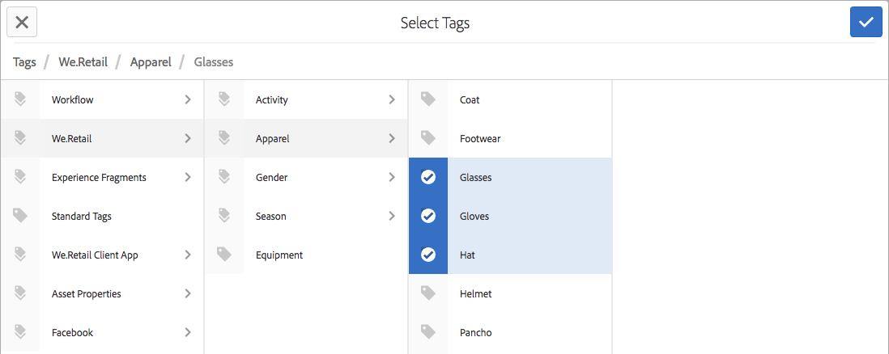

# 使用標籤{#using-tags}

標籤是快速且簡單的網站內容分類方法。 標籤可視為可附加至頁面、資產或其他內容的關鍵字或標籤，以便搜尋以尋找該內容及相關內容。

* 如需 [有關建立和管理標籤](/help/sites-administering/tags.md) ，以及已套用內容標籤的資訊，請參閱管理標籤。
* 如需 [標籤架構的相關資訊](/help/sites-developing/tags.md) ，請參閱為開發人員標籤，以及在自訂應用程式中包含和擴充標籤。

## 使用標籤的十個理由 {#ten-reasons-to-use-tagging}

1. **組織內容** -標籤功能讓作者更輕鬆，因為他們可以輕鬆快速地組織內容。
1. **組織標籤** -在標籤組織內容時，分層分類／命名空間組織標籤。
1. **有條理的標籤** -能夠建立標籤和子標籤，因此可以表示整個分類系統，涵蓋詞語、子詞語及其關係。 這允許建立與正式內容階層平行的第二（或第三）內容階層。
1. **受控標籤** -可通過對標籤和／或名稱空間應用權限來控制標籤，以控制標籤建立和應用程式。
1. **彈性標籤** -標籤有許多名稱和面孔：標籤、分類術語、類別、標籤等。 它們的內容模型及使用方式有彈性；例如，在概述目標人口統計資料時，將內容分類和評分，或建立次要內容階層。
1. **改進的搜尋** - AEM中的預設搜尋元件大致包含已建立的標籤和套用的標籤，篩選器可套用至這些標籤，將結果縮小為相關的標籤。
1. **SEO啟用** -套用為頁面屬性的標籤會自動顯示在頁面的標籤中，讓搜尋引擎可以看到。
1. **簡單複雜** -只需按一下按鈕，就能輕鬆建立標籤。 之後，可新增標題、說明和無限制的標籤，為標籤提供更多語義。
1. **核心一致性** -標籤系統是AEM的核心元件，並由所有AEM功能用來分類內容。 此外，標籤API可供開發人員用來建立具有相同分類存取權的標籤啟用應用程式。
1. **結合結構與彈性** - AEM最適合處理結構化資訊，因為頁面和路徑是巢狀結構。 由於內置全文搜索功能，它在處理非結構化資訊時同樣具有強大的功能。 標籤結合了結構和靈活性的優點。

當設計網站的內容結構和資產的中繼資料架構時，請考慮提供的輕量型和可存取的方法標籤。

## 套用標籤 {#applying-tags}

在作者環境中，作者可以存取頁面屬性並在「標籤／關鍵字」欄位中輸入一或多個標籤，以套 **用標籤** 。

若要套用 [預先定義的標籤](/help/sites-administering/tags.md)，請在「頁面屬性 **」視窗中，使用「標籤** 」欄位和「選 ******** 擇標籤」視窗。 「標 **準標籤** 」標籤是預設的命名空間，這表示分類 `namespace-string:` 沒有前置詞。

### 發佈標籤 {#publishing-tags}

與頁面一樣，您可以對標籤和名稱空間執行下列動作：

**啟動**

* 啟動個別標籤。

   如同頁面一樣，新建立的標籤必須先啟動，才能在發佈環境中使用。

>[!NOTE]
>
>當您啟動頁面時，會自動開啟對話方塊，讓您啟動屬於頁面的未啟動標籤。

**停用**

* 停用選取的標籤。
