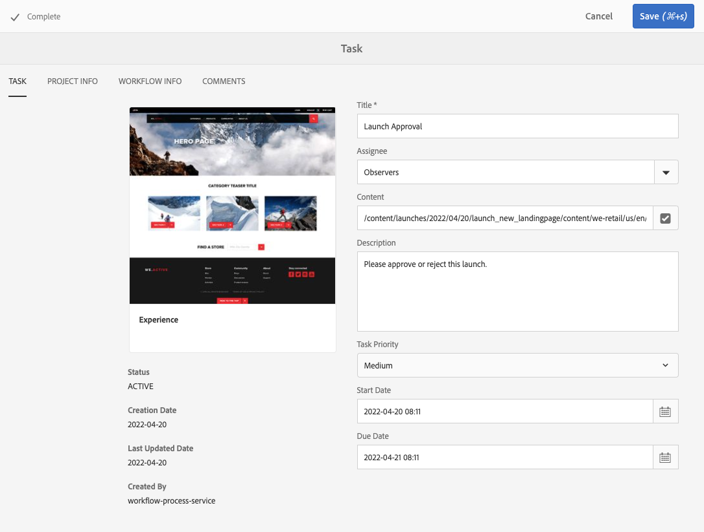
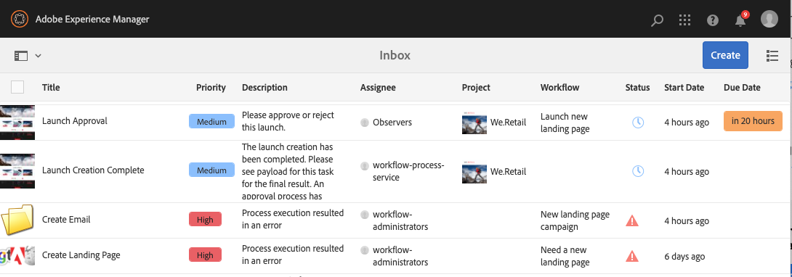

# 使用任務 {#working-with-tasks}

任務代表與內容相關要執行的工作專案。 當您被指派任務時，它會顯示在「工作流程收件匣」中。 任務專案與工作流程專案之間可透過下列值加以區分： **型別** 欄。

任務也用於專案中，以判斷專案的完整度等級。

## 追蹤專案進度 {#tracking-project-progress}

您可以透過檢視專案內活動/完成的任務，來追蹤專案進度，該專案由 **任務** 圖磚。 專案進度可由下列專案決定：

* **任務拼貼：** 任務表徵圖中描述了專案的整體進度，可在專案詳細資訊頁面上找到。

* **工作清單：** 按一下「任務」表徵圖時，將顯示任務清單。 此清單包含與項目相關的所有任務的詳細資訊。

這兩個選項都會列出工作流程任務和您直接在任務表徵圖中建立的任務。

### 任務拼貼 {#task-tile}

如果專案具有任何相關任務，則任務表徵圖會顯示在專案內。 任務表徵圖顯示專案的目前狀態。 這是以工作流程內的現有任務為基礎，不包括未來在工作流程進行時將產生的任何任務。 下列資訊會顯示在「工作」表徵圖中：

* 已完成任務的百分比
* 作用中任務的百分比
* 逾期任務的百分比

### 檢視或修改專案中的任務 {#viewing-or-modifying-the-tasks-in-a-project}

除了追蹤進度以外，您也可能想要檢視專案的詳細資訊或修改專案。

#### 任務清單 {#task-list}

按一下任務表徵圖右下方的省略符號按鈕，以顯示您的收件匣，該收件匣已根據與專案相關的任務進行篩選。 任務詳細資訊會與中繼資料一起顯示，例如到期日、受指派人、優先順序和狀態。

#### 任務詳細資料 {#task-details}

如需特定工作的詳細資訊，請在收件匣中，點選或按一下工作以選取它，然後點選或按一下 **開啟** （在工具列中）。

您可以透過不同的標籤檢視、編輯或新增詳細資訊至任務。

* **任務**  — 一般任務資訊
* **專案資訊**  — 與任務相關聯的專案摘要
* **工作流程資訊**  — 與任務相關的工作流程摘要（如果適用）
* **註解**  — 任務本身的一般註解

### 新增任務 {#adding-tasks}

您可以將新任務新增至專案。 然後，這些任務會出現在「任務」表徵圖中，並可在通知收件匣中使用，以便您瞭解未完成任務。

若要新增任務：

1. 在專案中，找出 **任務** 圖磚
1. 點選或按一下圖磚右上方的向下>形箭號，然後選取 **建立任務**.
1. 在 **新增任務** 視窗，提供工作詳細資訊，例如，優先順序、受指派人和到期日。

   

1. 點選或按一下「**提交**」。

## 使用收件匣中的任務 {#working-with-tasks-in-the-inbox}

您可以直接從收件匣存取專案任務，而不是從專案本身存取專案任務。 收件匣會提供您跨專案任務的概述，讓您瞭解整個工作流程。

從收件匣中，您可以開啟任務並設定任務狀態。 當任務指派給您所屬的使用者群組時，也會顯示在您的收件匣中。 在這種情況下，群組的所有成員都可以執行工作並完成任務。

若要完成任務，請選取任務並按一下 **完成** （在工具列中）。 將資訊新增至工作，然後按一下 **完成**. 另請參閱 [您的收件匣](/help/sites-authoring/inbox.md) 以取得詳細資訊。
