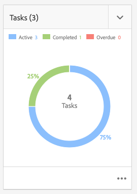

# 使用任務 {#working-with-tasks}

任務表示要針對內容執行的工作項。 當您被分配任務時，該任務將顯示在工作流收件箱中。 任務項可以與工作流項區分為值 **類型** 欄。

項目中還使用任務來確定項目的完整性級別。

## 追蹤專案進度 {#tracking-project-progress}

您可以透過查看專案內的活動/完成任務(由 **工作** 方塊。 項目進度可由以下方式確定：

* **任務表徵圖：** 任務表徵圖中描述了項目的整體進度，該任務表徵圖可在項目詳細資訊頁上使用。

* **任務清單：** 按一下任務表徵圖時，將顯示任務清單。 此清單包含與項目相關的所有任務的詳細資訊。

兩個選項都列出工作流任務以及直接在任務表徵圖中建立的任務。

### 任務表徵圖 {#task-tile}

如果項目有任何相關任務，則項目內將顯示任務表徵圖。 任務表徵圖顯示項目的當前狀態。 這是以工作流程內的現有任務為基礎，不包含隨著工作流程進行而將產生的任何任務。 任務表徵圖中顯示以下資訊：

* 已完成任務的百分比
* 活動任務的百分比
* 逾期任務百分比

### 查看或修改項目中的任務 {#viewing-or-modifying-the-tasks-in-a-project}

除了追蹤進度外，您也可能想要檢視或修改專案的詳細資訊。

#### 任務清單 {#task-list}

按一下任務表徵圖右下角的刪節號按鈕，以顯示在與項目相關的任務上篩選的收件箱。 任務詳細資訊與元資料一起顯示，如到期日、受託人、優先順序和狀態。

#### 任務詳細資料 {#task-details}

有關特定任務的詳細資訊，請在收件箱中，點選或按一下任務以選擇它，然後點選或按一下 **開啟** 的下一頁。

您可以通過不同的頁簽查看、編輯或向任務添加詳細資訊。

* **任務**  — 一般任務資訊
* **專案資訊**  — 任務關聯的項目摘要
* **工作流程輸入**  — 任務關聯的工作流的摘要（如果適用）
* **註解**  — 對任務本身的一般性評論

### 添加任務 {#adding-tasks}

您可以新增任務至專案。 然後，這些任務會顯示在任務表徵圖中，並可在通知收件箱中使用，以便您了解未完成的任務。

添加任務：

1. 在專案中，找出 **工作** 拼貼
1. 點選或按一下圖磚右上角的向下>形並選取 **建立任務**.
1. 在 **添加任務** 窗口，提供任務詳細資訊，如優先順序、受託人和到期日。

   

1. 點選或按一下 **提交**.

## 使用收件箱中的任務 {#working-with-tasks-in-the-inbox}

與其從專案本身存取專案工作，您可以直接從收件匣存取專案工作。 您的收件匣提供專案間工作的概觀，讓您了解整個工作流程。

從收件箱中，可以開啟任務並設定任務狀態。 將任務分配給您所屬的用戶組時，任務也會顯示在收件箱中。 在這種情況下，組的任何成員都可以執行工作並完成任務。

要完成任務，請選擇任務並按一下 **完成** 的下一頁。 向任務添加資訊，然後按一下 **完成**. 請參閱 [您的收件匣](/help/sites-authoring/inbox.md) 以取得更多資訊。
