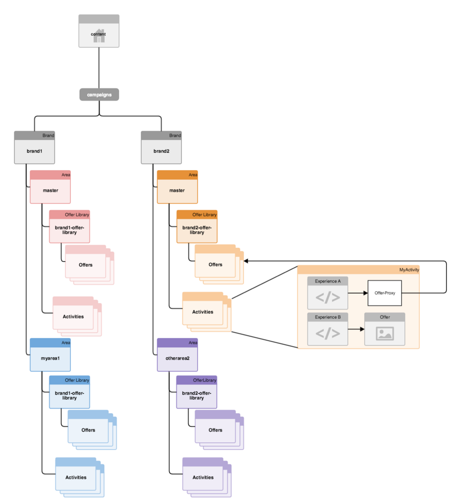

# 目標內容的多網站管理結構{#how-multisite-management-for-targeted-content-is-structured}

下圖說明如何建構針對目標內容的多網站支援。

區域會出現在 **/content/campaigns/&lt;brand>下方** ，而且依預設，每個品牌都有一個主區域，會自動建立。 每個區域都包含其專屬的活動、體驗和選件集。

若要尋找目標內容，頁面或網站可對應至某個區域。 如果沒有設定區域，AEM會回到此特定品牌的主要區域。

下圖為邏輯在三個網站（稱為site1、site2和site3）上運作的範例。

* site1會根據區域對應，針對brand1尋找myarea1，針對brand2尋找其他區域2。
* site2會針對brand1尋找myarea1，並針對brand2尋找主要區域，因為只定義了brand1的區域對應。
* site3會為brand1和brand2尋找主要區域，因為此網站完全未定義其他區域對應。

