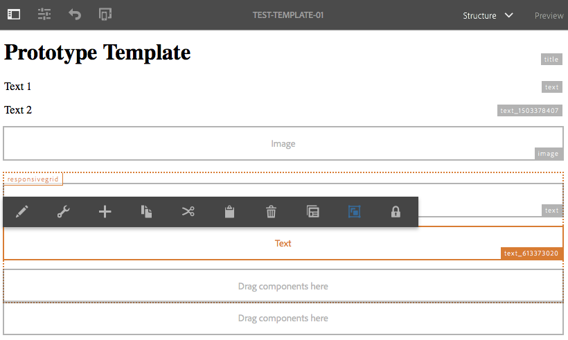
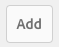

# 建立頁面範本{#creating-page-templates}

建立頁面時，您必須選取範本，作為建立新頁面的基礎。 範本會定義結果頁面的結構、任何初始內容以及可以使用的元件。

使用范 **本編輯器**，建立和維護範本不再是開發人員專屬的工作。也可以涉及一種稱為模板作 **者的權**&#x200B;力用戶。開發人員仍需要設定環境、建立用戶端程式庫和建立要使用的元件，但是當這些基本功能準備就緒後，範本作者就可以彈性地建立和設定範本，而不需要開發專案。****

此 **範本主控台** 可讓範本作者：

* 建立新範本或複製現有範本。
* 管理範本的生命週期。

此 **範本編輯器** 可讓範本作者：

* 將元件新增至範本，並將其放置在回應式格線上。
* 預先設定元件。
* 定義在使用範本建立的頁面上可編輯哪些元件。

本檔案說明如何 **範本作者** 可使用範本主控台和編輯器來建立和管理可編輯的範本。

如需技術層面可編輯範本如何運作的詳細資訊，請參閱開發人員檔案 [頁面範本 — 可編輯](/help/sites-developing/page-templates-editable.md) 以取得詳細資訊。

>[!NOTE]
>
>范 **** 本編輯器不支援直接在範本層級定位。可以定位根據可編輯的範本建立的頁面，但無法定位範本本身。

>[!CAUTION]
>
>使用建立的頁面和範本 **範本主控台** 不應與傳統UI搭配使用，且這類使用不受支援。

## 開始之前 {#before-you-start}

>[!NOTE]
>
>管理員必須在以下位置設定範本資料夾： **設定瀏覽器** 並套用適當的許可權，然後範本作者才能在該資料夾中建立範本。

開始之前，請務必注意下列幾點：

* 建立新範本需要共同作業。 因此， [角色](#roles) 會針對每項任務指定。

* 根據您執行個體的設定方式，請注意AEM現在提供的 [兩種基本範本型別](/help/sites-authoring/templates.md#editable-and-static-templates). 這並不會影響您實際操作的方式 [使用範本建立頁面](#using-a-template-to-create-a-page)，但會影響您可以建立的範本型別，以及頁面與其範本的關聯方式。

### 角色 {#roles}

使用「模板控制台」和「模 **板編輯器** 」建立新模板時 **** ，需要在以下角色之間協作：

* **管理員**:

   * 建立新的範本資料夾需要 `admin` 權利。

   * 這類工作通常也可以由開發人員完成

* **開發人員**:

   * 著重於技術/內部細節
   * 需要開發環境的經驗。
   * 為範本作者提供必要資訊。

* **範本作者**：

   * 此為群組成員的特定作者 `template-authors`

      * 這會配置所需的許可權和許可權。
   * 可設定元件和其他高階詳細資訊的使用方式，這些需要執行下列動作：

      * 一些技術知識

         * 例如，定義路徑時使用模式。
      * 來自開發人員的技術資訊。

由於某些工作的性質（例如建立資料夾），需要開發環境，而這需要知識/經驗。

本檔案中詳細列出的任務以及負責執行這些任務的角色。

### 可編輯和靜態範本 {#editable-and-static-templates}

AEM現在提供兩種基本型別的範本：

* [可編輯的範本](/help/sites-authoring/templates.md#creatingandmanagingnewtemplates)

   * 可以是 [已建立](#creatinganewtemplate) 和 [已編輯](#editingatemplate) 由範本作者使用 **範本** 主控台和編輯器。 此 **範本** 控制檯可在以下位置存取： **一般** 部分 **工具** 主控台。

   * 建立新頁面後，頁面與範本之間會維持動態連線。 這表示對範本結構和/或鎖定內容的變更將會反映在使用該範本建立的任何頁面上。 解除鎖定（即初始）內容的變更將不會反映出來。
   * 使用內容原則（您可以從範本編輯器定義這些原則）來儲存設計屬性。 頁面編輯器中的設計模式不再用於可編輯的範本。

* 靜態範本

   * 靜態範本可用於多個版本的AEM。
   * 它們是 [由您的開發人員提供](/help/sites-developing/page-templates-static.md)，因此作者無法建立或編輯這些變數。
   * 會複製以建立新頁面，但之後不存在動態連線（儘管範本名稱已註冊以供參考）。
   * 使用 [設計模式](/help/sites-authoring/default-components-designmode.md) 以儲存設計屬性。
   * 由於編輯靜態範本是開發人員的專屬工作，請參閱開發人員檔案 [頁面範本 — 靜態](/help/sites-developing/page-templates-static.md) 以取得詳細資訊。

根據定義，範本控制檯和範本編輯器只允許建立和編輯可編輯的範本。 因此，本檔案僅專注於可編輯的範本。

### 使用範本建立頁面 {#using-a-template-to-create-a-page}

使用範本時 [建立新頁面](/help/sites-authoring/managing-pages.md#creating-a-new-page) 靜態範本與可編輯範本之間沒有可見的差異，也沒有任何指示。 對於頁面作者，程式是透明的。

## 建立和管理範本 {#creating-and-managing-templates}

建立新的可編輯範本時，您可以：

* 使用 **範本** 主控台。 這可在以下位置取得： **一般** 部分 **工具** 主控台。

   * 或直接在： [https://localhost:4502/libs/wcm/core/content/sites/templates.html/conf](https://localhost:4502/libs/wcm/core/content/sites/templates.html/conf)

* 可以 [為範本建立資料夾](#creating-a-template-folder-admin) 如有需要
* [建立新範本](#creatinganewtemplateauthor)，一開始會是空的

* [定義其他屬性](#definingtemplatepropertiesauthor) 範本（如有需要）
* [編輯範本](#editingtemplates) 若要定義：

   * [結構](#editingatemplatestructureauthor)  — 使用範本建立的頁面上無法變更的預定義內容。
   * [初始內容](#editing-a-template-initial-content-author)  — 可在使用範本建立的頁面上變更的預定義內容。
   * [版面](#editingatemplatelayoutauthor)  — 適用於多種裝置。
   * [樣式](/help/sites-authoring/style-system.md)  — 定義要與範本及其元件搭配使用的樣式。

* [啟用範本](#enablingatemplateauthor) 建立頁面時使用
* [允許範本](#allowing-a-template-author) （您的網站必要頁面或分支）
* [發佈範本](#publishingatemplateauthor) 使其可在發佈環境中使用

>[!NOTE]
>
>此 **允許的範本** 通常會在最初設定您的網站時預先定義。

>[!CAUTION]
>
>切勿輸入任何需要的資訊 [國際化](/help/sites-developing/i18n.md) 放入範本中。 基於內部化的目的， [核心元件的本地化功能](https://experienceleague.adobe.com/docs/experience-manager-core-components/using/get-started/localization.html) 建議使用。

### 建立範本資料夾 — 管理員 {#creating-a-template-folder-admin}

您應該為專案建立範本資料夾，以存放專案特定的範本。 這是一項管理員任務，在檔案中有所說明 [頁面範本 — 可編輯](/help/sites-developing/page-templates-editable.md#template-folders).

### 建立新範本 — 範本作者 {#creating-a-new-template-template-author}

1. 開啟范 **本主控台** (透過工具-> **一** 般 ****)，然後導覽至所需的檔案夾。

   >[!NOTE]
   >
   >在標準AEM執行個體中 **全域** 資料夾已存在於範本主控台中。 如果在目前資料夾中找不到原則及/或範本型別，這會保留預設範本並做為遞補內容。
   >
   >
   >建議最佳實務使用 [為您的專案建立的範本資料夾](/help/sites-developing/page-templates-editable.md#template-folders).

1. 選取 **建立**，後接 **建立範本** 以開啟精靈。

1. 選取 **範本型別**，然後選取 **下一個**.

   >[!NOTE]
   >
   >範本型別是預先定義的範本配置，可視為範本的範本。 這些是由開發人員或系統管理員預先定義的。 如需詳細資訊，請參閱開發人員檔案 [頁面範本 — 可編輯](/help/sites-developing/page-templates-editable.md#template-type).

1. 完成 **範本詳細資訊**：

   * **範本名稱**
   * **說明**

1. 選擇 **建立**。隨即顯示確認訊息，請選取 **開啟** 開始 [編輯範本](#editingatemplate) 或 **完成** 以返回範本主控台。

   >[!NOTE]
   >
   >建立新範本時，會將其標籤為 **草稿** 在主控台中，這表示頁面作者還不能使用它。

### 定義範本屬性 — 範本作者 {#defining-template-properties-template-author}

範本可以有下列屬性：

* 影像

   * 要當做影像使用 [範本縮圖](/help/sites-authoring/templates.md#template-thumbnail-image) 以輔助選取，例如「建立頁面」精靈中的選取。

      * 可以上傳
      * 可根據範本內容產生

* 標題

   * 用於識別範本的標題，例如 **建立頁面** 精靈。

* 說明

   * 選用的說明，可提供範本及其用途的詳細資訊，例如 **建立頁面** 精靈。

若要檢視和/或編輯屬性：

1. 在 **範本主控台**，選取範本。
1. 從工 **具欄中選擇** 「查看屬性」(View Properties)或快速選項以開啟對話框。
1. 您現在可以檢視或編輯範本屬性。

>[!NOTE]
>
>範本是簡化頁面建立工作流程的強大工具。 不過，太多範本會讓作者不知所措，並使頁面建立過程變得混亂。 一個好的經驗法則是將範本數量保持在100個以下。
>
>由於潛在的效能影響，Adobe不建議使用超過1000個範本。

>[!NOTE]
>
>主控台中會指出範本的狀態（草稿、已啟用或已停用）。

#### 範本縮圖影像 {#template-thumbnail-image}

若要定義範本縮圖：

1. 編輯範本屬性。
1. 選擇您要上傳縮圖，還是從範本內容產生縮圖。

   * 如果要上傳縮圖，請按一下或點選 **上傳影像**
   * 如果您想要產生縮圖，請按一下或點選 **產生預覽**

1. 對於這兩種方法，都會顯示縮圖的預覽。

   如果不滿意，請按一下或點選 **清除** 上傳其他影像或重新產生縮圖。

1. 當您滿意縮圖時，請按一下或點選 **儲存並關閉**.

### 啟用和允許範本 — 範本作者 {#enabling-and-allowing-a-template-template-author}

若要在建立頁面時使用範本，您需要：

* [啟用範本](#enablingatemplate) 以使其可在建立頁面時使用。
* [允許範本](#allowingatemplate) 以指定可使用範本的內容分支。

#### 啟用範本 — 範本作者 {#enabling-a-template-template-author}

您可以啟用或停用範本，使其可在以下位置使用或無法使用： **建立頁面** 精靈。

>[!CAUTION]
>
>啟用範本後，當範本作者開始進一步更新範本時，將顯示警告。 這是為了通知使用者可能會參考範本，所以任何變更都可能影響參考範本的頁面。

1. 在 **範本主控台**，選取範本。
1. 選取 **啟用** 或 **停用** 工具列，然後在確認對話方塊中再次進行。
1. 您現在可以在以下情況下使用範本： [建立新頁面](/help/sites-authoring/managing-pages.md#creating-a-new-page)，但您可能想 [編輯範本](#editingatemplate) 根據您的需求。

>[!NOTE]
>
>主控台中會指出範本的狀態（草稿、已啟用或已停用）。

#### 允許範本 — 作者 {#allowing-a-template-author}

範本可設為可用於或不可用於某些頁面分支。

1. 開啟 [頁面屬性](/help/sites-authoring/editing-page-properties.md) 用於您希望範本可用的分支的根頁面。

1. 開啟 **進階** 標籤。

1. 在「 **範本設定** 」下 **，使用「新增」欄位** ，指定範本的路徑。

   路徑可以是明確的，也可以使用模式。 例如：

   `/conf/<your-folder>/settings/wcm/templates/.*`

   路徑順序無關，所有路徑都將掃描，所有範本都將擷取。

   >[!NOTE]
   >
   >如果 **允許的範本** 清單留空，樹狀結構將遞增，直到找到值/清單為止。
   >
   >
   >另請參閱 [範本可用性](/help/sites-developing/templates.md#template-availability)  — 允許範本的原則保持不變。

1. 按一下 **儲存** 以儲存對頁面屬性所做的變更。

>[!NOTE]
>
>通常會在設定時為您整個網站預先定義允許的範本。

### 發佈範本 — 範本作者 {#publishing-a-template-template-author}

由於範本在轉譯頁面時參考，因此需要發佈完整設定的範本，才能用於發佈環境。

1. 在 **範本主控台**，選取範本。
1. 選取 **發佈** 以開啟精靈。
1. 選取 **內容原則** 將一同發佈。

1. 選取 **發佈** ，以完成動作。

## 編輯範本 — 範本作者 {#editing-templates-template-authors}

建立或編輯範本時，您可以定義多個方面。 編輯範本類似於頁面製作。

可以編輯範本的下列方面：

* [結構](#editingatemplatestructure)

   頁面作者無法移動此處新增的元件，或從結果頁面中移除這些元件。 如果您希望頁面作者能夠在產生的頁面中新增和移除元件，則您需要將段落系統新增到範本。

   鎖定元件後，您可以新增頁面作者無法編輯的內容。 您可以解鎖元件，讓您可以定義 [初始內容](#editingatemplateinitialcontent).

   >[!NOTE]
   >
   >在結構模式中，任何作為已解鎖元件之父件的元件都無法移動、剪下或刪除。

* [初始內容](#editingatemplateinitialcontent)

   解鎖元件後，您可以定義要複製到結果頁面（使用範本建立）的初始內容。 您可以在產生的頁面上編輯這些已解鎖的元件。

   >[!NOTE]
   >
   >在 **初始內容** 模式以及在結果頁面上，可以刪除任何具有可存取父項的已解鎖元件（即配置容器內的元件）。

* [配置](#editingatemplatelayout)

   您可以在此處預先定義所需裝置格式的範本配置。 **範本製作的** 「版面」模式與頁面製作的「版面 [**** 」模式功能相同](/help/sites-authoring/responsive-layout.md#defining-layouts-layout-mode)。

* [頁面原則](#editingatemplatepagepolicies)

   在頁面原則底下，您可以將預先定義的頁面原則連結至頁面。 這些頁面原則會定義各種設計設定。

* [樣式](/help/sites-authoring/style-system.md)

   樣式系統可讓範本作者在元件的內容原則中定義樣式類別，讓內容作者在編輯頁面上的元件時能夠選取這些類別。 這些樣式可作為元件的替代視覺變體，使其更靈活。

   請參閱 [樣式系統檔案](/help/sites-authoring/style-system.md) 以取得詳細資訊。

此 **模式** 工具列中的選取器可讓您選取及編輯範本的適當面向：

* [結構](#editingatemplatestructure)
* [初始內容](#editingatemplateinitialcontent)
* [配置](#editingatemplatelayout)

而 **頁面原則** 上的選項 **頁面資訊** 功能表可讓您 [選取所需的頁面原則](#editingatemplatepagepolicies)：

>[!CAUTION]
>
>如果作者開始編輯已啟用的範本，將會顯示警告。 這是為了通知使用者可能會參考範本，所以任何變更都可能影響參考範本的頁面。

### 編輯範本 — 結構 — 範本作者 {#editing-a-template-structure-template-author}

在 **結構** 模式：您可定義範本的元件和內容，並定義範本及其元件的原則。

* 無法在產生的頁面上移動範本結構中所定義的元件，也無法將其從任何產生的頁面中刪除。
* 如果您希望頁面作者能夠新增和移除元件，請將段落系統新增至範本。
* 元件可解除鎖定並重新鎖定，讓您定義 [初始內容](#editingatemplateinitialcontent).

* 已定義元件和頁面的設計原則。

在 **結構** 範本編輯器的模式：

* **新增元件**

   將元件新增至範本的機制有多種：

   * 從 **元件** 側面板中的瀏覽器。
   * 藉由使用 **插入元件** 選項(**+** 圖示)，位於範本上已有元件的工具列上，或 **將元件拖曳到這裡** 方塊。

   * 透過拖曳資產(從 **資產** （例如側面板中的瀏覽器）直接在範本上產生適當的元件。

   新增後，每個元件都會標示為：

   * 邊框
   * 顯示元件型別的標籤
   * 解鎖元件時顯示的標籤

   >[!NOTE]
   >
   >將現成可用的標題元件新增至範本時 **** ，其中會包含預設的文字 **結構**。
   >
   >
   >如果您變更此專案，並新增自己的文字，則從範本建立頁面時，將會使用此更新的文字。
   >
   >
   >如果您保留預設文字（結構），則標題將預設為後續頁面的名稱。

   >[!NOTE]
   >
   >將元件和資產新增至範本時，雖然不盡相同，但與類似動作有許多相似之處， [頁面製作](/help/sites-authoring/editing-content.md).

* **元件動作**

   將元件新增至範本後，請對元件執行動作。 每個個別例項都有一個工具列，可讓您存取可用的動作，工具列取決於元件型別。

   

   它也可以取決於所採取的動作，例如當原則已與元件相關聯時，則設計配置圖示變為可用。

* **編輯和設定**

   透過這兩個動作，您可以將內容新增至元件。

* **表示結構的邊框**

   使用時 **結構** 模式橘色邊框表示目前選取的元件。 虛線也表示父元件。

   例如，在下方的熒幕擷圖中 **文字** 元件已選取，在 **配置容器** （回應式格線）。

   

* **原則與屬性（一般）**

   內容（或設計）原則會定義元件的設計屬性。 例如，可用的元件或最小/最大尺寸。 這些適用於範本（以及使用範本建立的頁面）。

   為元件建立內容原則或選取現有原則。 這可讓您定義設計詳細資訊。

    

   設定視窗分成兩段。

   * 在對話方塊的左側，在 **原則**，您就能選取現有的原則或選取現有的原則。
   * 對話方塊右側下方的 **屬性**，您可以設定元件型別的特定屬性。

   可用的屬性取決於所選的元件。 例如，對於文字元件，屬性會定義複製和貼上選項、格式選項和段落樣式等選項。

   ***政策***

   內容（或設計）原則會定義元件的設計屬性。 例如，可用的元件或最小/最大尺寸。 這些適用於範本（以及使用範本建立的頁面）。

   下 **原則** 您可以透過下拉式清單，選取要套用至元件的現有原則。

   

   選取「 」旁邊的「新增」按鈕，即可新增一項原則。 **選取原則** 下拉式清單。 之後，新的標題應會在 **原則標題** 欄位。

   

   中選取的現有原則 **選取原則** 下拉式清單可使用下拉式清單旁邊的複製按鈕復製為新原則。 之後，新的標題應會在 **原則標題** 欄位。 依預設，複製的原則標題為 **X的副本**，其中X是複製原則的標題。

   

   原則說明是選擇性的，可在 **原則說明** 欄位。

   在 **其他範本也使用選取的原則** 區段中，您可以輕鬆檢視哪些其他範本使用了在以下專案中選擇的原則： **選取原則** 下拉式清單。

   

   >[!NOTE]
   >
   >如果將相同型別的多個元件新增為初始內容，則相同原則會套用至所有元件。 這會映象中的相同限制 [**設計模式** 適用於靜態範本](/help/sites-authoring/default-components-designmode.md).

   ***屬性***

   在 **屬性** 標題您可以定義元件的設定。 標題有兩個標籤：

   * 主要
   * 功能

   *主要*

   於 **主要** 標籤中，會定義元件最重要的設定。

   例如，影像元件可定義允許的寬度並啟用延遲載入。

   如果設定允許多個設定，請按一下或點選 **新增** 按鈕以新增其他設定。

   

   若要移除設定，請按一下或點選 **刪除** 按鈕的位置。

   若要移除設定，請按一下或點選**刪除**按鈕。

   

   *功能*

   此 **功能** 索引標籤可讓您啟用或停用元件的其他功能。

   例如，對於影像元件，您可以定義裁切比例、允許的影像定向以及是否允許上傳。

   

   >[!CAUTION]
   >
   >請注意，在AEM中，裁切比率的定義為 **高度/寬度**. 這與傳統的寬度/高度定義不同，這樣做是出於舊版相容性的原因。 只要您定義「 」，頁面製作使用者就不會察覺到任何差異 **名稱** 很清楚，因為這就是UI中顯示的內容。

   >[!NOTE]
   >
   >[實作RTF編輯器的元件的內容原則](/help/sites-administering/rich-text-editor.md#main-pars-header-206036638) 只能為RTE透過其UI設定提供的選項定義。  

* **原則與屬性（配置容器）**

   版面配置容器的原則和屬性設定類似於一般用途，但有一些差異。

   >[!NOTE]
   >
   >容器元件必須設定原則，因為它可讓您定義容器中可用的元件。

   設定視窗分成兩段，就像視窗的一般使用方式一樣。

   ***政策***

   內容（或設計）原則會定義元件的設計屬性。 例如，可用的元件或最小/最大尺寸。 這些適用於範本（以及使用範本建立的頁面）。

   下 **原則** 您可以透過下拉式清單，選取要套用至元件的現有原則。 其運作方式與視窗的一般使用方式相同。

   ***屬性***

   在 **屬性** 標題您可以選擇版面容器可用的元件，並定義其設定。 標題有三個標籤：

   * 允許的元件
   * 預設元件
   * 回應式設定

   *允許的元件*

   於 **允許的元件** 索引標籤中，您可以定義哪些元件可用於配置容器。

   * 元件會依其元件群組分組，可展開和收合這些元件。
   * 透過勾選群組名稱，可以選取整個群組，而取消勾選則可以取消選取所有群組。
   * 減號表示至少選取了一個群組中的專案，但並未選取所有專案。
   * 搜尋可依名稱篩選元件。
   * 無論篩選條件為何，元件群組名稱右側所列的計數代表這些群組中選取的元件總數。

   

   *預設元件*

   於 **預設元件** 索引標籤上，您可定義哪些元件會自動與指定媒體型別建立關聯，這樣當作者從資產瀏覽器拖曳資產時，AEM就能知道要與哪個元件建立關聯。 請注意，只有具備拖放區域的元件才適用於此設定。

   按一下或點選 **新增對應** 以新增全新的元件和MIME型別對應。

   在清單中選取元件，然後按一下或點選「 **新增類型** 」，將其他MIME類型新增至已映射的元件。按一下「 **刪除** 」圖示以移除MIME類型。

   

   *回應式設定*

   於 **回應式設定** 索引標籤您可以設定配置配置容器產生之格線中的欄數。

* **解鎖/鎖定元件**

   您可以解鎖/鎖定元件，以定義內容是否可用於變更 **初始內容** 模式。

   解鎖元件後：

   * 開啟的掛鎖指示器會顯示在邊框中。
   * 元件工具列將會據此調整。
   * 任何已輸入的內容將不會再顯示於 **結構** 模式。

      * 已輸入的內容會視為初始內容，且僅會顯示於 **初始內容** 模式。
   * 無法移動、剪下或刪除已解鎖元件的父件。

   

   這包括解除鎖定容器元件，以便在初始內容模式或產生的頁 **面中新增其他元件** 。如果您在解除鎖定容器之前已將元件/內容新增至容器，則這些元件/內容在「結構」模式中將不再顯示，但會以「初始內容 ******** 」模式顯示。在「 **結構模式**」中，只有容器元件本身會顯示其「允許的元 **件」清單**。

   

   為了節省空間，配置容器不會因應允許的元件清單而增大。 容器會變成可捲動清單。

   可配置的元件以「策略」表徵圖顯示 **** ，可以點選或按一下該表徵圖以編輯該元件的策略和屬性。

   

* **與現有頁面的關係**

   如果在根據範本建立頁面後更新結構，則這些頁面將反映範本的變更。 工具列中會顯示警告，提醒您這個事實以及確認對話方塊。

   

### 編輯範本 — 初始內容 — 作者 {#editing-a-template-initial-content-author}

**初始內容** 模式用於定義首次根據範本建立頁面時顯示的內容。 然後，頁面作者可以編輯初始內容。

雖然在「結構 **」模式下建立的所有內容在「初始內容」中都可** 見 ****，但只能選擇和編輯已解鎖的元件。

>[!NOTE]
>
>**初始內容** 模式可視為使用該範本建立之頁面的編輯模式。 因此，原則未定義於 **初始內容** 模式，但不是在 [**結構** 模式](/help/sites-authoring/templates.md#editing-a-template-structure-template-author).

* 可編輯的已解除鎖定元件會加上標籤。 選取時，它們具有藍色邊框：

   

* 已解鎖的元件有一個工具列，可讓您編輯和設定內容：

   

* 如果容器元件已解除鎖定(在「結 **構** 」模式中)，則您可以在「初始內容 **** 」模式中新增元件至容器。在「初始內 **容」模式中新增的元件** ，可在產生的頁面上移動或從中刪除。

   您可以使用「拖曳元件到此處 **」區域，或從適當容器的工具列** 中使用「插入新元件 **** 」選項來新增元件。

    

* 如果在根據範本建立頁面後更新範本的初始內容，則範本中初始內容的變更不會影響這些頁面。

>[!NOTE]
>
>初始內容旨在準備元件和作為建立內容起點的頁面配置。 此並非意圖讓實際內容維持原狀。 因此，初始內容無法翻譯。
>
>如果您需要在範本中加入可翻譯文字（例如頁首或頁尾），您可以使用 [核心元件的本地化功能](https://experienceleague.adobe.com/docs/experience-manager-core-components/using/get-started/localization.html).

### 編輯範本 — 版面 — 範本作者 {#editing-a-template-layout-template-author}

您可以為一系列裝置定義範本配置。 [回應式佈局](/help/sites-authoring/responsive-layout.md) 適用於範本的運作方式與頁面製作相同。

>[!NOTE]
>
>版面配置變更將反映在 **初始內容** 模式，但未看到任何變更 **結構** 模式。

### 編輯範本 — 頁面設計 — 範本作者/開發人員 {#editing-a-template-page-design-template-author-developer}

頁面設計 (包括所需的用戶端程式庫和頁面原則) 會保留在「頁面資訊」功能表的「 **頁面設計** 」選 **** 項下。

若要存取 **頁面設計** 對話方塊：

1. 從 **範本編輯器**，選取 **頁面資訊** 從工具列中，然後 **頁面設計** 以開啟對話方塊。
1. 此 **頁面設計** 對話方塊隨即開啟，並分成兩個區段：

   * 左半部會定義 [頁面原則](/help/sites-authoring/templates.md#page-policies)
   * 右半部分定義 [頁面屬性](/help/sites-authoring/templates.md#page-properties)

   

#### 頁面原則 {#page-policies}

您可以將內容原則套用至範本或結果頁面。 這會定義頁面上主要段落系統的內容原則。

* 您可以從以下位置為頁面選取現有原則： **選取原則** 下拉式清單。

   

   選取「 」旁邊的「新增」按鈕，即可新增一項原則。 **選取原則** 下拉式清單。 之後，新的標題應會在 **原則標題** 欄位。

   

   中選取的現有原則 **選取原則** 下拉式清單可使用下拉式清單旁邊的複製按鈕復製為新原則。 之後，新的標題應會在 **原則標題** 欄位。 依預設，複製的原則標題為 **X的副本**，其中X是複製原則的標題。

   

* 在中定義原則的標題 **原則標題** 欄位。 原則必須有標題，才能輕鬆地在 **選取原則** 下拉式清單。

   

* 原則說明是選擇性的，可在 **原則說明** 欄位。
* 在 **其他範本也使用選取的原則** 區段中，您可以輕鬆檢視哪些其他範本使用了在以下專案中選擇的原則： **選取原則** 下拉式清單。

   

#### 頁面內容 {#page-properties}

使用頁面屬性，您可以透過使用定義所需的使用者端程式庫 **頁面設計** 對話方塊。 這些使用者端資料庫包含要與範本及使用該範本建立的頁面一起載入的樣式表和JavaScript。

* 指定您要套用至使用此範本建立之頁面的使用者端程式庫。 在的文字欄位中輸入程式庫名稱 **使用者端資源庫** 區段。

   

* 如果需要多個程式庫，請按一下「新增」按鈕，為程式庫名稱新增其他文字欄位。

   

   視需要為您的使用者端資料庫新增任意數目的文字欄位。

   

* 使用拖曳操作框拖曳欄位，視需要定義物件庫的相對位置。

   

>[!NOTE]
>
>雖然範本作者可以在範本上指定頁面原則，但是他們需要從開發人員取得適當使用者端資料庫的詳細資訊。

### 編輯範本 — 初始頁面屬性 — 作者 {#editing-a-template-initial-page-properties-author}

使用 **初始頁面屬性** 選項，您可以定義初始值 [頁面屬性](/help/sites-authoring/editing-page-properties.md) 建立結果頁面時使用。

1. 在範本編輯器中，選取 **頁面資訊** 從工具列中，然後 **初始頁面屬性** 以開啟對話方塊。

1. 在對話方塊中，您可以定義要套用至使用此範本建立的頁面的屬性。

   

1. 透過確認您的定義 **完成**.

## 最佳做法 {#best-practices}

建立範本時，您應考慮：

1. 從範本建立頁面後，範本變更的影響。

   以下是範本上可能進行的不同操作清單，以及這些操作如何影響根據範本建立的頁面：

   * 結構變更：

      * 這些會立即套用至產生的頁面。
      * 訪客仍需發佈已變更的範本，才能檢視變更。
   * 內容原則和設計設定的變更：

      * 這些會立即套用至產生的頁面。
      * 訪客需要發佈變更才能檢視變更。
   * 初始內容的變更：

      * 這些僅適用於範本變更後建立的頁面。
   * 配置圖變更取決於修改的元件是否屬於下列專案：

      * 僅限結構 — 立即套用
      * 包含初始內容 — 僅在變更後建立的頁面上

   請特別注意：

   * 在啟用的範本上鎖定或解除鎖定元件。
   * 這可能有副作用，因為現有頁面已可使用它。 通常：

      * 現有頁面上將會遺失解除鎖定元件（已鎖定）。
      * 鎖定元件（可編輯的）會隱藏該內容，使其無法在頁面上顯示。

   >[!NOTE]
   >
   >變更不再是草稿之範本上元件的鎖定狀態時，AEM會發出明確警告。

1. [建立您自己的資料夾](#creatingatemplatefolderdeveloper) 您網站專屬的範本。
1. [發佈您的範本](#publishingatemplateauthor) 從 **範本** 主控台。
