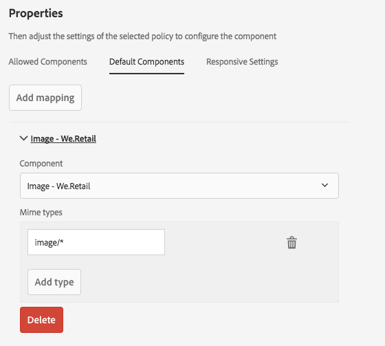
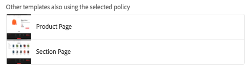

# 建立頁面模板{#creating-page-templates}

建立頁面時，必須選擇模板，該模板將用作建立新頁面的基礎。 模板定義結果頁面的結構、任何初始內容以及可使用的元件。

使用范 **本編輯器**，建立和維護範本不再是開發人員專屬的工作。也可以涉及一種稱為模板作 **者的權**&#x200B;力用戶。開發人員仍需要設定環境、建立用戶端程式庫和建立要使用的元件，但是當這些基本功能準備就緒後，範本作者就可以彈性地建立和設定範本，而不需要開發專案。****

的 **模板控制台** 允許模板作者：

* 建立新模板或複製現有模板。
* 管理模板的生命週期。

的 **模板編輯器** 允許模板作者：

* 將元件添加到模板並將它們放置在響應網格上。
* 預配置元件。
* 定義可在使用模板建立的頁面上編輯哪些元件。

此文檔說明 **模板作者** 可以使用模板控制台和編輯器建立和管理可編輯的模板。

有關可編輯模板如何在技術級別工作的詳細資訊，請參閱開發人員文檔 [頁面模板 — 可編輯](/help/sites-developing/page-templates-editable.md) 的子菜單。

>[!NOTE]
>
>范 **** 本編輯器不支援直接在範本層級定位。可以定位根據可編輯的範本建立的頁面，但無法定位範本本身。

>[!CAUTION]
>
>使用 **模板控制台** 不打算與經典UI一起使用，因此不支援這種使用。

## 開始前 {#before-you-start}

>[!NOTE]
>
>管理員必須在 **配置瀏覽器** 並在模板作者可以在該資料夾中建立模板之前應用適當的權限。

在開始之前，需要考慮以下幾點：

* 建立新模板需要協作。 因此， [角色](#roles) 為每個任務指示。

* 根據實例的配置方式，瞭解現在提供AEM的 [兩種基本模板類型](/help/sites-authoring/templates.md#editable-and-static-templates)。 這不會影響你實際上 [使用模板建立頁面](#using-a-template-to-create-a-page)，但它確實會影響您可以建立的模板類型以及頁面與其模板的關聯方式。

### 角色 {#roles}

使用「模板控制台」和「模 **板編輯器** 」建立新模板時 **** ，需要在以下角色之間協作：

* **管理員**:

   * 為模板建立新資料夾需要 `admin` 。

   * 此類任務通常也可由開發人員完成

* **開發人員**:

   * 重點介紹技術/內部細節
   * 需要開發環境方面的經驗。
   * 為模板作者提供必要的資訊。

* **模板作者**:

   * 這是屬於該組的特定作者 `template-authors`

      * 這將分配所需的權限和權限。
   * 可以配置元件的使用和其他需要的高級詳細資訊：

      * 一些技術知識

         * 例如，在定義路徑時使用陣列。
      * 開發人員的技術資訊。

由於某些任務（如建立資料夾）的性質，需要開發環境，這需要知識/經驗。

本文檔中詳細列出的任務，並列出負責執行這些任務的角色。

### 可編輯模板和靜態模板 {#editable-and-static-templates}

現AEM在提供了兩種基本類型的模板：

* [可編輯的範本](/help/sites-authoring/templates.md#creatingandmanagingnewtemplates)

   * 可以 [建立](#creatinganewtemplate) 和 [編輯](#editingatemplate) 按模板作者使用 **模板** 控制台和編輯器。 的 **模板** 控制台可在 **常規** 的下界 **工具** 控制台。

   * 建立新頁面後，將在頁面和模板之間保持動態連接。 這意味著對模板結構和/或鎖定內容的更改將反映在使用該模板建立的任何頁面上。 不會反映對未鎖定（即初始）內容的更改。
   * 使用內容策略（您可以從模板編輯器中定義這些策略）來保留設計屬性。 頁面編輯器中的設計模式不再用於可編輯模板。

* 靜態範本

   * 靜態模板可用於多個版本AEM。
   * 他們 [由開發人員提供](/help/sites-developing/page-templates-static.md)，因此作者無法建立或編輯。
   * 複製以建立新頁，但此後不存在動態連接（儘管已註冊模板名稱以獲取資訊）。
   * 使用 [設計模式](/help/sites-authoring/default-components-designmode.md) 來保留設計屬性。
   * 由於編輯靜態模板是開發人員的獨有任務，請查看開發人員文檔 [頁面模板 — 靜態](/help/sites-developing/page-templates-static.md) 的子菜單。

根據定義，模板控制台和模板編輯器只允許建立和編輯可編輯模板。 因此，本文檔只關注可編輯模板。

### 使用模板建立頁面 {#using-a-template-to-create-a-page}

使用模板時 [建立新頁面](/help/sites-authoring/managing-pages.md#creating-a-new-page) 靜態模板和可編輯模板之間沒有可見的差異和指示。 對於頁面作者，該過程是透明的。

## 建立和管理模板 {#creating-and-managing-templates}

建立新可編輯模板時，您：

* 使用 **模板** 控制台。 在 **常規** 的下界 **工具** 控制台。

   * 或直接在： [https://localhost:4502/libs/wcm/core/content/sites/templates.html/conf](https://localhost:4502/libs/wcm/core/content/sites/templates.html/conf)

* 可 [為模板建立資料夾](#creating-a-template-folder-admin) 必要
* [建立新模板](#creatinganewtemplateauthor)，最初為空

* [定義其他屬性](#definingtemplatepropertiesauthor) 模板
* [編輯模板](#editingtemplates) 定義：

   * [結構](#editingatemplatestructureauthor)  — 在使用模板建立的頁面上不能更改的預定義內容。
   * [初始內容](#editing-a-template-initial-content-author)  — 可在使用模板建立的頁面上更改的預定義內容。
   * [佈局](#editingatemplatelayoutauthor)  — 用於一系列設備。
   * [樣式](/help/sites-authoring/style-system.md)  — 定義要與模板及其元件一起使用的樣式。

* [啟用模板](#enablingatemplateauthor) 在建立頁面時使用
* [允許模板](#allowing-a-template-author) 網站所需的頁面或分支
* [發佈模板](#publishingatemplateauthor) 使其在發佈環境中可用

>[!NOTE]
>
>的 **允許的模板** 通常在網站初始設定時預先定義。

>[!CAUTION]
>
>切勿輸入任何需要 [國際化](/help/sites-developing/i18n.md) 到模板。 就內部化而言， [核心元件的本地化功能](https://experienceleague.adobe.com/docs/experience-manager-core-components/using/get-started/localization.html) 。

### 建立模板資料夾 — 管理 {#creating-a-template-folder-admin}

應為項目建立模板資料夾以保存項目特定模板。 這是管理任務，在文檔中有說明 [頁面模板 — 可編輯](/help/sites-developing/page-templates-editable.md#template-folders)。

### 建立新模板 — 模板作者 {#creating-a-new-template-template-author}

1. 開啟范 **本主控台** (透過工具-> **一** 般 ****)，然後導覽至所需的檔案夾。

   >[!NOTE]
   >
   >在標準AEM實例中 **全球** 模板控制台中已存在資料夾。 如果在當前資料夾中未找到策略和/或模板類型，則保留預設模板並充當回退。
   >
   >
   >建議使用 [為項目建立的模板資料夾](/help/sites-developing/page-templates-editable.md#template-folders)。

1. 選擇 **建立**，後跟 **建立模板** 的子菜單。

1. 選擇 **模板類型**，然後選擇 **下一個**。

   >[!NOTE]
   >
   >模板類型是預定義的模板佈局，可以視為模板的模板。 這些是由開發人員或系統管理員預定義的。 更多資訊可在開發人員文檔中找到 [頁面模板 — 可編輯](/help/sites-developing/page-templates-editable.md#template-type)。

1. 完成 **模板詳細資訊**:

   * **範本名稱**
   * **說明**

1. 選擇 **建立**。將顯示確認，選擇 **開啟** 開始 [編輯模板](#editingatemplate) 或 **完成** 以返回到模板控制台。

   >[!NOTE]
   >
   >建立新模板時，該模板標籤為 **草稿** 在控制台中，這表示頁面作者尚不能使用它。

### 定義模板屬性 — 模板作者 {#defining-template-properties-template-author}

模板可具有以下屬性：

* 影像

   * 要用作 [模板的縮略圖](/help/sites-authoring/templates.md#template-thumbnail-image) 幫助選擇，如「建立頁面」嚮導中。

      * 可以上載
      * 可基於模板內容生成

* 標題

   * 用於標識模板的標題，如 **建立頁** 的子菜單。

* 說明

   * 提供有關模板及其使用的詳細資訊的可選說明，例如在 **建立頁** 的子菜單。

要查看和/或編輯屬性：

1. 在 **模板控制台**，請選擇模板。
1. 從工 **具欄中選擇** 「查看屬性」(View Properties)或快速選項以開啟對話框。
1. 現在可以查看或編輯模板屬性。

>[!NOTE]
>
>模板是優化頁面建立工作流的強大工具。 然而，過多的模板可能會使作者不堪重負，使頁面建立變得混亂。 一個很好的經驗法則是將模板數量保持在100以下。
>
>Adobe建議不要有1000個以上的模板，因為可能會影響效能。

>[!NOTE]
>
>控制台中指示模板的狀態（草稿、啟用或禁用）。

#### 模板縮略圖 {#template-thumbnail-image}

要定義模板縮略圖，請執行以下操作：

1. 編輯模板屬性。
1. 選擇是要上載縮略圖還是要從模板內容生成縮略圖。

   * 如果要上載縮略圖，請按一下或點擊 **上載映像**
   * 如果要生成縮略圖，請按一下或點擊 **生成預覽**

1. 對於這兩種方法，將顯示縮略圖的預覽。

   如果不滿意，請按一下或點擊 **清除** 上載其他影像或重新生成縮略圖。

1. 對縮略圖感到滿意時，按一下或點擊 **保存並關閉**。

### 啟用和允許模板 — 模板作者 {#enabling-and-allowing-a-template-template-author}

要在建立頁面時能夠使用模板，您需要：

* [啟用模板](#enablingatemplate) 使其在建立頁面時可用。
* [允許模板](#allowingatemplate) 指定可以使用模板的內容分支。

#### 啟用模板 — 模板作者 {#enabling-a-template-template-author}

可以啟用或禁用模板，使模板在 **建立頁** 的子菜單。

>[!CAUTION]
>
>啟用模板後，當模板作者開始進一步更新模板時，將顯示警告。 這將通知用戶模板可能被引用，因此任何更改都可能影響引用模板的頁面。

1. 在 **模板控制台**，請選擇模板。
1. 選擇 **啟用** 或 **禁用** 的子菜單。
1. 現在，您可以在 [建立新頁面](/help/sites-authoring/managing-pages.md#creating-a-new-page)雖然你可能想 [編輯模板](#editingatemplate) 根據你的要求。

>[!NOTE]
>
>控制台中指示模板的狀態（草稿、啟用或禁用）。

#### 允許模板 — 作者 {#allowing-a-template-author}

模板可用於某些頁面分支或不可用。

1. 開啟 [頁面屬性](/help/sites-authoring/editing-page-properties.md) 用於希望模板可用的分支的根頁。

1. 開啟 **高級** 頁籤。

1. 在「 **範本設定** 」下 **，使用「新增」欄位** ，指定範本的路徑。

   路徑可以是顯式的或使用模式。 例如：

   `/conf/<your-folder>/settings/wcm/templates/.*`

   路徑的順序無關，將掃描所有路徑並檢索任何模板。

   >[!NOTE]
   >
   >如果 **允許的模板** 清單為空，然後樹將升級，直到找到值/清單。
   >
   >
   >請參閱 [模板可用性](/help/sites-developing/templates.md#template-availability)  — 允許的模板的原則保持不變。

1. 按一下 **保存** 的子菜單。

>[!NOTE]
>
>通常，在設定允許的模板時會為整個站點預先定義它。

### 發佈模板 — 模板作者 {#publishing-a-template-template-author}

在呈現頁面時引用模板，因此需要發佈完全配置的模板，以便在發佈環境中可用。

1. 在 **模板控制台**，請選擇模板。
1. 選擇 **發佈** 的上界。
1. 選擇 **內容策略** 並列出版。

1. 選擇 **發佈** 的子菜單。

## 編輯模板 — 模板作者 {#editing-templates-template-authors}

建立或編輯模板時，可以定義多個方面。 編輯模板與頁面創作類似。

可以編輯模板的以下方面：

* [結構](#editingatemplatestructure)

   此處添加的元件不能由頁面作者從生成的頁面中移動/刪除。 如果希望頁面作者能夠將元件添加和移除到結果頁面，則需要將段落系統添加到模板。

   鎖定元件後，您可以添加內容，這些內容不能由頁面作者編輯。 可以解鎖元件以允許您定義 [初始內容](#editingatemplateinitialcontent)。

   >[!NOTE]
   >
   >在結構模式下，不能移動、剪切或刪除任何作為未鎖定元件父級的元件。

* [初始內容](#editingatemplateinitialcontent)

   當元件解除鎖定後，您可以定義將複製到從模板建立的結果頁面的初始內容。 這些未鎖定的元件可以在生成的頁面上編輯。

   >[!NOTE]
   >
   >在 **初始內容** 模式以及在生成的頁面上，可以刪除任何具有可訪問父級（即佈局容器中的元件）的未鎖定元件。

* [配置](#editingatemplatelayout)

   在此，您可以為所需的設備格式預定義模板佈局。 **範本製作的** 「版面」模式與頁面製作的「版面 [**** 」模式功能相同](/help/sites-authoring/responsive-layout.md#defining-layouts-layout-mode)。

* [頁面原則](#editingatemplatepagepolicies)

   在頁面策略下，可以將預定義的頁面策略連接到頁面。 這些頁面策略定義各種設計配置。

* [樣式](/help/sites-authoring/style-system.md)

   「樣式系統」允許模板作者在元件的內容策略中定義樣式類，以便內容作者能夠在頁面上編輯元件時選擇它們。 這些樣式可以是元件的視覺變體，使其更靈活。

   查看 [樣式系統文檔](/help/sites-authoring/style-system.md) 的子菜單。

的 **模式** 工具欄中的「選擇器」(selector)允許您選擇和編輯模板的相應方面：

* [結構](#editingatemplatestructure)
* [初始內容](#editingatemplateinitialcontent)
* [配置](#editingatemplatelayout)

當 **頁面策略** 的上界 **頁面資訊** 菜單 [選擇所需的頁面策略](#editingatemplatepagepolicies):

>[!CAUTION]
>
>如果作者開始編輯已啟用的模板，將顯示警告。 這將通知用戶模板可能被引用，因此任何更改都可能影響引用模板的頁面。

### 編輯模板 — 結構 — 模板作者 {#editing-a-template-structure-template-author}

在 **結構** 模式：為模板定義元件和內容，並為模板及其元件定義策略。

* 在模板結構中定義的元件不能移動到結果頁面上，也不能從任何結果頁面中刪除。
* 如果希望頁面作者能夠添加和刪除元件，請向模板中添加段落系統。
* 可以解鎖和重新鎖定元件，以允許您定義 [初始內容](#editingatemplateinitialcontent)。

* 定義了元件和頁面的設計策略。

在 **結構** 模板編輯器的模式：

* **添加元件**

   有幾種機制用於將元件添加到模板：

   * 從 **元件** 的下界。
   * 使用 **插入元件** 選項&#x200B;**+** 表徵圖) **將元件拖動到此處** 框。

   * 通過拖動資產(從 **資產** 瀏覽器在側面板中)直接到模板上就地生成相應的元件。

   添加後，每個元件都將標籤為：

   * 邊框
   * 顯示元件類型的標籤
   * 要顯示元件何時解鎖的標籤

   >[!NOTE]
   >
   >將現成可用的標題元件新增至範本時 **** ，其中會包含預設的文字 **結構**。
   >
   >
   >如果更改此項，並添加您自己的文本，則當根據模板建立頁面時，將使用此更新的文本。
   >
   >
   >如果保留預設文本（結構），則標題將預設為後續頁的名稱。

   >[!NOTE]
   >
   >雖然不相同，但向模板添加元件和資產與在 [頁面創作](/help/sites-authoring/editing-content.md)。

* **元件操作**

   將元件添加到模板後，對它們執行操作。 每個實例都有一個工具欄，允許您訪問可用操作，該工具欄取決於元件類型。

   

   它還可以取決於所採取的操作，例如當策略與元件關聯時，設計配置表徵圖變為可用。

* **編輯和配置**

   通過這兩個操作，您可以將內容添加到元件中。

* **用於指示結構的邊框**

   在 **結構** 模式為橙色邊框表示當前選定的元件。 虛線還指示父元件。

   例如，在以下螢幕截圖中 **文本** 在 **佈局容器** （響應網格）。

   

* **策略和屬性（常規）**

   內容（或設計）策略定義元件的設計屬性。 例如，可用元件或最小/最大尺寸。 這些模板（以及使用模板建立的頁面）適用。

   為元件建立內容策略或選擇現有策略。 這允許您定義設計詳細資訊。

    

   配置窗口分為兩個部分。

   * 在對話框的左側 **策略**，您可以選擇現有策略或選擇現有策略。
   * 在對話框的右側 **屬性**，可以設定特定於元件類型的屬性。

   可用屬性取決於所選元件。 例如，對於文本元件，屬性定義複製和貼上選項、格式設定選項以及段落樣式等其它選項。

   ***政策***

   內容（或設計）策略定義元件的設計屬性。 例如，可用元件或最小/最大尺寸。 這些模板（以及使用模板建立的頁面）適用。

   下 **策略** 您可以通過下拉清單選擇要應用於元件的現有策略。

   

   可通過選擇「」(T)旁邊的「添加」(Add)按鈕來添加新策略 **選擇策略** 下拉清單。 然後，應在 **策略標題** 的子菜單。

   

   中的選定現有策略 **選擇策略** 可使用下拉清單旁邊的複製按鈕將下拉清單複製為新策略。 然後，應在 **策略標題** 的子菜單。 預設情況下，複製的策略將標題為 **X副本**，其中X是複製策略的標題。

   

   策略的說明在 **策略說明** 的子菜單。

   在 **其他模板也使用所選策略** 部分，您可以輕鬆查看哪些其他模板使用在 **選擇策略** 下拉清單。

   

   >[!NOTE]
   >
   >如果將同一類型的多個元件添加為初始內容，則同一策略適用於所有元件。 這與 [**設計模式** 用於靜態模板](/help/sites-authoring/default-components-designmode.md)。

   ***屬性***

   在 **屬性** 標題可定義元件的設定。 標題有兩個頁籤：

   * 主要
   * 功能

   *主要*

   在 **主** 頁籤，定義元件的最重要設定。

   例如，對於影像元件，允許的寬度可以與啟用延遲載入一起定義。

   如果設定允許多個配置，請按一下或點擊 **添加** 按鈕以添加其他配置。

   

   要刪除配置，請按一下或點擊 **刪除** 按鈕。

   要刪除配置，請按一下或點擊**刪除*按鈕。

   

   *功能*

   的 **功能** 頁籤允許您啟用或禁用元件的其他功能。

   例如，對於影像元件，可以定義裁剪比例、允許的影像方向以及允許上載。

   

   >[!CAUTION]
   >
   >請注意，AEM在裁剪比中定義為 **高度/寬度**。 這不同於傳統的寬度/高度定義，是出於傳統相容性原因。 如果您定義 **名稱** 因為這是UI中顯示的內容。

   >[!NOTE]
   >
   >[用於實現富格文本編輯器的元件的內容策略](/help/sites-administering/rich-text-editor.md#main-pars-header-206036638) 只能為RTE通過其UI設定提供的選項定義。  

* **策略和屬性（佈局容器）**

   佈局容器的策略和屬性設定與一般用法類似，但有一些不同。

   >[!NOTE]
   >
   >配置策略對於容器元件是必需的，因為它使您能夠定義容器中可用的元件。

   配置窗口分為兩個部分，與窗口的一般用法相同。

   ***政策***

   內容（或設計）策略定義元件的設計屬性。 例如，可用元件或最小/最大尺寸。 這些模板（以及使用模板建立的頁面）適用。

   下 **策略** 您可以通過下拉清單選擇要應用於元件的現有策略。 此功能與在窗口的一般使用中一樣。

   ***屬性***

   在 **屬性** 標題可以選擇佈局容器可用的元件並定義其設定。 標題有三個頁籤：

   * 允許的元件
   * 預設元件
   * 回應式設定

   *允許的元件*

   在 **允許的元件** 頁籤中，定義佈局容器可用的元件。

   * 元件按其元件組分組，這些元件組可展開和折疊。
   * 可以通過檢查組名稱來選擇整個組，並且可以通過取消檢查來取消選擇所有組。
   * 減號表示至少選擇了組中的一個項目，但不是所有項目。
   * 可通過搜索按名稱篩選元件。
   * 元件組名稱右側列出的計數表示這些組中選定元件的總數，而與篩選器無關。

   

   *預設元件*

   在 **預設元件** 頁籤，定義哪些元件自動與給定媒體類型關聯，以便當作者從資產瀏覽器中拖動資產時，AEM知道與哪個元件關聯。 請注意，只有具有放置區域的元件才可用於此類配置。

   按一下或點擊 **添加映射** 添加全新的元件和MIME類型映射。

   在清單中選取元件，然後按一下或點選「 **新增類型** 」，將其他MIME類型新增至已映射的元件。按一下「 **刪除** 」圖示以移除MIME類型。

   

   *回應式設定*

   在 **響應設定** 頁籤中，您可以配置佈局容器的生成網格中的列數。

* **解鎖/鎖定元件**

   您可以解鎖/鎖定元件以定義內容是否可用於更改 **初始內容** 的子菜單。

   元件解鎖後：

   * 邊框中顯示開啟的掛鎖指示器。
   * 元件工具欄將相應調整。
   * 已輸入的任何內容將不再顯示在 **結構** 的子菜單。

      * 已輸入的內容被視為初始內容，且僅在 **初始內容** 的子菜單。
   * 無法移動、剪切或刪除未鎖定元件的父項。

   

   這包括解除鎖定容器元件，以便在初始內容模式或產生的頁 **面中新增其他元件** 。如果您在解除鎖定容器之前已將元件/內容新增至容器，則這些元件/內容在「結構」模式中將不再顯示，但會以「初始內容 ******** 」模式顯示。在「 **結構模式**」中，只有容器元件本身會顯示其「允許的元 **件」清單**。

   

   為節省空間，佈局容器不會增長以容納允許的元件清單。 容器將變為可滾動清單。

   可配置的元件以「策略」表徵圖顯示 **** ，可以點選或按一下該表徵圖以編輯該元件的策略和屬性。

   

* **與現有頁面的關係**

   如果在基於模板建立頁面後更新結構，則這些頁面將反映對模板的更改。 工具欄中會顯示一個警告，提醒您此事實以及確認對話框。

   

### 編輯模板 — 初始內容 — 作者 {#editing-a-template-initial-content-author}

**初始內容** 模式用於定義在首次基於模板建立頁面時顯示的內容。 然後，頁面作者可以編輯初始內容。

雖然在「結構 **」模式下建立的所有內容在「初始內容」中都可** 見 ****，但只能選擇和編輯已解鎖的元件。

>[!NOTE]
>
>**初始內容** 模式可以考慮使用該模板建立的頁面的編輯模式。 因此，策略未在 **初始內容** 模式，但 [**結構** 模式](/help/sites-authoring/templates.md#editing-a-template-structure-template-author)。

* 標籤可用於編輯的未鎖定元件。 選中後，它們具有藍色邊框：

   

* 未鎖定的元件具有一個工具欄，允許您編輯和配置內容：

   

* 如果容器元件已解除鎖定(在「結 **構** 」模式中)，則您可以在「初始內容 **** 」模式中新增元件至容器。在「初始內 **容」模式中新增的元件** ，可在產生的頁面上移動或從中刪除。

   您可以使用「拖曳元件到此處 **」區域，或從適當容器的工具列** 中使用「插入新元件 **** 」選項來新增元件。

    

* 如果在基於模板建立頁面後更新模板的初始內容，則這些頁面不會受到模板中初始內容更改的影響。

>[!NOTE]
>
>初始內容用於準備元件和作為建立內容起點的頁面佈局。 它並不是實際內容，而是原樣保留。 因此，無法翻譯初始內容。
>
>如果需要在模板中包括可翻譯文本（如頁眉或頁腳），則可以使用 [核心元件的本地化特徵](https://experienceleague.adobe.com/docs/experience-manager-core-components/using/get-started/localization.html)。

### 編輯模板 — 佈局 — 模板作者 {#editing-a-template-layout-template-author}

可以為一系列設備定義模板佈局。 [響應式佈局](/help/sites-authoring/responsive-layout.md) 對於頁面創作，模板的操作與模板一樣。

>[!NOTE]
>
>佈局的更改將反映在 **初始內容** 模式，但在 **結構** 的子菜單。

### 編輯模板 — 頁面設計 — 模板作者/開發人員 {#editing-a-template-page-design-template-author-developer}

頁面設計 (包括所需的用戶端程式庫和頁面原則) 會保留在「頁面資訊」功能表的「 **頁面設計** 」選 **** 項下。

訪問 **頁面設計** 對話框：

1. 從 **模板編輯器**&#x200B;選中 **頁面資訊** 的 **頁面設計** 的子菜單。
1. 的 **頁面設計** 對話框開啟，並分為兩部分：

   * 左半部分定義 [頁面策略](/help/sites-authoring/templates.md#page-policies)
   * 右半部分定義 [頁屬性](/help/sites-authoring/templates.md#page-properties)

   

#### 頁面原則 {#page-policies}

您可以將內容策略應用於模板或結果頁面。 這定義了頁面上主要段落系統的內容策略。

* 可以從 **選擇策略** 下拉。

   

   可通過選擇「」(T)旁邊的「添加」(Add)按鈕來添加新策略 **選擇策略** 下拉清單。 然後，應在 **策略標題** 的子菜單。

   

   中的選定現有策略 **選擇策略** 可使用下拉清單旁邊的複製按鈕將下拉清單複製為新策略。 然後，應在 **策略標題** 的子菜單。 預設情況下，複製的策略將標題為 **X副本**，其中X是複製策略的標題。

   

* 在中定義策略的標題 **策略標題** 的子菜單。 策略需要具有標題，以便在 **選擇策略** 下拉清單。

   

* 策略的說明在 **策略說明** 的子菜單。
* 在 **其他模板也使用所選策略** 部分，您可以輕鬆查看哪些其他模板使用在 **選擇策略** 下拉清單。

   

#### 頁面內容 {#page-properties}

使用頁面屬性，可以使用 **頁面設計** 對話框。 這些客戶端庫包括要隨模板一起載入的樣式表和javascript以及使用該模板建立的頁面。

* 指定要應用於使用此模板建立的頁面的客戶端庫。 在中的文本欄位中輸入庫的名稱 **客戶端庫** 的子菜單。

   

* 如果需要多個庫，請按一下「添加」按鈕為庫名稱添加附加文本欄位。

   

   根據客戶端庫的需要添加盡可能多的文本欄位。

   

* 使用拖動控制滑塊拖動欄位，根據需要定義庫的相對位置。

   

>[!NOTE]
>
>雖然模板作者可以在模板上指定頁面策略，但他或她需要從開發人員那裡獲取相應客戶端庫的詳細資訊。

### 編輯模板 — 初始頁面屬性 — 作者 {#editing-a-template-initial-page-properties-author}

使用 **初始頁屬性** 選項，可定義初始 [頁屬性](/help/sites-authoring/editing-page-properties.md) 在建立結果頁時使用。

1. 在模板編輯器中，選擇 **頁面資訊** 的 **初始頁屬性** 的子菜單。

1. 在對話框中，可以定義要應用於使用此模板建立的頁面的屬性。

   

1. 確認定義 **完成**。

## 最佳做法 {#best-practices}

建立模板時，應考慮：

1. 從模板建立頁面後對模板所做的更改的影響。

   下面列出了模板上可能的不同操作以及它們如何影響從它們建立的頁面：

   * 結構更改：

      * 這些內容會立即應用於生成的頁面。
      * 訪問者仍需要發佈更改的模板才能查看更改。
   * 對內容策略和設計配置的更改：

      * 這些操作會立即應用於生成的頁面。
      * 訪問者需要發佈更改才能查看更改。
   * 對初始內容的更改：

      * 這些僅適用於在模板更改後建立的頁面。
   * 對佈局的更改取決於修改的元件是否屬於以下元件：

      * 僅限結構 — 立即應用
      * 包含初始內容 — 僅在更改後建立的頁面上

   在以下情況下，請特別小心：

   * 鎖定或解鎖已啟用的模板上的元件。
   * 這可能會產生副作用，因為現有頁面已經在使用它了。 通常：

      * 現有頁面上將缺少解鎖元件（已鎖定）。
      * 鎖定元件（可編輯）將隱藏該內容，使其不會顯示在頁面上。

   >[!NOTE]
   >
   >在更AEM改不再是草稿的模板上元件的鎖定狀態時，會顯式發出警告。

1. [建立您自己的資料夾](#creatingatemplatefolderdeveloper) 特定於站點的模板。
1. [發佈模板](#publishingatemplateauthor) 從 **模板** 控制台。
