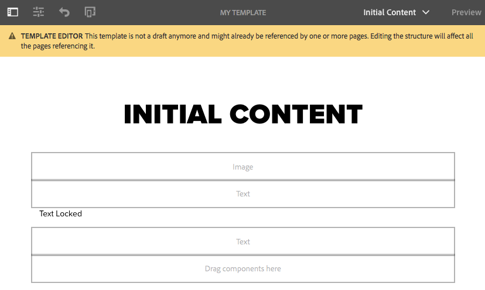
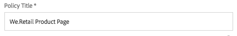

# 建立頁面範本{#creating-page-templates}

建立頁面時，您必須選取範本，以作為建立新頁面的基礎。 範本會定義產生的頁面、任何初始內容，以及可使用的元件。

使用范 **本編輯器**，建立和維護範本不再是開發人員專屬的工作。也可以涉及一種稱為模板作 **者的權**&#x200B;力用戶。開發人員仍需要設定環境、建立用戶端程式庫和建立要使用的元件，但是當這些基本功能準備就緒後，範本作者就可以彈性地建立和設定範本，而不需要開發專案。****

此 **範本主控台** 允許範本作者：

* 建立新範本或複製現有範本。
* 管理範本的生命週期。

此 **範本編輯器** 允許範本作者：

* 將元件新增至範本，並將其置於回應式格線上。
* 預先設定元件。
* 定義可在使用範本建立的頁面上編輯的元件。

本檔案說明 **範本作者** 可使用範本主控台和編輯器來建立和管理可編輯的範本。

有關可編輯的模板在技術級別如何工作的詳細資訊，請參閱開發人員文檔 [頁面範本 — 可編輯](/help/sites-developing/page-templates-editable.md) 以取得更多資訊。

>[!NOTE]
>
>范 **** 本編輯器不支援直接在範本層級定位。可以定位根據可編輯的範本建立的頁面，但無法定位範本本身。

>[!CAUTION]
>
>使用 **範本主控台** 不適用於傳統UI，且不支援這類使用。

## 開始之前 {#before-you-start}

>[!NOTE]
>
>管理員必須在 **配置瀏覽器** 並套用適當權限，範本作者才能在該資料夾中建立範本。

在開始前，請務必考慮下列要點：

* 建立新模板需要協作。 因此， [角色](#roles) 會針對每個任務指示。

* 視您的執行個體的設定方式而定，請注意AEM現在提供 [兩種基本範本類型](/help/sites-authoring/templates.md#editable-and-static-templates). 這不會影響您實際上 [使用範本建立頁面](#using-a-template-to-create-a-page)，但這確實會影響您可建立的範本類型，以及頁面與其範本的關聯方式。

### 角色 {#roles}

使用「模板控制台」和「模 **板編輯器** 」建立新模板時 **** ，需要在以下角色之間協作：

* **管理員**:

   * 為模板建立新資料夾需要 `admin` 權限。

   * 這類工作通常也可由開發人員完成

* **開發人員**:

   * 著重於技術/內部詳細資訊
   * 需要開發環境的經驗。
   * 為範本作者提供必要資訊。

* **範本作者**:

   * 此為群組成員的特定作者 `template-authors`

      * 這會分配所需的權限和權限。
   * 可以配置元件的使用情況和其他需要的高級詳細資訊：

      * 一些技術知識

         * 例如，定義路徑時使用模式。
      * 開發人員的技術資訊。

由於某些工作（例如建立資料夾）的性質，因此需要開發環境，而這需要知識/經驗。

本文檔中詳述的任務將列出負責執行這些任務的角色。

### 可編輯和靜態範本 {#editable-and-static-templates}

AEM現在提供兩種基本範本類型：

* [可編輯的範本](/help/sites-authoring/templates.md#creatingandmanagingnewtemplates)

   * 可以是 [已建立](#creatinganewtemplate) 和 [編輯](#editingatemplate) 由範本作者使用 **範本** 主控台和編輯器。 此 **範本** 主控台可在 **一般** 區段 **工具** 控制台。

   * 建立新頁面後，頁面與範本之間會維持動態連線。 這表示使用該範本建立的任何頁面上，都會反映對範本結構和/或鎖定內容的變更。 不會反映對未鎖定（即初始）內容的變更。
   * 使用內容原則（可從範本編輯器定義這些原則）來保留設計屬性。 可編輯的範本不再使用頁面編輯器中的設計模式。

* 靜態範本

   * 數個AEM版本都提供靜態範本。
   * 是 [由您的開發人員提供](/help/sites-developing/page-templates-static.md)，因此作者無法建立或編輯。
   * 系統會複製以建立新頁面，但之後不存在動態連線（不過會註冊範本名稱以取得資訊）。
   * 使用 [設計模式](/help/sites-authoring/default-components-designmode.md) 保留設計屬性。
   * 由於編輯靜態範本是開發人員專屬的工作，請參閱開發人員檔案 [頁面範本 — 靜態](/help/sites-developing/page-templates-static.md) 以取得更多資訊。

根據定義，範本控制台和範本編輯器只允許建立和編輯可編輯的範本。 因此，本檔案專注於可編輯的範本。

### 使用範本建立頁面 {#using-a-template-to-create-a-page}

將範本用於 [建立新頁面](/help/sites-authoring/managing-pages.md#creating-a-new-page) 靜態和可編輯的範本之間沒有顯示差異，也沒有顯示。 對於頁面作者而言，程式是透明的。

## 建立和管理範本 {#creating-and-managing-templates}

建立新的可編輯範本時，您可以：

* 使用 **範本** 控制台。 這可在 **一般** 區段 **工具** 控制台。

   * 或直接在： [https://localhost:4502/libs/wcm/core/content/sites/templates.html/conf](https://localhost:4502/libs/wcm/core/content/sites/templates.html/conf)

* 可 [為模板建立資料夾](#creating-a-template-folder-admin) 必要
* [建立新範本](#creatinganewtemplateauthor)，一開始會是空的

* [定義其他屬性](#definingtemplatepropertiesauthor) 範本（如有需要）
* [編輯範本](#editingtemplates) 要定義：

   * [結構](#editingatemplatestructureauthor)  — 在使用範本建立的頁面上無法變更的預先定義內容。
   * [初始內容](#editing-a-template-initial-content-author)  — 可在使用範本建立的頁面上變更的預先定義內容。
   * [版面](#editingatemplatelayoutauthor)  — 適用於一系列裝置。
   * [樣式](/help/sites-authoring/style-system.md)  — 定義要與範本及其元件搭配使用的樣式。

* [啟用範本](#enablingatemplateauthor) 用於建立頁面時
* [允許範本](#allowing-a-template-author) 用於您網站的必要頁面或分支
* [發佈範本](#publishingatemplateauthor) 讓其可在發佈環境中使用

>[!NOTE]
>
>此 **允許的範本** 通常會在網站初次設定時預先定義。

>[!CAUTION]
>
>切勿輸入任何需要 [國際化](/help/sites-developing/i18n.md) 填入範本。 為內部化目的， [核心元件的本地化功能](https://experienceleague.adobe.com/docs/experience-manager-core-components/using/get-started/localization.html) 。

### 建立範本資料夾 — 管理員 {#creating-a-template-folder-admin}

應為您的專案建立範本資料夾，以保留專案專用的範本。 這是管理任務，在文檔中有說明 [頁面範本 — 可編輯](/help/sites-developing/page-templates-editable.md#template-folders).

### 建立新範本 — 範本作者 {#creating-a-new-template-template-author}

1. 開啟范 **本主控台** (透過工具-> **一** 般 ****)，然後導覽至所需的檔案夾。

   >[!NOTE]
   >
   >在標準AEM例項中， **全球** 模板控制台中已存在資料夾。 如果在當前資料夾中找不到策略和/或模板類型，則此選項將保留預設模板，並充當後援。
   >
   >
   >建議使用 [為項目建立的模板資料夾](/help/sites-developing/page-templates-editable.md#template-folders).

1. 選擇 **建立**，後跟 **建立範本** 來開啟嚮導。

1. 選擇 **範本類型**，然後選取 **下一個**.

   >[!NOTE]
   >
   >範本類型是預先定義的範本配置，可視為範本的範本。 這些由開發人員或系統管理員預先定義。 如需詳細資訊，請參閱開發人員檔案 [頁面範本 — 可編輯](/help/sites-developing/page-templates-editable.md#template-type).

1. 完成 **範本詳細資料**:

   * **範本名稱**
   * **說明**

1. 選擇 **建立**。將顯示確認，請選擇 **開啟** 開始 [編輯範本](#editingatemplate) 或 **完成** 返回模板控制台。

   >[!NOTE]
   >
   >建立新範本時，會將其標示為 **草稿** 在主控台中，這表示頁面作者尚無法使用它。

### 定義範本屬性 — 範本作者 {#defining-template-properties-template-author}

範本可以有下列屬性：

* 影像

   * 要作為 [範本縮圖](/help/sites-authoring/templates.md#template-thumbnail-image) 以輔助選取，例如在「建立頁面」精靈中。

      * 可上傳
      * 可根據範本內容產生

* 標題

   * 用於識別範本的標題，例如 **建立頁面** 嚮導。

* 說明

   * 提供範本及其使用的詳細資訊的選用說明，例如 **建立頁面** 嚮導。

要查看和/或編輯屬性：

1. 在 **範本主控台**，請選取範本。
1. 從工 **具欄中選擇** 「查看屬性」(View Properties)或快速選項以開啟對話框。
1. 您現在可以檢視或編輯範本屬性。

>[!NOTE]
>
>範本是功能強大的工具，可簡化頁面建立工作流程。 不過，太多範本可能會讓作者不堪重負，使頁面建立變得困惑。 經驗法則是將範本數量控制在100以下。
>
>Adobe不建議有超過1000個範本，因為可能會影響效能。

>[!NOTE]
>
>主控台會指出範本的狀態（草稿、啟用或停用）。

#### 範本縮圖影像 {#template-thumbnail-image}

若要定義範本縮圖：

1. 編輯範本屬性。
1. 選擇您要上傳縮圖，還是從範本內容產生縮圖。

   * 如果您要上傳縮圖，請按一下或點選 **上傳影像**
   * 如果要產生縮圖，請按一下或點選 **產生預覽**

1. 對於這兩種方法，都會顯示縮圖的預覽。

   如果不滿意，請按一下或點選 **清除** 上傳其他影像或重新產生縮圖。

1. 對縮圖感到滿意時，按一下或點選 **儲存並關閉**.

### 啟用和允許範本 — 範本作者 {#enabling-and-allowing-a-template-template-author}

若要在建立頁面時使用範本，您必須：

* [啟用範本](#enablingatemplate) ，以便在建立頁面時使用。
* [允許範本](#allowingatemplate) 指定可使用範本的內容分支。

#### 啟用範本 — 範本作者 {#enabling-a-template-template-author}

範本可以啟用或停用，以便在 **建立頁面** 嚮導。

>[!CAUTION]
>
>範本啟用後，當範本作者開始進一步更新範本時，將會顯示警告。 這會通知使用者可能已參考範本，因此任何變更都可能影響參考範本的頁面。

1. 在 **範本主控台**，請選取範本。
1. 選擇 **啟用** 或 **停用** ，然後在確認對話方塊中再次顯示。
1. 您現在可以在 [建立新頁面](/help/sites-authoring/managing-pages.md#creating-a-new-page)，不過您可能想要 [編輯範本](#editingatemplate) 根據你的要求。

>[!NOTE]
>
>主控台會指出範本的狀態（草稿、啟用或停用）。

#### 允許範本 — 作者 {#allowing-a-template-author}

範本可供某些頁面分支使用或無法使用。

1. 開啟 [頁面屬性](/help/sites-authoring/editing-page-properties.md) 用於要讓範本可用的分支的根頁面。

1. 開啟 **進階** 標籤。

1. 在「 **範本設定** 」下 **，使用「新增」欄位** ，指定範本的路徑。

   路徑可以是明確的或使用模式。 例如：

   `/conf/<your-folder>/settings/wcm/templates/.*`

   路徑的順序不相關，會掃描所有路徑並擷取任何範本。

   >[!NOTE]
   >
   >若 **允許的範本** 清單為空，然後向上爬樹，直到找到值/清單。
   >
   >
   >請參閱 [範本可用性](/help/sites-developing/templates.md#template-availability)  — 允許的模板的原則保持不變。

1. 按一下 **儲存** 以儲存對頁面屬性的變更。

>[!NOTE]
>
>設定時，通常會為整個網站預先定義允許的範本。

### 發佈範本 — 範本作者 {#publishing-a-template-template-author}

轉譯頁面時參照範本時，必須發佈完全設定的範本，才能在發佈環境中使用。

1. 在 **範本主控台**，請選取範本。
1. 選擇 **發佈** ，開啟精靈。
1. 選取 **內容原則** 並列出版。

1. 選擇 **發佈** 來完成動作。

## 編輯範本 — 範本作者 {#editing-templates-template-authors}

建立或編輯範本時，您可以定義各種方面。 編輯範本類似於頁面編寫。

可編輯範本的下列方面：

* [結構](#editingatemplatestructure)

   此處新增的元件無法由頁面作者從產生的頁面中移動/移除。 如果希望頁面作者能夠將元件添加和刪除到生成的頁面，則需要向模板添加段落系統。

   元件鎖定時，您可以新增內容，但頁面作者無法編輯內容。 您可以解除鎖定元件，以便定義 [初始內容](#editingatemplateinitialcontent).

   >[!NOTE]
   >
   >在結構模式中，不能移動、剪切或刪除任何作為未鎖定元件父級的元件。

* [初始內容](#editingatemplateinitialcontent)

   元件解除鎖定後，您可以定義將複製到從範本建立的結果頁面的初始內容。 可在產生的頁面上編輯這些未鎖定的元件。

   >[!NOTE]
   >
   >在 **初始內容** 模式以及在產生的頁面上，可以刪除任何具有可存取父項（即版面容器內的元件）的未鎖定元件。

* [配置](#editingatemplatelayout)

   您可以在此處預先定義所需裝置格式的範本版面。 **範本製作的** 「版面」模式與頁面製作的「版面 [**** 」模式功能相同](/help/sites-authoring/responsive-layout.md#defining-layouts-layout-mode)。

* [頁面原則](#editingatemplatepagepolicies)

   在頁面原則下，您可以將預先定義的頁面原則連結至頁面。 這些頁面原則定義各種設計設定。

* [樣式](/help/sites-authoring/style-system.md)

   樣式系統允許模板作者在元件的內容策略中定義樣式類，以便內容作者能夠在編輯頁面上的元件時選擇它們。 這些樣式可作為元件的替代視覺變化，使其更具彈性。

   請參閱 [樣式系統檔案](/help/sites-authoring/style-system.md) 以取得更多資訊。

此 **模式** 工具列中的選取器可讓您選取和編輯範本的適當方面：

* [結構](#editingatemplatestructure)
* [初始內容](#editingatemplateinitialcontent)
* [配置](#editingatemplatelayout)

若 **頁面原則** 選項 **頁面資訊** 功能表 [選擇所需的頁面策略](#editingatemplatepagepolicies):

>[!CAUTION]
>
>如果作者開始編輯已啟用的範本，將會顯示警告。 這會通知使用者可能已參考範本，因此任何變更都可能影響參考範本的頁面。

### 編輯範本 — 結構 — 範本作者 {#editing-a-template-structure-template-author}

在 **結構** 模式：為模板定義元件和內容，並為模板及其元件定義策略。

* 在範本結構中定義的元件無法在產生的頁面上移動，也無法從任何產生的頁面中刪除。
* 如果您希望頁面作者能夠新增和移除元件，請在範本中新增段落系統。
* 元件可以重新解除鎖定和鎖定，以便您定義 [初始內容](#editingatemplateinitialcontent).

* 已定義元件和頁面的設計原則。

在 **結構** 範本編輯器的模式：

* **新增元件**

   有數種機制可將元件新增至範本：

   * 從 **元件** 瀏覽器。
   * 使用 **插入元件** 選項(**+** 圖示)，可在範本或 **拖曳元件至此** 框。

   * 透過拖曳資產(從 **資產** 瀏覽器)直接在範本上，就地產生適當的元件。

   新增後，每個元件都會加上：

   * 邊框
   * 顯示元件類型的標籤
   * 要在元件已解鎖時顯示的標籤

   >[!NOTE]
   >
   >將現成可用的標題元件新增至範本時 **** ，其中會包含預設的文字 **結構**。
   >
   >
   >如果您變更此項目，並新增您自己的文字，則從範本建立頁面時，將會使用此更新的文字。
   >
   >
   >如果您保留預設文字（結構），則標題會預設為後續頁面的名稱。

   >[!NOTE]
   >
   >將元件和資產新增至範本雖然不相同，但與下列情形的類似動作有許多相似之處： [頁面編寫](/help/sites-authoring/editing-content.md).

* **元件動作**

   將元件新增至範本後，對元件執行動作。 每個個別執行個體都有一個工具列，可讓您存取可用的動作，該工具列取決於元件類型。

   

   它也取決於所採取的操作，例如當策略與元件關聯時，設計配置表徵圖將可用。

* **編輯和配置**

   透過這兩個動作，您可以將內容新增至元件。

* **用於指示結構的邊框**

   使用時 **結構** 以橘色邊框模式表示目前選取的元件。 虛線也代表上層元件。

   例如，在下方的螢幕擷取中， **文字** 在 **版面容器** （響應網格）。

   

* **策略和屬性（一般）**

   內容（或設計）原則會定義元件的設計屬性。 例如，可用元件或最小/最大尺寸。 這些規則適用於範本（以及使用範本建立的頁面）。

   為元件建立內容原則或選取現有原則。 這可讓您定義設計詳細資訊。

    

   設定視窗分為兩個部分。

   * 在對話方塊的左側， **原則**，您可以選擇現有策略或選擇現有策略。
   * 在對話方塊的右側， **屬性**，您可以設定元件類型的特定屬性。

   可用的屬性取決於所選元件。 例如，對於文本元件，屬性定義了複製和貼上選項、格式選項和段落樣式等選項。

   ***政策***

   內容（或設計）原則會定義元件的設計屬性。 例如，可用元件或最小/最大尺寸。 這些規則適用於範本（以及使用範本建立的頁面）。

   在 **原則** 您可以透過下拉式清單，選取要套用至元件的現有原則。

   

   您可以選取 **選擇策略** 下拉式清單。 之後，應在 **策略標題** 欄位。

   

   中選定的現有策略 **選擇策略** 下拉式清單可使用下拉式清單旁的複製按鈕，以新原則複製。 之後，應在 **策略標題** 欄位。 預設情況下，複製的策略將被命名為 **X副本**，其中X是複製之原則的標題。

   

   策略的說明在 **策略描述** 欄位。

   在 **其他模板也使用所選策略** 部分，您可以輕鬆查看哪些其他模板使用在 **選擇策略** 下拉式清單。

   

   >[!NOTE]
   >
   >如果添加了多個相同類型的元件作為初始內容，則相同的策略適用於所有元件。 這反映了 [**設計模式** 用於靜態範本](/help/sites-authoring/default-components-designmode.md).

   ***屬性***

   在 **屬性** 標題中，您可以定義元件的設定。 標題有兩個標籤：

   * 主要
   * 功能

   *主要*

   在 **主要** 索引標籤中，會定義元件最重要的設定。

   例如，對於影像元件，可定義允許的寬度並啟用延遲載入。

   如果設定允許多個設定，請按一下或點選 **新增** 按鈕以新增其他設定。

   

   若要移除設定，請按一下或點選 **刪除** 按鈕。

   若要移除設定，請按一下或點選** Delete**按鈕。

   

   *功能*

   此 **功能** 索引標籤可讓您啟用或停用元件的其他功能。

   例如，對於影像元件，您可以定義裁切比例、允許的影像方向，以及是否允許上傳。

   

   >[!CAUTION]
   >
   >請注意，在AEM裁切比例中，定義為 **高度/寬度**. 這與傳統的寬度/高度定義不同，因為舊版相容性原因而完成。 若您定義 **名稱** UI中會顯示這個。

   >[!NOTE]
   >
   >[實作RTF編輯器的元件的內容原則](/help/sites-administering/rich-text-editor.md#main-pars-header-206036638) 只能針對RTE透過其UI設定可用的選項來定義。  

* **策略和屬性（佈局容器）**

   佈局容器的策略和屬性設定與一般用法類似，但有一些差異。

   >[!NOTE]
   >
   >容器元件必須配置策略，因為它可讓您定義容器中可用的元件。

   設定視窗分為兩個部分，如同一般使用視窗一樣。

   ***政策***

   內容（或設計）原則會定義元件的設計屬性。 例如，可用元件或最小/最大尺寸。 這些規則適用於範本（以及使用範本建立的頁面）。

   在 **原則** 您可以透過下拉式清單，選取要套用至元件的現有原則。 此功能與一般使用視窗的功能相同。

   ***屬性***

   在 **屬性** 標題，您可以選取哪些元件可用於配置容器並定義其設定。 標題有三個標籤：

   * 允許的元件
   * 預設元件
   * 回應式設定

   *允許的元件*

   在 **允許的元件** 頁簽，定義佈局容器可用的元件。

   * 元件會依其元件群組分組，可展開和收合。
   * 可以通過檢查組名稱來選擇整個組，而通過取消檢查可以取消選擇所有組。
   * 減號至少表示已選取一個組中的項目，但並非全部。
   * 可使用搜尋來依名稱篩選元件。
   * 元件組名稱右側列出的計數表示這些組中選定元件的總數（無論篩選器為何）。

   

   *預設元件*

   在 **預設元件** 標籤中，您可以定義哪些元件會自動與指定的媒體類型關聯，以便當作者從資產瀏覽器拖曳資產時，AEM會知道要將其關聯到哪個元件。 請注意，此類配置僅可使用帶拖放區的元件。

   按一下或點選 **新增對應** 新增全新元件和MIME類型對應。

   在清單中選取元件，然後按一下或點選「 **新增類型** 」，將其他MIME類型新增至已映射的元件。按一下「 **刪除** 」圖示以移除MIME類型。

   

   *回應式設定*

   在 **回應式設定** 索引標籤，您可以在產生的配置容器格線中設定欄數。

* **解除鎖定/鎖定元件**

   您可以解除鎖定/鎖定元件，以定義內容是否可供在 **初始內容** 模式。

   元件解除鎖定時：

   * 邊框中顯示開啟的掛鎖指示器。
   * 元件工具列將隨之調整。
   * 已輸入的任何內容將不再顯示於 **結構** 模式。

      * 已輸入的內容會視為初始內容，且只會顯示在 **初始內容** 模式。
   * 無法移動、剪切或刪除未鎖定元件的父項。

   

   這包括解除鎖定容器元件，以便在初始內容模式或產生的頁 **面中新增其他元件** 。如果您在解除鎖定容器之前已將元件/內容新增至容器，則這些元件/內容在「結構」模式中將不再顯示，但會以「初始內容 ******** 」模式顯示。在「 **結構模式**」中，只有容器元件本身會顯示其「允許的元 **件」清單**。

   

   為了節省空間，版面容器不會擴展以容納允許的元件清單。 容器反而會變成可捲動清單。

   可配置的元件以「策略」表徵圖顯示 **** ，可以點選或按一下該表徵圖以編輯該元件的策略和屬性。

   

* **與現有頁面的關係**

   如果在根據範本建立頁面後更新結構，則這些頁面將反映對範本的變更。 工具列中會顯示警告，提醒您此事實以及確認對話方塊。

   

### 編輯範本 — 初始內容 — 作者 {#editing-a-template-initial-content-author}

**初始內容** 模式用於定義內容，內容會在根據範本首次建立頁面時顯示。 然後頁面作者就可以編輯初始內容。

雖然在「結構 **」模式下建立的所有內容在「初始內容」中都可** 見 ****，但只能選擇和編輯已解鎖的元件。

>[!NOTE]
>
>**初始內容** 可使用該範本建立之頁面的編輯模式時，可考慮使用該模式。 因此，未在 **初始內容** 模式，而 [**結構** 模式](/help/sites-authoring/templates.md#editing-a-template-structure-template-author).

* 標籤可用於編輯的未鎖定元件。 選取後，其邊框會呈藍色：

   

* 解除鎖定的元件有一個工具欄，允許您編輯和配置內容：

   

* 如果容器元件已解除鎖定(在「結 **構** 」模式中)，則您可以在「初始內容 **** 」模式中新增元件至容器。在「初始內 **容」模式中新增的元件** ，可在產生的頁面上移動或從中刪除。

   您可以使用「拖曳元件到此處 **」區域，或從適當容器的工具列** 中使用「插入新元件 **** 」選項來新增元件。

    

* 如果在根據範本建立頁面後更新範本的初始內容，則這些頁面不會受到範本中初始內容變更的影響。

>[!NOTE]
>
>初始內容的用途是準備元件和頁面版面，以作為建立內容的起點。 其目的並非實際內容可維持原樣。 因此，無法翻譯初始內容。
>
>如果您需要在範本中納入可翻譯的文字，例如在頁首或頁尾中，您可以使用 [核心元件的本地化功能](https://docs.adobe.com/content/help/zh-Hant/experience-manager-core-components/using/get-started/localization.html).

### 編輯範本 — 版面 — 範本作者 {#editing-a-template-layout-template-author}

您可以定義裝置範圍的範本配置。 [回應式版面](/help/sites-authoring/responsive-layout.md) 範本的運作方式與頁面編寫相同。

>[!NOTE]
>
>版面的變更將反映在 **初始內容** 模式，但在 **結構** 模式。

### 編輯範本 — 頁面設計 — 範本作者/開發人員 {#editing-a-template-page-design-template-author-developer}

頁面設計 (包括所需的用戶端程式庫和頁面原則) 會保留在「頁面資訊」功能表的「 **頁面設計** 」選 **** 項下。

若要存取 **頁面設計** 對話框：

1. 從 **範本編輯器**，選取 **頁面資訊** ，然後 **頁面設計** 來開啟對話框。
1. 此 **頁面設計** 對話方塊隨即開啟，並分為兩個區段：

   * 左半部定義 [頁面原則](/help/sites-authoring/templates.md#page-policies)
   * 右半部定義 [頁面屬性](/help/sites-authoring/templates.md#page-properties)

   

#### 頁面原則 {#page-policies}

您可以將內容原則套用至範本或產生的頁面。 這會定義頁面上主要段落系統的內容原則。

* 您可以從 **選擇策略** 下拉式清單。

   

   您可以選取 **選擇策略** 下拉式清單。 之後，應在 **策略標題** 欄位。

   

   中選定的現有策略 **選擇策略** 下拉式清單可使用下拉式清單旁的複製按鈕，以新原則複製。 之後，應在 **策略標題** 欄位。 預設情況下，複製的策略將被命名為 **X副本**，其中X是複製之原則的標題。

   

* 在 **策略標題** 欄位。 需要策略才能有標題，以便在 **選擇策略** 下拉式清單。

   

* 策略的說明在 **策略描述** 欄位。
* 在 **其他模板也使用所選策略** 部分，您可以輕鬆查看哪些其他模板使用在 **選擇策略** 下拉式清單。

   

#### 頁面內容 {#page-properties}

使用頁面屬性，您可以使用 **頁面設計** 對話框。 這些客戶端庫包括要載入模板的樣式表和javascript以及使用該模板建立的頁。

* 指定您要套用至使用此範本建立之頁面的用戶端程式庫。 在 **用戶端程式庫** 區段。

   

* 如果需要多個程式庫，請按一下「新增」按鈕，為程式庫名稱新增其他文字欄位。

   

   視需要為用戶端程式庫新增任意數量的文字欄位。

   

* 使用拖曳控點拖曳欄位，視需要定義程式庫的相對位置。

   

>[!NOTE]
>
>雖然範本作者可以在範本上指定頁面原則，但他/她需要從開發人員取得適當用戶端程式庫的詳細資訊。

### 編輯範本 — 初始頁面屬性 — 作者 {#editing-a-template-initial-page-properties-author}

使用 **初始頁面屬性** 選項，可定義初始 [頁面屬性](/help/sites-authoring/editing-page-properties.md) 建立產生的頁面時使用。

1. 從範本編輯器中，選取 **頁面資訊** ，然後 **初始頁面屬性** 來開啟對話框。

1. 在對話方塊中，您可以定義要套用至使用此範本建立之頁面的屬性。

   

1. 使用確認您的定義 **完成**.

## 最佳作法 {#best-practices}

建立範本時，您應考慮：

1. 從該範本建立頁面後，對範本所做的變更所產生的影響。

   以下是範本上可能的不同操作清單，以及這些操作如何影響從這些操作建立的頁面：

   * 結構變更：

      * 這些會立即套用至產生的頁面。
      * 訪客仍需要發佈已變更的範本，才能看到變更。
   * 內容原則和設計設定的變更：

      * 這些規則會立即套用至產生的頁面。
      * 需要發佈變更，訪客才能看到變更。
   * 初始內容的變更：

      * 這些規則僅適用於範本變更後建立的頁面。
   * 版面的變更取決於修改的元件是否屬於：

      * 僅限結構 — 立即應用
      * 包含初始內容 — 僅限在變更後建立的頁面上

   請格外小心：

   * 在啟用的模板上鎖定或解鎖元件。
   * 這可能會產生副作用，因為現有頁面可能已在使用它。 通常：

      * 現有頁面上將缺少解鎖元件（已鎖定）。
      * 鎖定元件（可編輯）將隱藏該內容，使其不會顯示在頁面上。

   >[!NOTE]
   >
   >AEM在不再是草稿的範本上變更元件的鎖定狀態時，會顯示明確警告。

1. [建立您自己的資料夾](#creatingatemplatefolderdeveloper) 特定於網站的範本。
1. [發佈範本](#publishingatemplateauthor) 從 **範本** 控制台。
