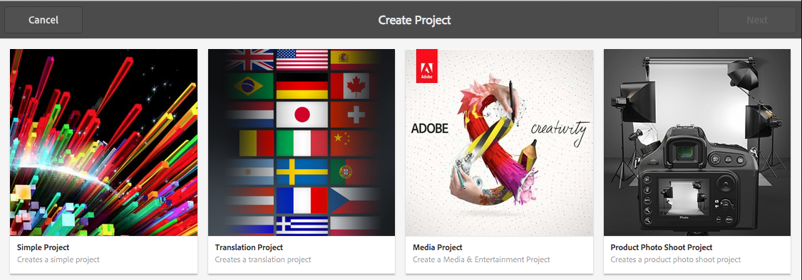
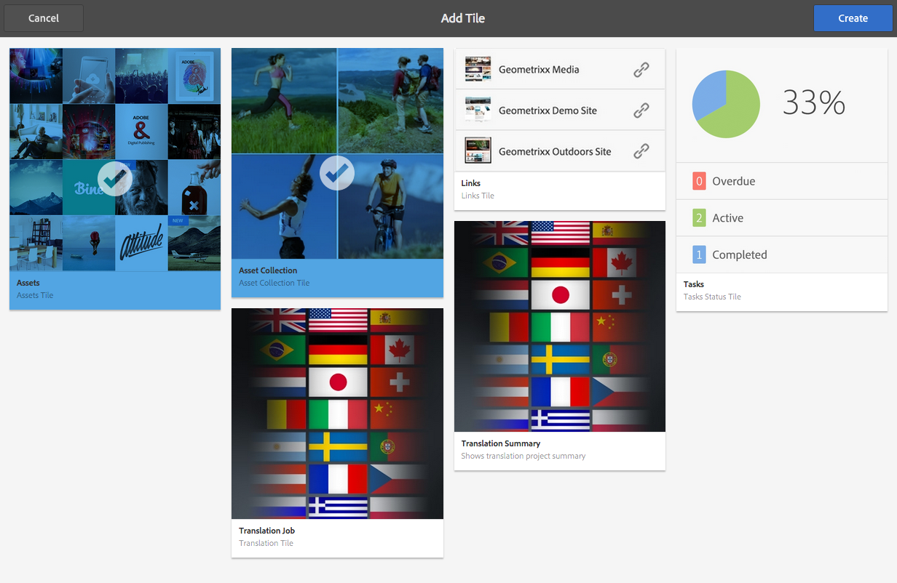
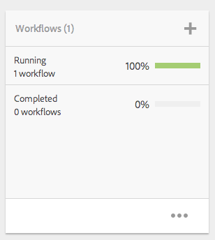
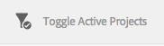

# 管理專案{#managing-projects}

專案可讓您將資源分組為一個實體，借此組織專案。

在&#x200B;**專案**&#x200B;主控台中，您可以存取專案並採取動作：

在「專案」中，您可以建立專案、將資源與專案建立關聯，以及刪除專案或資源連結。 您可能想要開啟圖磚以檢視其內容，並新增項目至圖磚。 本主題說明這些程式。

>[!NOTE]
>
>6.2引入了將項目組織到資料夾中的能力。 在「專案」頁面上，您可以建立專案或資料夾。
>
>如果已建立資料夾，則會將使用者帶往該資料夾，讓他們可在該資料夾中建立其他資料夾或專案。 它有助於根據產品促銷活動、位置、翻譯語言等類別，將專案組織到資料夾中。
>
>您可以在清單檢視中檢視專案和資料夾，也可以進行搜尋。

>[!CAUTION]
>
>若要讓專案中的使用者在使用專案功能（例如建立專案、建立工作/工作流程、查看及管理團隊）時查看其他使用者/群組，這些使用者必須擁有&#x200B;**/home/users**&#x200B;和&#x200B;**/home/groups**&#x200B;的讀取存取權。 實作此項目最簡單的方式是，為&#x200B;**projects-users**&#x200B;群組提供&#x200B;**/home/users**&#x200B;和&#x200B;**/home/groups**&#x200B;的讀取存取權。

## 建立項目{#creating-a-project}

AEM提供下列範本，供您在建立專案時自行選擇：

* 簡單專案
* 媒體專案
* 產品像片拍攝專案
* 翻譯專案

從專案到專案，建立專案的程式都相同。專案類型之間的差異包括可用的使 [用者角色](/help/sites-authoring/projects.md)[和工作流程](/help/sites-authoring/projects-with-workflows.md)。要建立新項目，請執行以下操作：

1. 在「 **專案**」中，點選/按一 **下「建立** 」以開啟「 **** 建立專案」精靈：
1. 選取範本. 現成可用的簡單項目、媒體項目、[翻譯項目](/help/sites-administering/tc-manage.md)和[產品照片拍攝產品](/help/sites-authoring/managing-product-information.md)，然後按一下&#x200B;**下一步**。

   

1. 定義&#x200B;**Title**&#x200B;和&#x200B;**Description**，並視需要新增&#x200B;**縮圖**&#x200B;影像。 您也可以新增或刪除使用者，以及使用者所屬的群組。 此外，按一下&#x200B;**Advanced**&#x200B;以新增URL中使用的名稱。

   

1. 點選/按一下&#x200B;**建立**。 確認會詢問您是否要開啟新專案或返回主控台。

### 將資源與項目{#associating-resources-with-your-project}關聯

由於項目使您可以將資源分組到一個實體，因此您要將資源與項目關聯。 這些資源稱為&#x200B;**圖磚**。 [專案圖磚](/help/sites-authoring/projects.md#project-tiles)中會說明您可新增的資源類型。

將資源與項目關聯：

1. 從&#x200B;**專案**&#x200B;主控台開啟您的專案。
1. 點選/按一下「**新增圖磚**」，然後選取您要連結至專案的圖磚。 您可以選取多種圖磚類型。

   

   >[!NOTE]
   >
   >可以與項目關聯的項目圖磚在[項目圖磚中有詳細說明。](/help/sites-authoring/projects.md#project-tiles)

1. 點選/按一下&#x200B;**建立**。 您的資源已連結至專案，從現在開始，您就可以從專案存取。

### 刪除項目或資源連結{#deleting-a-project-or-resource-link}

從主控台刪除專案或從專案刪除連結資源時，會使用相同的方法：

1. 導覽至適當位置：

   * 要刪除項目，請轉到&#x200B;**項目**&#x200B;控制台的頂層。
   * 若要刪除專案內的資源連結，請在&#x200B;**Projects**&#x200B;主控台中開啟您的專案。

1. 按一下&#x200B;**選擇**&#x200B;並選擇項目或資源連結，進入選擇模式。
1. 點選/按一下&#x200B;**刪除**。

1. 您必須在對話方塊中確認刪除。 如果確認，則刪除項目或資源連結。 點選/按一下&#x200B;**取消選取**&#x200B;以退出選取模式。

>[!NOTE]
>
>當您建立專案並將使用者新增至各種角色時，系統會自動建立與專案相關的群組，以管理相關的權限。例如，名為Myproject的專案會有三個群組 **Myproject Owners**、 **Myproject Editors**、 **Myproject Obsertors**。不過，如果刪除專案，這些群組不會自動刪除。管理員需要手動刪除「工具 **>安全** 性 **>** 群組 ****」。

### 將項添加到磁貼{#adding-items-to-a-tile}

在某些圖磚中，您可能想要新增多個項目。 例如，您可能一次執行多個工作流程或執行多個體驗。

若要將項目新增至圖磚：

1. 在&#x200B;**「專案」**&#x200B;中，導覽至專案，然後按一下您要新增項目的方塊上的「新增+」圖示。

   

1. 將項目新增至圖磚，如同建立新圖磚時一樣。 [此處](/help/sites-authoring/projects.md#project-tiles)說明專案圖磚。 在此範例中，新增了另一個工作流程。

   

### 開啟磁貼{#opening-a-tile}

您可能想要查看當前表徵圖中包含的項目，或修改或刪除表徵圖中的項目。

要開啟圖磚，以便查看或修改項目：

1. 在專案主控台中，點選/按一下點(...)

   

1. AEM會列出該方塊中的項目。 您可以進入選擇模式以修改或刪除項目。

   

## 查看項目統計資料{#viewing-project-statistics}

要查看項目統計資訊，請在&#x200B;**項目**&#x200B;控制台中，按一下&#x200B;**顯示統計資訊視圖**。 隨即顯示每個專案的完成層級。 再次按一下「**顯示統計資訊視圖**」以轉到&#x200B;**項目**&#x200B;控制台。

### 查看項目時間軸{#viewing-a-project-timeline}

專案時間軸提供上次使用專案中資產的時間。 若要檢視專案時間軸，請按一下/點選&#x200B;**時間軸**，然後進入選取模式並選取專案。 資產會顯示在左窗格中。 按一下/點選&#x200B;**時間軸**&#x200B;以返回&#x200B;**專案**&#x200B;主控台。

### 查看活動/非活動項目{#viewing-active-inactive-projects}

若要在使用中和非使用中專案之間切換，請在&#x200B;**專案**&#x200B;主控台中，按一下&#x200B;**切換使用中專案**。 如果圖示旁邊有核取記號，則會顯示使用中的專案。

如果圖示旁有x，表示非作用中專案。

## 將項目設為非活動或活動{#making-projects-inactive-or-active}

如果已完成項目，您可能希望將其設為非活動項目，但仍希望保留有關該項目的資訊。

若要將專案設為非作用中（或作用中）:

1. 在&#x200B;**專案**&#x200B;主控台中，開啟您的專案，然後尋找&#x200B;**專案資訊**&#x200B;方塊。

   >[!NOTE]
   如果此圖磚尚未在您的專案中，則您可能需要新增它。 請參閱[新增圖磚](#adding-items-to-a-tile)。

1. 點選/按一下&#x200B;**編輯**。
1. 將選取器從&#x200B;**Active**&#x200B;變更為&#x200B;**Inactive**（反之亦然）。

   

1. 點選/按一下&#x200B;**Done**&#x200B;以儲存您的變更。
