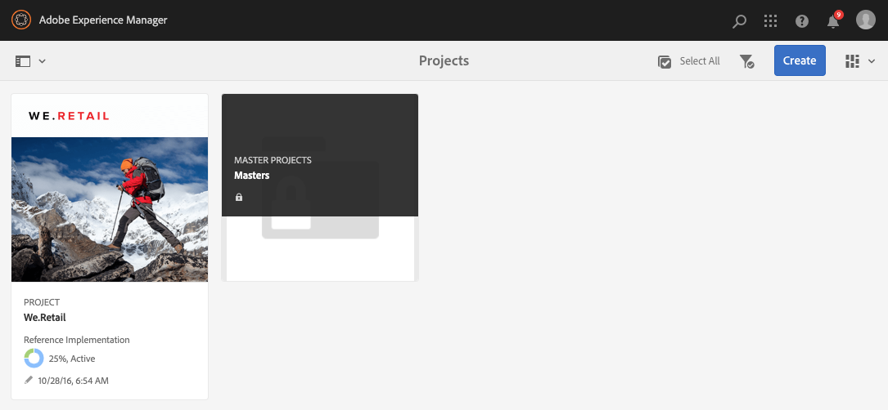
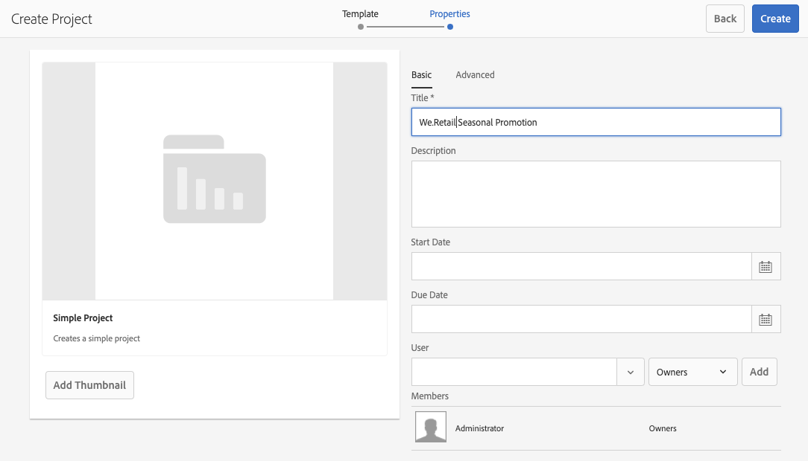
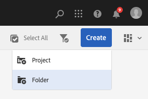

# 管理專案 {#managing-projects}

在 **項目** 控制台，您可以訪問和管理項目。

使用控制台，您可以建立項目、將資源與項目關聯，還可以刪除項目或資源連結。

## 訪問要求 {#access-requirements}

項目標準AEM功能，不需要任何附加設定。

但是，對於項目中的用戶在使用項目時要查看其他用戶/組，例如在建立項目、建立任務/工作流或查看和管理團隊時，這些用戶需要具有對的讀取權限 `/home/users` 和 `/home/groups`。

最簡單的方法就是 **項目用戶** 組讀取訪問權限 `/home/users` 和 `/home/groups`。

## 建立項目 {#creating-a-project}

按照以下步驟建立新項目。

1. 在 **項目** 控制台，點擊或按一下 **建立** 開啟 **建立項目** 的子菜單。
1. 選擇模板並按一下 **下一個**。 您可以瞭解有關標準項目模板的詳細資訊 [給。](/help/sites-authoring/projects.md#project-templates)

   

1. 定義 **標題** 和 **說明** 並添加 **縮略圖** 影像。 您還可以添加或刪除用戶及其所屬的組。

   

1. 點擊/按一下 **建立**。 確認會詢問您是要開啟新項目還是要返回控制台。

建立項目的過程與所有項目模板的過程相同。 項目類型之間的差異與可用項目有關 [用戶角色](/help/sites-authoring/projects.md) 和 [工作流。](/help/sites-authoring/projects-with-workflows.md)

### 將資源與項目關聯 {#associating-resources-with-your-project}

項目使您能夠將資源分組到一個實體中，以便將資源作為一個整體進行管理。 因此，您需要將資源與項目關聯。 這些資源在項目中分組為 **磁貼**。 可添加的資源類型在中介紹 [項目磁貼](/help/sites-authoring/projects.md#project-tiles)。

要將資源與項目關聯，請執行以下操作：

1. 從 **項目** 控制台。
1. 點擊/按一下 **添加磁貼** 並選擇要連結到項目的磁貼。 可以選擇多種類型的磁貼。

   

1. 點擊/按一下 **建立**。 您的資源已連結到您的項目，從現在開始，您可以從您的項目訪問它。

### 將項目添加到磁貼 {#adding-items-to-a-tile}

在某些磁貼中，您可能想添加多個項。 例如，您可能同時運行多個工作流或多次運行一次。

要將項目添加到磁貼：

1. 在 **項目**，導航到項目，然後按一下要向其中添加項目的磁貼右上角的向下雪佛龍表徵圖，並選擇相應的選項。

   * 該選項取決於磁貼的類型。 例如，它可能 **建立任務** 為 **任務** 拼貼 **啟動工作流** 為 **工作流** 平鋪。

   

1. 將項目添加到磁貼中，與建立新磁貼時一樣。 描述了項目磁貼 [給。](/help/sites-authoring/projects.md#project-tiles)

## 查看項目資訊 {#viewing-project-info}

項目的主要目的是將相關資訊分組到一個地方，使其更易於訪問和操作。 您有多種訪問此資訊的方法。

### 開啟磁貼 {#opening-a-tile}

您可能希望查看當前磁貼中包含哪些項目，或修改或刪除磁貼中的項目。

要開啟磁貼，以便查看或修改項目：

1. 點擊或按一下磁貼右下角的橢圓表徵圖。

   

1. 打AEM開控制台，查看與磁貼關聯的項目類型以及基於所選項目的篩選器。

   

### 查看項目時間線 {#viewing-a-project-timeline}

項目時間表提供有關上次使用項目中資產的時間的資訊。 要查看項目時間線，請執行以下步驟。

1. 在 **項目** 控制台，按一下或點擊 **時間軸** 在控制台左上角的滑軌選擇器中。
   
2. 在控制台中，選擇要查看其時間線的項目。
   

資產顯示在鐵軌中。 完成後，使用滑軌選擇器返回到普通視圖。

### 查看非活動項目 {#viewing-active-inactive-projects}

在活動和 [非活動項目，](#making-projects-inactive-or-active) 的 **項目** 控制台，按一下 **切換活動項目** 的子菜單。

預設情況下，控制台顯示活動項目。 按一下 **切換活動項目** 表徵圖以切換到查看非活動項目。 再次按一下它以切換回活動項目。

## 組織項目 {#organizing-projects}

有幾個選項可幫助您組織項目以保留 **項目** 控制台可管理。

### 項目資料夾 {#project-folders}

您可以在 **項目** 控制台對類似項目進行分組和組織。

1. 在 **項目** 按一下控制台 **建立** 然後 **建立資料夾**。

   

1. 給資料夾一個標題並按一下 **建立**。

1. 資料夾將添加到控制台。

現在，您可以在資料夾中建立項目。 您可以建立多個資料夾，也可以嵌套資料夾。

### 停用項目 {#making-projects-inactive-or-active}

如果項目已完成，您可能希望將其標籤為非活動，但仍希望保留有關該項目的資訊。 [不活動的項目現在顯示](#viewing-active-inactive-projects) 在 **項目** 控制台。

要使項目處於非活動狀態，請執行以下步驟。

1. 開啟 **項目屬性** 的子菜單。
   * 通過選擇項目或通過 **項目資訊** 平鋪。
1. 在 **項目屬性** 窗口，更改 **項目狀態** 滑塊 **活動** 至 **非活動**。

   

1. 點擊或按一下 **保存並關閉** 的子菜單。

### 刪除項目 {#deleting-a-project}

按照以下步驟刪除項目。

1. 導航至 **項目** 控制台。
1. 在控制台中選擇項目。
1. 點擊或按一下 **刪除** 的子菜單。
1. 可以AEM在項目刪除時刪除/修改關聯的項目資料。 選擇在 **刪除項目** 對話框。
   * 移除專案群組和角色
   * 刪除項目資產資料夾
   * 終止專案工作流程

   
1. 點擊或按一下 **刪除** 的子菜單。

要瞭解有關由項目自動建立的組的詳細資訊，請參閱 [自動建立組](/help/sites-authoring/projects.md#auto-group-creation) 的雙曲餘切值。
