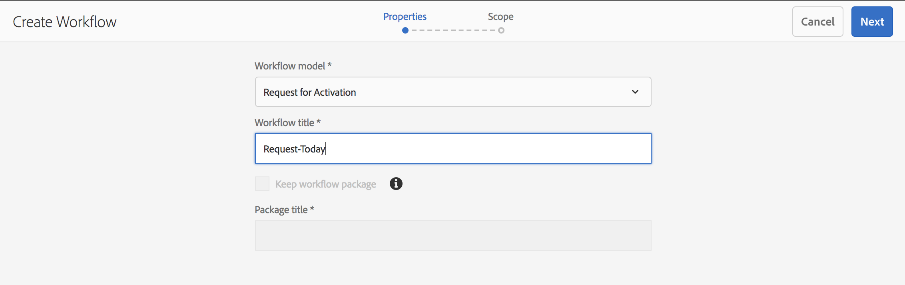

# 將工作流程套用至頁面{#applying-workflows-to-pages}

編寫時，您可以叫用工作流程以在頁面上執行動作；也可以套用多個工作流程。

套用工作流程時，請指定下列資訊：

* 要套用的工作流程。您可以套用您有權存取的任何工作流程 (由AEM管理員指派)。
* （可選）有助於識別使用者收件匣中的工作流程例項的標題。
* 工作流程裝載；這可以是一或多個頁面。

工作流程可從以下位置啟動：

* [網站主控台](#starting-a-workflow-from-the-sites-console).
* [編輯頁面時，從「頁面資訊」](#starting-a-workflow-from-the-page-editor).

>[!NOTE]
>
>另請參閱：
>
>* [如何將工作流程套用至DAM資產](/help/assets/assets-workflow.md).
>* [使用專案工作流程](/help/sites-authoring/projects-with-workflows.md).
>

>[!NOTE]
>
>AEM管理員可以 [使用數個其他方法開始工作流程](/help/sites-administering/workflows-starting.md).

## 從Sites Console啟動工作流程 {#starting-a-workflow-from-the-sites-console}

您可以從以下其中一項啟動工作流程：

* [「網站」工具列的「建立」選項](#starting-a-workflow-from-the-sites-toolbar).
* [Sites主控台的時間軸邊欄](#starting-a-workflow-from-the-timeline).

在這兩種情況下，您都必須：

* [在建立工作流程精靈中指定工作流程詳細資訊](#specifying-workflow-details-in-the-create-workflow-wizard).

### 從網站工具列啟動工作流程 {#starting-a-workflow-from-the-sites-toolbar}

您可以從的工具列啟動工作流程 **網站** 主控台：

1. 導覽至並選取所需頁面。

1. 從 **建立** 工具列中的選項，您現在可以選取 **工作流程**.

   

1. 此 **建立工作流程** 精靈會協助您 [指定工作流程詳細資料](#specifying-workflow-details-in-the-create-workflow-wizard).

### 從時間表啟動工作流程 {#starting-a-workflow-from-the-timeline}

從 **時間表** 您可以啟動要套用至所選資源的工作流程。

1. [選取資源](/help/sites-authoring/basic-handling.md#viewingandselectingyourresources) 並開啟 [時間表](/help/sites-authoring/basic-handling.md#timeline) （或開啟時間表，然後選取資源）。
1. 註解欄位旁的箭頭可用來顯現 **開始工作流程**：

   

1. 此 **建立工作流程** 精靈會協助您 [指定工作流程詳細資料](#specifying-workflow-details-in-the-create-workflow-wizard).

### 在建立工作流程精靈中指定工作流程詳細資訊 {#specifying-workflow-details-in-the-create-workflow-wizard}

此 **建立工作流程** 精靈將協助您選取工作流程並指定必要的詳細資料。

開啟 **建立工作流程** 精靈的來源：

* [「網站」工具列的「建立」選項](#starting-a-workflow-from-the-sites-toolbar).
* [Sites主控台的時間軸邊欄](#starting-a-workflow-from-the-timeline).

您可以指定詳細資料：

1. 在 **屬性** 步驟，工作流程的基本選項已定義：

   * **工作流程模型**
   * **工作流程標題**

      * 您可以指定此例項的標題，協助您在稍後階段識別它。

   根據工作流程模型，也可以使用下列選項。 這些功能可在工作流程完成後，保留建立為裝載的封裝。

   * **保留工作流程封裝**
   * **封裝標題**

      * 您可以指定封裝的標題，以協助識別。

   >[!NOTE]
   >
   >當為「 **** 多資源支援」配置了工作流且已選擇多個資源時，「保留工作流包」選項可用。

   完成後，請使用 **下一個** 以繼續進行。

   

1. 在 **範圍** 您可以選取的步驟：

   * **新增內容** 以開啟 [路徑瀏覽器](/help/sites-authoring/author-environment-tools.md#path-browser) 並選取其他資源；在瀏覽器中，按一下/點選 **選取** 以將內容新增至工作流程例項。

   * 檢視其他動作的現有資源：

      * **包含子項** 以指定該資源的子項將包含在工作流程中。
對話方塊隨即開啟，讓您根據下列條件調整選取範圍：

         * 僅包含直接子項.
         * 僅包含修改過的頁面.
         * 僅包含已發佈的頁面.

        任何指定的子項都會新增至將套用工作流程的資源清單中。

      * **移除選取專案** 以從工作流程移除該資源。

   

   >[!NOTE]
   >
   >如果添加其他資源，則可以使用「上 **一步** 」( **Back** )在「屬性」(Properties)步驟中調整「保留工作流程包 **」(Keep workflow package** )的設定。

1. 使用 **建立** 以關閉精靈並建立工作流程例項。 通知會顯示在Sites主控台中。

## 從頁面編輯器啟動工作流程 {#starting-a-workflow-from-the-page-editor}

編輯頁面時，您可以選取 **頁面資訊** 工具列中的。 下拉式選單具有選項 **在工作流程中開始**. 這會開啟一個對話方塊，您可以在其中指定所需的工作流程，以及標題（如有需要）：

