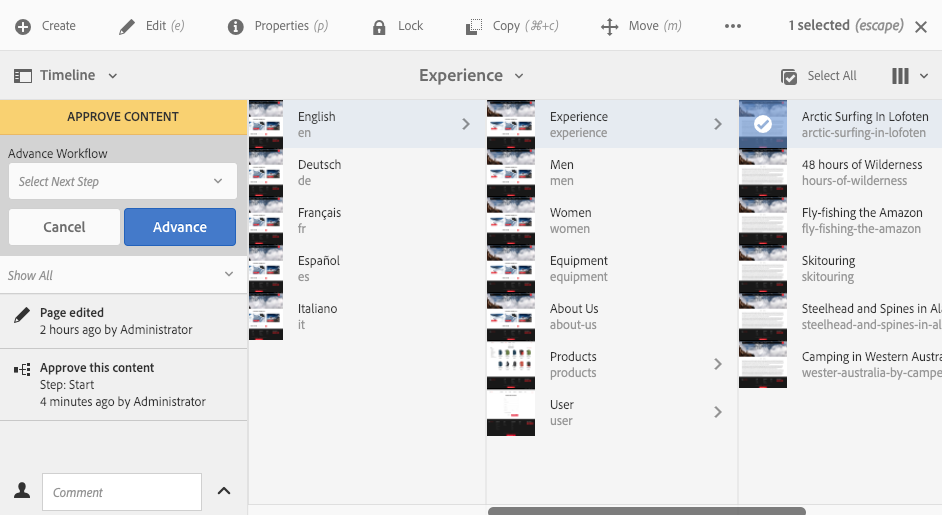
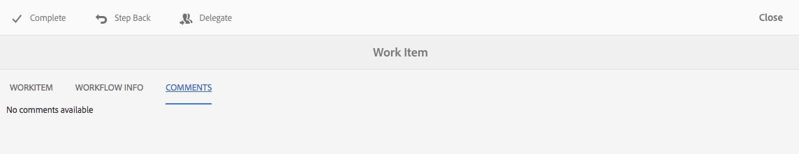

# 參與工作流程{#participating-in-workflows}

工作流程通常包括需要人員在頁面或資產上執行活動的步驟。 工作流程會選取執行活動的使用者或群組，並將工作專案指派給該人員或群組。 使用者會收到通知，然後可以採取適當的動作：

* [檢視通知](#notifications-of-available-workflow-actions)
* [完成參與者步驟](#completing-a-participant-step)
* [委派參與者步驟](#delegating-a-participant-step)
* [對參與者步驟執行後退](#performing-step-back-on-a-participant-step)
* [開啟工作流程專案以檢視詳細資訊（並執行動作）](#opening-a-workflow-item-to-view-details-and-take-actions)
* [檢視工作流程裝載（多個資源）](#viewing-the-workflow-payload-multiple-resources)

## 可用工作流程動作的通知 {#notifications-of-available-workflow-actions}

當您被指派工作項目時(例如「核准內 **容**」)，會出現各種警報和/或通知：

* 您的 [通知](/help/sites-authoring/inbox.md) 指示器（工具列）將會增加：

  

* 此專案將列在您的通知中 [收件匣](/help/sites-authoring/inbox.md)：

  

* 使用頁面編輯器時，狀態列將會顯示：

   * 套用至頁面的工作流程名稱，例如「請求啟用」。
   * 目前使用者在工作流程目前步驟中可用的任何動作；例如，完成、委派、檢視詳細資訊。
   * 頁面須遵守的工作流程數量。 您可以：

      * 使用左/右箭頭，導覽各種工作流程的狀態資訊。
      * 按一下實際數字，以開啟所有適用工作流程的下拉式清單，然後選取您要在狀態列中顯示的工作流程。

  

  >[!NOTE]
  >
  >只有具有工作流程許可權的使用者才能看到狀態列；例如， `workflow-users` 群組。
  >
  >
  >當目前使用者直接參與工作流程的目前步驟時，會顯示動作。

* 時間 **時間表** 會針對資源開啟，且會顯示工作流程步驟。 當您按一下警示橫幅時，畫面也會顯示可用的動作：

  

### 完成參與者步驟 {#completing-a-participant-step}

您可以完成專案以允許工作流程進行到下一個步驟。

在此動作中，您可以指出：

* **下一步**：下一個要採取的步驟；您可以從提供的清單中選取
* **註解**：如有必要

您可以透過下列任一方式完成參與者步驟：

* [收件匣](#completing-a-participant-step-inbox)
* [頁面編輯器](#completing-a-participant-step-page-editor)
* [時間軸](#completing-a-participant-step-timeline)
* 當 [開啟工作流程專案以檢視詳細資料](#opening-a-workflow-item-to-view-details-and-take-actions).

#### 完成參與者步驟 — 收件匣 {#completing-a-participant-step-inbox}

請使用下列步驟完成工作專案：

1. 開啟 **[AEM收件匣](/help/sites-authoring/inbox.md)**.
1. 選取您要對其執行動作的工作流程專案（按一下縮圖）。
1. 選取 **完成** 工具列中的。
1. 此 **完成工作專案** 對話方塊開啟。 選取 **下一步** 從下拉式選擇器新增 **註解** 如有需要。
1. 使用 **確定** 完成步驟(或 **取消** 以中止動作)。

#### 完成參與者步驟 — 頁面編輯器 {#completing-a-participant-step-page-editor}

請使用下列步驟完成工作專案：

1. 開啟 [編輯頁面](/help/sites-authoring/managing-pages.md#opening-a-page-for-editing).
1. 選取 **完成** 從頂部的狀態列開啟。
1. 此 **完成工作專案** 對話方塊開啟。 選取 **下一步** 從下拉式選擇器新增 **註解** 如有需要。
1. 使用 **確定** 完成步驟(或 **取消** 以中止動作)。

#### 完成參與者步驟 — 時間表 {#completing-a-participant-step-timeline}

您也可以使用時間表來完成並推進步驟：

1. 選取所需頁面並開啟 **時間表** (或開啟 **時間表** 並選取頁面)：

   

1. 按一下警報橫幅以顯示可用動作。 選取 **前進**：

   

1. 根據工作流程，您可以選取下一個步驟：

   

1. 選取 **前進** 以確認動作。

### 委派參與者步驟 {#delegating-a-participant-step}

如果已將步驟指派給您，但由於任何原因您無法採取動作，則可以將步驟委派給其他使用者或群組。

可委派的使用者取決於工作專案的指派者：

* 如果工作專案已指派給群組，則群組成員可供使用。
* 如果工作專案已指派給群組，然後又委派給使用者，則群組成員和群組可供使用。
* 如果工作專案已指派給單一使用者，則無法委派工作專案。

在此動作中，您可以指出：

* **使用者**：您要委派給的使用者；您可以從提供的清單中選取
* **註解**：如有必要

您可從下列任一項委派參與者步驟：

* [收件匣](#delegating-a-participant-step-inbox)
* [頁面編輯器](#delegating-a-participant-step-page-editor)
* [時間軸](#delegating-a-participant-step-timeline)
* 當 [開啟工作流程專案以檢視詳細資料](#opening-a-workflow-item-to-view-details-and-take-actions).

#### 委派參與者步驟 — 收件匣 {#delegating-a-participant-step-inbox}

請使用下列步驟委派工作專案：

1. 開啟 **[AEM收件匣](/help/sites-authoring/inbox.md)**.
1. 選取您要對其執行動作的工作流程專案（按一下縮圖）。
1. 選取 **委派** 工具列中的。
1. 對話方塊開啟。 指定 **使用者** 從下拉式選取器（也可以是群組）中新增 **註解** 如有需要。
1. 使用 **確定** 完成步驟(或 **取消** 以中止動作)。

#### 委派參與者步驟 — 頁面編輯器 {#delegating-a-participant-step-page-editor}

請使用下列步驟委派工作專案：

1. 開啟 [編輯頁面](/help/sites-authoring/managing-pages.md#opening-a-page-for-editing).
1. 選取 **委派** 從頂部的狀態列開啟。
1. 對話方塊開啟。 指定 **使用者** 從下拉式選取器（也可以是群組）中新增 **註解** 如有需要。
1. 使用 **確定** 完成步驟(或 **取消** 以中止動作)。

#### 委派參與者步驟 — 時間表 {#delegating-a-participant-step-timeline}

您也可以使用時間表來委派及/或指派步驟：

1. 選取所需頁面並開啟 **時間表** (或開啟 **時間表** 並選取頁面)。
1. 按一下警報橫幅以顯示可用動作。 選取 **變更被指定者**：

   

1. 指定新的被指定者：

   

1. 選取 **指派** 以確認動作。

### 對參與者步驟執行後退 {#performing-step-back-on-a-participant-step}

如果您發現某個步驟或一系列步驟需要重複，您可以後退。 這可讓您選取工作流程中先前發生的步驟，以便重新處理。 工作流程會回到您指定的步驟，然後從那裡繼續。

在此動作中，您可以指出：

* **上一步**：要傳回到的步驟；您可以從提供的清單中選取
* **註解**：如有必要

您可以透過下列其中一種方式，對參與者步驟執行後退：

* [收件匣](#performing-step-back-on-a-participant-step-inbox)
* [頁面編輯器](#performing-step-back-on-a-participant-step-page-editor)
* [時間軸](#performing-step-back-on-a-participant-step-timeline)
* 當 [開啟工作流程專案以檢視詳細資料](#opening-a-workflow-item-to-view-details-and-take-actions).

#### 對參與者步驟執行後退 — 收件匣 {#performing-step-back-on-a-participant-step-inbox}

請使用下列步驟來後退：

1. 開啟 **[AEM收件匣](/help/sites-authoring/inbox.md)**.
1. 選取您要對其執行動作的工作流程專案（按一下縮圖）。
1. 選取 **後退** 以開啟對話方塊。

1. 指定 **上一步** 並新增 **註解** 如有需要。
1. 使用 **確定** 完成步驟(或 **取消** 以中止動作)。

#### 對參與者步驟執行後退 — 頁面編輯器 {#performing-step-back-on-a-participant-step-page-editor}

請使用下列步驟來後退：

1. 開啟 [編輯頁面](/help/sites-authoring/managing-pages.md#opening-a-page-for-editing).
1. 選取 **後退** 從頂部的狀態列開啟。
1. 指定 **上一步** 並新增 **註解** 如有需要。
1. 使用 **確定** 完成步驟(或 **取消** 以中止動作)。

#### 對參與者步驟執行後退 — 時間表 {#performing-step-back-on-a-participant-step-timeline}

您也可以使用時間軸來回滾（回退）至上一步：

1. 選取所需頁面並開啟 **時間表** (或開啟 **時間表** 並選取頁面)。
1. 按一下警報橫幅以顯示可用動作。 選取 **回覆**：

   

1. 指定工作流程應傳回到的步驟：

   

1. 選取 **回覆** 以確認動作。

### 開啟工作流程專案以檢視詳細資訊（並執行動作） {#opening-a-workflow-item-to-view-details-and-take-actions}

檢視工作流程工作專案的詳細資訊，並採取適當的動作。

工作流程詳細資訊會顯示在標籤中，而工具列中有適當的動作：

* **工作專案** 標籤：

  

* **工作流程資訊** 標籤：

  

  如果 [工作流程階段](/help/sites-developing/workflows.md#workflow-stages) 已針對模型配置，您可以根據以下內容檢視進度：

  

* **評論** 標籤：

  

您可以透過以下其中一種方式來開啟工作專案詳細資料：

* [收件匣](#performing-step-back-on-a-participant-step-inbox)
* [頁面編輯器](#performing-step-back-on-a-participant-step-page-editor)

#### 開啟工作流程詳細資料 — 收件匣 {#opening-workflow-details-inbox}

若要開啟工作流程專案並檢視詳細資訊，請執行下列動作：

1. 開啟 **[AEM收件匣](/help/sites-authoring/inbox.md)**.
1. 選取您要對其執行動作的工作流程專案（按一下縮圖）。
1. 選取 **開啟** 以開啟資訊標籤。

1. 如有必要，請選取適當的動作，提供任何詳細資訊，然後確認 **確定** (或 **取消**)。
1. 使用 **儲存** 或 **取消** 以結束。

#### 開啟工作流程詳細資料 — 頁面編輯器 {#opening-workflow-details-page-editor}

若要開啟工作流程專案並檢視詳細資訊，請執行下列動作：

1. 開啟 [編輯頁面](/help/sites-authoring/managing-pages.md#opening-a-page-for-editing).
1. 選取 **檢視詳細資料** 以開啟資訊標籤。

1. 如有必要，請選取適當的動作，提供任何詳細資訊，然後確認 **確定** (或 **取消**)。
1. 使用 **儲存** 或 **取消** 以結束。

### 檢視工作流程裝載（多個資源） {#viewing-the-workflow-payload-multiple-resources}

您可以檢視與工作流程例項相關聯的裝載詳細資料。 一開始會顯示封裝中的資源，然後您可以向下展開以顯示個別頁面。

若要檢視工作流程例項的裝載和資源：

1. 開啟 **[AEM收件匣](/help/sites-authoring/inbox.md)**.
1. 選取您要對其執行動作的工作流程專案（按一下縮圖）。
1. 選取 **檢視裝載** 以開啟對話方塊。

   由於Workflow封裝只是存放庫內路徑的指標集合，因此您可以在此處新增/移除/修改專案，以調整Workflow封裝所參照的專案。 使用 **資源定義** 元件以新增專案。

   

1. 這些連結可用來開啟個別頁面。
