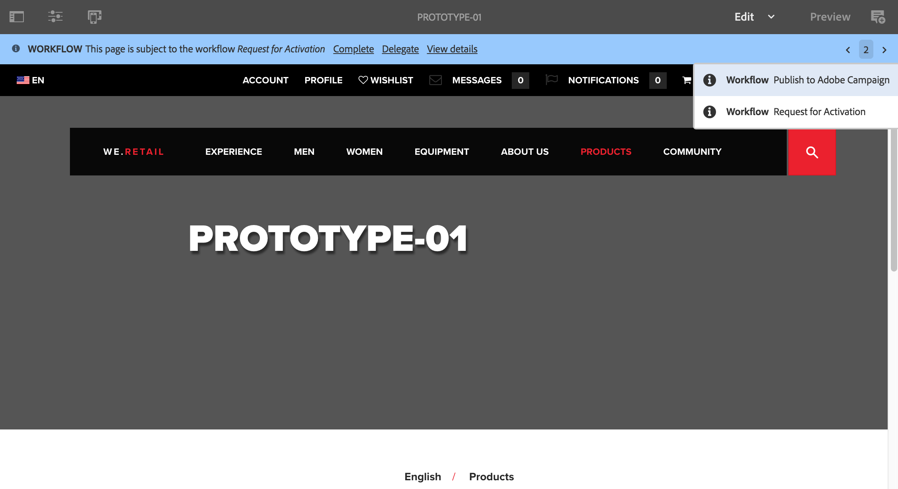
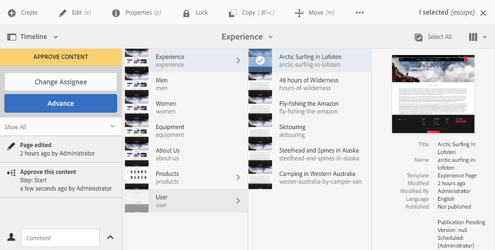

# 參與工作流程{#participating-in-workflows}

工作流程通常包括要求人員在頁面或資產上執行活動的步驟。 工作流選擇要執行活動的用戶或組，並將工作項指派給該人員或組。 使用者會收到通知，然後可以採取適當的動作：

* [檢視通知](#notifications-of-available-workflow-actions)
* [完成參與者步驟](#completing-a-participant-step)
* [委派參與者步驟](#delegating-a-participant-step)
* [在參與者步驟上執行退步](#performing-step-back-on-a-participant-step)
* [開啟工作流項以查看詳細資訊（並執行操作）](#opening-a-workflow-item-to-view-details-and-take-actions)
* [檢視工作流程裝載（多個資源）](#viewing-the-workflow-payload-multiple-resources)

## 可用工作流操作的通知 {#notifications-of-available-workflow-actions}

當您被指派工作項目時(例如「核准內 **容**」)，會出現各種警報和/或通知：

* 您的 [通知](/help/sites-authoring/inbox.md) 指示器（工具欄）將增加：

   

* 項目會列在您的通知中 [收件匣](/help/sites-authoring/inbox.md):

   

* 使用頁面編輯器時，狀態列會顯示：

   * 要套用至頁面的工作流程名稱；例如Request for Activation。
   * 工作流當前步驟的當前用戶可用的任何操作；例如，完成、委派、檢視詳細資訊。
   * 頁面要遵循的工作流程數。 您可以：

      * 使用向左/向右箭頭瀏覽各種工作流程的狀態資訊。
      * 按一下/點選實際數字，開啟所有適用工作流程的下拉式清單，然後選取您要顯示在狀態列中的工作流程。

   

   >[!NOTE]
   >
   >狀態欄僅對具有工作流權限的用戶可見；例如， `workflow-users` 群組。
   >
   >
   >當目前使用者直接參與工作流程的目前步驟時，就會顯示動作。

* 當 **時間表** 為資源開啟，則會顯示工作流程步驟。 當您按一下/點選警報橫幅時，也會顯示可用的動作：

   

### 完成參與者步驟 {#completing-a-participant-step}

您可以完成項目，讓工作流程繼續進行下一個步驟。

在此動作上，您可以指出：

* **下一步**:下一步要採取；您可以從提供的清單中選取
* **註解**:必要

您可以從以下任一步驟完成參與者步驟：

* [收件匣](#completing-a-participant-step-inbox)
* [頁面編輯器](#completing-a-participant-step-page-editor)
* [時間軸](#completing-a-participant-step-timeline)
* when [開啟工作流項以查看詳細資訊](#opening-a-workflow-item-to-view-details-and-take-actions).

#### 完成參與者步驟 — 收件箱 {#completing-a-participant-step-inbox}

使用以下過程完成工作項：

1. 開啟 **[AEM收件匣](/help/sites-authoring/inbox.md)**.
1. 選取您要對其採取動作的工作流程項目（點選/按一下縮圖）。
1. 選擇 **完成** 的上界。
1. 此 **完成工作項** 對話框將開啟。 選取 **下一步** 從下拉式選取器新增 **註解** （如果需要）。
1. 使用 **確定** 完成步驟(或 **取消** 中止動作)。

#### 完成參與者步驟 — 頁面編輯器 {#completing-a-participant-step-page-editor}

使用以下過程完成工作項：

1. 開啟 [編輯頁面](/help/sites-authoring/managing-pages.md#opening-a-page-for-editing).
1. 選擇 **完成** 從頂端的狀態列。
1. 此 **完成工作項** 對話框將開啟。 選取 **下一步** 從下拉式選取器新增 **註解** （如果需要）。
1. 使用 **確定** 完成步驟(或 **取消** 中止動作)。

#### 完成參與者步驟 — 時間表 {#completing-a-participant-step-timeline}

您也可以使用時間軸來完成和推進步驟：

1. 選取所需頁面並開啟 **時間表** (或開啟 **時間表** 並選取頁面):

   

1. 按一下/點選警報橫幅以顯示可用動作。 選擇 **進階**:

   

1. 您可以根據工作流程選取下一個步驟：

   

1. 選擇 **進階** 以確認動作。

### 委派參與者步驟 {#delegating-a-participant-step}

如果已指派步驟給您，但由於任何原因您無法採取動作，您可以將步驟委派給其他使用者或群組。

可用於委派的用戶取決於為誰分配了工作項：

* 如果工作項已分配給組，則組成員可用。
* 如果工作項目被指派給某個組，然後被委派給某個用戶，則可使用組成員和組。
* 如果工作項已分配給單個用戶，則無法委派工作項。

在此動作上，您可以指出：

* **使用者**:要委派給的用戶；您可以從提供的清單中選取
* **註解**:必要

您可以從以下任一位置委派參與者步驟：

* [收件匣](#delegating-a-participant-step-inbox)
* [頁面編輯器](#delegating-a-participant-step-page-editor)
* [時間軸](#delegating-a-participant-step-timeline)
* when [開啟工作流項以查看詳細資訊](#opening-a-workflow-item-to-view-details-and-take-actions).

#### 委派參與者步驟 — 收件匣 {#delegating-a-participant-step-inbox}

使用以下過程來委派工作項：

1. 開啟 **[AEM收件匣](/help/sites-authoring/inbox.md)**.
1. 選取您要對其採取動作的工作流程項目（點選/按一下縮圖）。
1. 選擇 **委派** 的上界。
1. 對話方塊將會開啟。 指定 **使用者** 從下拉式選取器（這也可以是群組）中新增 **註解** （如果需要）。
1. 使用 **確定** 完成步驟(或 **取消** 中止動作)。

#### 委派參與者步驟 — 頁面編輯器 {#delegating-a-participant-step-page-editor}

使用以下過程來委派工作項：

1. 開啟 [編輯頁面](/help/sites-authoring/managing-pages.md#opening-a-page-for-editing).
1. 選擇 **委派** 從頂端的狀態列。
1. 對話方塊將會開啟。 指定 **使用者** 從下拉式選取器（這也可以是群組）中新增 **註解** （如果需要）。
1. 使用 **確定** 完成步驟(或 **取消** 中止動作)。

#### 委派參與者步驟 — 時間表 {#delegating-a-participant-step-timeline}

您也可以使用時間軸來委派和/或指派步驟：

1. 選取所需頁面並開啟 **時間表** (或開啟 **時間表** 並選取頁面)。
1. 按一下/點選警報橫幅以顯示可用動作。 選擇 **變更受託人**:

   

1. 指定新的受託人：

   

1. 選擇 **指派** 以確認動作。

### 在參與者步驟上執行退步 {#performing-step-back-on-a-participant-step}

如果您發現需要重複某個步驟或一系列步驟，您可以退後一步。 這可讓您選取先前在工作流程中發生的步驟，以進行重新處理。 工作流程會回到您指定的步驟，然後從那裡繼續。

在此動作上，您可以指出：

* **上一步**:要返回的步驟；您可以從提供的清單中選取
* **註解**:必要

您可以從以下任一步驟中對參與者步驟執行後退：

* [收件匣](#performing-step-back-on-a-participant-step-inbox)
* [頁面編輯器](#performing-step-back-on-a-participant-step-page-editor)
* [時間軸](#performing-step-back-on-a-participant-step-timeline)
* when [開啟工作流項以查看詳細資訊](#opening-a-workflow-item-to-view-details-and-take-actions).

#### 在參與者步驟上執行步驟 — 收件箱 {#performing-step-back-on-a-participant-step-inbox}

請依照下列程式進行退步：

1. 開啟 **[AEM收件匣](/help/sites-authoring/inbox.md)**.
1. 選取您要對其採取動作的工作流程項目（點選/按一下縮圖）。
1. 選擇 **後退** 來開啟對話框。

1. 指定 **上一步** 並新增 **註解** （如果需要）。
1. 使用 **確定** 完成步驟(或 **取消** 中止動作)。

#### 在參與者步驟 — 頁面編輯器上執行步驟 {#performing-step-back-on-a-participant-step-page-editor}

請依照下列程式進行退步：

1. 開啟 [編輯頁面](/help/sites-authoring/managing-pages.md#opening-a-page-for-editing).
1. 選擇 **後退** 從頂端的狀態列。
1. 指定 **上一步** 並新增 **註解** （如果需要）。
1. 使用 **確定** 完成步驟(或 **取消** 中止動作)。

#### 在參與者步驟上執行步驟 — 時間表 {#performing-step-back-on-a-participant-step-timeline}

您也可以使用時間軸來回復到上一個步驟：

1. 選取所需頁面並開啟 **時間表** (或開啟 **時間表** 並選取頁面)。
1. 按一下/點選警報橫幅以顯示可用動作。 選擇 **回滾**:

   

1. 指定工作流程應返回的步驟：

   

1. 選擇 **回滾** 以確認動作。

### 開啟工作流項以查看詳細資訊（並採取操作） {#opening-a-workflow-item-to-view-details-and-take-actions}

查看工作流工作項的詳細資訊並採取相應操作。

工作流程詳細資訊會顯示在標籤中，而工具列中會提供適當的動作：

* **工作項目** 標籤：

   

* **工作流程資訊** 標籤：

   

   若 [工作流程階段](/help/sites-developing/workflows.md#workflow-stages) 已為模型配置，您可以根據以下內容查看進度：

   

* **註解** 標籤：

   

您可以從以下任一位置開啟工作項詳細資訊：

* [收件匣](#performing-step-back-on-a-participant-step-inbox)
* [頁面編輯器](#performing-step-back-on-a-participant-step-page-editor)

#### 開啟工作流詳細資訊 — 收件箱 {#opening-workflow-details-inbox}

要開啟工作流項並查看詳細資訊，請執行以下操作：

1. 開啟 **[AEM收件匣](/help/sites-authoring/inbox.md)**.
1. 選取您要對其採取動作的工作流程項目（點選/按一下縮圖）。
1. 選擇 **開啟** 來開啟資訊標籤。

1. 如果需要，請選擇相應的操作，提供任何詳細資訊並使用確認 **確定** (或 **取消**)。
1. 使用 **儲存** 或 **取消** 退出。

#### 開啟工作流程詳細資訊 — 頁面編輯器 {#opening-workflow-details-page-editor}

要開啟工作流項並查看詳細資訊，請執行以下操作：

1. 開啟 [編輯頁面](/help/sites-authoring/managing-pages.md#opening-a-page-for-editing).
1. 選擇 **檢視詳細資料** 從狀態欄開啟資訊標籤。

1. 如果需要，請選擇相應的操作，提供任何詳細資訊並使用確認 **確定** (或 **取消**)。
1. 使用 **儲存** 或 **取消** 退出。

### 檢視工作流程裝載（多個資源） {#viewing-the-workflow-payload-multiple-resources}

您可以檢視與工作流程例項相關聯的裝載的詳細資訊。 一開始會顯示套件中的資源，然後您可以向下切入以顯示個別頁面。

若要檢視工作流程例項的裝載和資源：

1. 開啟 **[AEM收件匣](/help/sites-authoring/inbox.md)**.
1. 選取您要對其採取動作的工作流程項目（點選/按一下縮圖）。
1. 選擇 **檢視裝載** ，開啟對話方塊。

   由於工作流包只是指向儲存庫內路徑的指針的集合，因此您可以在此處添加/刪除/修改條目，以調整工作流包引用的內容。 使用 **資源定義** 元件以新增項目。

   

1. 連結可用來開啟個別頁面。
