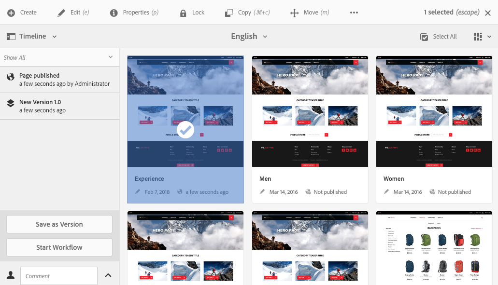
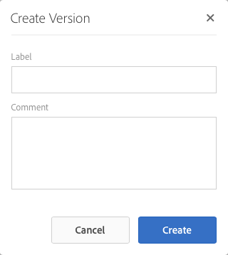

# 使用頁面版本{#working-with-page-versions}

版本設定功能會在特定時間點建立頁面的「快照」。 使用版本設定，您可以執行下列動作：

* 建立頁面的版本。
* 將頁面還原成先前的版本；例如：
   * 還原您對頁面所做的變更。
* 將頁面的目前版本與先前版本進行比較：
   * 以醒目提示文字和影像中的差異。

>[!NOTE]
>
>AEM存放庫中只會建立內容的版本。 程式碼、CSS和JavaScript等動態資源不會進行版本設定。
>
>* 檢視版本時，內容會與存放庫的最新程式碼、CSS和JavaScript一併檢視。
>* 還原版本時，只會還原內容，並套用存放庫的最新程式碼、CSS和JavaScript。

## 建立新版本 {#creating-a-new-version}

您可以透過以下方式建立資源的版本：

* [時間表邊欄](#creating-a-new-version-timeline)
* [建立](#creating-a-new-version-create-with-a-selected-resource)選項（當選取資源時）

### 建立新版本 — 時間表 {#creating-a-new-version-timeline}

1. 瀏覽以顯示您要建立版本的頁面。
1. 在[選取模式](/help/sites-authoring/basic-handling.md#viewing-and-selecting-resources)中選取頁面。
1. 開啟&#x200B;**時間表**&#x200B;欄。
1. 按一下註解欄位旁的箭頭以顯示選項：

   

1. 選取&#x200B;**另存為版本**。
1. 如有必要，請輸入&#x200B;**標籤**&#x200B;和&#x200B;**註解**。

   

1. 使用&#x200B;**建立**&#x200B;確認新版本。

   時間軸中的資訊會更新以指示新版本。

### 建立新版本 — 使用選取的資源建立 {#creating-a-new-version-create-with-a-selected-resource}

1. 瀏覽以顯示您要建立版本的頁面。
1. 在[選取模式](/help/sites-authoring/basic-handling.md#viewing-and-selecting-resources)中選取頁面。
1. 從工具列選取&#x200B;**建立**&#x200B;選項以開啟對話方塊。
1. 您可以視需要在此對話方塊中輸入&#x200B;**標籤**&#x200B;和&#x200B;**註解**：

   

1. 使用&#x200B;**建立**&#x200B;確認新版本。

   會開啟時間軸，並更新資訊以指示新版本。

## 恢復版本 {#reinstating-versions}

建立頁面的版本後，有多種恢復先前版本的方法：

* **從[時間表](/help/sites-authoring/basic-handling.md#timeline)邊欄還原為此版本**&#x200B;選項

  復原所選頁面的先前版本。

* 從頂端[動作工具列](/help/sites-authoring/basic-handling.md#actions-toolbar)的&#x200B;**還原**&#x200B;選項

   * **還原版本**

     在目前選取的資料夾中復原指定頁面的版本；這也可以包括復原先前已刪除的頁面。

   * **還原樹狀結構**

     將整個樹狀結構恢復到指定的日期和時間的版本；這可以包括先前已刪除的頁面。

>[!NOTE]
>
>恢復頁面時，建立的版本將成為新分支的一部分。
>
>說明：
>
>1. 建立任何頁面的版本。
>1. 初始標籤和版本節點名稱將為1.0、1.1、1.2，以此類推。
>1. 恢復第一個版本；在此例中為1.0。
>1. 再次建立版本。
>1. 產生的標籤和節點名稱現在將為1.0.0、1.0.1、1.0.2，以此類推。

### 還原為版本 {#revert-to-a-version}

若要&#x200B;**將**&#x200B;選取的頁面還原成先前的版本：

1. 瀏覽以顯示您要回覆至先前版本的頁面。
1. 在[選取模式](/help/sites-authoring/basic-handling.md#viewing-and-selecting-resources)中選取頁面。
1. 開啟「時 **間軸** 」欄，然後選 **取「全部顯示** 」 **或「版本**」。會列出所選頁面的頁面版本。
1. 選取您想要還原到的版本。 可能的選項如下所示：

   

1. 選取&#x200B;**還原為此版本**。 選取的版本會還原，且時間軸中的資訊會更新。

### 還原版本 {#restore-version}

此方法可用來還原目前資料夾內指定頁面的版本；這也可以包括還原先前已刪除的頁面：

1. 導覽至[選取](/help/sites-authoring/basic-handling.md#viewing-and-selecting-resources)必要的資料夾。

1. 從頂端[動作工具列](/help/sites-authoring/basic-handling.md#actions-toolbar)選取&#x200B;**還原**，然後選取&#x200B;**還原版本**。

   >[!NOTE]
   >
   >如果符合下列任一條件：
   >
   >* 您已選取從未有任何子頁面的單一頁面，
   >* 或資料夾中的所有頁面都沒有版本，
   >
   >則顯示會是空的，因為沒有適用的版本。

1. 列出可用的版本：

   中所有頁面的清單

1. 針對特定頁面，請使用&#x200B;**還原至版本**&#x200B;下的下拉式選取器，選取該頁面的必要版本。

   

1. 在主顯示中，選取要還原的頁面：

   

1. 針對要還原為目前版本的所選頁面，選取&#x200B;**還原**。

>[!NOTE]
>
>您選取必要頁面和相關版本的順序可以互換。

### 還原樹狀結構 {#restore-tree}

此方法可用來還原指定日期和時間的樹狀結構版本；這可以包括先前已刪除的頁面：

1. 導覽至[選取](/help/sites-authoring/basic-handling.md#viewing-and-selecting-resources)必要的資料夾。

1. 選取&#x200B;**還原**，然後從頂端[動作工具列](/help/sites-authoring/basic-handling.md#actions-toolbar)選取&#x200B;**還原樹狀結構**。 隨即顯示樹狀結構的最新版本：

   

1. 使用&#x200B;**日期**&#x200B;最新版本的日期和時間選擇器來選取樹狀結構的其他版本 — 要還原的版本。

1. 視需要設定旗標&#x200B;**保留的非版本化頁面**：

   * 如果啟用（已選取），則會維護任何非版本化頁面，且不受還原影響。

   * 如果處於非使用中（未選取），則會移除任何非版本化頁面，因為這些頁面在版本化樹狀結構中不存在。

1. 針對要還原為&#x200B;*目前*&#x200B;版本的樹狀結構選取版本&#x200B;**還原**。

## 預覽版本 {#previewing-a-version}

您可以預覽特定版本：

1. 導覽以顯示您要比較的頁面。
1. 在[選取模式](/help/sites-authoring/basic-handling.md#viewing-and-selecting-resources)中選取頁面。
1. 開啟「時 **間軸** 」欄，然後選 **取「全部顯示** 」 **或「版本**」。
1. 列出頁面版本。 選取您要預覽的版本：

   

1. 選取&#x200B;**預覽**。 頁面會顯示在新的標籤中。

   >[!CAUTION]
   >
   >如果頁面已移動，您將無法再對移動前所做的任何版本執行預覽。
   >
   >* 如果您遇到問題，請檢查頁面的[時間表](/help/sites-authoring/basic-handling.md#timeline)，以檢視頁面是否已移動。

## 比較目前頁面與版本 {#comparing-a-version-with-current-page}

若要比較上一個版本與目前頁面：

1. 導覽以顯示您要比較的頁面。
1. 在[選取模式](/help/sites-authoring/basic-handling.md#viewing-and-selecting-resources)中選取頁面。
1. 開啟「時 **間軸** 」欄，然後選 **取「全部顯示** 」 **或「版本**」。
1. 列出頁面版本。 選取要比較的版本：

   

1. 選取&#x200B;**與目前**&#x200B;比較。 [頁面diff](/help/sites-authoring/page-diff.md)開啟以顯示差異。

## Timewarp {#timewarp}

時間扭曲是一項功能，用來模擬過去特定時間某個頁面的&#x200B;*已發佈*&#x200B;狀態。

>[!TIP]
>
>執行AEM 6.5.10.0或更新版本時，[Timewarp也可以與Launches搭配使用以預覽未來](/help/sites-authoring/launches.md)。

內容建立是一個持續進行的合作過程。 Timewarp的用途是讓作者追蹤已發佈網站在一段時間內的變化，協助他們瞭解內容的變更情況。 此功能使用頁面版本來判斷發佈環境的狀態：

* 系統會尋找在選取的時間使用中的頁面版本。
   * 此頁面版本是在&#x200B;*時間扭曲中選取的時間點*&#x200B;之前建立/啟動。
* 當導覽至已刪除的頁面時，也會呈現頁面 — 只要該頁面的舊版本仍然可在存放庫中使用。
* 如果找不到發佈的版本，則Timewarp會回覆成作者環境中頁面的目前狀態（以防止發生錯誤/404頁面，此錯誤會導致無法瀏覽）。

### 使用時間扭曲 {#using-timewarp}

時間扭曲是頁面編輯器的[模式](/help/sites-authoring/author-environment-tools.md#page-modes)。 若要啟動，只需像切換任何其他模式一樣切換即可。

1. 啟動您要啟動Timewarp之頁面的編輯器，然後在模式選取項中選取&#x200B;**Timewarp**。

   

1. 在對話方塊中，設定目標日期和時間，然後按一下&#x200B;**設定日期**。 如果您未選取時間，則會將目前時間設為預設值。

   

1. 根據日期集顯示頁面。 時間扭曲模式會透過視窗頂端的藍色狀態列指示。 使用狀態列中的連結來選取新的目標日期或退出Timewarp模式。

   

### 時間扭曲限制 {#timewarp-limitations}

Timewarp會盡力在選取的時間點重製頁面。 不過，由於AEM中持續編寫內容的過程非常複雜，並非總是可以做到這一點。 使用Timewarp時，請牢記以下限制。

* **時間扭曲是根據已發佈的頁面來運作** — 僅當您之前已發佈頁面時，時間扭曲才會完全運作。 如果沒有，時間扭曲會在作者環境中顯示目前頁面。
* **時間扭曲使用頁面版本** — 如果您瀏覽到的頁面已從存放庫移除/刪除，如果該頁面的舊版本仍然位於存放庫中，則該頁面會正確呈現。
* **移除的版本會影響時間扭曲** — 如果從存放庫移除版本，那麼時間扭曲無法顯示正確的檢視。

* **時間扭曲為唯讀** — 您無法編輯頁面的舊版本。 它僅供檢視。 若要還原較舊的版本，您必須使用[還原](#reverting-to-a-page-version)手動還原。

* **時間扭曲僅以頁面內容為基礎** — 如果轉譯網站的元素已變更，則檢視會與原本不同，因為這些專案不在存放庫中建立版本。 這些元素包括程式碼、css、資產/影像等。

>[!CAUTION]
>
>時間扭曲是一種工具，可協助作者瞭解及建立其內容。 其目的並非作為稽核記錄或用於法律目的。
