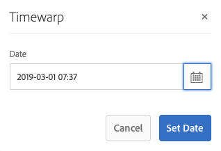

# 使用頁面版本{#working-with-page-versions}

版本設定功能會在特定時間點建立頁面的「快照」。 使用版本設定，您可以執行下列動作：

* 建立頁面的版本。
* 將頁面還原成先前的版本；例如：
   * 還原您對頁面所做的變更。
* 將頁面的目前版本與先前版本進行比較：
   * 以反白文字和影像中的差異。

## 建立新版本 {#creating-a-new-version}

您可以從下列位置建立資源的版本：

* 此 [時間軸邊欄](#creating-a-new-version-timeline)
* 此 [建立](#creating-a-new-version-create-with-a-selected-resource) 選項（當選取資源時）

### 建立新版本 — 時間表 {#creating-a-new-version-timeline}

1. 導覽以顯示您要建立版本的頁面。
1. 選取中的頁面 [選擇模式](/help/sites-authoring/basic-handling.md#viewing-and-selecting-resources).
1. 開啟 **時間表** 欄。
1. 按一下/點選評論欄位旁的箭頭，以顯示選項：

   

1. 選取 **另存為版本**.
1. 輸入 **標籤** 和 **註解** 如有需要。

   

1. 透過確認新版本 **建立**.

   時間軸中的資訊會更新以指示新版本。

### 建立新版本 — 使用選取的資源建立 {#creating-a-new-version-create-with-a-selected-resource}

1. 導覽以顯示您要建立版本的頁面。
1. 選取中的頁面 [選擇模式](/help/sites-authoring/basic-handling.md#viewing-and-selecting-resources).
1. 選取 **建立** 工具列中的選項以開啟對話方塊。
1. 在對話方塊中，您可以輸入 **標籤** 和 **註解**，如有需要：

   

1. 透過確認新版本 **建立**.

   時間軸會開啟，資訊會更新以指示新版本。

## 恢復版本 {#reinstating-versions}

建立頁面的版本後，有多種恢復先前版本的方法：

* 此 **還原為此版本** 選項來自 [時間表](/help/sites-authoring/basic-handling.md#timeline) 邊欄

  復原所選頁面的先前版本。

* 此 **還原** 自上方的選項 [動作工具列](/help/sites-authoring/basic-handling.md#actions-toolbar)

   * **還原版本**

     在目前選取的資料夾中復原指定頁面的版本；這也可以包括復原先前已刪除的頁面。

   * **還原樹狀結構**

     將整個樹狀結構恢復到指定的日期和時間的版本；這可以包括先前已刪除的頁面。

>[!NOTE]
>
>恢復頁面時，建立的版本將成為新分支的一部分。
>
>舉例說明：
>
>1. 建立任何頁面的版本。
>1. 初始標籤和版本節點名稱將為1.0、1.1、1.2，依此類推。
>1. 恢復第一個版本；在此例中為1.0。
>1. 再次建立版本。
>1. 產生的標籤和節點名稱現在將為1.0.0、1.0.1、1.0.2，以此類推。

### 還原為版本 {#revert-to-a-version}

至 **回覆** 選取的頁面變更為舊版：

1. 導覽以顯示您要回覆至先前版本的頁面。
1. 選取中的頁面 [選擇模式](/help/sites-authoring/basic-handling.md#viewing-and-selecting-resources).
1. 開啟「時 **間軸** 」欄，然後選 **取「全部顯示** 」 **或「版本**」。系統會列出所選頁面的頁面版本。
1. 選取您要還原的版本。 可能的選項如下所示：

   

1. 選取 **還原為此版本**. 選取的版本會還原並更新時間軸中的資訊。

### 還原版本 {#restore-version}

此方法可用來還原目前資料夾中指定頁面的版本；這也可以包括還原先前已刪除的頁面：

1. 導覽至、和 [選取](/help/sites-authoring/basic-handling.md#viewing-and-selecting-resources)，必要的資料夾。

1. 選取 **還原**，則 **還原版本** 從頂端 [動作工具列](/help/sites-authoring/basic-handling.md#actions-toolbar).

   >[!NOTE]
   >
   >如果符合下列任一條件：
   >
   >* 您已選取從未有任何子頁面的單一頁面，
   >* 或資料夾中的任何頁面都沒有版本，
   >
   >則顯示會是空的，因為沒有適用的版本。

1. 列出可用的版本：

   

1. 針對特定頁面，使用「 」下方的下拉式選取器 **還原至版本** 以選取該頁面的所需版本。

   

1. 在主顯示中，選取要還原的必要頁面：

   

1. 選取 **還原** 對於選取的版本，選取的頁面，將還原為目前版本。

>[!NOTE]
>
>您選取必要頁面和相關版本的順序可以互換。

### 還原樹狀結構 {#restore-tree}

此方法可用來還原樹狀結構在指定日期和時間的版本；這可以包括先前已刪除的頁面：

1. 導覽至、和 [選取](/help/sites-authoring/basic-handling.md#viewing-and-selecting-resources)，必要的資料夾。

1. 選取 **還原**，則 **還原樹狀結構** 從頂端 [動作工具列](/help/sites-authoring/basic-handling.md#actions-toolbar). 將顯示樹狀結構的最新版本：

   

1. 使用以下位置的日期和時間選擇器： **當日最新版本** 以選取樹狀結構的其他版本 — 要還原的版本。

1. 設定標幟 **保留的非版本化頁面** 視需要：

   * 如果啟用（選取），則會維護任何非版本化頁面，且不受還原影響。

   * 如果停用（未選取），則會移除任何非版本化頁面，因為這些頁面不存在於版本化樹狀結構中。

1. 選取 **還原** 樹狀結構的選取版本，將還原為 *目前* 版本。

## 預覽版本 {#previewing-a-version}

您可以預覽特定版本：

1. 導覽以顯示您要比較的頁面。
1. 選取中的頁面 [選擇模式](/help/sites-authoring/basic-handling.md#viewing-and-selecting-resources).
1. 開啟「時 **間軸** 」欄，然後選 **取「全部顯示** 」 **或「版本**」。
1. 會列出頁面版本。 選取您要預覽的版本：

   

1. 選取 **預覽**. 頁面會顯示在新的標籤中。

   >[!CAUTION]
   >
   >如果頁面已移動，您將無法再對移動前所做的任何版本執行預覽。
   >
   >* 如果您在預覽時遇到問題，請檢視 [時間表](/help/sites-authoring/basic-handling.md#timeline) ，以檢視頁面是否已移動。

## 比較版本與目前頁面 {#comparing-a-version-with-current-page}

若要比較上一個版本與目前頁面：

1. 導覽以顯示您要比較的頁面。
1. 選取中的頁面 [選擇模式](/help/sites-authoring/basic-handling.md#viewing-and-selecting-resources).
1. 開啟「時 **間軸** 」欄，然後選 **取「全部顯示** 」 **或「版本**」。
1. 會列出頁面版本。 選取您要比較的版本：

   

1. 選取 **與目前比較**. 此 [頁面差異](/help/sites-authoring/page-diff.md) 開啟以顯示差異。

## Timewarp {#timewarp}

時間扭曲是一項功能，旨在模擬 *已發佈* 過去特定時間的頁面狀態。

>[!TIP]
>
>[時間扭曲也可以與啟動項搭配使用，以預覽未來情況](/help/sites-authoring/launches.md) 執行AEM 6.5.10.0或更新版本時。

內容建立是一項持續且協同合作的程式。 Timewarp的用途是讓作者追蹤已發佈網站在一段時間內的變化，協助他們瞭解內容的變更。 此功能使用頁面版本來判斷發佈環境的狀態：

* 系統會尋找在選取的時間處於作用中狀態的頁面版本。
   * 已建立/啟動此頁面版本 *早於* 在時間扭曲中選取的時間點。
* 瀏覽至已刪除的頁面時，也會轉譯該頁面 — 只要該頁面的舊版本仍然位於存放庫中。
* 如果找不到發佈的版本，則時間扭曲會回覆成作者環境中頁面的目前狀態（以防止發生錯誤/404頁面，該頁面會阻止瀏覽）。

### 使用時間扭曲 {#using-timewarp}

時間扭曲是 [模式](/help/sites-authoring/author-environment-tools.md#page-modes) 頁面編輯器的。 若要啟動，只需像切換任何其他模式一樣切換即可。

1. 啟動您要啟動Timewarp的頁面編輯器，然後選取 **時間扭曲** 在模式選取項中。

   

1. 在對話方塊中，設定目標日期和時間，然後按一下或點選 **設定日期**. 如果您未選取時間，則會以目前時間為預設值。

   

1. 根據日期集顯示頁面。 時間扭曲模式會透過視窗頂端的藍色狀態列表示。 使用狀態列中的連結來選取新的目標日期或退出「時間扭曲」模式。

   

### 時間扭曲限制 {#timewarp-limitations}

時間扭曲會儘量在選定的時間點重新產生頁面。 不過，由於AEM中持續編寫內容的過程非常複雜，並非總是可以做到這一點。 當您使用時間扭曲時，請牢記這些限制。

* **時間扭曲根據已發佈的頁面運作**  — 只有在您先前已發佈頁面的情況下，時間扭曲功能才能完全運作。 如果沒有，時間扭曲會在作者環境中顯示目前頁面。
* **時間扭曲使用頁面版本**  — 如果您導覽至已從存放庫移除/刪除的頁面，如果該頁面的舊版本仍然位於存放庫中，則該頁面會正確呈現。
* **已移除的版本會影響時間扭曲**  — 如果從存放庫移除版本，則時間扭曲無法顯示正確的檢視。

* **時間扭曲為唯讀**  — 您無法編輯頁面的舊版本。 它僅供檢視。 如果要還原較舊的版本，您必須使用手動還原 [還原](#reverting-to-a-page-version).

* **時間扭曲僅以頁面內容為基礎**  — 如果呈現網站的元素已變更，則檢視會與原本不同，因為這些專案不在存放庫中建立版本。 這些元素包括程式碼、css、資產/影像等。

>[!CAUTION]
>
>Timewarp是專為協助作者瞭解及建立其內容而設計的工具。 此日誌並非用作稽核記錄檔或作法律用途。
