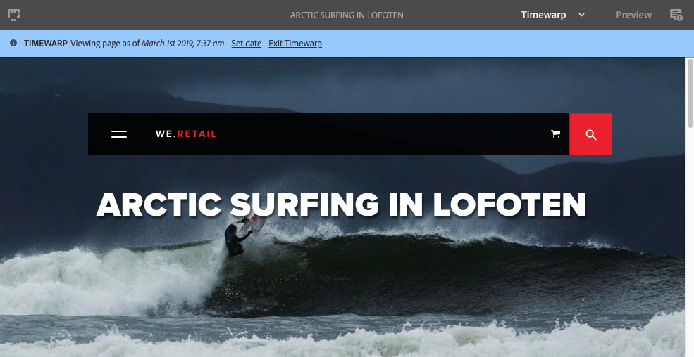

# 使用頁面版本{#working-with-page-versions}

版本修訂會在特定時間點建立頁面的「快照」。 使用版本控制，您可以執行下列動作：

* 建立頁面版本。
* 將頁面還原為舊版，以還原您對頁面所做的變更，例如。
* 比較目前版本的頁面與先前版本，其中反白顯示文字和影像的差異。

## 建立新版本{#creating-a-new-version}

您可以從以下網址建立資源版本：

* [時間軸邊欄](#creating-a-new-version-timeline)
* [建立](#creating-a-new-version-create-with-a-selected-resource)選項（當選擇資源時）

### 建立新版本——時間軸{#creating-a-new-version-timeline}

1. 導覽以顯示您要建立版本的頁面。
1. 在[選擇模式](/help/sites-authoring/basic-handling.md#viewing-and-selecting-resources)中選擇頁面。
1. 開啟&#x200B;**時間軸**&#x200B;欄。
1. 按一下／點選注釋欄位旁的箭頭，以顯示選項：

   

1. 選擇&#x200B;**另存為**&#x200B;版本。
1. 如果需要，請輸入&#x200B;**標籤**&#x200B;和&#x200B;**注釋**。

   

1. 使用&#x200B;**Create**&#x200B;確認新版本。

   時間軸中的資訊將會更新，以指出新版本。

### 建立新版本——使用選定資源建立{#creating-a-new-version-create-with-a-selected-resource}

1. 導覽以顯示您要建立版本的頁面。
1. 在[選擇模式](/help/sites-authoring/basic-handling.md#viewing-and-selecting-resources)中選擇頁面。
1. 從工具欄中選擇&#x200B;**建立**&#x200B;選項。
1. 對話方塊將會開啟。 如果需要，可以輸入&#x200B;**Label**&#x200B;和&#x200B;**Comment**:

   

1. 使用&#x200B;**Create**&#x200B;確認新版本。

   時間軸將會開啟，並更新資訊以指出新版本。

## 回復為頁面版本{#reverting-to-a-page-version}

建立版本後，您可視需要回復至該版本。

>[!NOTE]
>
>在恢復頁面時，所建立的版本將是新分支的一部分。
>
>要說明：
>
>1. 建立任何頁面的版本。
>1. 初始標籤和版本節點名稱為1.0、1.1、1.2等。
>1. 恢復第一個版本；即1.0。
>1. 再次建立新版本。
>1. 產生的標籤和節點名稱現在會是1.0.0、1.0.1、1.0.2等。

>

要回復到以前的版本：

1. 導覽以顯示您要回復為舊版的頁面。
1. 在[選擇模式](/help/sites-authoring/basic-handling.md#viewing-and-selecting-resources)中選擇頁面。
1. 開啟「時 **間軸** 」欄，然後選 **取「全部顯示** 」 **或「版本**」。將列出所選頁面的頁面版本。
1. 選擇要回復的版本。 可能的選項將顯示：

   

1. 選擇「**回復到此版本**」。 將還原所選版本，並更新時間軸中的資訊。

## 預覽{#previewing-a-version}版本

您可以預覽特定版本：

1. 導覽以顯示您要比較的頁面。
1. 在[選擇模式](/help/sites-authoring/basic-handling.md#viewing-and-selecting-resources)中選擇頁面。
1. 開啟「時 **間軸** 」欄，然後選 **取「全部顯示** 」 **或「版本**」。
1. 將列出頁面版本。 選擇您要預覽的版本：

   

1. 選擇&#x200B;**預覽**。 頁面將顯示在新標籤中。

   >[!CAUTION]
   >
   >如果頁面已移動，您無法再對移動前進行的任何版本執行預覽。
   >
   >* 如果您在預覽時遇到問題，請檢查頁面的[時間軸](/help/sites-authoring/basic-handling.md#timeline)，以查看頁面是否已移動。

## 比較版本與目前頁面{#comparing-a-version-with-current-page}

若要比較舊版與目前頁面：

1. 導覽以顯示您要比較的頁面。
1. 在[選擇模式](/help/sites-authoring/basic-handling.md#viewing-and-selecting-resources)中選擇頁面。
1. 開啟「時 **間軸** 」欄，然後選 **取「全部顯示** 」 **或「版本**」。
1. 將列出頁面版本。 選擇要比較的版本：

   

1. 選擇&#x200B;**與當前比較**。 [頁面diff](/help/sites-authoring/page-diff.md)將開啟並顯示差異。

## Timewarp {#timewarp}

時間彎曲功能旨在模擬頁面在過去特定時間的&#x200B;*published*&#x200B;狀態。

由於內容建立是持續的協作程式，因此「時間彎曲」的目的是讓作者能夠隨時追蹤發佈的網站，以便瞭解內容的變更。 此功能使用頁面版本來判斷發佈環境的狀態。

要執行此操作：

* 系統會尋找在選取時間作用中的頁面版本。
* 這表示顯示的版本是在「時間彎曲」中選取的時間點&#x200B;*之前建立／啟動的。*
* 導航到已刪除的頁面時，也會呈現該頁面——只要該頁面的舊版本仍然在儲存庫中可用。
* 如果找不到發佈版本，則「時間彎曲」會回復為作者環境上頁面的目前狀態（這是為了防止發生錯誤/404頁面，這會防止瀏覽）。

### 使用時間彎曲{#using-timewarp}

時間彎曲是頁面編輯器的[mode](/help/sites-authoring/author-environment-tools.md#page-modes)。 若要啟動它，只需像切換任何其他模式一樣來切換它。

1. 啟動要啟動「時間彎曲」頁面的編輯器，然後在模式選擇中選擇&#x200B;**Timewarp**。

   

1. 在對話方塊中設定目標日期和時間，然後按一下或點選「設 **定日期」**。如果您未選取時間，則預設為目前時間。

   

1. 頁面會根據日期集顯示。 時間彎曲模式會透過視窗頂端的藍色狀態列來指示。 使用狀態列中的連結來選取新的目標日期或退出時間彎曲模式。

   

### 時間彎曲限制{#timewarp-limitations}

時間彎曲會盡力在選取的時間點重制頁面。 不過，由於AEM中持續製作內容十分複雜，因此並非總能做到。 當您使用Timewarp時，應牢記這些限制。

* **時間彎曲會根據已發佈的頁面運作** -只有在您先前已發佈頁面時，時間彎曲才會完全運作。如果不是，時間彎曲會顯示作者環境中的目前頁面。
* **時間彎曲使用頁面版本** -如果導航到已從儲存庫中刪除／刪除的頁面，如果舊版頁面仍在儲存庫中可用，則會正確顯示該頁面。
* **刪除的版本會影響「時間彎曲** 」-如果版本已從儲存庫中刪除，則「時間彎曲」無法顯示正確的視圖。

* **時間彎曲為唯讀** -您無法編輯舊版頁面。僅供檢視。 如果要恢復舊版，則必須使用[restore](#reverting-to-a-page-version)手動完成。

* **時間彎曲僅以頁面內容為基礎** -如果轉換網站的元素（例如程式碼、css、資產／影像等）已變更，檢視會與原本的檢視不同，因為這些項目未在儲存庫中版本化。

>[!CAUTION]
>
>時間彎曲功能是設計為工具，可協助作者瞭解並建立其內容。 它不是作為審計日誌或用於法律目的。
