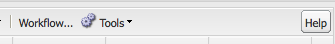

# 基本處理{#basic-handling}

>[!NOTE]
>
>* 本頁面旨在提供使用AEM作者環境時基本處理的概述。 它以 **Sites** Console為基礎。
   >
   >
* 某些功能並非在所有控制台中都可用，而／或某些控制台中有其他功能。 有關各個控制台及其相關功能的具體資訊將在其他頁面上詳細介紹。
>* AEM提供鍵盤快速鍵。 尤其是使用 [控制台](/help/sites-classic-ui-authoring/author-env-keyboard-shortcuts.md) , [編輯頁面時](/help/sites-classic-ui-authoring/classic-page-author-keyboard-shortcuts.md)。
>

## 歡迎畫面 {#the-welcome-screen}

傳統UI提供多種控制台，使用眾所周知的導覽和啟動動作的機制，包括點按、按兩下和上 [下文菜單](#context-menus)。

登錄時，將顯示歡迎螢幕，這將提供指向控制台和服務的連結清單：

## 控制台 {#consoles}

主控制台包括：

<table>
 <tbody>
  <tr>
   <td><strong>主控台</strong></td>
   <td><strong>目的</strong></td>
  </tr>
  <tr>
   <td><strong>歡迎</strong></td>
   <td>提供AEM主要功能的概述和直接存取（透過連結）。</td>
  </tr>
  <tr>
   <td><strong>數位資產</strong>  </td>
   <td>這些控制台可讓您匯入 <a href="/help/sites-classic-ui-authoring/classicui-assets.md">和管理數位資產</a> ，例如影像、視訊、檔案和音訊檔案。 然後，在相同AEM例項上執行的任何網站都可以使用這些資產。 </td>
  </tr>
  <tr>
   <td><strong>啟動</strong></td>
   <td>這可協助您管理啟動 <a href="/help/sites-classic-ui-authoring/classic-launches.md">程式</a>;這些功能可讓您針對未來一或多個已啟動網頁的版本開發內容。  注 <i>意：在觸控式UI中，Sites主控台和「參考」邊欄中提供大部分相同的功能。</i> 如 <i>果需要，此控制台可從工具控制台獲得；依次選擇操作和啟動。</i></td>
  </tr>
  <tr>
   <td><strong>收件匣 </strong></td>
   <td>在許多情況下，許多人參與了工作流的子任務，每個人必須先完成自己的步驟，然後才將工作交給下一個人。 「收件箱」允許您查看與此類任務相關的通知。 請參 <a href="/help/sites-administering/workflows.md">閱使用工作流</a>。   </td>
  </tr>
  <tr>
   <td><strong>標記</strong></td>
   <td>「標籤」控制台可讓您管理標籤。 標籤是短名稱或片語，您可使用這些短名稱或片語來分類和註解內容，讓您更容易找到和組織內容。 如需詳細資訊，請 <a href="/help/sites-classic-ui-authoring/classic-feature-tags.md">參閱使用和管理標籤</a>。</td>
  </tr>
  <tr>
   <td><strong>工具</strong></td>
   <td>「工 <a href="/help/sites-administering/tools-consoles.md">具」控制台</a> ，可讓您存取許多專業工具和控制台，協助您管理網站、數位資產和內容儲存庫的其他方面。</td>
  </tr>
  <tr>
   <td><strong>使用者</strong></td>
   <td>這些控制台可讓您管理使用者和群組的存取權限。 如需完整詳細資訊，請 <a href="/help/sites-administering/security.md">參閱使用者管理與安全性</a>。  </td>
  </tr>
  <tr>
   <td><strong>網站</strong></td>
   <td>Sites/Websites主控台可讓您 <a href="/help/sites-classic-ui-authoring/classic-page-author.md">建立、檢視和管理在AEM例項上執行的網站</a> 。 透過這些主控台，您可以建立、複製、移動和刪除網站頁面、啟動工作流程，以及啟動（發佈）頁面。 您也可以開啟頁面進行編輯。  </td>
  </tr>
  <tr>
   <td><strong>工作流程</strong></td>
   <td>工作流是一系列已定義的步驟，描述完成某些任務的過程。 在很多情況下，有許多人參與了一項任務，每個人在將工作交給下一個人之前必須完成自己的步驟。 「工作流程控制台」可讓您建立工作流程模型並管理執行中的工作流程例項。 請參 <a href="/help/sites-administering/workflows.md">閱使用工作流</a>。  </td>
  </tr>
 </tbody>
</table>

「網 **站** 」主控台提供兩個窗格，供您導覽和管理頁面：

* 左窗格

   這會顯示您網站的樹狀結構，以及這些網站內的頁面。

   此外，它還會顯示其他方面或AEM的相關資訊，包括專案、藍圖和資產。

* 右窗格

   這會顯示頁面（位於左側窗格中選取的位置），並可用於執行動作。

您可以在此處使 [用工具列](/help/sites-authoring/managing-pages.md) 、內容選單或開啟頁面以執行進一步動作來管理頁面。

>[!NOTE]
>
>所有控制台的基本處理方式都相同。 本節將重點放在 **Websites** console上，因為它是編寫時使用的主要控制台。

## 存取說明 {#accessing-help}

在各種控制台（例如網站）上也提供「說 **明** 」按鈕，這將開啟「封裝共用」或說明檔案網站。

編輯頁面時，側 [腳也會有存取說明的按鈕](/help/sites-classic-ui-authoring/classic-page-author-env-tools.md#accessing-help)。

## 使用網站主控台導覽 {#navigating-with-the-websites-console}

「網 **站** 」主控台會以樹狀結構（左側窗格）列出您的內容頁面。 為方便導覽，樹狀結構的區段可視需要展開(+)或收合(-):

* 按一下頁面名稱（在左窗格中）將：

   * 在右窗格中列出子頁面
   * 同時展開左窗格中的結構。

      基於效能原因，此操作取決於子節點數。 在標準安裝中，當子節點數或更少時，此擴展方 `30` 法將起作用。

* 連按兩下頁面名稱（左窗格）也會展開樹狀結構，不過由於頁面同時開啟，此效果並不明顯。

>[!NOTE]
>
>您可以在網站管理介面工具集 `30`的應用程式特定組態中，依控制台變更此預設值():
>
>在網站管理節點上：
>
>設定屬性的值：
>`treeAutoExpandMax`
>於:
>`/apps/wcm/core/content/siteadmin`
>
>或全球主題：
>設定值：
>`TREE_AUTOEXPAND_MAX`
>在:
>`/apps/cq/ui/widgets/themes/default/widgets/wcm/SiteAdmin.js`
>
>如需詳 [細資訊，請參閱CQ Widget API中的](https://helpx.adobe.com/experience-manager/6-5/sites/developing/using/reference-materials/widgets-api/index.html?class=CQ.wcm.SiteAdmin) 「網站管理員」。

## 網站主控台上的頁面資訊 {#page-information-on-the-websites-console}

「網站」控制台的右 **窗格提供** 「清單檢視」，其中包含有關頁面的資訊：

以下為可用項目：這些欄位的子集顯示為預設值：

<table>
 <tbody>
  <tr>
   <td><strong>欄</strong></td>
   <td><strong>說明</strong></td>
  </tr>
  <tr>
   <td>縮圖</td>
   <td>顯示頁面的縮圖。</td>
  </tr>
  <tr>
   <td>標題</td>
   <td>顯示在頁面上的標題</td>
  </tr>
  <tr>
   <td>名稱</td>
   <td>AEM引用的名稱是頁面</td>
  </tr>
  <tr>
   <td>已發佈</td>
   <td>指出頁面是否已發佈，並提供發佈日期和時間。</td>
  </tr>
  <tr>
   <td>修改時間</td>
   <td>指出頁面是否已修改，並提供修改日期和時間。 若要儲存任何修改，您必須啟動頁面。</td>
  </tr>
  <tr>
   <td>Scene7發佈</td>
   <td>指出頁面是否已發佈至Scene7。  </td>
  </tr>
  <tr>
   <td>狀態</td>
   <td>指出頁面的目前狀態，例如頁面是工作流程的一部分還是即時副本，或頁面目前是否已鎖定。</td>
  </tr>
  <tr>
   <td>印象</td>
   <td>以點擊數顯示頁面上的活動。</td>
  </tr>
  <tr>
   <td>範本</td>
   <td>指出頁面所依據的範本。</td>
  </tr>
  <tr>
   <td>在工作流程中</td>
   <td>指出頁面是否在工作流程中。</td>
  </tr>
  <tr>
   <td>鎖定者: </td>
   <td>顯示頁面已鎖定的時間以及已鎖定的使用者帳戶。</td>
  </tr>
  <tr>
   <td>即時副本</td>
   <td>指出頁面是即時副本的一部分。</td>
  </tr>
 </tbody>
</table>

>[!NOTE]
>
>要選擇可見的列，請將滑鼠懸停在列標題上。 下拉式選單將會顯示，您可從此處使用「欄 **」選項** 。

「已發佈」和「已修改」欄中頁 **面旁的顏色** ，指 **** 出出版物狀態：

| **欄** | **彩色** | **說明** |
|---|---|---|
| 已發佈 | 綠色 | 出版成功。 內容會發佈。 |
| 已發佈 | 黃色 | 出版物擱置中。 系統尚未收到發佈確認。 |
| 已發佈 | 紅色 | 發行失敗. 與發佈實例沒有連接。 這也可能表示內容已停用。 |
| 已發佈 | *blank* | 此頁面從未發佈。 |
| 修改時間 | 藍色 | 自上次發佈以來已修改頁面。 |
| 修改時間 | *blank* | 自上次發佈以來，此頁面從未修改過，也未修改過。 |

## 內容功能表 {#context-menus}

傳統UI使用眾所周知的機制來導覽和啟動動作，包括點按和點按。 視目前情況而定，還提供一系列內容功能表（通常以滑鼠右鍵開啟）:

