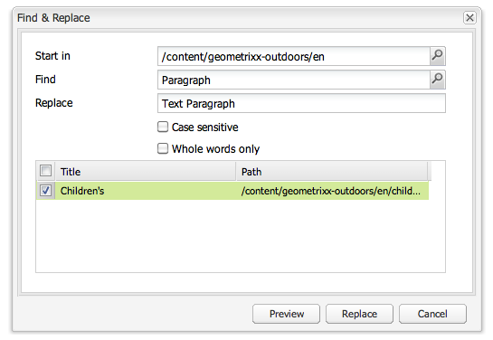

# 搜尋{#searching}

作者環境提AEM供了各種機制來搜索內容，這取決於資源類型。

>[!NOTE]
>
>在作者環境之外，還可以使用其他機制進行搜索，如 [查詢生成器](/help/sites-developing/querybuilder-api.md) 和 [CRXDE Lite](/help/sites-developing/developing-with-crxde-lite.md)。

## 搜索基礎 {#search-basics}

要訪問搜索面板，請按一下 **搜索** 對話框。

通過搜索面板，您可以搜索所有網站頁面。 它包含以下欄位和小部件：

* **全文**:搜索指定的文本
* **在之後/之前修改**:僅搜索在特定日期之間更改的頁面
* **模板**:僅根據指定的模板搜索那些頁面
* **標籤**:僅搜索具有指定標籤的頁面

>[!NOTE]
>
>當您的實例配置為 [Lucene搜索](/help/sites-deploying/queries-and-indexing.md) 可以在中使用以下 **全文**:
>
>* [通配符](https://lucene.apache.org/core/5_3_1/queryparser/org/apache/lucene/queryparser/classic/package-summary.html#Wildcard_Searches)
>* [布爾運算子](https://lucene.apache.org/core/5_3_1/queryparser/org/apache/lucene/queryparser/classic/package-summary.html#Boolean_operators)
>
>* [規則運算式](https://lucene.apache.org/core/5_3_1/queryparser/org/apache/lucene/queryparser/classic/package-summary.html#Regexp_Searches)
>* [欄位分組](https://lucene.apache.org/core/5_3_1/queryparser/org/apache/lucene/queryparser/classic/package-summary.html#Field_Grouping)
>* [提升](https://lucene.apache.org/core/5_3_1/queryparser/org/apache/lucene/queryparser/classic/package-summary.html#Boosting_a_Term)
>

通過按一下 **搜索** 的下界。 按一下 **重置** 的子菜單。

## 篩選 {#filter}

可以在不同位置設定（並清除）篩選器以細化和細化視圖：

## 查找和替換 {#find-and-replace}

在 **網站** 控制台 **查找和替換** 菜單選項允許您在網站的某個部分中搜索和替換字串的多個實例。

1. 選擇根頁面或資料夾，以在其中執行查找和替換操作。
1. 選擇 **工具** 然後 **查找和替換**:

   

1. 的 **查找和替換** 對話框執行以下操作：

   * 確認查找操作應開始的根路徑
   * 定義要查找的術語
   * 定義應替換它的術語
   * 指示搜索是否應區分大小寫
   * 指示是否只應找到整個字（否則也會找到子字串）

   按一下 **預覽** 列出找到術語的位置。 可以選擇/清除要替換的特定實例：

   

1. 按一下 **替換** 替換所有實例。 系統將要求您確認操作。

查找和替換servlet的預設範圍包括以下屬性：

* `jcr:title`
* `jcr:description`
* `jcr:text`
* `text`

可以使用Apache Felix Web管理控制台更改範圍(例如， `https://localhost:4502/system/console/configMgr`)。 選擇 `CQ WCM Find Replace Servlet (com.day.cq.wcm.core.impl.servlets.FindReplaceServlet)` 並根據需要配置範圍。

>[!NOTE]
>
>在標準安AEM裝中，查找和替換使用Lucene進行搜索功能。
>
>Lucene索引長度高達16k的字串屬性。 超出此範圍的字串將不被搜索。
