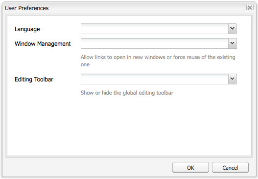

# 設定您的帳戶環境{#configuring-your-account-environment}

AEM提供您設定帳戶的功能，以及作者環境的某些方面。

使用帳 [戶設定](#account-settings) 和使 [用者偏好設定](#user-preferences) ，可定義下列選項和偏好設定：

* **編輯工具**&#x200B;列選擇是否要使用全域編輯工具列。 此工具列顯示在瀏覽器視窗頂端，提供您 **Copy**、Cut **、** Paste **、** Delete **** 按鈕，以用於該頁面上的段落元件：

   * 需要時顯示 (預設)
   * 永遠顯示
   * 隱藏

* **模擬為**&#x200B;使用  者可代表其他使用者運作的功能。

* **語**&#x200B;言編寫環境UI所用的語言。 從可用清單中選擇所需的語言。

* **窗口管理**&#x200B;選擇以下任一項：

   * 將在新視窗中開啟多個Windows（預設）頁面。
   * 將在當前窗口中開啟單個WindowPages。

## 帳戶設定 {#account-settings}

使用者圖示可讓您存取下列各種選項：

* 登出
* [模擬為](/help/sites-administering/security.md#impersonating-another-user)
* [使用者偏好設定](#user-preferences)
* [通知收件匣](/help/sites-classic-ui-authoring/author-env-inbox.md)

### 使用者偏好設定 {#user-preferences}

每位使用者都可自行設定特定屬性。 這可從控制台 **右上角** 「偏好設定」對話方塊中取得。

對話方塊提供下列選項：

