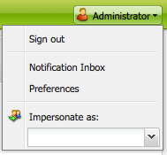

# 設定帳戶環境{#configuring-your-account-environment}

AEM可讓您設定帳戶，以及製作環境的某些方面。

使用[帳戶設定](#account-settings)和[用戶首選項](#user-preferences)可以定義以下選項和首選項：

* **編輯工**
具欄選擇是否要具有全局編輯工具欄。此工具列會顯示在瀏覽器視窗頂端，提供您 
**複製**、 **剪下**、 **貼上**、刪除按鈕，以便與該頁 **** 面上的段落元件一起使用：

   * 需要時顯示 (預設)
   * 永遠顯示
   * 隱藏

* **模擬**
為使用 [者可](/help/sites-administering/security.md#impersonating-another-user) 以代表其他使用者運作的模擬功能。

* ****
語言用於製作環境UI的語言。從可用清單中選取所需語言。

* **窗口**
管理選擇：

   * 多個視窗（預設）
頁面將在新視窗中開啟。
   * 單一視窗
將在當前窗口中開啟頁面。

## 帳戶設定 {#account-settings}

使用者圖示可讓您存取下列各種選項：

* 登出
* [模擬為](/help/sites-administering/security.md#impersonating-another-user)
* [使用者偏好設定](#user-preferences)
* [通知收件匣](/help/sites-classic-ui-authoring/author-env-inbox.md)

### 使用者偏好設定 {#user-preferences}

每個使用者都可自行設定特定屬性。 這可從控制台右上角的&#x200B;**偏好設定**&#x200B;對話方塊取得。

對話方塊提供下列選項：

