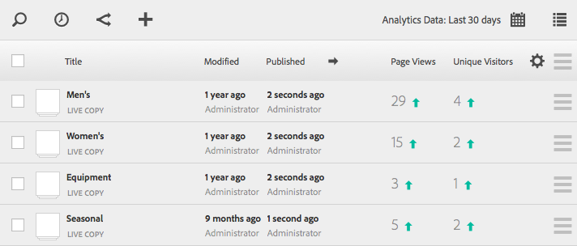

# 查看頁面分析資料{#seeing-page-analytics-data}

使用頁面分析資料來評估其頁面內容的成效。

頁面分析資料會顯示在Sites主控台中。 當網站以清單格式顯示時，預設會提供下列欄：

* 頁面檢視
* 不重複訪客
* 頁面逗留時間

>[!NOTE]
>
>直接在主控台中顯示網站分析資料，僅可在觸控最佳化UI中使用。 請參閱 [查看頁面分析資料](/help/sites-authoring/page-analytics-using.md) 以取得詳細資訊。
