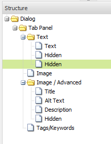

# 支架{#scaffolding}

有時，您可能需要建立大量共用相同結構但內容不同的頁面。 透過標準AEM介面，您將需要建立每個頁面、將適當的元件拖曳至頁面上，然後個別填入每個頁面。

使用腳手架，您可以建立表單（腳手架），其中欄位可反映您頁面的結構，然後使用此表單輕鬆建立以此結構為基礎的頁面。

>[!NOTE]
>
>腳手架（在傳統UI中）尊重 [MSM的繼承](#scaffolding-with-msm-inheritance)。

## 腳手架的運作方式 {#how-scaffolding-works}

Scaffold會儲存在網 **站管理員的** 「工具」主控台中。

* 開啟「工 **具」控制台** ，然後按一下「預 **設頁面支架」**。
* 在此下，按一下 **geometrixx**。
* 在 **geometrixx** 下方，您會找到名 *為* News的Scaffold頁 **面**。 按兩下以開啟此頁面。

Scaffold由一個表單組成，其中包含將組成要建立頁面的每段內容的欄位，以及通過Scaffold頁面的 **Page Properties** （頁面屬性）訪問的四個重要參數。

支架頁面屬性包括：

* **標題文字**:這是這個腳手架頁面本身的名稱。 在此範例中，它稱為「新聞」。
* **說明**:這會顯示在腳手架頁面的標題下方。
* **目標範本**:這是此Scaffold在建立新頁面時將使用的模板。 在此範例中，它是 *Geometrixx內容頁面範本* 。
* **目標路徑**:這是父頁面的路徑，此Scaffold將在其下建立新頁面。 在此範例中，路 *徑為/content/geometrixx/tw/news*。

腳手架的體部是形狀。 當使用者想要使用支架建立頁面時，他會填寫表單，然後按一下底 *部的*「建立」。 在上 **述的** 「新聞」範例中，表格包含下列欄位：

* **標題**:這是要建立的頁面的名稱。 每個支架上都有此欄位。
* **文字**:此欄位對應至產生頁面上的文字元件。
* **影像**:此欄位對應至產生頁面上的影像元件。
* **映像／高級**: **標題**:影像的標題。
* **映像／高級**: **替代文字**:影像的替代文字。
* **映像／高級**:說 **明**:影像的說明。
* **映像／高級**:大 **小**:影像的大小。
* **標籤／關鍵字**:要指派給此頁面的中繼資料。 每個支架上都有此欄位。

### 建立腳手架 {#creating-a-scaffold}

若要建立新的支架，請前往「工 **具** 」主控台，然 **後前往「預設頁面支架** 」並建立新頁面。 單頁範本類型將可用，即「腳手架 *範本」。*

轉到新頁 **面的「頁面屬性** 」，並設定Title *、* Description *、***** Target Text（如上所述）Title Trectipation和Target Path。

接下來，您必須定義此支架將建立的頁面結構。 若要這麼做，請進入 **[Scaffold頁面](/help/sites-authoring/page-authoring.md#sidekick)**上的設計模式。 將出現一個連結，允許您在對話框編輯器中編輯&#x200B;**腳手架**。

使用對話框編輯器，您指定了使用此指令碼建立新頁面時將建立的屬性。

腳手架的對話框定義與元件的對話框定義類似(請參 [閱Components](/help/sites-developing/components.md))。 但有一些重要差異：

* 元件對話框定義將呈現為常規對話框（例如，如對話框編輯器的中間窗格所示），而Scaffold對話框定義（儘管它們在對話框編輯器中顯示為常規對話框）將呈現為Scaffold窗體(如上面的 **News** scaffold中所示)。
* 元件對話框僅提供定義單個特定元件內容所需值的欄位。 Scaffold對話框必須為要建立的頁面的每個段落中的每個屬性提供欄位。
* 在元件對話框中，用於呈現指定內容的元件是隱式的，因此，在建立段落時 `sling:resourceType` ，將自動填充段落的屬性。 使用支架時，必須由對話框本身提供定義給定段落的內容和指定元件的所有資訊。 在Scaffold對話方塊中，必須使用「隱藏」欄位 *來提供此資訊* ，才能在建立頁面時提交此資訊。

檢視對話方塊編輯器中 **的News** Scaffold對話方塊範例，以說明其運作方式。 進入Scaffold頁面的設計模式，然後按一下對話方塊編輯器連結。

現在，按一下對話方塊欄 **位「對話>標籤面板>文字>文字**」，如下所示：

此欄位的屬性清單將顯示在對話框編輯器的右側，如下所示：

請注意此欄位的name屬性。 它有價值

`./jcr:content/par/text/text`

這是屬性的名稱，當使用Scaffold來建立頁面時，此欄位內容將寫入此屬性。 屬性會以代表要建立之頁面之節點的相對路徑來表示。 它指定屬性文本，位於節點文本下方，該文本位於節點par下方，節點par本身是頁面節點下方jcr:content節點的子節點。

這會定義要輸入至此欄位之文字的內容儲存位置。 不過，我們還需要為此內容指定另外兩個特徵：

* 此處儲存的字串必須解譯為豐 *富文字*,
* 該使用哪個元件將此內容轉譯至產生的頁面。

請注意，在一般元件對話方塊中，您不必指定此資訊，因為該資訊隱含在對話方塊已系結至特定元件的事實中。

若要指定您使用隱藏欄位的這兩項資訊。 按一下第一個隱藏欄位「對 **話>標籤面板>文字>隱藏**」，如下所示：

此隱藏欄位的屬性如下：

此隱藏欄位的名稱屬性為

`./jcr:content/par/text/textIsRich`

此為布林屬性，用於解譯儲存於的文字字串 `./jcr:content/par/text/text`。

因為我們知道文字應被解譯為Rich Text，所以我們會將此欄 `value` 位的屬性指定為 `true`。

>[!CAUTION]
>
>對話框編輯器允許用戶更改對話框定 *義中* 現有屬性的值。 若要新增屬性，使用者必須使用 [CRXDE Lite](/help/sites-developing/developing-with-crxde-lite.md)。 例如，當使用對話框編輯器將新的隱藏欄位添加到對話框定義時，它沒有 *value* 屬性（即名為&quot;value&quot;的屬性）。 如果相關隱藏欄位需要設 *定預設值* ，則必須使用其中一種CRX工具手動新增此屬性。 該值不能與對話框編輯器本身一起添加。 不過，一旦屬性存在，就可以使用對話框編輯器編輯其值。

按一下第二個隱藏欄位即可看到：

此隱藏欄位的屬性如下：

此隱藏欄位的名稱屬性為

`./jcr:content/par/text/sling:resourceType`

而此屬性的固定值為

`foundation/components/textimage`

這指定用於呈現此段落文本內容的元件是「文本圖 *像」元件* 。 使用在其 `isRichText` 他隱藏欄位中指定的布林值時，元件可以以所需的方式來轉換儲存 `./jcr:content/par/text/text` 在的實際文字字串。

### 與MSM繼承的腳手架 {#scaffolding-with-msm-inheritance}

在傳統UI中，腳手架與MSM繼承（如適用）完全整合。

當您在 **Stawble** mode（使用側腳底部的圖示）中開啟頁面時，受繼承約束的任何元件都會以下列方式表示：

* 鎖定符號（對於大多數元件而言）;例如文字和標題)
* 具有文本的遮罩 **按一下取消繼承** （對於影像元件）

這表明，在取消繼承之前，無法編輯元件。

>[!NOTE]
>
>這可比作編輯頁 [面內容時繼承的元件](/help/sites-authoring/editing-content.md#inheritedcomponentsclassicui)。

按一下鎖定符號或影像表徵圖可以中斷繼承：

* 符號將變更為開啟的掛鎖。
* 解除鎖定後，您就可以編輯內容。

解除鎖定後，您可以按一下解除鎖定的掛鎖符號，以還原繼承——這會遺失您所做的任何編輯。

>[!NOTE]
>
>如果繼承在頁面層級(來自「頁面屬性」的「Livecopy」（即時副本）標籤)取消，則所有元件都可在 **Shatwarle** 模式中編輯（這些元件將以解鎖狀態顯示）。
