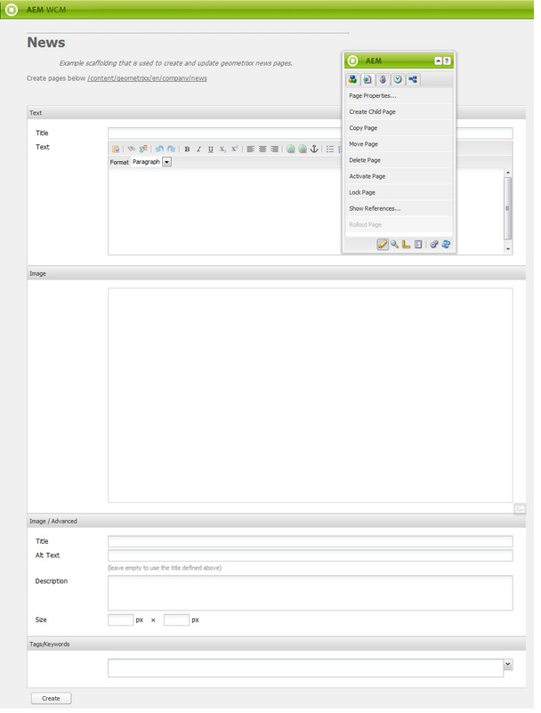

# 支架{#scaffolding}

有時，您可能需要建立大量共用相同結構但內容不同的頁面。 透過標準AEM介面，您將需要建立每個頁面、將適當的元件拖曳至頁面上，然後個別填入每個頁面。

使用腳手架，您可以建立表單（腳手架），其中欄位可反映您頁面的結構，然後使用此表單輕鬆建立以此結構為基礎的頁面。

>[!NOTE]
>
>腳手架（在傳統UI中）[尊重MSM繼承](#scaffolding-with-msm-inheritance)。

## 腳手架的運作方式{#how-scaffolding-works}

Scaffolds會儲存在網站管理員的&#x200B;**Tools**&#x200B;主控台中。

* 開啟&#x200B;**工具**&#x200B;控制台，然後按一下&#x200B;**預設頁面支架**。
* 在此下，按一下&#x200B;**geometrixx**。
* 在&#x200B;**geometrixx**&#x200B;下方，您會找到名為&#x200B;**News**&#x200B;的&#x200B;*scaffold page*。 按兩下以開啟此頁面。

Scaffold由一個表單組成，其中包含將組成要建立頁面的每段內容的欄位，以及通過Scaffold頁面的&#x200B;**Page Properties**&#x200B;訪問的四個重要參數。

支架頁面屬性包括：

* **標題文字**:這是這個腳手架頁面本身的名稱。在此範例中，它稱為「新聞」。
* **說明**:這會顯示在腳手架頁面的標題下方。
* **目標範本**:這是此Scaffold在建立新頁面時將使用的模板。在此範例中，它是&#x200B;*Geometrixx Content Page*&#x200B;範本。
* **目標路徑**:這是父頁面的路徑，此Scaffold將在其下建立新頁面。在此範例中，路徑為&#x200B;*/content/geometrixx/tw/news*。

腳手架的體部是形狀。 當使用者想要使用腳手架建立頁面時，他會填寫表單，然後按一下底部的&#x200B;*Create*。 在上述&#x200B;**News**&#x200B;範例中，表單包含下列欄位：

* **標題**:這是要建立的頁面的名稱。每個支架上都有此欄位。
* **文字**:此欄位對應至產生頁面上的文字元件。
* **影像**:此欄位對應至產生頁面上的影像元件。
* **映像／高級**: **標題**:影像的標題。
* **映像／高級**: **替代文字**:影像的替代文字。
* **映像／高級**: **說明**:影像的說明。
* **映像／高級**: **大小**:影像的大小。
* **標籤／關鍵字**:要指派給此頁面的中繼資料。每個支架上都有此欄位。

### 建立腳手架{#creating-a-scaffold}

要建立新腳手架，請轉至&#x200B;**工具**&#x200B;控制台，然後轉至&#x200B;**預設頁腳手架**&#x200B;並建立新頁。 將提供單頁模板類型&#x200B;*棚架模板。*

轉至新頁面的&#x200B;**頁面屬性**，並如上所述設定&#x200B;*標題文本*、*說明*、*目標模板*&#x200B;和&#x200B;*目標路徑*。

接下來，您必須定義此支架將建立的頁面結構。 若要這麼做，請進入Scaffold頁面上的&#x200B;**[設計模式](/help/sites-authoring/page-authoring.md#sidekick)**。 將出現一個連結，允許您在&#x200B;**對話框編輯器**&#x200B;中編輯腳手架。

使用對話框編輯器，您指定了使用此指令碼建立新頁面時將建立的屬性。

腳手架的對話框定義與元件的對話框定義類似（請參見[元件](/help/sites-developing/components.md)）。 但有一些重要差異：

* 元件對話框定義呈現為常規對話框（例如，對話框編輯器的中間窗格中顯示），而Scaffold對話框定義（儘管它們在對話框編輯器中顯示為常規對話框）在Scaffold頁面上呈現為Scaffold表單（如上面&#x200B;**News** Scaffold中所示）。
* 元件對話框僅提供定義單個特定元件內容所需值的欄位。 Scaffold對話框必須為要建立的頁面的每個段落中的每個屬性提供欄位。
* 在元件對話框中，用於呈現指定內容的元件是隱式的，因此在建立段落時，段落的`sling:resourceType`屬性會自動填充。 使用支架時，必須由對話框本身提供定義給定段落內容和指定元件的所有資訊。 在Scaffold對話方塊中，必須使用&#x200B;*Hidden*&#x200B;欄位來提供這項資訊，才能在建立頁面時提交這項資訊。

查看對話框編輯器中的示例&#x200B;**News**&#x200B;支架對話框有助於解釋其工作原理。 進入Scaffold頁面的設計模式，然後按一下對話方塊編輯器連結。

現在，按一下對話欄位&#x200B;**對話>標籤面板>文字>文字**，如下所示：

此欄位的屬性清單將顯示在對話框編輯器的右側，如下所示：

請注意此欄位的name屬性。 它有價值

`./jcr:content/par/text/text`

這是屬性的名稱，當使用Scaffold來建立頁面時，此欄位內容將寫入此屬性。 屬性會以代表要建立之頁面之節點的相對路徑來表示。 它指定屬性文本，位於節點文本下方，該文本位於節點par下方，節點par本身是頁面節點下方jcr:content節點的子節點。

這會定義要輸入至此欄位之文字的內容儲存位置。 不過，我們還需要為此內容指定另外兩個特徵：

* 此處儲存的字串必須解釋為&#x200B;*rich text*，以及
* 該使用哪個元件將此內容轉譯至產生的頁面。

請注意，在一般元件對話方塊中，您不必指定此資訊，因為該資訊隱含在對話方塊已系結至特定元件的事實中。

若要指定您使用隱藏欄位的這兩項資訊。 按一下第一個隱藏欄位&#x200B;**對話>標籤面板>文字>隱藏**，如下所示：

此隱藏欄位的屬性如下：

此隱藏欄位的名稱屬性為

`./jcr:content/par/text/textIsRich`

這是用於解譯儲存在`./jcr:content/par/text/text`的文本字串的布爾屬性。

由於我們知道應將文字解譯為Rich Text，因此我們將此欄位的`value`屬性指定為`true`。

>[!CAUTION]
>
>對話框編輯器允許用戶更改對話框定義中現有&#x200B;**&#x200B;屬性的值。 若要新增屬性，使用者必須使用[CRXDE Lite](/help/sites-developing/developing-with-crxde-lite.md)。 例如，當使用對話框編輯器將新的隱藏欄位添加到對話框定義時，它沒有&#x200B;*value*&#x200B;屬性（即名稱為&quot;value&quot;的屬性）。 如果相關的隱藏欄位需要設定預設&#x200B;*value*&#x200B;屬性，則必須使用其中一個CRX工具手動添加此屬性。 該值不能與對話框編輯器本身一起添加。 不過，一旦屬性存在，就可以使用對話框編輯器編輯其值。

按一下第二個隱藏欄位即可檢視：

此隱藏欄位的屬性如下：

此隱藏欄位的名稱屬性為

`./jcr:content/par/text/sling:resourceType`

而此屬性的固定值為

`foundation/components/textimage`

這指定用於呈現此段落文本內容的元件是&#x200B;*文本影像*&#x200B;元件。 使用在其他隱藏欄位中指定的`isRichText`布林值，元件可以依所需方式呈現儲存在`./jcr:content/par/text/text`的實際文字字串。

### 具有MSM繼承{#scaffolding-with-msm-inheritance}的支架

在傳統UI中，腳手架與MSM繼承（如適用）完全整合。

當您在&#x200B;**Shawbler**&#x200B;模式中開啟頁面（使用側腳底部的圖示）時，受繼承約束的任何元件都會以下列方式表示：

* 鎖定符號（對於大多數元件而言）;例如文字和標題)
* 具有文本&#x200B;**的蒙版按一下取消繼承**（對於影像元件）

這表明，在取消繼承之前，無法編輯元件。

>[!NOTE]
>
>這可比作編輯頁面內容](/help/sites-authoring/editing-content.md#inheritedcomponentsclassicui)時的[繼承元件。

按一下鎖定符號或影像表徵圖可以中斷繼承：

* 符號將變更為開啟的掛鎖。
* 解除鎖定後，您就可以編輯內容。

解除鎖定後，您可以按一下解除鎖定的掛鎖符號，以還原繼承——這會遺失您所做的任何編輯。

>[!NOTE]
>
>如果繼承在頁面層級取消（來自「頁面屬性」的「Livecopy」標籤），則所有元件都可在&#x200B;**Swabler**&#x200B;模式中編輯（這些元件將顯示在解鎖狀態）。
