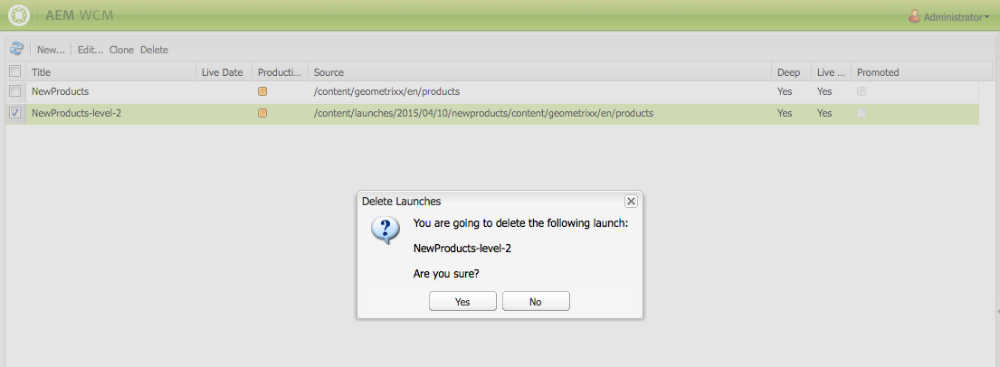

# 建立啟動{#creating-launches}

建立啟動以更新現有網頁的新版本，以供日後啟動。 當您建立啟動時，您會指定標題和來源頁面：

* 標題會出現在 **Sidekick**，作者可從其中存取來處理標題。
* 依預設，來源頁面的子頁面會包含在啟動中。 視需要，您只能使用來源頁面。
* 依預設， [即時副本會隨著來源頁面變更](/help/sites-administering/msm.md) ，自動更新啟動頁面。 您可以指定建立靜態副本以防止自動更改。

（可選）您可以指定 **啟動日期** （和時間），以定義啟動頁面要升級和啟動的時間。 不過，「 **啟動日期** 」只會搭配「生產就緒 **」旗標運作(請** 參閱編輯啟動設定 );要讓動作實際自動發生，必須同時設定。

## 建立啟動 {#creating-a-launch}

以下過程將建立一個啟動。

1. 開啟「網站管理」頁面([http://localhost:4502/siteadmin](http://localhost:4502/siteadmin))。
1. ****&#x200B;按一下 **新建……然**&#x200B;後新啟動…….
1. 在「建 **立啟動** 」對話方塊中，指定下列屬性的值：

   * **啟動標題**:啟動的名稱。 名稱對作者應有意義。
   * **「源」頁**:要為其建立啟動的頁面的路徑。 依預設，會包含所有子頁面。
   * **排除子頁面**:選取此選項可建立僅用於來源頁面的啟動，而非子頁面。 依預設，不會選取此選項。
   * **保持同步**:選取此選項，可在來源頁面變更時自動更新啟動頁面的內容。 這是讓啟動成為即時副 [本](/help/sites-administering/msm.md)。
   * **啟動日期**:啟動副本要啟動的日期和時間(取決於「生產就緒」 **標誌** ;請 [參閱啟動——事件順序](/help/sites-authoring/launches.md#launches-the-order-of-events))。
   

1. 按一下&#x200B;**「建立」**。

## 刪除啟動 {#deleting-a-launch}

您也可以刪除啟動。

1. 在啟動 [主控台中](/help/sites-classic-ui-authoring/classic-launches.md)，選取所需的啟動。
1. 按一下 **刪除** -需要確認：

   

   >[!CAUTION]
   >
   >刪除巢狀啟動時，您應先刪除較低的層級。

