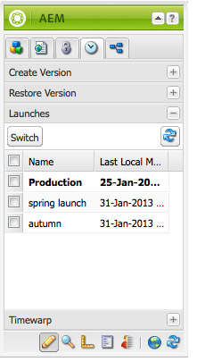

# 編輯啟動{#editing-launches}

## 編輯啟動頁面 {#editing-launch-pages}

為頁面（或一組頁面）建立啟動後，您可以編輯頁面啟動副本中的內容。

1. 開啟頁面進行編輯。
1. 在Sidekick中，選取「版本 **修訂** 」標籤，然後展開「 **啟動** 」群組。 目前正在編輯的啟動標題使用粗體。

   

1. 選取您要處理的啟動，然後按一下「切換 **」**。
1. 開始編輯。

   >[!NOTE]
   >
   >您可以使用 **sidekick的Page** （頁面）標籤來執行 **Create Child Page**（建立子頁面）等動作。

## 編輯啟動設定 {#editing-a-launch-configuration}

建立啟動後，您可以變更啟動名稱和啟動日期。 您也可以指定要與啟動建立關聯的影像。

1. 開啟啟動管理頁面([http://localhost:4502/libs/launches/content/admin.html](http://localhost:4502/libs/launches/content/admin.html))。

1. 選擇所需的啟動，然後按一下「 **編輯** 」(Edit)以開啟對話框：

   * 在「一 **般** 」索引標籤中，您可以編輯：

      * **標題**
      * **即時日期**:這等於啟動日期
      * **生產就緒**
      如需 [這些欄位的用途和互動的詳細資訊](/help/sites-authoring/launches.md#launches-the-order-of-events) ，請參閱啟動——事件順序。

   * 在「影 **像** 」索引標籤中，您可以上傳影像檔案。

1. 按一下&#x200B;**「儲存」**。

## 發現頁面的啟動狀態 {#discovering-the-launch-status-of-a-page}

當您編輯頁面的啟動時，有關啟動的資訊會顯示在Sidekick的「版本控制 **」** 標籤底部：

* 啟動的名稱。
* 上次變更後的時間。
* 執行上次變更的使用者。
* Production Ready(生產就 **緒** )旗標的狀態(orange=not set;green=set)。

