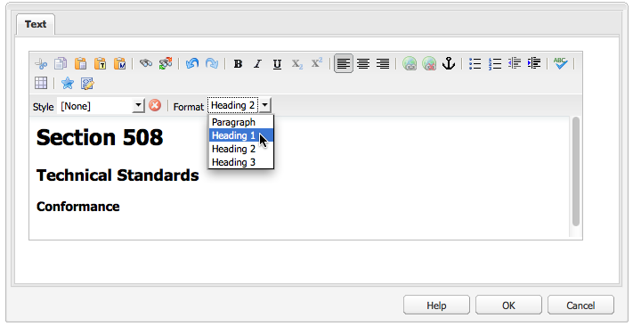

# 建立可存取的內容 (符合 WCAG 2.0){#creating-accessible-content-wcag-conformance}

>[!CAUTION]
>
>由於AEM 6.4已棄用傳統UI，因此本頁面的內容並未針對WCAG 2.1更新。
>
>如需AEM和WCAG 2.1的相關詳細資訊，請參閱下列頁面：
>
>* [AEM與網頁協助工具准則](/help/managing/web-accessibility.md)
>* [WCAG 2.1 快速指南](/help/managing/qg-wcag.md)
>* [建立可存取的內容 (符合 WCAG 2.1)](/help/sites-authoring/creating-accessible-content.md)

WCAG 2.0 包含一系列無需仰賴技術的指引和成功標準，有助身心障礙人士存取與使用網路內容。

>[!NOTE]
>
>另請參閱：
>
>* [WCAG 2.0快速指南](/help/managing/qg-wcag.md)
>* [設定RTF編輯器以產生無障礙內容](/help/sites-administering/rte-accessible-content.md)
>

這些指南會根據三個一致性層級進行分級：A級（最低）、AA級和AAA級（最高）。 簡而言之，層級的定義如下：

* **** A級：您的網站達到基本的最低協助功能等級。要達到此級別，將滿足所有A級成功標準。
* **AA級：** 這是您努力追求的最佳無障礙環境支援等級，其中您的網站可達到更高的無障礙環境支援等級，因此大部分使用者都可使用大部分的技術。 要達到此級別，將滿足所有A級和A級成功標準。
* **AAA級：** 您的網站可達到高水準的協助工具。 要達到此級別，將滿足所有A級、AA級和AAA級成功標準。

建立網站時，您必須決定要讓網站遵循的整體等級。

下節會顯示 [WCAG 2.0指引](https://www.w3.org/TR/WCAG20/#guidelines) 具有A級和AA級的相關成功標準 [一致性層級](https://www.w3.org/TR/UNDERSTANDING-WCAG20/conformance.html).

>[!NOTE]
>
>由於某些型別的內容無法滿足所有AAA級成功標準，因此不建議將此符合程度作為一般原則來要求。

>[!NOTE]
>
>本檔案使用下列專案：
>
>* 的簡短名稱 [WCAG 2.0指引](https://www.w3.org/TR/WCAG20/#guidelines).
>* 中使用的編號 [WCAG 2.0指引](https://www.w3.org/TR/WCAG20/#guidelines) 以便與WCAG網站進行交叉參照。
>

## 准則1：可感知 {#principle-perceivable}

[准則1：可感知 — 資訊和使用者介面元件必須以使用者可感知的方式呈現給使用者。](https://www.w3.org/TR/WCAG20/#perceivable)

### 替代文字(1.1) {#text-alternatives}

[指引1.1替代文字：為任何非文字內容提供替代文字，以便可以變更為人們需要的其他形式，例如大字型、盲文、語音、符號或更簡單的語言。](https://www.w3.org/TR/WCAG20/#text-equiv)

### 非文字內容(1.1.1) {#non-text-content}

* 成功標準1.1.1
* A級
* 非文字內容：除了下列情況外，所有呈現給使用者的非文字內容都有相同用途的替代文字。

#### 用途 — 非文字內容(1.1.1) {#purpose-non-text-content}

網頁上的資訊可以用許多不同的非文字格式提供，例如圖片、影片、動畫、圖表和圖形。 失明或嚴重視力障礙的人無法看到非文字內容，但他們可以透過熒幕閱讀器閱讀文字內容，或透過盲文顯示裝置以觸覺形式呈現文字內容。 因此，透過以圖形格式提供替代內容的文字內容，看不到圖形內容的人可以存取內容所提供的資訊的同等版本。

另一個有用的優點是，替代文字可讓搜尋引擎技術為非文字內容編制索引。

#### 如何達到標準 — 非文字內容(1.1.1) {#how-to-meet-non-text-content}

對於靜態圖形，基本要求是為圖形提供對等文字替代文字。 此方法的完成位置為 **替代文字** 欄位：

>[!NOTE]
>
>有些現成可用的元件(例如 **Carousel** 和 **Slideshow** )不提供將替代文字說明新增至影像的方式。當針對您的AEM例項實作這些元件的版本時，您的開發團隊應設定這些元件以支援 `alt` 屬性。 這麼做可確保作者將其新增至內容(請參閱 [新增對其他HTML元素和屬性的支援](/help/sites-administering/rte-accessible-content.md#add-support-for-more-html-elements-and-attributes))。

此 **替代文字** 欄位位於 **進階** 的影像屬性標籤 **影像** 元件對話方塊：


AEM新增 **替代文字** 預設為影像。 對於傳統UI，建立預設屬性的方式有兩種不同的情況，不過預設值可能不足以作為替代值，並且可能必須在中編輯 **進階** 影像屬性標籤：

* 檔案:

影像會從使用者的硬碟上傳。 如果您將影像元件新增至頁面，然後從硬碟或其他來源選擇影像，預設值為 **替代文字** 是 `file`. 此值必須在 **進階** 影像屬性索引標籤。 再次重申，此值不會顯示在 **替代文字** 欄位，但值變更時，新值會顯示在「 」欄位中。

* 資產:

從數位資產存放庫新增影像。 如果您將影像從數位資產存放庫拖曳至網頁，則 **標題** 和 **替代文字** 該影像的值取自該影像的中繼資料。

>[!NOTE]
>
>在上述兩種情況下，預設值 **替代文字** 值在中不可見 **進階影像屬性** 標籤。 若要變更預設值，只需在 **替代文字** 欄位。

>[!NOTE]
>
>如果您的影像純粹是裝飾性質(請參閱 [建立良好的替代文字](#creating-good-text-alternatives))，則可在 **替代文字** 使用空格鍵的欄位。 這麼做會建立一個空白 `alt` 屬性，會提示熒幕助讀程式忽略影像。

#### 建立良好的替代文字 {#creating-good-text-alternatives}

有多種形式的非文字內容，因此替代文字的值取決於圖形在網頁中所扮演的角色。 一些經驗法則包含下列內容：

* 替代文字應簡潔明瞭，但能清楚擷取非文字內容所提供的基本資訊。
* 應避免過長的說明（超過100個字元）。 如果替代文字需要更多細節：

   * 在替代文字中提供簡短說明
   * 並在相同頁面其他位置或不同網頁中有更長的說明。 將影像設為連結，或是在影像旁邊放置文字連結，即可連結至此個別說明。

* 替代文字不應復寫相同頁面上附近文字表單中提供的內容。 請記住，許多影像都是已涵蓋在頁面文字中的點插圖，因此可能已經存在詳細的替代文字。
* 如果非文字內容是另一個頁面或檔案的連結，且沒有其他文字構成相同連結的一部分，則影像的替代文字必須指出連結的目的地。 它不能描述影像。
* 如果非文字內容包含在按鈕元素中，且沒有文字構成相同按鈕的一部分，則影像的替代文字必須指出按鈕的功能，而非說明影像。
* 您可以為影像指定空白(null)的替代文字，但前提是影像沒有替代文字。 例如，它是純粹的裝飾圖形。 或者，如果頁面文字中已存在對等文字。

此 [W3C草稿：用於提供實用替代文字的HTML5技術](https://html.spec.whatwg.org/multipage/images.html#alt) 提供更多詳細資訊，以及針對不同型別影像提供適當替代文字的範例。

需要替代文字的特定非文字內容型別可能包括：

* 說明性像片：

這些是人物、物件或地點的影像。 請思考像片在頁面中的角色；適當的對等文字可能是 *像片 [物件]*，但可能取決於周圍的文字。

* 圖示：

傳送特定資訊的小型象形圖（圖形）。 每個頁面和網站都必須使用一致的量度。 圖示在頁面或網站上的所有例項都應使用相同的簡短替代文字，除非這樣做會造成相鄰文字不必要的重複。

* 圖表與圖形：

這些通常代表數值資料。 因此，提供替代文字的一個選項可能是包含圖表或圖形中顯示的主要趨勢的簡短摘要。 如有需要，也可在文字中使用 **說明** 中的欄位 **進階** 影像屬性索引標籤。 此外，您也可以在頁面或網站的其他位置，以表格形式提供來源資料。


若要提供此範例圖表的替代選項，請新增簡明的 `alt` 文字移至影像本身，然後以全文字替代文字跟隨影像。

```xml
<p></p>
<p> Figure 1. Distribution of Articles by Journal Category.
Pie chart: Language=68%, Education=14% and Science=18%.</p>
```

>[!NOTE]
>
>上述程式碼片段僅用於說明順序。 使用 **影像** 元件，而非 `img src` 以上使用的參考。

在AEM中，您可以使用 **替代文字** 和 **說明** 影像設定對話方塊中的欄位 — 如所示 [如何達到標準 — 非文字內容(1.1.1)](#how-to-meet-non-text-content).

* 地圖、圖表、流程圖：

對於提供空間資料的圖形(例如。 若要支援描述物件或程式之間的關係)，請確定關鍵訊息是以文字格式提供。對於地圖，提供等同全文的地圖可能不切實際，但如果提供地圖以幫助人們找到特定位置的方式，則地圖影像的替代文字可以簡短地指出 *X的地圖*，接著在頁面其他位置的文字中或透過 **說明** 中的欄位 **進階** 的標籤 **影像** 元件。

* 驗證碼：

驗證碼是 *完全自動化的公用圖靈測試，將電腦和人類區分開來*. 這是用於網頁的安全性檢查，可區分人類與惡意軟體，但可能會造成協助工具障礙。 這些影像會要求使用者描述他們所看到的內容，以便通過安全性測試。 無法提供影像的替代文字，因此您必須考慮替代非圖形解決方案。

W3C提供數種建議，例如： 這些方法各有其優缺點。

    *邏輯謎題
    *使用聲音輸出而非影像
    *限制使用帳戶和垃圾郵件篩選器。

* 背景影像：

這些影像是使用階層式樣式表(CSS)而非HTML來達成。 無法指定替代文字值。 因此，背景影像不應提供重要的文字資訊，即使提供，頁面文字中也必須提供此資訊。

不過，當影像無法顯示時，請務必顯示替代背景。

>[!NOTE]
>
>背景和前景文字之間應有適當的對比等級。 此對比將在中更詳細地討論 [對比（最小） (1.4.3)](#contrast-minimum).

#### 更多資訊 — 非文字內容(1.1.1) {#more-information-non-text-content}

* [瞭解成功標準1.1.1](https://www.w3.org/TR/UNDERSTANDING-WCAG20/text-equiv-all.html)
* [如何達到成功標準1.1.1](https://www.w3.org/WAI/WCAG21/quickref/?versions=2.0#text-alternatives)
* [W3C：提供實用替代文字的HTML5技術](https://html.spec.whatwg.org/multipage/images.html#alt)
* [驗證碼的W3C說明和替代方案](https://www.w3.org/TR/turingtest/)

### 時間型媒體(1.2) {#time-based-media}

[准則1.2以時間為主的媒體：提供以時間為主的媒體替代方案。](https://www.w3.org/TR/WCAG20/#text-equiv)

此資訊會處理以下內容的網頁內容： *基於時間*. 這涵蓋使用者可播放的內容（例如視訊、音訊和動畫內容），且可以是預先錄製或即時資料流。

### 純音訊和純視訊（預先錄製）(1.2.1) {#audio-only-and-video-only-pre-recorded}

* 成功標準1.2.1
* A級
* 純音訊和純視訊（預先錄製）：對於預先錄製的純音訊和預先錄製的純視訊媒體，除非音訊或視訊是文字的替代媒體，且標示清楚如下，否則情況如下：

   * 僅限預先錄製的音訊：提供時間型媒體的替代方案，為預先錄製的僅限音訊內容提供同等資訊。
   * 僅限預先錄製的視訊：提供時間型媒體的替代方案或音軌，為預先錄製的僅限視訊內容提供同等資訊。

#### 用途 — 純音訊和純視訊（預先錄製）(1.2.1) {#purpose-audio-only-and-video-only-pre-recorded}

下列使用者可能會遇到視訊與音訊的無障礙問題：

* 沒有音軌或音軌不足以通知視訊或動畫中正在發生的事情時，患有視覺障礙的人；
* 有聽力障礙或耳聾且聽不到音軌的人；
* 聽得見音軌但不瞭解說話內容的人（例如，因為這是他們不懂的語言）。

使用不支援以特定媒體格式(例如AdobeFlash)播放內容之瀏覽器或裝置的使用者，也可能無法播放視訊或音訊。

以不同的格式提供這項資訊，例如文字（或沒有音訊的視訊），可以讓無法存取原始內容的人存取這些資訊。

#### 如何達到標準 — 純音訊和純視訊（預先錄製）(1.2.1) {#how-to-meet-audio-only-and-video-only-pre-recorded}

* 如果內容是預先錄製不含視訊的音訊（例如播客）：

   * 在緊接內容之前或之後的位置提供音訊內容文字記錄的連結。

  成績單應為HTML頁面，其中包含所有口語和重要非口語內容的同等文字。 它應該也會指出說話者、設定說明、聲音表情，以及其他重要音訊的說明。

* 如果內容是無音訊的動畫或預先錄製的視訊：

   * 提供緊接在內容之前或之後的連結，以提供視訊所提供的資訊對等文字說明
   * 或是常用的音訊格式（例如MP3）中的對等音訊描述。

>[!NOTE]
>
>如果音訊或視訊內容是作為網頁上其他格式內容的替代提供，則不需要遵循上述要求。 例如，如果影片說明文字指示的清單，則此影片不需要替代文字，因為文字指示已經是影片的替代文字。

在AEM網頁中插入多媒體(尤其是Flash內容)與插入影像類似。 不過，由於多媒體內容遠不止是靜態影像，因此對於控制多媒體的播放方式，有各種不同的設定和選項。

>[!NOTE]
>
>將多媒體與資訊性內容搭配使用時，您也必須建立替代內容的連結。 例如，若要包含文字記錄，請建立HTML頁面以顯示記錄，然後在音訊內容旁邊或下方新增連結。

#### 更多資訊 — 純音訊和純視訊（預先錄製）(1.2.1) {#more-information-audio-only-and-video-only-pre-recorded}

* [瞭解成功標準1.2.1](https://www.w3.org/TR/UNDERSTANDING-WCAG20/media-equiv-av-only-alt.html)
* [如何達到成功標準1.2.1](https://www.w3.org/WAI/WCAG21/quickref/?versions=2.0#time-based-media)

### 註解（預先錄製） (1.2.2) {#captions-pre-recorded}

* 成功標準1.2.2
* A級
* 註解（預先錄製）：除了媒體是文字的替代媒體，且明確標示為文字外，同步媒體中的所有預先錄製的音訊內容都會提供註解。

#### 用途 — 字幕（預先錄製）(1.2.2) {#purpose-captions-pre-recorded}

耳聾或聽力缺佳的人無法或很難存取音訊內容。 註解是口語和非口語音訊的對等文字，會在視訊期間的適當時間顯示在熒幕上。 它們可讓無法聽到音訊的人瞭解正在發生的事情。

>[!NOTE]
>
>如果視訊或動畫的相同頁面上有適當的文字或非文字等同專案（直接提供等同資訊），則不需要註解。

#### 如何達到標準 — 字幕（預先錄製）(1.2.2) {#how-to-meet-captions-pre-recorded}

註解可以是：

* 開啟：播放視訊時一律可見
* 隱藏式：註解可以由使用者開啟或關閉

儘可能使用隱藏式字幕。 它讓使用者可以選擇是否檢視註解。

對於隱藏式字幕，請建立並提供適當格式的同步字幕檔案，例如 [SMIL](https://www.w3.org/AudioVideo/)，以及視訊檔案。

請參閱中的教學課程 [更多資訊 — 字幕（預先錄製）(1.2.2)](#more-information-captions-pre-recorded). 請務必提供附註，讓使用者知道有字幕可觀看影片。

如果您必須使用開啟的註解，請將文字內嵌到視訊曲目中。 這個方法是使用視訊編輯應用程式來達成，該應用程式允許將標題重疊在視訊上。

#### 更多資訊 — 字幕（預先錄製）(1.2.2) {#more-information-captions-pre-recorded}

* [瞭解成功標準1.2.2](https://www.w3.org/TR/UNDERSTANDING-WCAG20/media-equiv-captions.html)：
* [如何達到成功標準1.2.2](https://www.w3.org/WAI/WCAG21/quickref/?versions=2.0#time-based-media)
* [W3C：同步的多媒體](https://www.w3.org/AudioVideo/)
* [字幕、成績單和音訊說明 — 依WebAIM](https://webaim.org/techniques/captions/)

### 音訊描述或替代媒體（預先錄製） (1.2.3) {#audio-description-or-media-alternative-pre-recorded}

* 成功標準1.2.3
* A級
* 音訊說明或替代媒體（預先錄製）：除了媒體是文字的替代媒體，且明確標示為文字的替代媒體外，系統會為同步媒體提供時間型媒體或預先錄製的視訊內容的替代媒體。

#### 用途 — 音訊說明或替代媒體（預先錄製） (1.2.3) {#purpose-audio-description-or-media-alternative-pre-recorded}

如果影片或動畫中的資訊僅以視覺效果顯示，失明或視障人士會遇到協助工具障礙。 或者，如果音軌提供的資訊不足，無法透過視覺效果瞭解正在發生的事情。

#### 如何達到標準 — 音訊說明或替代媒體（預先錄製） (1.2.3) {#how-to-meet-audio-description-or-media-alternative-pre-recorded}

您可採取兩種方法來達到此成功標準。 任一專案皆可接受：

1. 為視訊內容加入其他音訊說明。 您可以透過下列三種方式之一達成此方法：

   * 在現有對話方塊中暫停期間，提供未顯示在現有音軌中的場景變更資訊；
   * 提供包含原始音軌的全新、額外和選購音軌，但也包含有關場景變更的額外音訊資訊。

      * 使用者可以在現有的音軌之間切換(這項 *不會* 包含音訊說明)和新的音軌(可 *會* 包含音訊說明)。
      * 此方法可防止對不需要額外說明的使用者造成中斷。

   * 建立視訊內容的第二個版本，以允許擴充音訊說明。 這樣做會減少在現有對話方塊之間提供詳細音訊說明的困難，方法是在適當的時間暫時暫停音訊和視訊。 因此，在動作再次開始之前，可以輸入更長的音訊說明。 如同上一個範例，最好將此作為選用的額外音訊曲目提供，以防止對不需要額外說明的使用者造成中斷。

1. 提供文字稿，其為視訊或動畫的音訊與視覺元素的適當對等文字。 在適當的情況下，應包括說話者的指示、語調的描述、語音表情。 視其長度而定，您可以將文字記錄放在與視訊或動畫相同的頁面上，或放在另一個頁面上；如果您選擇後一個選項，請在視訊或動畫旁提供文字記錄的連結。

本指南不涵蓋如何建立音訊描述視訊的確切細節。 建立視訊和音訊說明可能相當耗時，但其他Adobe產品可協助您完成這些工作。 如果您在Adobe Flash Professional中建立內容，您也應該建立指令碼，提示使用者下載合適的外掛程式，並透過 `<noscript>` 元素。

#### 更多資訊 — 音訊說明或替代媒體（預先錄製） (1.2.3) {#more-information-audio-description-or-media-alternative-pre-recorded}

* [瞭解成功標準1.2.3](https://www.w3.org/TR/UNDERSTANDING-WCAG20/media-equiv-audio-desc.html)：
* [如何達到成功標準1.2.3](https://www.w3.org/WAI/WCAG21/quickref/?versions=2.0#qr-media-equiv-audio-desc)
* [Adobe Encore CS5](https://helpx.adobe.com/premiere-pro/using/whats-new.html)

### 註解（即時） (1.2.4)  {#captions-live}

* 成功標準1.2.4
* AA級
* 註解（即時）：為同步媒體中的所有即時音訊內容提供註解。

#### 用途 — 註解（即時） (1.2.4) {#purpose-captions-live}

此成功標準與 [註解（預先錄製）](#captions-pre-recorded) 因為除了此成功標準需要處理網路直播等即時簡報之外，此標準還能解決耳聾或聽力缺佳使用者遇到的協助工具問題。

#### 如何達到標準 — 字幕（即時）(1.2.4) {#how-to-meet-captions-live}

遵循提供的指引 [註解（預先錄製）](#captions-pre-recorded) 以上。 然而，由於媒體的即時性質，提供註解必須儘快建立，並對正在發生的事情做出回應。 因此，您應該考慮使用即時字幕或語音轉文字工具。

詳細指示不在本檔案的涵蓋範圍內，但下列資源提供有用的資訊：

* [WebAIM：即時字幕](https://webaim.org/techniques/captions/realtime)
* [AccessIT （華盛頓大學）：能否使用語音辨識自動產生字幕？](https://www.washington.edu/doit/programs/accessit?1209)

#### 更多資訊 — 字幕（即時） (1.2.4) {#more-information-captions-live}

* [瞭解成功標準1.2.4](https://www.w3.org/TR/UNDERSTANDING-WCAG20/media-equiv-real-time-captions.html)
* [如何達到成功標準1.2.4](https://www.w3.org/WAI/WCAG21/quickref/?versions=2.0#qr-media-equiv-real-time-captions)

### 音訊說明（預先錄製） (1.2.5)  {#audio-description-pre-recorded}

* 成功標準1.2.5
* AA級
* 音訊說明（預先錄製）：提供同步媒體中所有預先錄製的視訊內容的音訊說明。

#### 用途 — 音訊說明（預先錄製） (1.2.5) {#purpose-audio-description-pre-recorded}

此成功標準與 [音訊描述或替代媒體（預先錄製）](#audio-description-or-media-alternative-pre-recorded)但作者必須提供更詳細的音訊說明才能符合AA級標準。

#### 如何達到標準 — 音訊說明（預先錄製） (1.2.5) {#how-to-meet-audio-description-pre-recorded}

遵循提供的指引 [音訊描述或替代媒體（預先錄製）](#audio-description-or-media-alternative-pre-recorded).

#### 更多資訊 — 音訊說明（預先錄製） (1.2.5) {#more-information-audio-description-pre-recorded}

* [瞭解成功標準1.2.5](https://www.w3.org/TR/UNDERSTANDING-WCAG20/media-equiv-audio-desc-only.html)
* [如何達到成功標準1.2.5](https://www.w3.org/WAI/WCAG21/quickref/?versions=2.0#qr-media-equiv-audio-desc-only)

### 可調整(1.3) {#adaptable}

[指南1.3可調整：建立能以不同方式呈現的內容（例如更簡單的版面），而不會遺失資訊或結構。](https://www.w3.org/TR/WCAG20/#content-structure-separation)

本指引涵蓋支援以下人員所需的需求：

* 可能無法存取作者在中呈現的資訊 *標準* 二維、多欄、彩色網頁配置

* 可能使用純音訊或替代視覺顯示，例如大型文字或高對比度。

### 資訊和關係(1.3.1)  {#info-and-relationships}

* 成功標準1.3.1
* A級
* 資訊和關係：透過表示法傳遞的資訊、結構和關係可以程式化方式決定，或是可在文字中使用。

#### 用途 — 資訊和關係(1.3.1) {#purpose-info-and-relationships}

殘障人士使用的許多輔助技術都仰賴結構性資訊來有效顯示或輸出內容。 此結構資訊可以採用頁面標題、表格列與欄標題，以及清單型別的形式。 例如，熒幕助讀程式可讓使用者在頁面中從標題導覽至標題。 但是，當頁面內容似乎只有透過視覺樣式而非基礎HTML的結構時，則沒有可用於輔助技術的結構資訊，限制其支援更輕鬆瀏覽的能力。

此成功標準旨在確保透過HTML提供這類結構資訊，以便瀏覽器和輔助技術可存取並利用這些資訊。

#### 如何達到標準 — 資訊和關係(1.3.1) {#how-to-meet-info-and-relationships}

AEM可讓您使用適當的HTML元素輕鬆建構網頁。 在RTE （文字元件）中開啟頁面內容，並使用 **格式** 功能表以指定適當的結構元素（例如段落和標題）。

下圖顯示已設定為段落文字樣式的文字；使用的原始程式碼檢視顯示它有正確的開啟和關閉 &lt;p> 和 &lt;/p> 標籤之間。


請確定您的網頁已透過以下步驟指定了適當的結構：

* **使用標題：**

只要您已啟用RTE的協助工具功能(請參閱 [AEM與協助工具](/help/sites-administering/rte-accessible-content.md))，AEM提供三個層級的頁面標題。 您可以使用這些項目來識別內容的區段和子區段。標題1是標題的最高級別，標題3是最低級別。系統管理員可以配置系統以允許使用更多標題級別。

下圖示範不同標題型別的範例。



* **強調的文字**：

使用或元素來指示強調。 請勿使用標題來反白標示段落中的文字。

    *反白標示您要強調的文字；
    *按一下「**屬性**」面板中顯示的**B**圖示(&amp;lt；strong&amp;gt；)或**I**圖示(&amp;lt；em&amp;gt；)(請確定已選取HTML)。

>[!NOTE]
>
>標準AEM安裝中的RTE設定為使用：
>
>* &lt;b> 的 &lt;strong>
* &lt;i> 的 &lt;em>
>
雖然兩種形式效果相同，但偏好使用和，因為從語義上來講，它們才是正確的HTML標籤。 您的開發團隊可以在開發專案執行個體時將RTE設定為使用和(而非和)。

* **使用清單**:您可以使用HTML來指定三種不同的清單類型：

   * 此 `<ul>` 元素用於 *未排序* 清單（專案符號）清單。 識別個別清單專案時會使用 `<li>` 元素。

  在RTE中，使用 **專案符號清單** 圖示。

   * 此 `<ol>` 元素用於 *編號* 清單。 識別個別清單專案時會使用 `<li>` 元素。

  在RTE中，使用 **編號清單** 圖示。

如果要將現有內容變更為特定清單型別，請反白適當的文字並選取適當的清單型別。 如前一個顯示段落文字輸入方式的範例一樣，適當的清單元素會自動新增至您的HTML，但您可以在來源編輯檢視中檢視它。

>[!NOTE]
>
此 `<dl>` RTE不支援元素。

* **使用表格**：

資料表格必須使用HTML表格元素加以識別：

    *一個&#39;&lt;table>&#39;元素
    * a `&lt;tr>&#39;表格中每一列的元素
    * a `&lt;th>&#39;每個列和欄標題的元素
    * a `&lt;td>&#39;每個資料儲存格的元素

>[!NOTE]
>
表格應透過 **表格** 元件。 雖然可以在文字元件中建立表格，但不建議這樣做。

此外，可存取的表格會使用下列元素和屬性：

    * 「&lt;caption>&#39;元素用於提供表格的可見標題。 字幕預設會顯示在表格上方，但可以使用CSS適當地放置字幕。 註解會以程式設計方式與表格相關聯，因此是一種提供內容簡介的實用方法。
    * 「&lt;h3 class=&quot;summary&quot;>&#39;元素透過提供視力正常使用者可看到的摘要資訊，協助失明使用者更輕鬆地瞭解表格中呈現的資訊。 這在使用了複雜或非常規表格佈局時特別有用（此屬性不會顯示在瀏覽器中，只會由輔助型技術讀取）。
    *的&#39;scope&#39;屬性&lt;th>&#39;元素是用來指出儲存格是否代表特定列的標題，或代表特定欄的標題。 在複雜的表格中使用標題和id屬性也是類似的方法，其中資料儲存格可能會與一個或多個標題相關聯。

>[!NOTE]
>
依預設，這些元素和屬性不直接可用，但系統管理員可以在以下位置新增對這些值的支援： **表格屬性** 對話方塊(請參閱 [新增對其他HTML元素和屬性的支援](/help/sites-administering/rte-accessible-content.md#add-support-for-more-html-elements-and-attributes))。

新增 **表格**，您可以設定 **表格屬性** 使用對話方塊。

    *適當的**標題**。
    *理想情況下，請移除**Width**、**Height**、**Border**、**Cell邊框間距**、**Cell間距**的任何預設值。 因為這些屬性可以在全局樣式表中設定。


然後，您可以使用 **儲存格屬性** 若要選擇儲存格是資料儲存格或標題儲存格，以及如果是標題儲存格，要與列或欄相關，還是與兩者相關，請執行下列動作：


* **複雜資料表：**

有時候，如果有具有兩個或多個標題層級的複雜表格，則基本的「表格屬性」可能不足以提供所有必要的結構資訊。 對於這些型別的複雜表格，必須使用標題與其相關儲存格建立直接關係 **頁首** 和 **id** 屬性。 例如，在下表的標題和ID中，會對輔助技術使用者進行程式化關聯。

>[!NOTE]
>
ID屬性無法在現成安裝中使用。 可透過在RTE中設定HTML規則和序列化程式來啟用它。

>[!NOTE]
>
表格應透過 **表格** 元件。 雖然可以在文字元件中建立表格，但不建議這樣做。

```xml
<table>
   <tr>
     <th rowspan="2" id="h">Homework</th>
     <th colspan="3" id="e">Exams</th>
     <th colspan="3" id="p">Projects</th>
   </tr>
   <tr>
     <th id="e1" headers="e">1</th>
     <th id="e2" headers="e">2</th>
     <th id="ef" headers="e">Final</th>
     <th id="p1" headers="p">1</th>
     <th id="p2" headers="p">2</th>
     <th id="pf" headers="p">Final</th>
   </tr>
   <tr>
    <td headers="h">15%</td>
    <td headers="e e1">15%</td>
    <td headers="e e2">15%</td>
    <td headers="e ef">20%</td>
    <td headers="p p1">10%</td>
    <td headers="p p2">10%</td>
    <td headers="p pf">15%</td>
   </tr>
  </table>
```

若要在AEM中達到此目的，您必須使用來源編輯模式直接新增標籤。

>[!NOTE]
>
在標準安裝中，此功能無法立即使用。 它需要設定RTE；HTML規則和序列化程式。

#### 更多資訊 — 資訊和關係(1.3.1) {#more-information-info-and-relationships}

* [瞭解成功標準1.3.1](https://www.w3.org/TR/UNDERSTANDING-WCAG20/content-structure-separation-programmatic.html)
* [如何達到成功標準1.3.1](https://www.w3.org/WAI/WCAG21/quickref/?versions=2.0#qr-content-structure-separation-programmatic)

### 感官特性(1.3.3)  {#sensory-characteristics}

* 成功標準1.3.3
* A級
* 感官特性：提供用於理解和操作內容的指示，不會僅依賴元件的感官特性，例如形狀、大小、視覺位置、方向或聲音。

#### 用途 — 感官特性(1.3.3) {#purpose-sensory-characteristics}

設計者通常專注於視覺設計特徵，例如顏色、形狀、文字樣式，或內容在展示資訊時的絕對或相對位置。 在傳達資訊方面，這些可能是強大的設計技巧，但盲人或視覺障礙人士可能無法存取需要視覺識別屬性（例如位置、顏色或形狀）的資訊。

同樣地，需要區分不同聲音的資訊（例如，男性或女性口語內容），如果音訊內容沒有反映在任何替代文字中，對於聽覺障礙的人來說，會造成協助工具障礙。

>[!NOTE]
>
如需有關替代色彩的需求，請參閱 [使用顏色](#use-of-color).

#### 如何達到標準 — 感官特性(1.3.3) {#how-to-meet-sensory-characteristics}

請確定任何依賴頁面內容視覺特性的資訊也會以替代格式呈現。

* 不要依賴視覺位置來提供資訊。 例如，如果您想讓使用者參閱頁面右側的功能表以存取進一步資訊，請勿參閱 *右側的功能表*；請改為命名選單（例如，透過標題），並在文字中參照該名稱。
* 請勿依賴文字樣式（例如粗體或斜體文字）作為傳達資訊的唯一方式。

>[!NOTE]
>
如果在非視覺內容中理解描述性詞語的含義，則可以使用描述性詞語。 例如，使用 *以上* 和 *以下* 通常可以接受，因為它們分別表示特定內容專案之前和之後的內容。 朗讀內容時還是有意義的。

#### 更多資訊 — 感官特性(1.3.3) {#more-information-sensory-characteristics}

* [瞭解成功標準1.3.3](https://www.w3.org/TR/UNDERSTANDING-WCAG20/content-structure-separation-understanding.html)
* [如何達到成功標準1.3.3](https://www.w3.org/WAI/WCAG21/quickref/?versions=2.0#qr-content-structure-separation-understanding)

### 可區分(1.4) {#distinguishable}

[准則1.4可區分：讓使用者更容易檢視和聆聽內容，包括將前景與背景分開。](https://www.w3.org/TR/WCAG20/#visual-audio-contrast)

### 使用顏色(1.4.1)  {#use-of-color}

* 成功標準1.4.1
* A級
* 使用顏色：顏色並非唯一用於傳達資訊（表示動作、提示回應或區分視覺元素）的視覺方式。

>[!NOTE]
>
此成功標準特別針對色彩感知。 其他形式的認知包含在 [可調整(1.3)](#adaptable)；包括程式化存取色彩和其他視覺簡報編碼。

#### 用途 — 使用顏色(1.4.1) {#purpose-use-of-color}

色彩是增強網頁審美吸引力的有效方式，在傳達資訊方面也很有用。 然而，視覺障礙有很多種，從失明到色覺缺陷，這表示有些人無法分辨某些顏色。 這個問題使得色彩編碼成為提供資訊的不可靠方式。

例如，有紅 — 綠色覺缺陷的人無法區分綠色陰影和紅色陰影。 他們可能會將這兩種顏色視為第三種顏色（例如，棕色），在這種情況下，他們無法區分紅色、綠色和棕色。

此外，使用純文字瀏覽器、單色顯示裝置或檢視頁面黑白列印成品的人無法察覺顏色。

#### 如何達到標準 — 使用顏色(1.4.1) {#how-to-meet-use-of-color}

無論在何處使用顏色來傳達資訊，請務必提供資訊，而不需要看到顏色。

例如，請確定色彩提供的資訊也明確地以文字提供。 下圖顯示色彩和文字如何表示座位的效能可用性：

<table>
 <tbody>
  <tr>
   <td><p><strong>效能</strong></p> </td>
   <td><p><strong>可用性</strong></p> </td>
  </tr>
  <tr>
   <td><p>3月16日，星期二</p> </td>
   <td><p>可用名額</p> </td>
  </tr>
  <tr>
   <td><p>3月17日，星期三</p> </td>
   <td><p>可用名額</p> </td>
  </tr>
  <tr>
   <td><p>3月18日（星期四）</p> </td>
   <td><p>已售出</p> </td>
  </tr>
 </tbody>
</table>

如果使用顏色作為提供資訊的提示，您應該提供額外的視覺提示，例如變更樣式（例如粗體、斜體）或字型。 這有助於視力缺佳或色覺辨認障礙的人識別資訊。 然而，這並不能完全依賴，因為這對於完全看不到頁面的使用者而言並無助益。

#### 更多資訊 — 使用顏色(1.4.1) {#more-information-use-of-color}

* [瞭解成功標準1.4.1](https://www.w3.org/TR/2008/NOTE-WCAG20-TECHS-20081211/working-examples/G183/link-contrast.html)
* [如何達到成功標準1.4.1](https://www.w3.org/TR/2008/NOTE-WCAG20-TECHS-20081211/working-examples/G183/link-contrast.html)
* [滿足3:1對比率的指南，其中包含「網頁安全」色彩清單](https://www.w3.org/TR/2008/NOTE-WCAG20-TECHS-20081211/working-examples/G183/link-contrast.html)

### 對比（最小） (1.4.3) {#contrast-minimum}

* 成功標準1.4.3
* AA級
* 對比度（最小）：文字的視覺呈現和影像的對比度至少為4.5:1，以下除外：

   * 大型文字：大型文字和影像的對比率至少為3:1。
   * 附屬專案：文字或文字影像屬於非使用中使用者介面元件的一部分，且純粹為裝飾或任何人無法看見，或是屬於包含其他重要視覺內容的圖片的一部分，對於此類文字或文字影像沒有對比度要求。
   * 圖志型別：屬於圖志或品牌名稱的文字沒有最低對比要求。

#### 用途 — 對比（最小） (1.4.3) {#purpose-contrast-minimum}

某些視力障礙的人可能無法分辨某些低對比顏色配對。 如果發生下列任一情況，這些人員可能會發生協助工具問題：

* 文字與背景顏色對比較差。
* 文字（例如連結文字和非連結文字）的色彩編碼對於區分資訊很重要。

>[!NOTE]
>
純粹用於裝飾目的的文字會從此成功標準中排除。

#### 如何達到標準 — 對比（最小） (1.4.3) {#how-to-meet-contrast-minimum}

請確定文字與其背景的對比度已足夠。 對比率視相關文字的大小和樣式而定：

* 對於大小小於18點（或粗體小於14點）的文字，文字的文字/影像與背景之間的對比率應至少為4.5:1。
* 對於大小至少為18點（或粗體為14點）的文字，對比率應至少為3:1。
* 如果陣列化背景，則任何文字周圍的背景都應著色，以維持4.5:1或3:1的比例。

若要檢查對比率，請使用色彩對比工具，例如 [Paciello Group色彩對比分析器](https://www.paciellogroup.com/resources/contrast-analyser.html) 或 [WebAIM色彩對比檢查程式](https://webaim.org/resources/contrastchecker/). 這些工具可讓您檢查顏色配對，並報告任何對比問題。

或者，如果您不太在意頁面外觀的指定，則可以選擇不指定背景和前景文字顏色。 不需要檢查對比，因為使用者的瀏覽器會決定文字和背景的顏色。

如果無法滿足建議的對比等級，請提供替代對等頁面版本的連結（沒有色彩對比問題）。 或者，讓使用者根據自己的需求調整頁面色彩配置的對比。

#### 更多資訊 — 對比（最小） (1.4.3) {#more-information-contrast-minimum}

* [瞭解成功標準1.4.3](https://www.w3.org/TR/UNDERSTANDING-WCAG20/visual-audio-contrast-contrast.html)
* [如何達到成功標準1.4.3](https://www.w3.org/WAI/WCAG21/quickref/?versions=2.0#qr-visual-audio-contrast-contrast)

### 文字的影像(1.4.5) {#images-of-text}

* 成功標準1.4.5
* AA級
* 文字的影像：如果使用的技術可以達到視覺呈現效果，文字會用來傳遞資訊，而非文字的影像，但下列專案除外：

   * 可自訂：可視地根據使用者的需求自訂文字影像；
   * 必要：文字的特定呈現方式對於傳達的資訊至關重要。

>[!NOTE]
>
標誌型別（屬於標誌或品牌名稱一部分的文字）被認為是必要的。

#### 用途 — 文字影像(1.4.5) {#purpose-images-of-text}

當偏好文字的特定樣式時，通常會使用文字的影像；例如，商標標誌或從其他來源產生的文字（例如，紙質檔案的掃描）。 然而，與使用CSS以HTML呈現和樣式化的文字相比，文字影像在變更大小或外觀方面缺乏靈活性，而這對於有視覺障礙或閱讀困難的人可能是必要的。

#### 如何達到標準 — 文字影像(1.4.5) {#how-to-meet-images-of-text}

如果必須使用文字的影像，請使用CSS將文字的影像取代為HTML的對等文字，以便可自訂文字使用。 如需範例，請參閱 [C30：使用CSS將文字取代為文字的影像，並提供使用者介面控制項以進行切換](https://www.w3.org/TR/2008/NOTE-WCAG20-TECHS-20081211/C30).

#### 更多資訊 — 文字影像(1.4.5) {#more-information-images-of-text}

* [瞭解成功標準1.4.5](https://www.w3.org/TR/UNDERSTANDING-WCAG20/visual-audio-contrast-text-presentation.html)
* [如何達到成功標準1.4.5](https://www.w3.org/WAI/WCAG21/quickref/?versions=2.0#qr-visual-audio-contrast-text-presentation)

## 准則2：可操作 {#principle-operable}

[准則2：可操作 — 使用者介面元件和導覽必須可操作。](https://www.w3.org/TR/WCAG20/#operable)

### 暫停、停止、隱藏(2.2.2)  {#pause-stop-hide}

* 成功標準2.2.2
* A級
* 暫停、停止、隱藏：對於移動、閃爍、捲動或自動更新的資訊，符合下列情況：

   * 移動、閃爍、捲動：對於任何(a)自動開始、(b)持續超過五秒以及(c)與其他內容同時出現的移動、閃爍或捲動資訊，使用者都有一個機制可以暫停、停止或隱藏它，除非移動、閃爍或捲動是活動的一部分，在活動中它是必要的；
   * 自動更新：對於(a)自動開始且(b)與其他內容同時顯示的任何自動更新資訊，除非自動更新是重要活動的一部分，否則使用者有暫停、停止或隱藏資訊的機制，或控制更新的頻率。

需要注意的要點包括：

1. 如需與閃爍或閃爍內容相關的需求，請參閱 [切勿設計會導致癲癇發作的內容(2.3)](#seizures).
1. 由於任何不符合此成功標準的內容都可能干擾使用者使用整個頁面的能力，網頁上的所有內容（無論是否用於滿足其他成功標準）都必須符合此成功標準。 另請參閱 [一致性需求5：不干擾](https://www.w3.org/TR/WCAG20/#cc5).
1. 軟體定期更新或串流至使用者代理程式的內容，不必保留或呈現暫停起始與繼續簡報之間產生或接收的資訊，因為這在技術上可能行不通，且在許多情況下這麼做可能會產生誤導。
1. 如果在此階段中無法對所有使用者進行互動，而且如果未指出進度，可能會讓使用者感到困惑或導致他們認為內容已凍結或中斷，則作為預先載入階段的一部分或類似情況發生的動畫可視為必要。

#### 用途 — 暫停、停止、隱藏(2.2.2) {#purpose-pause-stop-hide}

某些使用者可能會發現移動的內容會讓人分心，而且難以將注意力集中在頁面的其他部分。 此外，對於無法跟上移動文字進度的人來說，這類內容可能很難閱讀。

#### 如何達到標準 — 暫停、停止、隱藏(2.2.2) {#how-to-meet-pause-stop-hide}

根據內容的性質，您可以在建立包含移動、閃爍或閃爍內容的網頁時，套用下列一或多個建議：

* 提供暫停捲動內容的方法，讓使用者有足夠的時間閱讀。 例如，新聞捲軸或自動更新文字。
* 請確定閃爍的內容會在5秒後停止閃爍。
* 使用適當的技術來顯示可由瀏覽器停用的閃爍內容。 例如，Graphics Interchange Format (GIF)或Animated Portable Network Graphics (APNG)檔案。
* 在網頁上提供表單控制項，讓使用者可停用頁面上的所有閃爍內容。
* 如果以上建議均不可行，請提供包含所有內容但不需閃爍的頁面連結。

#### 更多資訊 — 暫停、停止、隱藏(2.2.2) {#more-information-pause-stop-hide}

* [瞭解成功標準2.2.2](https://www.w3.org/TR/UNDERSTANDING-WCAG20/time-limits-pause.html)
* [如何達到成功標準2.2.2](https://www.w3.org/WAI/WCAG21/quickref/?versions=2.0#qr-time-limits-pause)

### 癲癇發作(2.3) {#seizures}

[指南2.3癲癇發作：請勿設計會導致癲癇發作的內容。](https://www.w3.org/TR/WCAG20/#seizure)

### 三個Flash或低於臨界值(2.3.1) {#three-flashes-or-below-threshold}

* 成功標準2.3.1
* A級
* 三次Flash或低於臨界值：網頁在任何一秒的期間內，都不包含閃光超過三次的任何專案，或是閃光低於一般閃光燈和紅色閃光燈臨界值。

>[!NOTE]
>
由於任何不符合此成功標準的內容都可能干擾使用者使用整個頁面的能力，因此網頁上的所有內容（無論是否用於符合其他成功標準）都必須符合此成功標準。 另請參閱 [一致性需求5：不干擾](https://www.w3.org/TR/WCAG20/#cc5).

#### 用途 — 三個Flash或低於臨界值(2.3.1) {#purpose-three-flashes-or-below-threshold}

在某些情況下，閃爍的內容會導致光敏性癲癇發作。 此成功標準可讓這類使用者存取及體驗所有內容，而不需擔心內容閃爍問題。

#### 如何達到標準 — 三個Flash或低於臨界值(2.3.1) {#how-to-meet-three-flashes-or-below-threshold}

採取步驟以確保套用下列技術：

* 請確定在任何一秒的時間段內，元件的閃爍次數不會超過三次；
* 如果無法滿足上述條件，則會在內顯示閃爍的內容 *小安全區域* 以畫面的畫素為單位。 此區域是使用複雜的公式來計算，詳見 [G176：讓閃爍區域保持足夠小](https://www.w3.org/TR/2008/NOTE-WCAG20-TECHS-20081211/G176)，因此只有在需要閃爍的內容時，才應使用此技巧。

#### 更多資訊 — 三個Flash或低於臨界值(2.3.1) {#more-information-three-flashes-or-below-threshold}

* [瞭解成功標準2.3.1](https://www.w3.org/TR/UNDERSTANDING-WCAG20/seizure-does-not-violate.html)
* [如何達到成功標準2.3.1](https://www.w3.org/WAI/WCAG21/quickref/?versions=2.0#seizure)

### 頁面帶有標題(2.4.2)  {#page-titled}

* 成功標準2.4.2
* A級
* 頁面標題：網頁具有說明主題或目的的標題。

#### 用途 — 頁面帶有標題(2.4.2) {#purpose-page-titled}

此成功標準可協助每個人（無論是否有任何損傷）快速識別網頁內容，而不需完整閱讀頁面。 在瀏覽器標籤中開啟數個網頁時，此設計相當實用，因為頁面標題會顯示在標籤中，因此可快速找到。

#### 如何達到標準 — 頁面有標題(2.4.2) {#how-to-meet-page-titled}

在AEM中建立新HTML頁面時，您可以指定頁面標題。 請確定標題足以說明頁面內容，讓訪客可快速確定內容是否符合其需求。

編輯頁面時，您也可以編輯頁面標題，存取方式為 **Sidekick** - **頁面** 標籤 —  **頁面屬性……**

#### 更多資訊 — 頁面帶有標題(2.4.2) {#more-information-page-titled}

* [瞭解成功標準2.4.2](https://www.w3.org/TR/UNDERSTANDING-WCAG20/navigation-mechanisms-title.html)
* [如何達到成功標準2.4.2](https://www.w3.org/WAI/WCAG21/quickref/?versions=2.0#qr-navigation-mechanisms-title)

### 連結目的（在內容中） (2.4.4)  {#link-purpose-in-context}

* 成功標準2.4.4
* A級
* 連結目的（在內容中）：每個連結的目的都可以單獨從連結文字中決定，或是從連結文字連同其程式決定的連結內容一起決定。 使用者一般不知道連結用途時，則屬例外。

#### 用途 — 連結用途（在內容中） (2.4.4) {#purpose-link-purpose-in-context}

不論使用狀況為何，透過適當的連結文字清楚指出連結的方向至關重要。 此設計可協助使用者決定是否實際想要追蹤連結。 對於視力正常的使用者，當頁面上有多個連結時（尤其是頁面含有大量文字時），有意義的連結文字會很有用，因為有意義的連結文字可更清楚指出目標頁面的功能。 雖然輔助技術（可在單一頁面上產生所有連結的清單）的使用者可以更輕鬆地脫離上下文理解連結文字。

#### 如何達到標準 — 連結目的（在內容中） (2.4.4) {#how-to-meet-link-purpose-in-context}

首先，請確定連結的文字中已清楚說明連結的用途。

* 錯誤範例：

   * 文字：如需2010年秋季晚間課程的詳細資訊，請按一下這裡。
   * 原因：它沒有清楚且明確地指出其目的地。

* 好範例：

   * 文字：2010年秋季晚間課程 — 詳細資料。
   * 原因：只要稍微調整文字和連結元素的位置，就能改善連結文字：

連結的用語在各個頁面中應保持一致，尤其是導覽列。 例如，如果特定頁面的連結已命名為 **出版物** 請在一個頁面上使用其他頁面上的文字，以確保一致性。

然而，在撰寫時，圍繞標題的使用有一些問題：

* 標題屬性中包含的文字僅供滑鼠使用者作為工具提示快顯視窗使用，且無法使用鍵盤進行存取。
* 熒幕助讀程式可以讀取標題屬性，但預設可能不會啟用此功能；因此使用者可能不知道存在標題屬性。
* 變更標題文字的外觀很困難，這表示有些人可能難以或無法閱讀。

因此，雖然title屬性可用於為連結提供額外內容，請注意其限制，且請勿將其用作適當連結文字的替代方案。

如果連結是由影像所組成，請確定影像的替代文字描述了連結的目的地。 例如，如果書架影像設定為個人出版物的連結，則替代文字應該寫成 **約翰·史密斯的出版物** 而非 **書架**.

或者，如果連結錨點包含描述連結用途以及影像元素的文字（因此文字會出現在影像旁），請為影像使用空的alt屬性：

```xml
<a href="publications.html">

John Smith's publications
</a>
```

>[!NOTE]
>
以上程式碼片段僅供說明之用，建議您使用 **影像** 元件。

雖然提供不需要額外內容即可識別連結目的的連結文字是一種可取的方法，但該方法並不認為始終可行。 與內容無關的連結可用於下列情況，其HTML範例可在下列位置找到： [如何達到成功標準2.4.4](https://www.w3.org/WAI/WCAG21/quickref/?versions=2.0#qr-navigation-mechanisms-refs).

* 當連結文字是緊密相關連結清單的一部分時，以及當連結周圍的清單專案可提供足夠的內容時。
* 當連結的用途可從 *之前* （非下列）段落文字。
* 其中連結包含在資料表中，因此可從相關標題中清楚識別用途。
* 其中連結清單包含在標題集中，而標題本身會提供適當的內容。
* 其中連結清單包含在巢狀連結中，且巢狀連結上方的父清單專案會提供適當的內容。

有時候，當一個頁面上有數個連結（每個連結都會提供複雜但必要的詳細資訊中的連結方向）時，最好提供其他版本的網頁，此網頁會顯示完全相同的內容，但連結文字的詳細資訊並不多。

另外，也可以使用指令碼，以便在連結本身中提供最少的文字。 但是，在啟動指向頁面頂端的適當控制項時，連結文字會 *已展開* 以取得更詳細的資料。 類似的方法是使用CSS來 *隱藏* 視力正常的使用者提供的完整連結，但還是會以全熒幕方式輸出給熒幕助讀程式使用者。 這不屬於本檔案的範圍，但如需如何達成此目標的詳細資訊，請參閱 [更多資訊 — 連結目的（在內容中） (2.4.4)](#more-information-link-purpose-in-context) 區段。

#### 更多資訊 — 連結目的（在內容中） (2.4.4) {#more-information-link-purpose-in-context}

* [瞭解成功標準2.4.4](https://www.w3.org/TR/UNDERSTANDING-WCAG20/navigation-mechanisms-refs.html)
* [如何達到成功標準2.4.4](https://www.w3.org/WAI/WCAG21/quickref/?versions=2.0#qr-navigation-mechanisms-refs)
* [C7：使用CSS隱藏連結文字的一部分](https://www.w3.org/TR/2008/NOTE-WCAG20-TECHS-20081211/C7)

## 准則3：可理解 {#principle-understandable}

[准則3：可理解 — 使用者介面的資訊和操作必須是可理解的。](https://www.w3.org/TR/WCAG20/#understandable)

### 讓文字內容可讀取及理解(3.1) {#make-text-content-readable-and-understandable}

[准則3.1可讀取：讓文字內容可讀取且可理解。](https://www.w3.org/TR/WCAG20/#meaning)

### 頁面語言(3.1.1) {#language-of-page}

* 成功標準3.1.1
* A級
* 頁面語言：每個網頁的預設人類語言均可由程式決定。

#### 用途 — 頁面語言(3.1.1) {#purpose-language-of-page}

此成功標準旨在確保文字和其他語言內容正確呈現。 對於熒幕助讀程式使用者，這可確保內容正確發音，而視覺瀏覽器則更有可能正確顯示特定字元集。

#### 如何達到標準 — 頁面語言(3.1.1) {#how-to-meet-language-of-page}

為達到此成功標準，可使用以下識別網頁的預設語言 `lang` 中的屬性 `<html>` 頁面頂端的元素。 例如：

* 如果頁面是以英式英文撰寫，則 `<html>` 元素應為：

`<html lang = "en-gb">`

* 然而，要呈現成美式英文的頁面應該採用以下標準：

`<html lang = "en-us">`

**在AEM中，您的頁面預設語言是在建立頁面時設定，但在編輯頁面時也可以變更，頁面可由** Sidekick **-** Page **標籤-** Page Properties...存取- **Advanced** 頁籤。

#### 更多資訊 — 頁面語言(3.1.1) {#more-information-language-of-page}

* [瞭解成功標準3.1.1](https://www.w3.org/TR/UNDERSTANDING-WCAG20/meaning-doc-lang-id.html)
* [如何達到成功標準3.1.1](https://www.w3.org/WAI/WCAG21/quickref/?versions=2.0#qr-meaning-doc-lang-id)
* 這些程式碼以ISO 639-1為基礎。 如需每種語言的程式碼清單，請參閱 [W3學校網站](https://www.w3schools.com/tags/ref_language_codes.asp).

### 區域性語言(3.1.2)  {#language-of-parts}

* 成功標準3.1.2
* AA級
* 部分語言：內容中每個段落或片語的人類語言都可以程式化方式決定，但適當名稱、技術術語、不定語言的單詞，以及成為緊鄰文字白語一部分的單字或片語除外。

#### 用途 — 區域性語言(3.1.2) {#purpose-language-of-parts}

此成功標準的用途與成功標準類似 [頁面語言](#language-of-page)，但適用於單一頁面上包含多種語言內容的網頁（例如，由於引號或不常見的借出文字）。

套用此成功標準的頁面允許：

* 使用盲文轉換軟體插入重音字元。
* 熒幕助讀程式可正確朗讀預設語言以外的字詞。
* 翻譯工具(例如Google Translate)可正確將內容從一種語言翻譯成另一種語言。

#### 如何達到標準 — 零件語言(3.1.2) {#how-to-meet-language-of-parts}

此 `lang` attribute可用來識別內容語言的變更。 例如，德文引號（ISO 639-1程式碼「de」）可顯示如下：

```xml
<blockquote cite = "John F. Kennedy" lang = "de">
     <p>Ich bin ein Berliner</p>
 </blockquote>
```

>[!NOTE]
>
現成可用的執行個體不支援區塊引號。 可開發自訂元件以支援此功能。

同樣地，如果 `span` 元素的使用方式如下：

```xml
<p>The only French phrase I know is <span lang = "fr">je ne sais quoi</span>.</p>
```

>[!NOTE]
>
包含不同語言的人名或城市，或使用預設語言中常見的外來詞或短語時(例如 *幸災樂禍* （英文版）。

若要使用適當的語言新增span元素，您可以在RTE的來源編輯模式中手動編輯HTML標示，使其顯示如上。 或者 `lang` 屬性可由系統管理員包含在RTE中(請參閱 [新增對其他HTML元素和屬性的支援](/help/sites-administering/rte-accessible-content.md#add-support-for-more-html-elements-and-attributes))。

#### 更多資訊 — 區域性語言(3.1.2) {#more-information-language-of-parts}

* [瞭解成功標準3.1.2](https://www.w3.org/TR/UNDERSTANDING-WCAG20/meaning-other-lang-id.html)
* [如何達到成功標準3.1.2](https://www.w3.org/WAI/WCAG21/quickref/?versions=2.0#qr-meaning-other-lang-id)

### 協助使用者避免和更正錯誤(3.3) {#help-users-avoid-and-correct-mistakes}

[准則3.3輸入協助：協助使用者避免和更正錯誤。](https://www.w3.org/TR/WCAG20/#minimize-error)

### 標籤或指示(3.3.2) {#labels-or-instructions}

* 成功標準3.3.2
* A級
* 標籤或指示：內容需要使用者輸入時，會提供標籤或指示。

#### 用途 — 標籤或指示(3.3.2) {#purpose-labels-or-instructions}

提供指示以幫助人們完成表單是介面可用性良好實務的基本部分。 對於有視覺或認知障礙的人士，這項資訊很有幫助，否則他們可能難以瞭解表單的版面以及在特定表單欄位中要提供的資料型別。

在AEM中，當您新增表單元件時，會新增預設標籤，例如 **文字欄位**，移至頁面。 此預設標題取決於元件型別。 您可在下列欄位新增自己的標題： **標題與文字** 該欄位之「編輯」對話方塊的「 」索引標籤。 請務必確保標籤可協助使用者瞭解與每個表單元件相關聯的資料。


這個 **標題** 欄位必須用於欄位元素，因為它提供了可用於輔助技術的標籤。 僅在該欄位旁的文字中寫入標籤是不夠的。

對於某些表單元件，您也可以使用「隱藏標題」核取方塊以視覺化方式 **隱藏標籤** 。以此方式隱藏的標籤仍適用於輔助技術，但無法顯示在螢幕上。雖然這在某些情況下是個好方法，但最好儘可能加入視覺標籤。 有些使用者可能會看到畫面的一小部分（一次看一個欄位），並需要標籤才能正確識別欄位。

#### 影像按鈕 {#image-buttons}

其中使用影像按鈕(例如 **Image Button** 元件)時，編輯對話方塊的「標題」和「文字」索引標籤中的「標題 ******** 」欄位實際上會提供影像的替代文字，而非標籤。因此，在以下範例中，包含文字的影像 `Submit` 的alt文字為 `Submit`，使用編輯對話方塊中的 **Title** 欄位新增。


#### 表單欄位群組 {#groups-of-form-fields}

如果有一組相關控制項，例如 **選項按鈕群組**，群組和個別控制項可能需要標題。 在AEM中新增一組選項按鈕時，「標題 **」欄位會提供此群組標題，而個別標題會指定為選項按鈕(** Items ****)。


不過，群組標題和選項按鈕本身之間沒有程式化關聯。範本編輯器必須將標題包住必要 `fieldset` 和 `legend` 標籤來建立此關聯，而這只能透過編輯頁面原始碼來完成。 或者，系統管理員可以新增對這些元素的支援，使這些元素顯示在 **欄位屬性** 對話方塊(請參閱 [新增對其他HTML元素和屬性的支援](/help/sites-administering/rte-accessible-content.md#add-support-for-more-html-elements-and-attributes))。

#### Forms的其他注意事項 {#additional-considerations-for-forms}

如果要以特定格式輸入資料，請在標籤文字中清楚說明。 例如，如果日期必須輸入在 `DD-MM-YYYY` 格式，請在標籤中特別指明這一點。 這表示當熒幕助讀程式的使用者遇到該欄位時，會自動公告標籤，以及關於格式的其他資訊。

如果表單欄位的輸入是必填的，請使用標籤中的必要字詞來清楚說明。AEM在需要欄位時新增星號，但最好將字詞加入標 `required`簽本身(在編輯對話方塊的「 **Title** 」欄位中)。


標籤的位置也很重要，因為它有助於他們找到適當的欄位。 當使用者面對複雜表單時，這尤其重要。 遵循以下慣例：

* 核取方塊或選項按鈕：

標籤會放在緊鄰欄位右側的位置。

* 所有其他表單元件（例如文字方塊、下拉式方塊）：

標籤會放置在欄位正上方或左側。

在功能有限的簡單表單中，適當地標示 `Submit` 按鈕可作為相鄰欄位的標籤(例如， `Search`)。 當尋找標籤文字的空間可能困難時，這個用法很有用。

#### 更多資訊 — 標籤或指示(3.3.2) {#more-information-labels-or-instructions}

* [瞭解成功標準3.3.2](https://www.w3.org/TR/UNDERSTANDING-WCAG20/minimize-error-cues.html)
* [如何達到成功標準3.3.2](https://www.w3.org/WAI/WCAG21/quickref/?versions=2.0#qr-minimize-error-cues)
