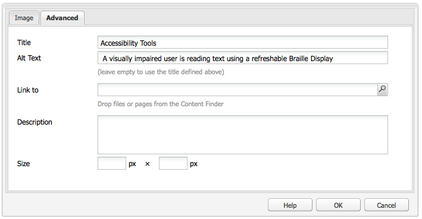

# 建立可存取的內容 (符合 WCAG 2.0){#creating-accessible-content-wcag-conformance}

>[!CAUTION]
>
>由於6.4中不建議使用AEMClassic UI，因此尚未為WCAG 2.1更新此頁上的內容。
>
>有關和WCAG 2.1的詳AEM細資訊，請參閱以下頁：
>
>* [和AEMWeb輔助功能指南](/help/managing/web-accessibility.md)
>* [WCAG 2.1 快速指南](/help/managing/qg-wcag.md)
>* [建立可存取的內容 (符合 WCAG 2.1)](/help/sites-authoring/creating-accessible-content.md)


WCAG 2.0 包含一系列無需仰賴技術的指引和成功標準，有助身心障礙人士存取與使用網路內容。

>[!NOTE]
>
>另請參閱:
>
>* 我們 [WCAG 2.0快速指南](/help/managing/qg-wcag.md) 更多詳細資訊
>* [配置富格文本編輯器以生成可訪問內容](/help/sites-administering/rte-accessible-content.md)
>


這些級別按三個一致性級別分級：A級（最低）、A級和AAA級（最高）。 簡而言之，這些級別定義如下：

* **** A級：您的網站達到基本的最低協助功能等級。要達到此級別，將滿足所有A級成功標準。
* **** AA級：這是您努力追求的最佳無障礙環境支援等級，其中您的網站可達到更高的無障礙環境支援等級，因此大部分使用者都可使用大部分的技術。要達到此級別，將滿足所有A級和A級成功標準。
* **** AAA級：您的網站可達到非常高的協助功能。要達到此級別，將滿足所有A級、AA級和AAA級成功標準。

建立網站時，您必須決定要讓網站遵循的整體等級。

以下部分顯示 [WCAG 2.0准則](https://www.w3.org/TR/WCAG20/#guidelines) A級和AA級的相關成功標準 [一致性級別](https://www.w3.org/TR/UNDERSTANDING-WCAG20/conformance.html)。

>[!NOTE]
>
>由於不可能滿足某些類型內容的所有級別AAA成功標準，因此建議不將此級別的一致性作為一般策略要求。

>[!NOTE]
>
>在本文檔中，我們使用：
>
>* 這些人的短名 [WCAG 2.0准則](https://www.w3.org/TR/WCAG20/#guidelines)。
>* 在 [WCAG 2.0准則](https://www.w3.org/TR/WCAG20/#guidelines) 以便與WCAG網站交叉引用。
>


## 原則1:可感知 {#principle-perceivable}

[原則1:可感知 — 資訊和用戶介面元件必須以用戶能夠感知的方式顯示給用戶。](https://www.w3.org/TR/WCAG20/#perceivable)

### 文本替代(1.1) {#text-alternatives}

[准則1.1案文備選方案：為任何非文本內容提供文本替代，以便將其轉換為人們需要的其他形式，如大型打印、盲文、語音、符號或更簡單的語言。](https://www.w3.org/TR/WCAG20/#text-equiv)

### 非文本內容(1.1.1) {#non-text-content}

* 成功標準1.1.1
* A級
* 非文本內容：呈現給用戶的所有非文本內容都有一個文本替代項，該文本替代項服務於相同目的，下面列出的情況除外。

#### 目的 — 非文本內容(1.1.1) {#purpose-non-text-content}

網頁上的資訊可以以多種不同的非文本格式提供，如圖片、視頻、動畫、圖表和圖形。 失明或視力嚴重受損的人無法看到非文本內容，但他們可以通過讓螢幕閱讀器讀取文本內容或通過盲文顯示設備以觸覺形式呈現來訪問文本內容。 因此，通過提供圖形格式內容的文本替代選項，無法查看圖形內容的人可以訪問內容所提供的資訊的等效版本。

一個有用的附加好處是，文本替代方案使非文本內容能夠通過搜索引擎技術進行索引。

#### 如何見面 — 非文本內容(1.1.1) {#how-to-meet-non-text-content}

對於靜態圖形，基本要求是為圖形提供等效的文本替換。 可以在 **替代文字** 欄位：

>[!NOTE]
>
>有些現成可用的元件(例如 **Carousel** 和 **Slideshow** )不提供將替代文字說明新增至影像的方式。為實例實施這些版本AEM時，您的開發團隊需要配置這些元件以支援 `alt` 屬性，以便作者可以將其添加到內容(請參見 [添加對附加HTML元素和屬性的支援](/help/sites-administering/rte-accessible-content.md#add-support-for-more-html-elements-and-attributes))。

的 **替代文字** 的 **高級** 影像屬性頁籤 **影像** 元件對話框：



添AEM加 **替代文字** 預設情況下。 對於傳統UI，預設屬性的建立方式有兩種不同的方案(儘管預設值可能不足以作為替代，並且很可能需要在 **高級** 影像屬性頁籤):

* 檔案:

   從用戶的硬碟上載影像。 如果將影像元件添加到頁面，然後從硬碟或其他源中選擇影像，則預設值 **替代文字** 是 `file`。 必須在 **高級** 影像屬性頁籤。 同樣，此值不顯示在 **替代文字** 欄位，但當值更改時，新值將顯示在欄位中。

* 資產:

   從數字資產庫添加影像。 如果將影像從數字資產儲存庫拖動到網頁，則 **標題** 和 **替代文字** 該影像的值將從該影像的元資料中提取。

>[!NOTE]
>
>在以上兩種情況下， **替代文字** 值在中不可見 **高級映像屬性** 頁籤。 要更改預設值，只需在 **替代文字** 的子菜單。

>[!NOTE]
>
>如果您的影像純粹是裝飾性的(請參閱 [建立好文本選項](#creating-good-text-alternatives))，您可以在 **替代文字** 的子菜單。 這將建立空 `alt` 屬性，提示螢幕閱讀器忽略影像。

#### 建立好文本選項 {#creating-good-text-alternatives}

非文本內容有多種形式，因此文本替換的價值取決於圖形在網頁中所扮演的角色。 以下是一些一般經驗法則：

* 案文備選案文應簡潔明瞭，但應清楚地掌握非文本內容提供的基本資訊。
* 應避免過長的描述（超過100個字元）。 如果文本替代項需要更多詳細資訊：

   * 在備選文本中提供簡短說明
   * 在同一頁或單獨網頁的其他位置的文本中有較長的說明。 通過使影像成為連結或將文本連結置於影像旁邊來連結到此單獨的說明。

* 備選文本不應複製同一頁面上附近文本表單中提供的內容。 請記住，許多影像是頁面文本中已涵蓋的點的插圖，因此可能已存在詳細的文本替代選項。
* 如果非文本內容是指向另一頁或文檔的連結，並且沒有其他文本構成同一連結的一部分，則影像的替代文本必須指示連結的目的地，而不是描述影像。
* 如果非文本內容包含在按鈕元素中，並且沒有文本構成同一按鈕的一部分，則影像的替代文本必須指示按鈕的功能，而不是描述影像。
* 為影像指定空（空）替代文本是完全可接受的，但前提是該影像沒有替代文本（例如，它是純裝飾圖形），或者頁面文本中已存在等效文本。

的 [W3C草稿：HTML5用於提供有用文本替代的技術](https://dev.w3.org/html5/alt-techniques/) 提供了更多詳細資訊和示例，說明了針對不同類型影像的適當替代文本設定。

需要文本替代的特定類型的非文本內容可能包括：

* 說明性照片：

   這些是人、物體或地方的影像。 想想照片在頁面上的作用；適當的文本等價物可能 *照片 [對象]*，但可能取決於周圍的文本。

* 表徵圖：

   這些是傳輸特定資訊的小像形圖（圖形）。 必須在頁面和站點上始終使用它們。 頁面或站點上表徵圖的所有實例都應具有相同的簡短文本選項，除非這樣做會導致相鄰文本的不必要的重複。

* 圖表和圖形：

   這些通常表示數值資料。 因此，提供文本替代選項的一個選項可能是包含圖表或圖形中顯示的主要趨勢的簡短摘要。 如有必要，還可使用 **說明** 的 **高級** 影像屬性頁籤。 此外，您還可以以表格形式在頁面或站點的其他位置提供源資料。

   

   要為此示例圖表提供替代方法，請添加一個簡明的 `alt` 文本到影像本身，然後使用全文替代項跟蹤影像。

   ```xml
   <p></p>
   <p> Figure 1. Distribution of Articles by Journal Category.
   Pie chart: Language=68%, Education=14% and Science=18%.</p>
   ```

   >[!NOTE]
   >
   >上面的代碼段僅用於說明順序。 建議使用 **影像** 元件(而不是 `img src` 上面使用的引用。

   在AEM此操作中，可以使用 **替代文字** 和 **說明** 映像的「配置」對話框中的欄位 — 如中所示 [如何見面 — 非文本內容(1.1.1)](#how-to-meet-non-text-content)。

* 映射、圖、流程圖：

   用於提供空間資料的圖形(例如。 若要支援描述物件或程式之間的關係)，請確定關鍵訊息是以文字格式提供。對於地圖，提供等同全文的地圖可能不切實際，但如果提供地圖以幫助人們找到特定位置的方式，則地圖影像的替代文字可以簡短地標示 *X*，然後在頁面其他地方的文字或透過 **Image元件的「** Advanced **」 (進階) 索引標籤中的「** Description **** 」 (說明) 欄位，提供指向該位置的指示。

* 驗證碼：

   驗證碼是 *完全自動化的公共圖靈test將電腦和人區分開來*。 它是用於網頁上的安全檢查，用於區分人和惡意軟體，但會造成訪問障礙。 這些映像需要用戶描述他們看到的內容，以便通過安全test。 為影像提供文本替代顯然是不可能的，因此您需要考慮其他非圖形解決方案。

   W3C提出了一些建議，如：

   * 邏輯謎題
   * 使用聲音輸出而不是影像
   * 帳戶和垃圾郵件過濾器使用有限。

* 背景影像：

   這些是使用層疊樣式表(CSS)而不是在HTML中實現的。 這意味著無法指定替代文本值。 因此，背景影像不應提供重要的文本資訊 — 如果提供了，則還必須在頁面文本中提供此資訊。

   但是，當無法顯示影像時，必須顯示替代背景。

   >[!NOTE]
   >
   >背景和前景文本之間應有適當的對比度；在 [對比度（最小值）(1.4.3)](#contrast-minimum)。

#### 詳細資訊 — 非文本內容(1.1.1) {#more-information-non-text-content}

* [瞭解成功標準1.1.1](https://www.w3.org/TR/UNDERSTANDING-WCAG20/text-equiv-all.html)
* [如何滿足成功標1.1.1](https://www.w3.org/WAI/WCAG20/quickref/#text-equiv)
* [W3C:HTML5提供有用案文備選案文的技術（草案）](https://dev.w3.org/html5/alt-techniques/)
* [驗證碼的W3C解釋和替代](https://www.w3.org/TR/turingtest/)

### 基於時間的介質(1.2) {#time-based-media}

[准則1.2基於時間的介質：為基於時間的介質提供替代方案。](https://www.w3.org/TR/WCAG20/#text-equiv)

這涉及的Web內容 *基於時間*。 這包括用戶可以播放的內容（例如視頻、音頻和動畫內容），並且可以預先錄制或即時流。

### 僅音頻和僅視頻（預錄制）(1.2.1) {#audio-only-and-video-only-pre-recorded}

* 成功標準1.2.1
* A級
* 僅音頻和僅視頻（預錄）:對於預錄的純音頻和純視頻媒體，除非音頻或視頻是文本的替代介質，並且明確標籤為：

   * 僅預錄音頻：提供了用於基於時間的媒體的替代方案，其提供用於預錄的僅音頻內容的等效資訊。
   * 僅預錄視頻：提供了用於基於時間的媒體或音頻軌道的替代方案，其提供用於預錄的僅視頻內容的等效資訊。

#### 用途 — 僅音頻和僅視頻（預錄）(1.2.1) {#purpose-audio-only-and-video-only-pre-recorded}

視頻和音頻的可訪問性問題可能會通過以下方式出現：

* 沒有原聲帶或原聲帶時，視覺受損者不足以告知視頻或動畫中的情況；
* 聽障者，聾者，聽不到配樂；
* 能聽到原聲帶但不理解正在說什麼的人（例如，因為他們聽不懂的語言）。

使用瀏覽器或設備的用戶也可能無法使用視頻或音頻，這些瀏覽器或設備不支援以特定媒體格式播放內容，如AdobeFlash。

以不同格式提供此資訊(如文本（或無音頻的視頻的音頻）可使無法訪問原始內容的人能夠訪問此資訊。

#### How to Meet — 僅音頻和僅視頻（預錄）(1.2.1) {#how-to-meet-audio-only-and-video-only-pre-recorded}

* 如果內容是預錄的無視頻音頻（如播客）:

   * 在內容之前或之後提供指向音頻內容的文本記錄的連結。

      筆錄應是HTML頁面，其文本相當於所有口語和重要的非口語內容，並應包括說話者的指示、設定描述、聲音表達以及任何其他重要音頻的描述。

* 如果內容是動畫或預錄制的無音頻視頻：

   * 在內容之前或之後提供連結，以表示視頻所提供資訊的等效文本描述
   * 或者使用常用音頻格式（如MP3）的等效音頻描述。

>[!NOTE]
>
>如果提供音頻或視頻內容作為網頁上已存在的另一種格式的內容的替代，則無需遵循上述要求。 例如，如果視頻說明了文本說明的清單，則此視頻不需要替代，因為文本說明已充當視頻的替代。

將多媒體(尤其是Flash內容)插AEM入網頁與插入影像類似。 然而，由於多媒體內容遠不止是靜止影像，因此有各種不同的設定和選項來控制多媒體的播放方式。

>[!NOTE]
>
>在將多媒體與資訊內容一起使用時，還必須建立到替代選項的連結。 例如，要包括文本記錄，請建立HTML頁以顯示記錄，然後在音頻內容旁或下添加連結。

#### 詳細資訊 — 僅音頻和僅視頻（預錄）(1.2.1) {#more-information-audio-only-and-video-only-pre-recorded}

* [瞭解成功標準1.2.1](https://www.w3.org/TR/UNDERSTANDING-WCAG20/media-equiv-av-only-alt.html)
* [如何滿足成功標1.2.1](https://www.w3.org/WAI/WCAG20/quickref/#media-equiv)

### 字幕（預錄）(1.2.2) {#captions-pre-recorded}

* 成功標準1.2.2
* A級
* 字幕（預錄）:為同步媒體中所有預先錄制的音頻內容提供字幕，除非該媒體是文本的替代媒體並且被清楚地標籤為這樣。

#### 目的 — 字幕（預錄）(1.2.2) {#purpose-captions-pre-recorded}

聾人，聾人，聽力障礙者，無法或者很難獲取音頻內容。 字幕是在視頻期間的適當時間在螢幕上顯示的口語和非口語音頻的文本等效項。 它們讓聽不到音頻的人理解正在發生的事情。

>[!NOTE]
>
>在視頻或動畫的同一頁面上提供合適的文本或非文本等效（直接提供等效資訊）時，不需要字幕。

#### How to Meet - Captions（預錄）(1.2.2) {#how-to-meet-captions-pre-recorded}

字幕可以是：

* 開啟：播放視頻時始終可見)
* 關閉：字幕可由用戶開啟或關閉

盡可能使用隱藏字幕，因為這樣用戶就可以選擇是否查看字幕。

對於隱藏字幕，您需要以適當的格式建立並提供同步字幕檔案(如 [SMIL](https://www.w3.org/AudioVideo/))旁邊(有關如何執行此操作的詳細資訊超出本指南的範圍，但我們提供了指向以下部分教程的連結 [詳細資訊 — 字幕（預錄）(1.2.2)](#more-information-captions-pre-recorded))。 確保您提供備注，讓用戶知道字幕可用於視頻。

如果必須使用開放字幕，請將文本嵌入視頻軌道。 這可以通過使用允許將標題疊置到視頻上的視頻編輯應用程式來實現。

#### 詳細資訊 — 字幕（預錄）(1.2.2) {#more-information-captions-pre-recorded}

* [瞭解成功標準1.2.2](https://www.w3.org/TR/UNDERSTANDING-WCAG20/media-equiv-captions.html):
* [如何滿足成功標1.2.2](https://www.w3.org/WAI/WCAG20/quickref/#media-equiv)
* [W3C:同步多媒體](https://www.w3.org/AudioVideo/)
* [字幕、筆錄和音頻說明 — 由WebAIM提供](https://webaim.org/techniques/captions/)

### 音頻說明或介質替代（預錄制）(1.2.3) {#audio-description-or-media-alternative-pre-recorded}

* 成功標準1.2.3
* A級
* 音頻說明或介質替代（預錄）:為同步媒體提供基於時間的媒體或預錄視頻內容的音頻描述的替代方案，除非媒體是文本的替代媒體並且被清楚地標籤為這樣。

#### 用途 — 音頻說明或媒體替代（預錄）(1.2.3) {#purpose-audio-description-or-media-alternative-pre-recorded}

如果視頻或動畫中的資訊僅以視覺方式提供，或者如果背景音樂沒有提供足夠的資訊來讓人們瞭解視覺上正在發生的事情，則盲人或視覺障礙者將體驗無障礙。

#### How to Meet - Audio Description或Media Alterant（預錄）(1.2.3) {#how-to-meet-audio-description-or-media-alternative-pre-recorded}

為了達到這一成功標準，可以採用兩種方法。 兩者皆可接受：

1. 包括視頻內容的其他音頻說明。 這可以通過以下三種方式之一實現：

   * 在現有對話框中暫停期間，提供有關未作為現有音頻軌道一部分呈現的場景更改的資訊；
   * 提供新的、附加的和可選的音頻軌道，其中包含原始音軌，但還包括有關場景更改的附加音頻資訊。

      * 這允許用戶在現有音頻軌道之間切換( *不* 包含音頻說明)和新音頻軌道( *是* 包含音頻說明)。
      * 這防止了不需要附加說明的用戶中斷。
   * 建立視頻內容的第二版本，以允許擴展音頻說明。 這通過在適當點暫停音頻和視頻，減少了在現有對話之間的間隙中提供詳細音頻描述的困難。 因此，在再次開始操作之前，可以給出更長的音頻描述。 如上例所示，最好將其作為可選的附加音頻軌道提供，以防止對不需要附加說明的用戶造成中斷。


1. 提供與視頻或動畫的音頻和視覺元素等價的適當文本文本記錄。 這應當包括，在適當情況下，說明說話者，說明情況，聲音表達。 視其長度而定，可以將文字記錄放在視頻或動畫的同一頁面，或放在單獨的頁面上；如果選擇後一個選項，請提供視頻或動畫旁邊的文字記錄的連結。

有關如何建立音頻描述視頻的詳細資訊超出本指南的範圍。 建立視頻和音頻說明可能非常耗時，但其他Adobe產品可幫助完成這些任務。 如果在Adobe Flash Professional建立內容，還應建立一個指令碼，提示用戶下載相應的插件，並通過 `<noscript>` 的子菜單。

#### 詳細資訊 — 音頻說明或媒體替代（預錄）(1.2.3) {#more-information-audio-description-or-media-alternative-pre-recorded}

* [瞭解成功標準1.2.3](https://www.w3.org/TR/UNDERSTANDING-WCAG20/media-equiv-audio-desc.html):
* [如何滿足成功標1.2.3](https://www.w3.org/WAI/WCAG20/quickref/#qr-media-equiv-audio-desc)
* [Adobe EncoreCS5](https://www.adobe.com/products/premiere/encore/)

### 字幕（即時）(1.2.4)  {#captions-live}

* 成功標準1.2.4
* AA級
* 字幕（即時）:為同步媒體中的所有即時音頻內容提供字幕。

#### 目的 — 字幕（即時）(1.2.4) {#purpose-captions-live}

此成功標準與 [字幕（預錄）](#captions-pre-recorded) 因為它解決了聾人或聽力受損者所經歷的無障礙障礙障礙，但這一成功標準涉及網路廣播等即時演示。

#### How to Meet - Captions(Live)(1.2.4) {#how-to-meet-captions-live}

遵循為 [字幕（預錄）](#captions-pre-recorded) 上。 但是，由於媒體的現場性質，必須盡快建立字幕設定，並應對正在發生的情況。 因此，您應考慮使用即時字幕或語音到文本工具。

詳細說明超出了本文檔的範圍，但以下資源提供了有用的資訊：

* [WebAIM:即時字幕](https://www.webaim.org/techniques/captions/realtime.php)
* [AccessIT（華盛頓大學）:能否使用語音識別自動生成字幕？](https://www.washington.edu/accessit/articles?1209)

#### 詳細資訊 — 字幕（即時）(1.2.4) {#more-information-captions-live}

* [瞭解成功標準1.2.4](https://www.w3.org/TR/UNDERSTANDING-WCAG20/media-equiv-real-time-captions.html)
* [如何滿足成功標1.2.4](https://www.w3.org/WAI/WCAG20/quickref/#qr-media-equiv-real-time-captions)

### 音頻說明（預錄制）(1.2.5)  {#audio-description-pre-recorded}

* 成功標準1.2.5
* AA級
* 音頻說明（預錄）:為同步媒體中的所有預錄視頻內容提供音頻描述。

#### 用途 — 音頻說明（預錄）(1.2.5) {#purpose-audio-description-pre-recorded}

此成功標準與 [音頻說明或介質替代（預錄制）](#audio-description-or-media-alternative-pre-recorded)，但作者必須提供更詳細的音頻說明才能符合AA級。

#### How to Meet — 音頻說明（預錄）(1.2.5) {#how-to-meet-audio-description-pre-recorded}

遵循為 [音頻說明或介質替代（預錄制）](#audio-description-or-media-alternative-pre-recorded)。

#### 詳細資訊 — 音頻說明（預錄）(1.2.5) {#more-information-audio-description-pre-recorded}

* [瞭解成功標準1.2.5](https://www.w3.org/TR/UNDERSTANDING-WCAG20/media-equiv-audio-desc-only.html)
* [如何滿足成功標1.2.5](https://www.w3.org/WAI/WCAG20/quickref/#qr-media-equiv-audio-desc-only)

### 適應性(1.3) {#adaptable}

[准則1.3適應性：建立可以以不同方式（例如更簡單的佈局）呈現的內容，而不會丟失資訊或結構。](https://www.w3.org/TR/WCAG20/#content-structure-separation)

本准則涵蓋支援以下人員所需的要求：

* 可能無法訪問作者在*標準*二維、多列、彩色網頁佈局中提供的資訊

* 可以使用純音或可選的視覺顯示，如大文本或高對比度。

### 資訊和關係(1.3.1)  {#info-and-relationships}

* 成功標準1.3.1
* A級
* 資訊和關係：通過演示所傳達的資訊、結構和關係可以以寫程式方式確定或以文本形式提供。

#### 目的 — 資訊和關係(1.3.1) {#purpose-info-and-relationships}

殘疾人使用的許多輔助技術都依靠結構資訊來有效顯示或輸出內容。 此結構資訊可以採用頁面標題、表行和列標題以及清單類型的形式。 例如，螢幕閱讀器允許用戶在從標題到標題的頁面中導航。 然而，當頁面內容似乎只通過視覺造型而非底層HTML具有結構時，則輔助技術沒有可用的結構資訊，限制了它們支援更方便瀏覽的能力。

存在這種成功標準是為了確保通過HTML提供這種結構性資訊，以便瀏覽器和輔助技術能夠訪問和利用這些資訊。

#### 如何會面 — 資訊和關係(1.3.1) {#how-to-meet-info-and-relationships}

AEM使用適當的HTML元素構建網頁變得容易。 在RTE（文本元件）中開啟頁面內容，然後使用 **格式** 的子菜單。

下圖顯示了已作為段落文本設定樣式的文本；正在使用的原始碼視圖顯示它具有正確的開啟和關閉 &lt;p> 和 &lt;/p> 標籤。


您可以通過以下方式確保您的網頁具有適當的結構：

* **使用標題：**

   只要啟用了RTE的輔助功能(請參見 [AEM和輔助功能](/help/sites-administering/rte-accessible-content.md))，提AEM供3級頁標題。 您可以使用這些項目來識別內容的區段和子區段。標題1是標題的最高級別，標題3是最低級別。系統管理員可以配置系統以允許使用更多標題級別。

   下圖演示了不同類型標題的示例。

   

* **強調的文本**:

   使用或元素指示強調。 請勿使用標題來反白標示段落中的文字。

   * 突出顯示要強調的文本；
   * 按一下 **B** 表徵圖 &lt;strong>)或 **我** 表徵圖 &lt;em>) **屬性** 面板(確保已選擇HTML)。

   >[!NOTE]
   >
   >標準安裝中AEM的RTE設定為使用：
   >
   >* &lt;b> 為 &lt;strong>
   * &lt;i> 為 &lt;em>

   它們實際上是相同的，但且更好，因為它們在語義上是正確的html。 您的開發團隊可以配置RTE以在開發項目實例時使用和(而不是和)。

* **使用清單**:您可以使用HTML來指定三種不同的清單類型：

   * 的 `<ul>` 元素用於 *未排序* 清單（項目符號）清單。 使用 `<li>` 的子菜單。

      在RTE中，使用 **項目符號清單** 表徵圖

   * 的 `<ol>` 元素用於 *編號* 清單。 使用 `<li>` 的子菜單。

      在RTE中，使用 **編號清單** 表徵圖
   如果要將現有內容更改為特定清單類型，請突出顯示相應的文本並選擇相應的清單類型。 如前面顯示如何輸入段落文本的示例所示，相應的清單元素將自動添加到您的HTML中，但您可以在源編輯視圖中查看此內容。

   >[!NOTE]
   `<dl>` RTE不支援。

* **使用表**:

   必須使用HTML表元素標識資料表：

   * 一個 `<table>` 元素
   * a `<tr>` 表中每行的元素
   * a `<th>` 每行和列標題的元素
   * a `<td>` 每個資料單元格的元素

   >[!NOTE]
   應使用 **表格** 元件。 雖然可以在文本元件中建立表，但不建議這樣做。

   此外，可訪問的表還使用以下元素和屬性：

   * 的 `<caption>` 元素用於為表提供可見的標題。 預設情況下，字幕顯示在表格的中心位置，但可以使用CSS進行適當定位。 字幕以寫程式方式與表相關聯，因此它是提供內容介紹的有用方法。
   * 的 `<h3 class="summary">` 元素通過提供有視力的用戶能夠看到的內容的概要，幫助無視的用戶更輕鬆地理解表中顯示的資訊。 在使用複雜或非常規表佈局時，這特別有用（此屬性不顯示在瀏覽器中，它只讀於輔助技術）。
   * 的 `scope` 屬性 `<th>` 元素用於指示單元格是否代表特定行的標題或特定列的標題。 類似的方法是在複雜表中使用頭和id屬性，其中資料單元可與一個或多個頭相關聯。

   >[!NOTE]
   預設情況下，這些元素和屬性不直接可用，儘管系統管理員可以在 **表屬性** 對話框，請參閱 [添加對附加HTML元素和屬性的支援](/help/sites-administering/rte-accessible-content.md#add-support-for-more-html-elements-and-attributes))。

   添加 **表格** 您可以配置 **表屬性** 對話框。

   * 適當 **標題**。
   * 理想情況下，請移除「寬 **度」、「邊框高度」、「邊框高度」、「邊框高度**」、「單元格間距」、「單元格間距 **」、「單元格**************&#x200B;間距」的預設值。因為這些屬性可以在全局樣式表中設定。

   

   然後，您可以使用 **單元格屬性** 選擇單元格是資料還是標題單元格，如果標題單元格，則選擇它是與行還是列相關，還是兩者兼有：

   

* **複雜資料表：**

   在某些情況下，如果存在具有兩個或更多級別標題的複雜表，則基本表屬性可能不足以提供所有必要的結構資訊。 對於這些類型的複雜表格，需要使用header和 **id屬性在標題及其相關儲存格之間建** 立直 **接** 關係。例如，在下表的標題和ID中，會對輔助技術使用者進行程式化關聯。

   >[!NOTE]
   id屬性在出廠安裝中不可用。 可以通過在RTE中配置HTML規則和序列化程式來啟用它。

   >[!NOTE]
   應使用 **表格** 元件。 雖然可以在文本元件中建立表，但不建議這樣做。

   ```xml
   <table>
      <tr>
        <th rowspan="2" id="h">Homework</th>
        <th colspan="3" id="e">Exams</th>
        <th colspan="3" id="p">Projects</th>
      </tr>
      <tr>
        <th id="e1" headers="e">1</th>
        <th id="e2" headers="e">2</th>
        <th id="ef" headers="e">Final</th>
        <th id="p1" headers="p">1</th>
        <th id="p2" headers="p">2</th>
        <th id="pf" headers="p">Final</th>
      </tr>
      <tr>
       <td headers="h">15%</td>
       <td headers="e e1">15%</td>
       <td headers="e e2">15%</td>
       <td headers="e ef">20%</td>
       <td headers="p p1">10%</td>
       <td headers="p p2">10%</td>
       <td headers="p pf">15%</td>
      </tr>
     </table>
   ```

   要在中實現AEM此目的，必須使用源編輯模式直接添加標注。

   >[!NOTE]
   此功能在標準安裝中不能立即使用。 它需要配置RTE;HTML規則和序列化程式。

#### 詳細資訊 — 資訊和關係(1.3.1) {#more-information-info-and-relationships}

* [瞭解成功標準1.3.1](https://www.w3.org/TR/UNDERSTANDING-WCAG20/content-structure-separation-programmatic.html)
* [如何滿足成功標1.3.1](https://www.w3.org/WAI/WCAG20/quickref/#qr-content-structure-separation-programmatic)

### 感官特徵(1.3.3)  {#sensory-characteristics}

* 成功證書1.3.3
* A級
* 感官特徵：為理解和操作內容而提供的說明不僅依賴於部件的感官特徵，如形狀、大小、視覺位置、方向或聲音。

#### 目的 — 感官特性(1.3.3) {#purpose-sensory-characteristics}

設計人員在展示資訊時通常關注視覺設計特徵，如顏色、形狀、文本樣式或內容的絕對或相對位置。 這些設計技術在傳遞資訊時可能非常強大，但是盲人或視覺障礙者可能無法訪問需要視覺識別屬性的資訊，如位置、顏色或形狀。

同樣，需要區分不同聲音（例如，男性或女性口語內容）的資訊，如果沒有反映在音頻內容的任何文本替代中，將給聽力受損者帶來無障礙障礙。

>[!NOTE]
有關顏色替代品的要求，請參閱 [顏色的使用](#use-of-color)。

#### 如何滿足 — 感官特性(1.3.3) {#how-to-meet-sensory-characteristics}

確保還以替代格式顯示依賴於頁面內容視覺特徵的任何資訊。

* 不要依靠視覺定位來提供資訊。 例如，如果要將用戶引導到頁面右側的菜單，以便訪問更多資訊，請不要引用 *右邊的菜單*;而是將菜單命名（例如，通過標題）並在文本中引用該名稱。
* 不要依賴文本樣式（例如，粗體或斜體文本）作為傳遞資訊的唯一方式。

>[!NOTE]
如果理解描述性術語在非視覺上下文中具有含義，則使用描述性術語將是可接受的。 例如，使用 *上* 和 *下* 通常可以接受，因為它們分別暗示某一內容項之前和之後的內容；當內容被大聲說出來時，這仍然有意義。

#### 更多資訊 — 感官特性(1.3.3) {#more-information-sensory-characteristics}

* [瞭解成功標準1.3.3](https://www.w3.org/TR/UNDERSTANDING-WCAG20/content-structure-separation-understanding.html)
* [如何滿足成功標1.3.3](https://www.w3.org/WAI/WCAG20/quickref/#qr-content-structure-separation-understanding)

### 可區分(1.4) {#distinguishable}

[准則1.4可區分：使用戶更容易查看和聽取內容，包括將前景與背景分開。](https://www.w3.org/TR/WCAG20/#visual-audio-contrast)

### 顏色的使用(1.4.1)  {#use-of-color}

* 成功標準1.4.1
* A級
* 顏色的使用：顏色不是傳遞資訊、指示動作、提示響應或區分可視元素的唯一視覺手段。

>[!NOTE]
此成功標準特別針對顏色感知。 其他形式的感知 [適應性(1.3)](#adaptable);包括對顏色的寫程式訪問和其他視覺呈現編碼。

#### 用途 — 顏色的使用(1.4.1) {#purpose-use-of-color}

顏色是提高網頁審美感的一種有效途徑，在資訊傳遞方面也是有用的。 但是，從盲目性到彩色視覺缺陷，都存在著一系列視覺缺陷，這意味著有些人無法分辨出某些顏色。 這使得顏色編碼成為提供資訊的不可靠方式。

例如，有紅綠色視覺缺陷的人，將無法區分綠色和紅色。 他們可能將這兩種顏色都視為第三種顏色（例如，棕色），在這種情況下，他們將無法區分紅色、綠色和棕色。

此外，使用純文字檔案瀏覽器、單色顯示設備或查看頁面黑白打印輸出的人無法感知顏色。

#### 如何相遇 — 顏色的使用(1.4.1) {#how-to-meet-use-of-color}

無論使用顏色來傳遞資訊，都要確保資訊可用而無需查看顏色。

例如，確保在文本中也明確提供由顏色提供的資訊。 下圖顯示了顏色和文本如何指示效能的座位可用性：

<table>
 <tbody>
  <tr>
   <td><p><strong>效能</strong></p> </td>
   <td><p><strong>可用性</strong></p> </td>
  </tr>
  <tr>
   <td><p>星期二3月16日<sup>第</sup></p> </td>
   <td><p>可用座位</p> </td>
  </tr>
  <tr>
   <td><p>星期三3月17日</p> </td>
   <td><p>可用座位</p> </td>
  </tr>
  <tr>
   <td><p>星期四3月18日<sup>第</sup></p> </td>
   <td><p>已售</p> </td>
  </tr>
 </tbody>
</table>

如果顏色用作提供資訊的提示，則應提供附加的視覺提示，如更改樣式（如粗體、斜體）或字型。 這有助於視力低或視力不足的人識別資訊。 但是，它不能完全靠得住，因為它根本無助於看不到頁面的人。

#### 詳細資訊 — 顏色的使用(1.4.1) {#more-information-use-of-color}

* [瞭解成功標準1.4.1](https://www.w3.org/TR/2008/NOTE-WCAG20-TECHS-20081211/working-examples/G183/link-contrast.html)
* [如何滿足成功標1.4.1](https://www.w3.org/TR/2008/NOTE-WCAG20-TECHS-20081211/working-examples/G183/link-contrast.html)
* [關於滿足3:1對比度的指導，包含「Web安全」顏色清單](https://www.w3.org/TR/2008/NOTE-WCAG20-TECHS-20081211/working-examples/G183/link-contrast.html)

### 對比度（最小值）(1.4.3) {#contrast-minimum}

* 成功標準1.4.3
* AA級
* 對比度（最小值）:文本和文本影像的視覺呈現具有至少4.5:1的對比度，以下除外：

   * 大文本：大規模文本和大規模文本的影像具有至少3:1的對比度。
   * 附帶：作為非活動用戶介面元件的一部分、純裝飾、對任何人都不可見、或包含顯著其它可視內容的圖片的一部分的文本或影像沒有對比度要求。
   * 邏輯類型：作為徽標或品牌名稱一部分的文本沒有最低對比度要求。

#### 用途 — 對比度（最小值）(1.4.3) {#purpose-contrast-minimum}

某些視覺缺陷的人可能無法區分某些低對比度顏色對。 如果出現以下情況，則這些人員可能會出現可訪問性問題：

* 文字與背景顏色對比較差。
* 文本（如連結文本和非連結文本）的顏色編碼在識別資訊中是很重要的。

>[!NOTE]
純用於裝飾目的的文本不在此成功標準中。

#### 如何碰合 — 對比度（最小值）(1.4.3) {#how-to-meet-contrast-minimum}

確保文本與其背景充分對比。 對比度取決於所討論文本的大小和樣式：

* 對於大小小於18點（或14點粗體）的文本，文本/影像與背景之間的對比度應至少為4.5:1。
* 對於大小至少為18點（或14點粗體）的文本，對比度應至少為3:1。
* 如果對背景進行陣列，則應對任何文本週圍的背景進行著色，以保持4.5:1或3:1比例。

要檢查對比度，請使用顏色對比度工具，如 [Paciello組顏色對比分析儀](https://www.paciellogroup.com/resources/contrast-analyser.html) 或 [WebAIM顏色對比度檢查器](https://www.webaim.org/resources/contrastchecker/)。 這些工具允許您檢查顏色對並報告任何對比度問題。

或者，如果您不太關心指定頁面的外觀，則可以選擇不指定背景和前景文本顏色。 無需進行對比度檢查，因為用戶的瀏覽器將確定文本和背景的顏色。

如果無法滿足建議的對比度級別，則需要提供指向頁面的替代等效版本（沒有顏色對比度問題）的連結，或允許用戶根據自己的要求調整頁面顏色方案的對比度。

#### 詳細資訊 — 對比度（最小值）(1.4.3) {#more-information-contrast-minimum}

* [瞭解成功標準1.4.3](https://www.w3.org/TR/UNDERSTANDING-WCAG20/visual-audio-contrast-contrast.html)
* [如何滿足成功標1.4.3](https://www.w3.org/WAI/WCAG20/quickref/#qr-visual-audio-contrast-contrast)

### 文本影像(1.4.5) {#images-of-text}

* 成功標準1.4.5
* AA級
* 文本影像：如果所使用的技術能夠實現視覺呈現，則文本用於傳遞資訊而不是文本的影像，以下除外：

   * 可自定義：文本影像可以根據用戶的需求進行可視化定製；
   * 基本：對所傳達的資訊而言，文本的具體呈現至關重要。

>[!NOTE]
Logotypes（屬於徽標或品牌名稱的文本）被認為是必不可少的。

#### 目的 — 文本影像(1.4.5) {#purpose-images-of-text}

當選擇特定文本樣式時，通常使用文本影像；例如，logotype或如果文本是從另一個源生成的（例如，掃描紙面文檔）。 但是，與使用HTML和CSS樣式顯示的文本相比，文本影像缺乏更改視覺障礙或閱讀困難者可能需要的大小或外觀的靈活性。

#### 如何碰面 — 文本影像(1.4.5) {#how-to-meet-images-of-text}

如果必須使用文本影像，則使用CSS將文本影像替換為HTML中的等效文本，以便文本能夠以可自定義的方式可用。 有關如何實現此目標的示例，請參閱 [C30:使用CSS將文本替換為文本影像並提供用戶介面控制項以切換](https://www.w3.org/TR/2008/NOTE-WCAG20-TECHS-20081211/C30)。

#### 詳細資訊 — 文本影像(1.4.5) {#more-information-images-of-text}

* [瞭解成功標準1.4.5](https://www.w3.org/TR/UNDERSTANDING-WCAG20/visual-audio-contrast-text-presentation.html)
* [如何滿足成功標1.4.5](https://www.w3.org/WAI/WCAG20/quickref/#qr-visual-audio-contrast-text-presentation)

## 原則2:可操作 {#principle-operable}

[原則2:可操作 — 用戶介面元件和導航必須可操作。](https://www.w3.org/TR/WCAG20/#operable)

### 暫停、停止、隱藏(2.2.2)  {#pause-stop-hide}

* 成功標準2.2.2
* A級
* 暫停、停止、隱藏：對於移動、閃爍、滾動或自動更新資訊，以下是真的：

   * 移動、閃爍、滾動：對於(a)自動啟動的任何移動、閃爍或滾動資訊，(b)持續超過五秒，(c)與其他內容並行顯示，有一種機制供用戶暫停、停止或隱藏資訊，除非移動、閃爍或滾動是必要活動的一部分；
   * 自動更新：對於(a)自動啟動和(b)與其他內容並行顯示的任何自動更新資訊，用戶有暫停、停止或隱藏更新或控制更新頻率的機制，除非自動更新是必要活動的一部分。

注意事項有：

1. 有關閃爍或閃爍內容的要求，請參閱 [不要以已知導致檢獲的方式設計內容(2.3)](#seizures)。
1. 由於任何不符合此成功標準的內容都可能干擾用戶使用整個頁面的能力，因此網頁上的所有內容（無論是否用於滿足其他成功標準）都必須符合此成功標準。 請參閱 [符合性要求5:無干擾](https://www.w3.org/TR/WCAG20/#cc5)。
1. 不需要由軟體定期更新或被流式傳輸到用戶代理的內容來保留或呈現在暫停開始和恢復演示之間生成或接收的資訊，因為這在技術上可能不可能，並且在許多情況下可能誤導這樣做。
1. 如果在預載入階段或類似情況中不能發生交互，並且如果不指示進度，可能會迷惑用戶或導致他們認為內容已凍結或斷開，則可以認為動畫是必不可少的。

#### 目的 — 暫停、停止、隱藏(2.2.2) {#purpose-pause-stop-hide}

某些用戶可能會發現移動內容會分散注意力，並且難以集中在頁面的其他部分。 此外，對於那些無法跟上移動文本的人來說，這些內容可能很難閱讀。

#### 如何見面 — 暫停、停止、隱藏(2.2.2) {#how-to-meet-pause-stop-hide}

根據內容的性質，在建立包含移動、閃爍或閃爍內容的網頁時，可以應用以下一個或多個建議：

* 提供暫停滾動內容的方法，以給用戶足夠的時間來讀取內容。 例如，新聞標題或自動更新的文本。
* 確保連結內容在五秒後停止閃爍。
* 使用適當的技術來顯示瀏覽器可以禁用的閃爍內容。 例如，圖形交換格式(GIF)或動畫可移植網路圖形(APNG)檔案。
* 在網頁上提供表單控制項，允許用戶禁用頁面上所有閃爍的內容。
* 如果上述任一項不可能，請提供指向包含所有內容但不閃爍的頁面的連結。

#### 詳細資訊 — 暫停、停止、隱藏(2.2.2) {#more-information-pause-stop-hide}

* [瞭解成功標準2.2.2](https://www.w3.org/TR/UNDERSTANDING-WCAG20/time-limits-pause.html)
* [如何滿足成功標2.2.2](https://www.w3.org/WAI/WCAG20/quickref/#qr-time-limits-pause)

### 緝獲量(2.3) {#seizures}

[准則2.3緝獲量：不要以已知會導致癲癇的方式設計內容。](https://www.w3.org/TR/WCAG20/#seizure)

### 三個Flash或低於閾值(2.3.1) {#three-flashes-or-below-threshold}

* 成功標準2.3.1
* A級
* 三個Flash或低於閾值：網頁中不包含在任何一秒週期內閃爍三次以上的內容，或者閃爍低於一般閃爍閾值和紅色閃爍閾值。

>[!NOTE]
由於任何不符合此成功標準的內容都可能干擾用戶使用整個頁面的能力，因此網頁上的所有內容（無論是否用於滿足其他成功標準）都必須符合此成功標準。 請參閱 [符合性要求5:無干擾](https://www.w3.org/TR/WCAG20/#cc5)。

#### 目的 — 三個Flash或低於閾值(2.3.1) {#purpose-three-flashes-or-below-threshold}

在某些情況下，閃爍的內容可能導致感光性癲癇。 此成功標準允許這些用戶訪問和體驗所有內容，而無需擔心內容閃爍。

#### 如何碰頭 — 三個Flash或低於閾值(2.3.1) {#how-to-meet-three-flashes-or-below-threshold}

應採取步驟確保應用以下技術：

* 確保元件在任何一秒鐘內閃爍不超過三次；
* 如果無法滿足上述條件，則在 *小安全區* 像素。 此區域使用複雜公式計算，覆蓋於 [G176:保持閃蒸區足夠小](https://www.w3.org/TR/2008/NOTE-WCAG20-TECHS-20081211/G176)因此，只有在閃爍內容為 *絕對* 必要。

#### 更多資訊 — 三個Flash或低於閾值(2.3.1) {#more-information-three-flashes-or-below-threshold}

* [瞭解成功標準2.3.1](https://www.w3.org/TR/UNDERSTANDING-WCAG20/seizure-does-not-violate.html)
* [如何滿足成功標2.3.1](https://www.w3.org/WAI/WCAG20/quickref/#seizure)

### 標題為(2.4.2)的頁  {#page-titled}

* 成功證書2.4.2
* A級
* 標題為：網頁的標題描述主題或目的。

#### 目的 — 標題為(2.4.2)的頁 {#purpose-page-titled}

此成功標準可幫助每個人快速識別網頁內容，而不必閱讀該頁面。 當在瀏覽器頁籤中開啟多個網頁時，這特別有用，因為該頁籤中顯示了頁面標題，因此可以快速定位。

#### 如何見面 — 標題為(2.4.2)的頁 {#how-to-meet-page-titled}

在中建立新HTML頁AEM時，可以指定頁標題。 確保標題充分描述了頁面的內容，以便訪問者能夠快速確定內容是否與其需求實際相關。

編輯頁面時，還可以編輯頁面標題，該頁面可由 **側腳** - **頁面** 頁籤 **頁面屬性……**

#### 詳細資訊 — 標題為(2.4.2)的頁 {#more-information-page-titled}

* [瞭解成功標準2.4.2](https://www.w3.org/TR/UNDERSTANDING-WCAG20/navigation-mechanisms-title.html)
* [如何滿足成功標2.4.2](https://www.w3.org/WAI/WCAG20/quickref/#qr-navigation-mechanisms-title)

### 連結用途（上下文）(2.4.4)  {#link-purpose-in-context}

* 成功證書2.4.4
* A級
* 連結用途（在上下文中）:每個連結的目的可以單獨從連結文本中確定，也可以從連結文本連同其以寫程式方式確定的連結上下文一起確定，除非在通常情況下連結的目的對用戶是不明確的。

#### 目的 — 連結目的（在上下文中）(2.4.4) {#purpose-link-purpose-in-context}

對所有用戶來說，無論有何損害，通過適當的連結文本明確指示連結的方向至關重要。 這有助於用戶確定他們是否真的想跟隨連結。 對於有目光的用戶，當頁面上有多個連結時（尤其是當頁面上有大量文本時），有意義的連結文本非常有用，因為有意義的連結文本可以更清楚地顯示目標頁面的功能。 而輔助技術的用戶可以更輕鬆地理解上下文之外的連結文本。

#### How to Meet — 連結目的（在上下文中）(2.4.4) {#how-to-meet-link-purpose-in-context}

最重要的是，確保連結的目的在連結的文本中已明確說明。

* 錯誤示例：

   * 文本：有關2010年秋季晚間課程的詳細資訊，請按一下這裡。
   * 原因：它沒有明確無誤地指明目的地。

* 好示例：

   * 文本：2010年秋季的晚間課程 — 詳情。
   * 原因：通過略微調整文本和連結元素的位置，可以改進連結文本：

連結應在各頁上使用一致的措辭，尤其是對於導航欄。 例如，如果指定了指向特定頁的連結 **出版物** 在一頁上，使用其他頁上的文本來確保一致性。

但是，在編寫本文時，標題的使用存在一些問題：

* 標題屬性中包含的文本通常僅作為工具提示彈出窗口可供滑鼠用戶使用，無法使用鍵盤訪問。
* 螢幕閱讀器可以讀出標題屬性，但預設情況下可能無法啟用此功能；因此用戶可能不知道標題屬性存在。
* 很難改變標題文本的外觀，這意味著有些人可能很難或無法閱讀。

因此，雖然標題屬性可用於為連結提供額外的上下文，但要瞭解其局限性，不要將其用作適當的連結文本的替代項。

如果連結由影像組成，請確保該影像的替代文本描述了連結的目標。 例如，如果將書架的影像設定為指向個人出版物的連結，則應閱讀替代文本 **約翰·史密斯的出版物** 不 **書架**。

或者，如果連結錨點除了影像元素之外還包含描述連結用途的文本（因此文本會顯示在影像旁邊），請為影像使用空alt屬性：

```xml
<a href="publications.html">

John Smith’s publications
</a>
```

>[!NOTE]
上面的代碼段是圖，建議使用 **影像** 元件。

雖然建議提供標識連結目的的連結文本而不需要附加上下文，但人們認識到這並非總是可能的。 上下文自由連結可用於以下情況，其HTML示例可在 [如何滿足成功標2.4.4](https://www.w3.org/WAI/WCAG20/quickref/#qr-navigation-mechanisms-refs)。

* 其中連結文本是緊密相關連結清單的一部分，並且包含連結的清單項提供了足夠的上下文。
* 當連結的目的可以從 *前* （非下文）段文本。
* 如果連結包含在資料表中，因此可以從相關標題中明確地識別目的。
* 如果連結清單包含在一組標題中，則標題本身提供了合適的上下文。
* 其中，連結清單包含在嵌套連結中，而嵌套連結上方的父清單項提供了合適的上下文。

在某些情況下，如果頁面上有多個連結（每個連結都以複雜但必要的詳細資訊提供連結的方向），則最好提供顯示完全相同內容但連結文本不如此詳細的網頁替代版本。

或者，可以使用指令碼，使得在連結本身內提供最少量的文本，但是當激活定位在頁面頂部的適當控制項時，連結文本是 *擴展* 進一步細節。 類似的方法是使用CSS *隱藏* 可視用戶的完整連結，但仍將其全部輸出給螢幕閱讀器用戶。 這不屬於本文檔的範圍，但有關如何實現此目標的詳細資訊，請參閱 [更多資訊 — 連結目的（在上下文中）(2.4.4)](#more-information-link-purpose-in-context) 的子菜單。

#### 更多資訊 — 連結目的（在上下文中）(2.4.4) {#more-information-link-purpose-in-context}

* [瞭解成功標準2.4.4](https://www.w3.org/TR/UNDERSTANDING-WCAG20/navigation-mechanisms-refs.html)
* [如何滿足成功標2.4.4](https://www.w3.org/WAI/WCAG20/quickref/#qr-navigation-mechanisms-refs)
* [C7:使用CSS隱藏連結文本的一部分](https://www.w3.org/TR/2008/NOTE-WCAG20-TECHS-20081211/C7)

## 原則3:可以理解 {#principle-understandable}

[原則3:可理解 — 資訊和用戶介面的操作必須可理解。](https://www.w3.org/TR/WCAG20/#understandable)

### 使文本內容可讀且可理解(3.1) {#make-text-content-readable-and-understandable}

[准則3.1可讀：使文本內容可讀且易於理解。](https://www.w3.org/TR/WCAG20/#meaning)

### 頁面語言(3.1.1) {#language-of-page}

* 成功標準3.1.1
* A級
* 頁面語言：每個網頁的預設人工語言可以寫程式確定。

#### 目的 — 頁面語言(3.1.1) {#purpose-language-of-page}

此成功標準的目的是確保正確呈現文本和其他語言內容。 對於螢幕閱讀器用戶，這可確保內容被正確讀取，而視覺瀏覽器更有可能正確顯示某些字元集。

#### How to Meet - Language of Page(3.1.1) {#how-to-meet-language-of-page}

為滿足此成功標準，可以使用 `lang` 屬性 `<html>` 元素。 例如：

* 如果一頁是用英文寫的， `<html>` 元素應讀取：

   `<html lang = "en-gb">`

* 而要呈現為美國英語的頁面，則應採用以下標準：

   `<html lang = "en-us">`

**在AEM中，您的頁面預設語言是在建立頁面時設定，但在編輯頁面時也可以變更，頁面可由** Sidekick **-** Page **標籤-** Page Properties...存取- **Advanced** 頁籤。

#### 詳細資訊 — 頁面語言(3.1.1) {#more-information-language-of-page}

* [瞭解成功標準3.1.1](https://www.w3.org/TR/UNDERSTANDING-WCAG20/meaning-doc-lang-id.html)
* [如何滿足成功標3.1.1](https://www.w3.org/WAI/WCAG20/quickref/#qr-meaning-doc-lang-id)
* 這些代碼基於ISO 639-1。 可在 [W3學校網站](https://www.w3schools.com/tags/ref_language_codes.asp)。

### 部件語言(3.1.2)  {#language-of-parts}

* 成功標準3.1.2
* AA級
* 部件語言：內容中每個段落或短語的人文語言可以以寫程式方式確定，但適當的名稱、技術術語、不確定語言的單詞以及已成為立即環繞文本的本地語言的一部分的單詞或短語除外。

#### 目的 — 部件語言(3.1.2) {#purpose-language-of-parts}

此成功標準的目的與成功標準相似 [頁面語言](#language-of-page)，但適用於單個頁面上包含多種語言內容的網頁（例如，由於引用或不常見的借詞）。

應用此成功標準的頁面允許：

* 盲文轉換軟體，用於插入帶重音字元。
* 螢幕閱讀器可正確讀出那些未使用預設語言的單詞。
* 翻譯工具(如Google翻譯)可將內容從一種語言正確翻譯到另一種語言。

#### How to Meet — 部件語言(3.1.2) {#how-to-meet-language-of-parts}

的 `lang` 屬性可用於標識內容語言中的更改。 例如，德語（ISO 639-1代碼&quot;de&quot;）中的引號如下所示：

```xml
<blockquote cite = "John F. Kennedy" lang = "de">
     <p>Ich bin ein Berliner</p>
 </blockquote>
```

>[!NOTE]
開箱實例中不支援塊引號。 可以開發自定義元件以支援該功能。

同樣，如果 `span` 元素的使用方式如下：

```xml
<p>The only French phrase I know is <span lang = "fr">je ne sais quoi</span>.</p>
```

>[!NOTE]
在包含不同語言的名稱或城市，或使用預設語言中已司空見慣的借詞或短語(如 *幸災樂禍* 英文)。

若要使用適當的語言添加HTML元素，可以在RTE的源編輯模式下手動編輯區域標籤，以便其讀取如上。 或者， `lang` 屬性可由系統管理員包括在RTE中(請參閱 [添加對附加HTML元素和屬性的支援](/help/sites-administering/rte-accessible-content.md#add-support-for-more-html-elements-and-attributes))。

#### 詳細資訊 — 部件語言(3.1.2) {#more-information-language-of-parts}

* [瞭解成功標準3.1.2](https://www.w3.org/TR/UNDERSTANDING-WCAG20/meaning-other-lang-id.html)
* [如何滿足成功標3.1.2](https://www.w3.org/WAI/WCAG20/quickref/#qr-meaning-other-lang-id)

### 幫助用戶避免和更正錯誤(3.3) {#help-users-avoid-and-correct-mistakes}

[准則3.3投入援助：幫助用戶避免和糾正錯誤。](https://www.w3.org/TR/WCAG20/#minimize-error)

### 標籤或說明(3.3.2) {#labels-or-instructions}

* 成功標準3.3.2
* A級
* 標籤或說明：當內容需要用戶輸入時提供標籤或說明。

#### 用途 — 標籤或說明(3.3.2) {#purpose-labels-or-instructions}

提供幫助人們完成表單的說明是介面可用性方面良好實踐的基本部分。 這樣做對於視覺或認知障礙患者特別有幫助，否則他們可能很難理解表單的佈局以及在特定表單域中提供的資料類型。

在添AEM加表單元件(如 **文本欄位**&#x200B;的雙曲餘切值。 此預設標題取決於元件類型。您可以在 **標題和文本** 對話框。 必須確保標籤有助於用戶瞭解與每個表單元件關聯的資料。


此 **標題** 欄位元素必須用於欄位元素，因為它提供了可用於輔助技術的標籤。 僅在欄位旁邊的文本中寫入標籤是不夠的。

對於某些表單元件，您也可以使用「隱藏標題」核取方塊以視覺化方式 **隱藏標籤** 。以此方式隱藏的標籤仍適用於輔助技術，但無法顯示在螢幕上。雖然這在某些情況下是個好方法，但通常最好盡可能加入視覺標籤，因為有些使用者可能會看到畫面的一小部分 (一次看一個欄位)，並需要標籤來正確識別欄位。

#### 影像按鈕 {#image-buttons}

其中使用影像按鈕(例如 **Image Button** 元件)時，編輯對話方塊的「標題」和「文字」索引標籤中的「標題 ******** 」欄位實際上會提供影像的替代文字，而非標籤。因此，在以下範例中，包含文字的影像 `Submit` 的alt文字為 `Submit`，使用編輯對話方塊中的 **Title** 欄位新增。


#### 表單域組 {#groups-of-form-fields}

如果有一組相關控制項，例如 **Radio Group**，則可能需要該群組的標題以及個別控制項。在AEM中新增一組選項按鈕時，「標題 **」欄位會提供此群組標題，而個別標題會指定為選項按鈕(** Items ****)。


不過，群組標題和選項按鈕本身之間沒有程式化關聯。範本編輯人員必須將標題包住必要 `fieldset` 和 `legend` 標籤，才能建立此關聯，而這只能透過編輯頁面原始碼來完成。或者，系統管理員可以添加對這些元素的支援，以便這些元素出現在 **欄位屬性** 對話框（請參見） [添加對附加HTML元素和屬性的支援](/help/sites-administering/rte-accessible-content.md#add-support-for-more-html-elements-and-attributes))。

#### Forms的其他注意事項 {#additional-considerations-for-forms}

如果要以特定格式輸入資料，請在標籤文本中明確這一點。 例如，如果必須在 `DD-MM-YYYY` 格式，具體將其指定為標籤的一部分。 這意味著當螢幕閱讀器用戶遇到該欄位時，標籤將自動被宣佈，並附加有關格式的附加資訊。

如果表單欄位的輸入是必填的，請使用標籤中的必要字詞來清楚說明。AEM在需要欄位時新增星號，但最好將字詞加入標 `required`簽本身(在編輯對話方塊的「 **Title** 」欄位中)。


標籤的定位也很重要，因為它有助於標籤找到相應的欄位。 當用戶面對複雜的表單時，這尤其重要。 按照以下公約執行：

* 複選框或單選按鈕：

   標籤將立即定位在欄位的右側。

* 所有其它表單元件（如文本框、組合框）:

   標籤位於欄位的正上方或正左側。

以功能非常有限的簡單形式，適當標籤 `Submit` 按鈕可用作相鄰欄位的標籤(例如 `Search`)。 在為標籤文本查找空間可能很困難時，此選項非常有用。

#### 詳細資訊 — 標籤或說明(3.3.2) {#more-information-labels-or-instructions}

* [瞭解成功標準3.3.2](https://www.w3.org/TR/UNDERSTANDING-WCAG20/minimize-error-cues.html)
* [如何滿足成功標3.3.2](https://www.w3.org/WAI/WCAG20/quickref/#qr-minimize-error-cues)
