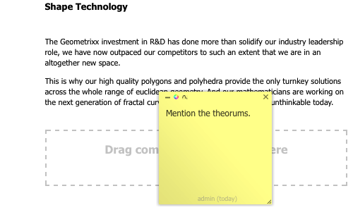

# 編輯頁面時的註解{#annotations-when-editing-a-page}

將內容新增至網站的頁面時，通常會在實際發佈之前先進行討論。 為協助此，許多與內容直接相關的元件（例如，與版面配置相反）可讓您新增註解。

註解會在頁面上放置彩色標籤／便條紙。 註解可讓您（或其他使用者）留下注釋和／或問題給其他作者／審核者。

>[!NOTE]
>
>單個元件類型的定義確定是否可在該元件的實例上添加註釋。

>[!NOTE]
>
>在傳統UI中建立的註解也會顯示在觸控最佳化UI中。 不過，素描是UI專用的，只會顯示在建立素描時的UI中。

>[!CAUTION]
>
>刪除資源（如段落）將刪除該資源附加的所有注釋和草圖；不論其在整頁上的位置。

>[!NOTE]
>
>視您的需求而定，您也可以開發工作流程，在新增、更新或刪除註解時傳送通知。

## 註解 {#annotations}

視段落設計而定，註解可作為上下文菜單上的選項（通常在所需段落上方使用滑鼠右鍵）或作為段落編輯欄上的按鈕使用。

在任一情況下，請選 **取「註解」**。 您會立即處於「編輯」模式，因此會將彩色便條註解套用至段落，讓您直接新增文字：

您可以將注釋移動到頁面上的新位置。 按一下頂部邊框區域，然後按住注釋並同時將注釋拖動到新位置。 雖然以某種方式將頁面連結至段落通常很有意義，但頁面上的任何位置都可以這麼做。

注釋（包括相關草圖）也包括在附加段落上執行的任何複製、剪切或刪除操作中；對於複製或剪切操作，注釋（和相關草繪）的位置保留其相對於原始段落的位置。

也可以通過拖動右下角來增加或減小注釋的大小。

為了追蹤目的，頁尾行會指出建立註解的使用者和日期。 後續作者可以編輯相同的注釋（腳注將會更新），或為同一段落建立新的注釋。

當您選擇刪除注釋時（刪除注釋也會刪除附加到該注釋的所有草繪），將會請求確認。

左上角的三個表徵圖允許您最小化注釋（連同任何相關草繪）、更改顏色和添加草繪。

>[!NOTE]
>
>注釋僅在作者環境的「編輯」模式中可見。
>
>它們在發佈環境中不可見，在作者環境中也無法使用預覽或設計模式。

>[!NOTE]
>
>註解無法新增至已被其他使用者鎖定的頁面。

## 注釋草繪 {#annotation-sketches}

>[!NOTE]
>
>素描在Internet explorer中無法使用，因此：
>
>* 表徵圖將不顯示。
>* 將不顯示在其他瀏覽器中建立的現有草繪。
>

素描是注釋的一個特徵，允許您在瀏覽器窗口（可見部分）的任意位置建立簡單線形：

* 當您處於草繪模式時，游標將變為交叉線。 您可以繪製多條不同的線條。
* 草繪線反映注釋顏色，可以是：

   * freehand

      預設模式；完成時，請釋放滑鼠按鈕。

   * 直線：

      按住 `ALT` 並按一下起點和終點；按兩下即可完成。

* 退出草繪方式後，可按一下草繪線以選取該草繪。
* 通過選取草繪，然後將其拖動到所需位置來移動草繪。
* 素描會覆蓋內容。 這表示在草圖的4個角內，不能按一下基礎段落；例如，如果您需要編輯或存取連結。 如果此問題（例如，您有覆蓋頁面大部分區域的草圖），則將適當的注釋最小化，因為這也會將所有相關草圖最小化，使您能夠訪問基礎區域。
* 要刪除單個草繪——選擇所需的草繪，然後按 **Delete** (**fn**-**backspace** on a MAC)鍵。

* 如果移動或複製段落，則任何相關注釋及其草圖也將被移動或複製；他們對本款的立場將保持不變。
* 如果刪除注釋，則附加到該注釋的所有草繪也將被刪除。

