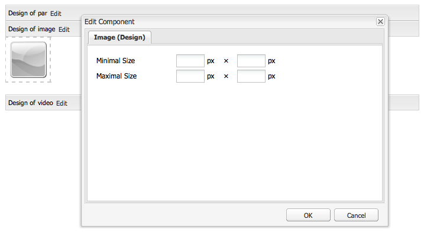

# 在設計模式中設定元件{#configuring-components-in-design-mode}

當現成安裝AEM執行個體時，Sidekick中會立即提供一組元件供您選擇。

除了這些以外，您也可以使用其他各種元件。 您可以使用設計模式 [啟用/停用這類元件](#enabledisablecomponentsusingdesignmode). 啟用並位於您的頁面後，您就可以使用設計模式來 [設定元件設計的各個層面](#configuringcomponentsusingdesignmode) 藉由編輯屬性引數。

>[!NOTE]
>
>編輯這些元件時務必謹慎。 設計設定通常是整個網站設計中不可或缺的一部分，因此這些設定只應由具有適當許可權（和體驗）的人變更，通常是管理員或開發人員。 另請參閱 [開發元件](/help/sites-developing/components.md) 以取得詳細資訊。

這實際上涉及新增或移除頁面段落系統中允許的元件。 段落系統( `parsys`)是包含所有其他段落元件的複合元件。 段落系統可讓作者將不同型別的元件新增至頁面，因為它包含所有其他段落元件。 每個段落型別都會表示為元件。

例如，產品頁面的內容可能包含包含以下內容的段落系統：

* 產品的影像（影像或文欄位落的形式）
* 產品說明（文欄位落）
* 含有技術資料的表格（作為表格段落）
* 使用者填寫的表單（表單開頭、表單元素和表單結尾段落）

>[!NOTE]
>
>另請參閱 [開發元件](/help/sites-developing/components.md#paragraphsystem) 和 [使用範本和元件的准則](/help/sites-developing/dev-guidelines-bestpractices.md#guidelines-for-using-templates-and-components) 有關詳細資訊 `parsys`.

## 啟用/停用元件 {#enable-disable-components}

在設計模式中，Sidekick會最小化，您可以設定可編寫的元件：

1. 若要進入設計模式，請開啟要編輯的頁面，並使用Sidekick圖示：

   

1. 按一下 **編輯** 在段落系統(**平端設計**)。

   

1. 將會開啟一個對話方塊，列出Sidekick中顯示的元件群組及其包含的個別元件。

   視需要選取，以新增或移除sidekick中可用的元件。

   

1. 在設計模式中，Sidekick會最小化。 按一下箭頭可以將Sidekick最大化，並返回編輯模式：

   

## 設定元件設計 {#configuring-the-design-of-a-component}

在「設計」模式中，您也可以為個別元件設定屬性。 每個元件都有自己的引數，以下範例顯示 **影像** 元件：

1. 若要進入設計模式，請開啟要編輯的頁面，並使用Sidekick圖示：

   

1. 您可以設定元件設計。

   例如，如果您按一下 **編輯** 在影像元件上(**影像設計**)您可以設定元件特定引數：

   

1. 按一下 **確定** 以儲存變更。

1. 在設計模式中，Sidekick會最小化。 按一下箭頭可以將Sidekick最大化，並返回編輯模式：

   
