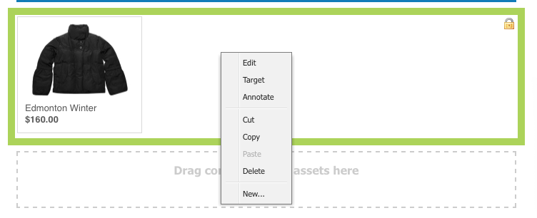
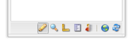
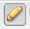

# 編輯頁面內容{#editing-page-content}

建立您的頁面後（新增或作為啟動或即時副本的一部分），您就可以編輯內容以進行所需的更新。

使用可拖曳至 [頁面的元件](/help/sites-classic-ui-authoring/classic-page-author-default-components.md) （適合內容類型）來新增內容。 然後，您就可以就地編輯、移動或刪除這些項目。

>[!NOTE]
>
>您的帳戶需要 [適當的存取權](/help/sites-administering/security.md)[限和](/help/sites-administering/security.md#permissions) 權限，才能編輯頁面；例如，新增、編輯或刪除元件、加上註解、解除鎖定。
>
>如果您遇到任何問題，我們建議您與系統管理員聯繫。

## Sidekick {#sidekick}

sidekick是製作頁面時的重要工具。 它會在編寫頁面時浮動，因此始終可見。

有數個標籤和圖示可供使用，包括：

* 元件
* 頁面
* 資訊
* 版本設定
* 工作流程
* 模式
* 支架
* ClientContext
* 網站

這些功能可讓您存取各種功能；包括：

* [選擇元件](/help/sites-classic-ui-authoring/classic-page-author-env-tools.md#sidekick)
* [顯示參照](/help/sites-classic-ui-authoring/classic-page-author-env-tools.md#showing-references)
* [訪問審計日誌](/help/sites-classic-ui-authoring/classic-page-author-env-tools.md#audit-log)
* [切換模式](/help/sites-classic-ui-authoring/classic-page-author-env-tools.md#page-modes)
* [建立](/help/sites-classic-ui-authoring/classic-page-author-work-with-versions.md#creating-a-new-version)、恢 [復](/help/sites-classic-ui-authoring/classic-page-author-work-with-versions.md#restoring-a-page-version-from-sidekick) 和  比較版本

* [發佈](/help/sites-classic-ui-authoring/classic-page-author-publish-pages.md#publishing-a-page)，取 [消發佈](/help/sites-classic-ui-authoring/classic-page-author-publish-pages.md#unpublishing-a-page) 頁面

* [編輯頁面屬性](/help/sites-classic-ui-authoring/classic-page-author-edit-page-properties.md)

* [腳手](/help/sites-authoring/scaffolding.md)

* [客戶端上下文](/help/sites-administering/client-context.md)

## 插入元件 {#inserting-a-component}

### 插入元件 {#inserting-a-component-1}

開啟頁面後，您可以開始新增內容。 若要這麼做，請新增元件（也稱為段落）。

要插入新元件：

1. 選擇要插入的段落類型有幾種方法：

   * **連按兩下標示為「拖曳元**&#x200B;件或資產到此處……」的區域。-「插入 **新元件」(Insert New Component** )工具欄開啟。 選取元件，然後按一下「 **確定」**。

   * 從浮動工具列拖曳元件（稱為側腳）以插入新段落。
   * **按一下右鍵現有段落，然後選擇「**&#x200B;新建……」-「插入新元件」(Insert New Component)工具欄開啟。 選取元件，然後按一下「 **確定」**。
   

1. 在sidekick和「插入新元 **件」(Insert New Component** )工具列中，您都會看到可用元件（段落類型）的清單。 這些區段可分割為各種區段（例如「一般」、「欄」等），可視需要展開。

   視您的生產環境而定，這些選擇可能會有所不同。 有關元件的完整詳細資訊，請參 [閱預設元件](/help/sites-classic-ui-authoring/classic-page-author-default-components.md)。

1. 在頁面上插入您想要的元件。 然後連按兩下段落，就會開啟一個視窗，讓您設定段落並新增內容。

### 使用內容搜尋器插入元件 {#inserting-a-component-using-the-content-finder}

您也可以從「內容搜尋器」拖曳資產，將新元件新增至 [頁面](/help/sites-classic-ui-authoring/classic-page-author-env-tools.md#the-content-finder)。 這會自動建立包含資產之適當類型的新元件。

這適用於下列資產類型（有些將依賴頁面／段落系統）:

| 資產類型 | 合成元件類型 |
|---|---|
| 影像 | 影像 |
| 文件 | 下載 |
| 產品 | 產品 |
| 視訊 | 閃光燈 |

>[!NOTE]
>
>您可以針對安裝設定此行為。 如需 [詳細資訊，請參閱設定段落系統，讓拖曳資產可建立元件例項](/help/sites-developing/developing-components.md#configuring-a-paragraph-system-so-that-dragging-an-asset-creates-a-component-instance) 。

要通過拖動上述資產類型之一來建立元件，請執行以下操作：

1. 請確定您的頁面處於「編 [**輯&#x200B;**」模式](/help/sites-classic-ui-authoring/classic-page-author-env-tools.md#page-modes)。
1. 開啟內 [容搜尋器](/help/sites-classic-ui-authoring/classic-page-author-env-tools.md#the-content-finder)。
1. 將所需資產拖曳至所需位置。 元件 [預留位置](#componentplaceholder) ，會顯示元件的位置。

   將在所需位置建立一個適合資產類型的元件——它將包含選定的資產。

1. [視需要編輯元件](#editmovecopypastedelete) 。

## 編輯元件（內容與屬性） {#editing-a-component-content-and-properties}

要編輯現有段落，請執行下列操作之一：

* **連按兩下** ，以開啟段落。 您會看到與使用現有內容建立段落時相同的窗口。 進行更改，然後按一下「 **確定」**。

* **按一下右鍵段落** ，然後按一下「 **編輯」**。

* **按兩下** （慢速按兩下）段落以進入就地編輯模式。 您可以直接編輯頁面上的文字，而不是在對話方塊視窗內。 在此模式下，頁面頂部將提供工具列。 只要進行變更，就會自動儲存。

## 移動元件 {#moving-a-component}

移動段落：

>[!NOTE]
>
>也可以使用「剪 [下並貼上](#cut-copy-paste-a-component) 」(Cut and Paste)移動元件。

1. 選擇要移動的段落：

   

1. 將段落拖曳至新位置- AEM會指出段落可以以綠色勾選標籤移至何處。 將它拖放至您所要的位置。
1. 您的段落已移動：

   

## 刪除元件 {#deleting-a-component}

刪除段落：

1. 選取段落並按 **一下滑鼠右鍵**:

   

1. 從菜 **單中選擇** 「刪除」。 AEM WCM會要求確認您要刪除段落，因為此動作無法復原。
1. 按一下 **確定**。

>[!NOTE]
>
>如果已設定用戶屬性以顯示「全局工具欄 [」，則還可以使用](/help/sites-classic-ui-authoring/author-env-user-props.md) Copy **、CutPaste**、 **PasteJoald、********** Delete可用按鈕對段落執行某些操作。

>
>此外 [還提供各](/help/sites-classic-ui-authoring/classic-page-author-keyboard-shortcuts.md) 種鍵盤快速鍵。

## 剪下／複製／貼上元件 {#cut-copy-paste-a-component}

與刪 [除元件時一樣](#deleting-a-component) ，您可以使用上下文菜單來複製、剪切和／或貼上元件

>[!NOTE]
如果已設定用戶屬性以顯示「全局工具欄 [」，則還可以使用](/help/sites-classic-ui-authoring/author-env-user-props.md) Copy **、CutPaste**、 **PasteJoald、********** Delete可用按鈕對段落執行某些操作。

>此外 [還提供各](/help/sites-classic-ui-authoring/classic-page-author-keyboard-shortcuts.md) 種鍵盤快速鍵。

>[!NOTE]
>
>剪下、複製和貼上內容僅支援在相同頁面中。

## 繼承的元件 {#inherited-components}

繼承的元件可以是各種情況的產品，包括：

* [多網站管理](/help/sites-administering/msm.md);還搭配腳手 [架](/help/sites-classic-ui-authoring/classic-feature-scaffolding.md#scaffolding-with-msm-inheritance)。

* [啟動](/help/sites-classic-ui-authoring/classic-launches.md) （根據livecopy）。
* 特定元件；例如Geometrixx內的繼承段落系統。

您可以取消（然後重新啟用）繼承。 視元件而定，這可從以下網址取得：

1. **即時副本**

   如果元件是livecopy或啟動的一部分，則會以掛鎖圖示指出。 您可以按一下掛鎖來取消繼承。

   * 選取元件時，會顯示掛鎖圖示；例如：
   

   * 掛鎖也顯示在元件對話框中；例如：
   

1. **繼承的段落制度**

   配置對話框。 例如，與Geometrixx內的繼承段落系統一樣：

   

## 添加註釋 {#adding-annotations}

[註解](/help/sites-classic-ui-authoring/classic-page-author-annotations.md) ，可讓其他作者針對您的內容提供意見回應。 這通常用於審閱和驗證目的。

## 預覽頁面 {#previewing-pages}

側腳底部邊框有兩個圖示，對於預覽頁面很重要：

* 鉛筆圖示顯示您目前處於編輯模式，可在此模式中新增、修改、移動或刪除內容。

   

* 放大鏡圖示可讓您選取預覽模式，在預覽模式中顯示頁面，就像在發佈環境中看到頁面一樣（有時也需要重新整理頁面）:

   

   在預覽模式中，將會減少側鍵，請按一下向下箭頭圖示以返回編輯模式：

   

## 尋找和取代 {#find-replace}

若要對相同片語進行較大比例的編輯，「尋找與取代」功能表選項可讓您在網站的某個區段內搜尋和取代字串的多個例項。 ****

## 鎖定頁面 {#locking-a-page}

AEM可讓您鎖定頁面，如此其他任何人都無法修改內容。 當您對特定頁面進行大量編輯，或需要將頁面凍結一段時間時，這項功能會很有用。

>[!CAUTION]
>
>鎖定頁面時應小心謹慎，因為唯一可以解除鎖定頁面的人是鎖定頁面的人（或具有管理員權限的帳戶）。

要鎖定頁面：

1. 在「網 **站** 」標籤中，選取您要鎖定的頁面。
1. 連按兩下頁面以開啟頁面進行編輯。
1. 在sidekick的「 **頁面** 」索引標籤中，選 **取「鎖定頁面」**:

   

   訊息顯示您的頁面已鎖定給其他使用者。 此外，在 **Websites** console的右窗格中，AEM WCM會將頁面顯示為已鎖定，並指出已鎖定頁面的使用者。

   

## 解除鎖定頁面 {#unlocking-a-page}

要解除鎖定頁面：

1. 在「網 **站** 」索引標籤中，選取您要解除鎖定的頁面。
1. 連按兩下頁面以開啟它。
1. 在sidekick的「頁 **面** 」索引標籤中，選取「解除 **鎖定頁面」**。

## 復原和重做頁面編輯 {#undoing-and-redoing-page-edits}

當頁面的內容影格有焦點時，請使用下列鍵盤快速鍵：

* 還原：Ctrl+Z(Windows)或Cmd+Z(Mac)
* 重做：Ctrl+Y(Windows)或Cmd+Y(Mac)

當您還原或重做一或多個段落的移除、新增或重新定位時，閃爍（預設行為）的亮部會指出受影響的段落。

>[!NOTE]
>
>如需  復原和重做頁面編輯時可能做到的完整詳細資訊，請參閱復原和重做頁面編輯——理論。

## 還原和重做頁面編輯——理論 {#undoing-and-redoing-page-edits-the-theory}

>[!NOTE]
>
>系統管理員可 [以根據實例的要求配置「撤消／重做](/help/sites-administering/config-undo.md) 」功能的各個方面。

AEM會儲存您執行之動作的記錄，以及您執行動作的順序。 因此，您可以依執行順序還原數個動作。 然後，您可以使用重做來重新套用一或多個動作。

如果選取內容頁面上的元素，則還原和重做命令會套用至選取的項目，例如文字元件。

撤消和重做命令的行為與其他軟體程式中類似。 在您決定內容時，使用命令來還原網頁的最近狀態。 例如，如果將文本段落移動到頁面上的不同位置，則可以使用撤消命令將段落移回。 如果您再次決定移動段落，請使用重做命令。

>[!NOTE]
>
>您可以：
>
>* 只要您自使用還原後未進行頁面編輯，就可執行重做動作。
>* 最多可還原20個編輯動作（預設設定）。
>* 也可使用 [鍵盤快速鍵](/help/sites-classic-ui-authoring/classic-page-author-keyboard-shortcuts.md) ，來還原和重做。
>

您可以對下列類型的頁面變更使用還原和重做：

* 新增、編輯、移除和移動段落
* 就地編輯段落內容
* 在頁面中複製、剪下和貼上項目
* 跨頁複製、剪下和貼上項目
* 新增、移除和變更檔案和影像
* 添加、移除和更改注釋和草繪
* Scaffold的變更
* 添加和刪除參照
* 在元件對話框中更改屬性值。

表單元件演算的表單欄位，不代表在編寫頁面時指定值。 因此，撤消和重做命令不會影響您對這些類型元件的值所做的更改。 例如，您無法撤消在下拉清單中選擇值。

>[!NOTE]
>
>還原和重做檔案和影像的變更需要特殊權限。 此外，還可還原檔案和影像變更的記錄，最短持續數小時。 但是，在此之後，不保證會取消變更。 您的管理員可以提供權限並變更預設時間（10小時）。
