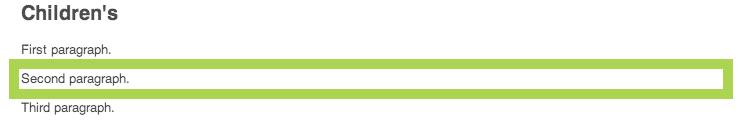

# 編輯頁面內容{#editing-page-content}

建立頁面後（新頁面或作為啟動或即時副本的一部分），您可以編輯內容以進行所需的更新。

使用 [元件](/help/sites-classic-ui-authoring/classic-page-author-default-components.md) （適合內容類型）拖曳至頁面上。 接著，您就可以就地編輯、移動或刪除這些項目。

>[!NOTE]
>
>您的帳戶需要 [適當的訪問權限](/help/sites-administering/security.md) 和 [權限](/help/sites-administering/security.md#permissions) 編輯頁面；例如，添加、編輯或刪除元件、批注、解鎖。
>
>如果您遇到任何問題，建議您與系統管理員聯繫。

## Sidekick {#sidekick}

製作頁面時，sidekick是重要工具。 編寫頁面時會浮動，因此一律可見。

有數個索引標籤和圖示可供使用，包括：

* 元件
* Page
* 資訊
* 版本設定
* 工作流程
* 模式
* 支架
* ClientContext
* 網站

這些功能提供了對多種功能的訪問；包括：

* [選擇元件](/help/sites-classic-ui-authoring/classic-page-author-env-tools.md#sidekick)
* [顯示參考](/help/sites-classic-ui-authoring/classic-page-author-env-tools.md#showing-references)
* [訪問審核日誌](/help/sites-classic-ui-authoring/classic-page-author-env-tools.md#audit-log)
* [切換模式](/help/sites-classic-ui-authoring/classic-page-author-env-tools.md#page-modes)
* [建立](/help/sites-classic-ui-authoring/classic-page-author-work-with-versions.md#creating-a-new-version), [還原](/help/sites-classic-ui-authoring/classic-page-author-work-with-versions.md#restoring-a-page-version-from-sidekick) 和 [比較](/help/sites-classic-ui-authoring/classic-page-author-work-with-versions.md#comparing-with-a-previous-version) 版本

* [發佈](/help/sites-classic-ui-authoring/classic-page-author-publish-pages.md#publishing-a-page), [取消發佈](/help/sites-classic-ui-authoring/classic-page-author-publish-pages.md#unpublishing-a-page) 頁面

* [編輯頁面屬性](/help/sites-classic-ui-authoring/classic-page-author-edit-page-properties.md)

* [支架](/help/sites-authoring/scaffolding.md)

* [用戶上下文](/help/sites-administering/client-context.md)

## 插入元件 {#inserting-a-component}

### 插入元件 {#inserting-a-component-1}

開啟頁面後，您可以開始新增內容。 若要這麼做，請新增元件（也稱為段落）。

插入新元件：

1. 選擇要插入的段落類型的方法有幾種：

   * 按兩下標籤為的區域 **將元件或資產拖曳到此處……** - **插入新元件** 工具列。 選取元件並按一下 **確定**.

   * 從浮動工具列拖曳元件（稱為sidekick）以插入新段落。
   * 按一下右鍵現有段落並選擇 **新……**  — 將開啟「插入新元件」(Insert New Component)工具欄。 選取元件並按一下 **確定**.

   

1. 在sidekick和 **插入新元件** 工具欄中，您會看到可用元件（段落類型）的清單。 這些區段可分為不同區段（例如一般、欄等），可視需要展開。

   這些選項可能會因您的生產環境而異。 如需元件的完整詳細資訊，請參閱 [預設元件](/help/sites-classic-ui-authoring/classic-page-author-default-components.md).

1. 在頁面上插入您要的元件。 然後按兩下段落，將開啟一個窗口，允許您配置段落並添加內容。

### 使用內容尋找器插入元件 {#inserting-a-component-using-the-content-finder}

您也可以從 [內容尋找器](/help/sites-classic-ui-authoring/classic-page-author-env-tools.md#the-content-finder). 這會自動建立包含資產之適當類型的新元件。

這對下列資產類型有效（有些將取決於頁面/段落系統）:

| 資產類型 | 合成元件類型 |
|---|---|
| 影像 | 影像 |
| 文件 | 下載 |
| 產品 | 產品 |
| 影片 | 閃光燈 |

>[!NOTE]
>
>您可以針對安裝設定此行為。 請參閱 [配置段落系統以便拖動資產可建立元件實例](/help/sites-developing/developing-components.md#configuring-a-paragraph-system-so-that-dragging-an-asset-creates-a-component-instance) 以取得詳細資訊。

若要借由拖曳上述其中一個資產類型來建立元件：

1. 確定您的頁面位於 [**編輯** 模式](/help/sites-classic-ui-authoring/classic-page-author-env-tools.md#page-modes).
1. 開啟 [內容尋找器](/help/sites-classic-ui-authoring/classic-page-author-env-tools.md#the-content-finder).
1. 將所需資產拖曳至所需位置。 此 [元件預留位置](#componentplaceholder) 顯示元件的位置。

   在所需位置建立與資產類型相適用的元件，其中會包含選取的資產。

1. [編輯](#editmovecopypastedelete) 元件（如有需要）。

## 編輯元件（內容和屬性） {#editing-a-component-content-and-properties}

要編輯現有段落，請執行以下操作之一：

* **按兩下** 要開啟的段落。 您會看到與使用現有內容建立段落時相同的窗口。 進行變更，然後按一下 **確定**.

* **按一下右鍵** 按一下 **編輯**.

* **按一下** 按兩下段落（按兩下慢速鍵）以進入就地編輯模式。 您將能直接編輯頁面上的文字，而非在對話方塊視窗內。 在此模式中，頁面頂端會提供工具列。 只需進行變更，系統就會自動儲存。

## 移動元件 {#moving-a-component}

要移動段落：

>[!NOTE]
>
>您也可以使用 [剪下並貼上](#cut-copy-paste-a-component) 來移動元件。

1. 選擇要移動的段落：

   

1. 將段落拖曳到新位置 — AEM表示可以使用綠色勾號將段落移至的位置。 將其放置在您想要的位置。
1. 已移動您的段落：

   

## 刪除元件 {#deleting-a-component}

要刪除段落：

1. 選擇段落和 **按一下右鍵**:

   

1. 選擇 **刪除** 的上界。 AEM WCM會要求確認您要刪除該段落，因為此動作無法復原。
1. 按一下&#x200B;**「確定」**。

>[!NOTE]
>
>如果您已設定 [顯示全局編輯工具欄的用戶屬性](/help/sites-classic-ui-authoring/author-env-user-props.md) 您也可以使用 **複製**, **剪下**, **貼上**, **刪除** 按鈕可用。
>
>各種 [鍵盤快捷鍵](/help/sites-classic-ui-authoring/classic-page-author-keyboard-shortcuts.md) 也可供使用。

## 剪下/複製/貼上元件 {#cut-copy-paste-a-component}

當 [刪除元件](#deleting-a-component) 您可以使用內容功能表來複製、剪下和/或貼上元件

>[!NOTE]
>
>如果您已設定 [顯示全局編輯工具欄的用戶屬性](/help/sites-classic-ui-authoring/author-env-user-props.md) 您也可以使用 **複製**, **剪下**, **貼上**, **刪除** 按鈕可用。
>
>各種 [鍵盤快捷鍵](/help/sites-classic-ui-authoring/classic-page-author-keyboard-shortcuts.md) 也可供使用。

>[!NOTE]
>
>剪下、複製和貼上內容僅支援在同一頁內。

## 繼承的元件 {#inherited-components}

繼承的元件可以是各種情況的產品，包括：

* [多網站管理](/help/sites-administering/msm.md);也與 [支架](/help/sites-classic-ui-authoring/classic-feature-scaffolding.md#scaffolding-with-msm-inheritance).

* [啟動](/help/sites-classic-ui-authoring/classic-launches.md) （根據livecopy時）。
* 特定元件；例如Geometrixx內的繼承段落系統。

您可以取消（然後重新啟用）繼承。 視元件而定，這可從下列位置取得：

1. **Live Copy**

   如果元件是Live Copy或啟動的一部分，則會以掛鎖圖示表示。 您可以按一下掛鎖來取消繼承。

   * 選取元件時，掛鎖圖示會隨即顯示；例如：

   

   * 掛鎖也顯示在元件對話方塊中；例如：

   

1. **繼承的段落制度**

   配置對話框。 例如，與Geometrixx內的繼承段落系統一樣：

   

## 新增註解 {#adding-annotations}

[註解](/help/sites-classic-ui-authoring/classic-page-author-annotations.md) 允許其他作者提供您內容的意見反應。 這通常用於檢閱和驗證用途。

## 預覽頁面 {#previewing-pages}

Sidekick的底邊有兩個圖示，這對預覽頁面很重要：

* 鉛筆圖示會顯示您目前處於編輯模式，可在此新增、修改、移動或刪除內容。

   

* 放大鏡圖示可讓您選取預覽模式，在此顯示頁面，就像在發佈環境中看到頁面一樣（有時也需要重新整理頁面）:

   

   在預覽模式中，sidekick將會減少，按一下向下箭頭圖示即可返回編輯模式：

   

## 尋找和取代 {#find-replace}

若要更大規模地編輯相同片語，請 **[查找和替換](/help/sites-classic-ui-authoring/author-env-search.md#find-and-replace)** 功能表選項，可讓您在網站的區段內搜尋和取代字串的多個例項。

## 鎖定頁面 {#locking-a-page}

AEM可讓您鎖定頁面，讓其他人無法修改內容。 當您對特定頁面進行許多編輯，或需要將頁面凍結一段時間時，這個功能會很實用。

>[!CAUTION]
>
>鎖定頁面時應謹慎使用，因為唯一能夠解除鎖定頁面的人是鎖定頁面的人（或具有管理員權限的帳戶）。

若要鎖定頁面：

1. 在 **網站** 頁簽，選擇要鎖定的頁面。
1. 連按兩下頁面以開啟頁面進行編輯。
1. 在 **頁面** sidekick的頁簽，選擇 **鎖定頁面**:

   

   訊息會顯示您的頁面已鎖定給其他使用者。 此外，在 **網站** 控制台中， AEM WCM會將頁面顯示為已鎖定，並指出已鎖定頁面的使用者。

   

## 解鎖頁面 {#unlocking-a-page}

解除鎖定頁面：

1. 在 **網站** 頁簽，選擇要解鎖的頁面。
1. 連按兩下頁面以開啟它。
1. 在 **頁面** sidekick的頁簽，選擇 **解除鎖定頁面**.

## 撤消和重新執行頁面編輯 {#undoing-and-redoing-page-edits}

當頁面的內容框架有焦點時，請使用以下鍵盤快速鍵：

* 還原：Ctrl+Z(Windows)或Cmd+Z(Mac)
* 重做：Ctrl+Y(Windows)或Cmd+Y(Mac)

撤消或重做一個或多個段落的刪除、添加或重定位時，閃爍（預設行為）突出顯示指示受影響的段落。

>[!NOTE]
>
>請參閱 [還原和重做頁面編輯 — 理論](#undoing-and-redoing-page-edits-the-theory) 以取得還原和重新執行頁面編輯時可能進行的完整詳細資訊。

## 還原和重做頁面編輯 — 理論 {#undoing-and-redoing-page-edits-the-theory}

>[!NOTE]
>
>您的系統管理員可以 [設定還原/重做功能的各個方面](/help/sites-administering/config-undo.md) 根據您執行個體的需求。

AEM會儲存您執行之動作的歷史記錄，以及執行動作的順序。 因此，您可以依照執行動作的順序來還原數個動作。 然後，您可以使用重做來重新套用一或多個動作。

如果選取了內容頁面上的元素，則還原和重做命令會套用至選取的項目，例如文字元件。

撤消和重做命令的行為與其他軟體程式中的行為類似。 在您決定內容時，可使用命令還原網頁的最近狀態。 例如，如果將文本段落移動到頁面上的其他位置，則可以使用撤消命令將段落移回。 如果然後再次決定移動段落，請使用重做命令。

>[!NOTE]
>
>您可以：
>
>* 只要您自使用還原功能後未進行頁面編輯，就重做動作。
>* 最多可還原20個編輯動作（預設設定）。
>* 也可使用 [鍵盤快速鍵](/help/sites-classic-ui-authoring/classic-page-author-keyboard-shortcuts.md) 以還原和重做。
>

您可以對下列類型的頁面變更使用還原和重做：

* 添加、編輯、刪除和移動段落
* 就地編輯段落內容
* 複製、剪下和貼上頁面中的項目
* 在頁面間複製、剪切和貼上項目
* 添加、刪除和更改檔案和影像
* 添加、刪除和更改注釋和草繪
* 架構的變更
* 添加和刪除引用
* 在元件對話框中更改屬性值。

表單元件轉譯的表單欄位在編寫頁面時無法指定值。 因此，撤消和重做命令不會影響您對這些類型元件的值所做的更改。 例如，您無法還原下拉式清單中選取值的作業。

>[!NOTE]
>
>若要還原和重做檔案和影像的變更，需要特殊權限。 此外，還可以還原檔案和影像變更的歷史記錄，最短持續數小時。 但是，在此之後，變更的還是無法保證。 管理員可以提供權限並更改10小時的預設時間。
