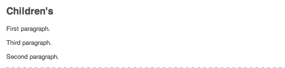

# 編輯頁面內容{#editing-page-content}

建立頁面（新建或作為啟動或即時拷貝的一部分）後，您可以編輯內容以進行所需的更新。

內容是使用 [元件](/help/sites-classic-ui-authoring/classic-page-author-default-components.md) （適用於內容類型），可以拖到頁面上。 然後可以就地編輯、移動或刪除這些內容。

>[!NOTE]
>
>您的帳戶需要 [適當的訪問權限](/help/sites-administering/security.md) 和 [權限](/help/sites-administering/security.md#permissions) 編輯頁面；例如，添加、編輯或刪除元件、注釋、解鎖。
>
>如果您遇到任何問題，我們建議您與系統管理員聯繫。

## 側腳 {#sidekick}

邊框是創作頁面時的關鍵工具。 在創作頁面時它會浮動，因此它始終可見。

有幾個頁籤和表徵圖，包括：

* 元件
* Page
* 資訊
* 版本設定
* 工作流程
* 模式
* 支架
* ClientContext
* 網站

這些功能提供了對多種功能的訪問；包括：

* [選擇元件](/help/sites-classic-ui-authoring/classic-page-author-env-tools.md#sidekick)
* [顯示引用](/help/sites-classic-ui-authoring/classic-page-author-env-tools.md#showing-references)
* [訪問審核日誌](/help/sites-classic-ui-authoring/classic-page-author-env-tools.md#audit-log)
* [切換模式](/help/sites-classic-ui-authoring/classic-page-author-env-tools.md#page-modes)
* [建立](/help/sites-classic-ui-authoring/classic-page-author-work-with-versions.md#creating-a-new-version)。 [恢復](/help/sites-classic-ui-authoring/classic-page-author-work-with-versions.md#restoring-a-page-version-from-sidekick) 和 [比較](/help/sites-classic-ui-authoring/classic-page-author-work-with-versions.md#comparing-with-a-previous-version) 版本

* [發佈](/help/sites-classic-ui-authoring/classic-page-author-publish-pages.md#publishing-a-page)。 [取消發佈](/help/sites-classic-ui-authoring/classic-page-author-publish-pages.md#unpublishing-a-page) 頁面

* [編輯頁面屬性](/help/sites-classic-ui-authoring/classic-page-author-edit-page-properties.md)

* [腳](/help/sites-authoring/scaffolding.md)

* [客戶端上下文](/help/sites-administering/client-context.md)

## 插入元件 {#inserting-a-component}

### 插入元件 {#inserting-a-component-1}

開啟頁面後，可以開始添加內容。 通過添加元件（也稱為段落）來完成此操作。

插入新元件：

1. 選擇要插入的段落類型有幾種方法：

   * 按兩下標有的區域 **將元件或資產拖到此處……** - **插入新元件** 按鈕。 選取一個元件並按一下 **確定**。

   * 從浮動工具欄拖動元件（稱為旁腳）以插入新段落。
   * 按一下右鍵現有段落並選擇 **新建……**  — 「插入新元件」工具欄開啟。 選取一個元件並按一下 **確定**。

   

1. 無論是在旁邊還是 **插入新元件** 工具欄，您可以看到可用元件（段落類型）的清單。 這些部分可分成不同的部分(例如，「常規」(General)、「列」(Columns)等)，可根據需要展開。

   根據您的生產環境，這些選項可能會有所不同。 有關元件的完整詳細資訊，請參閱 [預設元件](/help/sites-classic-ui-authoring/classic-page-author-default-components.md)。

1. 在頁面中插入所需的元件。 然後按兩下該段落，將開啟一個窗口，允許您配置段落並添加內容。

### 使用Content Finder插入元件 {#inserting-a-component-using-the-content-finder}

也可以通過從 [內容查找器](/help/sites-classic-ui-authoring/classic-page-author-env-tools.md#the-content-finder)。 這將自動建立包含資產的相應類型的新元件。

這對以下資產類型有效（某些類型將依賴於頁/段系統）:

| 資產類型 | 合成元件類型 |
|---|---|
| 影像 | 影像 |
| 文件 | 下載 |
| 產品 | 產品 |
| 影片 | 閃光燈 |

>[!NOTE]
>
>可以為安裝配置此行為。 請參閱 [配置段落系統，以便拖動資產建立元件實例](/help/sites-developing/developing-components.md#configuring-a-paragraph-system-so-that-dragging-an-asset-creates-a-component-instance) 的上界。

要通過拖動上述資產類型之一來建立元件：

1. 確保您的頁面位於 [**編輯** 模式](/help/sites-classic-ui-authoring/classic-page-author-env-tools.md#page-modes)。
1. 開啟 [內容查找器](/help/sites-classic-ui-authoring/classic-page-author-env-tools.md#the-content-finder)。
1. 將所需資產拖到所需位置。 的 [元件佔位符](#componentplaceholder) 顯示元件的位置。

   將在所需位置建立與資產類型相適應的元件 — 該元件將包含所選資產。

1. [編輯](#editmovecopypastedelete) 元件（如果需要）。

## 編輯元件（內容和屬性） {#editing-a-component-content-and-properties}

要編輯現有段落，請執行以下操作之一：

* **按兩下** 開啟它的段落。 與使用現有內容建立段落時看到的窗口相同。 進行更改，然後按一下 **確定**。

* **按一下右鍵** 並按一下 **編輯**。

* **按一下** 按兩次（慢速按兩下）進入就地編輯模式。 您將能夠直接編輯頁面上的文本，而不是在對話框窗口內。 在此模式下，頁面頂部將提供工具欄。 只需進行更改，即可自動保存。

## 移動元件 {#moving-a-component}

移動段落：

>[!NOTE]
>
>您還可以使用 [剪切和貼上](#cut-copy-paste-a-component) 的子菜單。

1. 選擇要移動的段落：

   

1. 將段落拖到新位置 — 指AEM示可以將段落移動到的位置，並帶有綠色複選標籤。 將其放在您所需的位置。
1. 您的段落已移動：

   

## 刪除元件 {#deleting-a-component}

刪除段落：

1. 選擇段落並 **按一下右鍵**:

   

1. 選擇 **刪除** 的子菜單。 AEMWCM請求確認您要刪除該段落，因為此操作無法撤消。
1. 按一下&#x200B;**「確定」**。

>[!NOTE]
>
>如果你已經 [顯示全局編輯工具欄的用戶屬性](/help/sites-classic-ui-authoring/author-env-user-props.md) 也可以使用 **複製**。 **剪切**。 **貼上**。 **刪除** 按鈕。
>
>各種 [鍵盤快捷鍵](/help/sites-classic-ui-authoring/classic-page-author-keyboard-shortcuts.md) 中。

## 剪切/複製/貼上元件 {#cut-copy-paste-a-component}

當 [刪除元件](#deleting-a-component) 可以使用上下文菜單複製、剪切和/或貼上元件

>[!NOTE]
>
>如果你已經 [顯示全局編輯工具欄的用戶屬性](/help/sites-classic-ui-authoring/author-env-user-props.md) 也可以使用 **複製**。 **剪切**。 **貼上**。 **刪除** 按鈕。
>
>各種 [鍵盤快捷鍵](/help/sites-classic-ui-authoring/classic-page-author-keyboard-shortcuts.md) 中。

>[!NOTE]
>
>僅在同一頁中支援剪切、複製和貼上內容。

## 繼承的元件 {#inherited-components}

繼承的元件可以是各種方案的產物，包括：

* [多站點管理](/help/sites-administering/msm.md);也與 [腳](/help/sites-classic-ui-authoring/classic-feature-scaffolding.md#scaffolding-with-msm-inheritance)。

* [啟動](/help/sites-classic-ui-authoring/classic-launches.md) （基於livecopy）。
* 具體元件；例如Geometrixx中的繼承段落系統。

可以取消（然後重新啟用）繼承。 根據元件的不同，可從以下站點獲得：

1. **Live Copy**

   如果元件是livecopy或啟動的一部分，則它由掛鎖表徵圖指示。 可以按一下掛鎖取消繼承。

   * 選擇元件時，將顯示掛鎖表徵圖；例如：

   

   * 掛鎖也顯示在元件對話框中；例如：

   

1. **繼承的段落制度**

   配置對話框。 例如，與Geometrixx中的繼承段落系統一樣：

   

## 添加註釋 {#adding-annotations}

[注釋](/help/sites-classic-ui-authoring/classic-page-author-annotations.md) 允許其他作者提供有關您內容的反饋。 這通常用於審查和驗證目的。

## 預覽頁面 {#previewing-pages}

旁邊框的下邊框有兩個對預覽頁面很重要的表徵圖：

* 鉛筆表徵圖顯示您當前處於編輯模式，在該模式下可以添加、修改、移動或刪除內容。

   

* 放大鏡表徵圖允許您選擇頁面在發佈環境中顯示時的預覽模式（有時還需要刷新頁面）:

   

   在預覽模式下，將減少旁鍵，按一下向下箭頭表徵圖返回編輯模式：

   

## 尋找和取代 {#find-replace}

對於同一短語的較大比例編輯， **[查找和替換](/help/sites-classic-ui-authoring/author-env-search.md#find-and-replace)** 菜單選項允許您在網站的某個部分中搜索和替換字串的多個實例。

## 鎖定頁面 {#locking-a-page}

允AEM許您鎖定頁面，以便其他人不能修改內容。 當您對一個特定頁面進行大量編輯或需要將頁面凍結一段時間時，此功能非常有用。

>[!CAUTION]
>
>鎖定頁面時應小心謹慎，因為唯一能夠解鎖頁面的人是鎖定頁面的人（或具有管理員權限的帳戶）。

要鎖定頁面：

1. 在 **網站** 頁籤。
1. 按兩下該頁面以將其開啟以進行編輯。
1. 在 **頁面** 頁籤，選擇 **鎖定頁**:

   

   一條消息顯示您的頁面已鎖定給其他用戶。 此外，在 **網站** 控制台AEM中， WCM將頁面顯示為已鎖定，並指示哪個用戶已鎖定頁面。

   

## 解鎖頁面 {#unlocking-a-page}

要解鎖頁面：

1. 在 **網站** 頁籤。
1. 按兩下該頁面以將其開啟。
1. 在 **頁面** 頁籤，選擇 **解鎖頁**。

## 撤消和重做頁面編輯 {#undoing-and-redoing-page-edits}

當頁面的內容框架具有焦點時，請使用以下鍵盤快捷鍵：

* 撤消：Ctrl+Z(Windows)或Cmd+Z(Mac)
* 重做：Ctrl+Y(Windows)或Cmd+Y(Mac)

撤消或重做一個或多個段落的刪除、添加或重新定位時，閃爍（預設行為）會突出顯示受影響的段落。

>[!NOTE]
>
>請參閱 [撤消和重做頁面編輯 — 理論](#undoing-and-redoing-page-edits-the-theory) 的子菜單。

## 撤消和重做頁面編輯 — 理論 {#undoing-and-redoing-page-edits-the-theory}

>[!NOTE]
>
>您的系統管理員可以 [配置「撤消/重做」特徵的各個方面](/help/sites-administering/config-undo.md) 根據你們的情況要求。

存AEM儲所執行操作的歷史記錄以及所執行操作的順序。 因此，您可以按執行順序撤消多個操作。 然後，可以使用重做重新應用一個或多個操作。

如果選擇了內容頁上的元素，則撤消和重做命令將應用於所選項目，如文本元件。

撤消和重做命令的行為與其他軟體程式中的行為類似。 在您對內容做出決策時，使用命令恢復網頁的最近狀態。 例如，如果將文本段落移動到頁面上的其他位置，則可以使用撤消命令將段落移回。 如果隨後再次決定移動段落，請使用重做命令。

>[!NOTE]
>
>您可以：
>
>* 只要自使用撤消後未進行頁面編輯，就重做操作。
>* 撤消最多20個編輯操作（預設設定）。
>* 也 [鍵盤快捷鍵](/help/sites-classic-ui-authoring/classic-page-author-keyboard-shortcuts.md) 撤消和重做。
>

可以對以下類型的頁面更改使用撤消和重做：

* 添加、編輯、刪除和移動段落
* 原地編輯段落內容
* 在頁面中複製、剪切和貼上項目
* 跨頁複製、剪切和貼上項目
* 添加、刪除和更改檔案和影像
* 添加、刪除和更改注釋和草繪
* 對Scaffold的更改
* 添加和刪除引用
* 更改元件對話框中的屬性值。

表單元件呈現的表單域不意味著在創作頁面時指定值。 因此，撤消和重做命令不會影響對這些類型元件的值所做的更改。 例如，無法撤消在下拉清單中選擇值。

>[!NOTE]
>
>要撤消和重做對檔案和影像的更改，需要特殊權限。 此外，還要撤消對檔案和影像所做的更改的歷史記錄，最少持續數小時。 但是，在此之後，無法保證撤消更改。 管理員可以提供權限並更改預設時間（10小時）。
