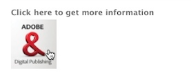

# 頁面製作的元件{#components-for-page-authoring}

以下元件適用於製作標準網頁內容時。 它們會構成AEM標準安裝的現成可用元件子集。

有些可立即透過sidekick取用，其他則可使用 [Design模式](/help/sites-classic-ui-authoring/classic-page-author-design-mode.md) ，以啟用／停用。

>[!CAUTION]
>
>本節僅討論標準AEM安裝中現成可用的元件。
>
>視您的例項而定，您可能已針對您的需求明確開發自訂元件。 這些元件甚至可能與此處討論的某些元件名稱相同。

當從側腳的「元 [件」標籤和](/help/sites-classic-ui-authoring/classic-page-author-edit-content.md) 「插入新元件」選取器編輯頁面時 **，這些元件可用(當您連按兩下********** 「拖曳元件」或此處的資產時)。

您可以選取元件並將其拖曳至頁面上的必要位置，然後依序 [編輯內容和屬性](/help/sites-classic-ui-authoring/classic-page-author-edit-content.md#editing-a-component-content-and-properties)。

元件會依各種類別（元件群組）排序，包括（用於頁面製作）:

* [一般](#general):包含基本元件，包括文字、影像、表格、圖表等。
* [欄](#columns):包含組織內容版面配置所需的元件。
* [表單](#formgroup):包含建立表單所需的所有元件。

## 一般 {#general}

「一般」元件是您用來建立內容的基本元件。

### 帳戶項目 {#account-item}

您可以定義包含標題和說明的連結。


### 自我調整影像 {#adaptive-image}

「最適化影像」基礎元件會產生影像，調整大小以符合開啟網頁的視窗。 若要使用元件，請從檔案系統或DAM提供影像資源。 當網頁開啟時，網頁瀏覽器會下載已調整大小的影像副本，以適合目前的視窗。

以下特性可確定窗口的大小：

* 裝置畫面：行動裝置通常會顯示網頁，以延伸至整個螢幕。
* 網頁瀏覽器視窗大小：膝上型電腦和桌上型電腦的使用者可以調整網頁瀏覽器視窗的大小。

例如，當網頁在行動電話上開啟時，元件會產生小型影像，而當在平板電腦上開啟時，元件會產生中型影像。 在膝上型電腦上，當頁面在最大化的網頁瀏覽器中開啟時，元件會建立並傳送大型影像。 當網頁瀏覽器調整大小以符合螢幕的一部分時，元件會傳送較小的影像並重新整理檢視，以適應此需求。

#### 支援的影像格式 {#supported-image-formats}

您可以將下列副檔名的影像檔案與Adaptive Image元件搭配使用：

* .jpg
* .jpeg
* .PNG
* .gif **

>[!CAUTION]
>
>** AEM不支援最適化轉譯的動畫。gif檔案。

#### 影像大小與品質 {#images-sizes-and-quality}

下表列出為給定視區寬度生成的影像的寬度。 計算所生成的影像的高度以保持恆定的長寬比，並且影像邊緣內不出現空白。 裁切可用來避免空格。

當影像是JPEG影像時，檢視區大小也會影響JPEG品質。 可能有下列JPEG品質：

* 低(0.42)
* 中(0.82)
* 高(1.00)

| 視區寬度範圍（像素） | 影像寬度（像素） | JPEG 品質 | 目標裝置類型 |
|---|---|---|---|
| width &lt;= 319 | 320 | 低 |  |
| width = 320 | 320 | 中 | 行動電話（縱向） |
| 320 &lt;寬度&lt; 481 | 480 | 中 | 行動電話（橫向） |
| 480 &lt;寬度&lt; 769 | 476 | 高 | 平板電腦（縱向） |
| 768 &lt;寬度&lt; 1025 | 620 | 高 | 平板電腦（橫向） |
| width &lt;= 1025 | 完整（原始大小） | 高 | 桌面 |

#### 屬性 {#properties}

該對話框允許您編輯最適化影像元件實例的屬性，其中許多屬性與其所基於的影像元件相同。 屬性可在兩個標籤中使用：

* **影像**

   * **影像**&#x200B;從內容搜尋器拖曳影像，或按一下以開啟可載入影像的瀏覽視窗。 載入影像後，您可以裁切影像、旋轉影像或刪除影像。 若要放大或縮小影像，請使用影像下方的投影片列（位於「確定」和「取消」按鈕上方）

   * **裁切**&#x200B;裁切影像。 拖曳邊框以裁切影像。

   * **旋轉**&#x200B;重複按一下「旋轉」，直到影像視需要旋轉。

   * **清除**&#x200B;移除目前的影像。

* **進階**

   * **Title** Adaptive Image元件不使用此屬性。

   * **替代文**&#x200B;字用於影像的替代文本。

   * **連結到** Adaptive Image元件不使用此屬性。

   * **說明** Adaptive Image元件不使用此屬性。

#### 擴充自適應影像元件 {#extending-the-adaptive-image-component}

有關自定義最適化影像元件的資訊，請參 [閱瞭解最適化影像元件](/help/sites-developing/responsive.md#using-adaptive-images)。

### 傳送 {#carousel}

「轉盤元件」可讓您顯示與個別頁面相關的影像：

* 一次一個
* 很短的時間
* 依您指定的順序
* 以您指定的

可點按的控制項也可讓使用者隨選即時循環檢視顯示的頁面。 按一下目前可見的頁面影像會帶您前往該頁面。 換言之，轉盤可當成導覽控制項。

#### 屬性 {#properties-1}

這些頁籤可用於兩個頁籤：

* **轉盤**&#x200B;在此處指定轉盤的運作方式：

   * 播放速度下一張投影片顯示前的毫秒數。
   * 轉換時間兩張投影片之間轉換的毫秒數時間。
   * 控制樣式下拉式選單提供各種選項；例如，「上／下一個按鈕」、「右上」開關。

* **List** Here you specify how pages are included in your Carousel:

   * **使用建立清單**：建立頁面清單有數種方式——子頁面、固定清單、搜尋或進階搜尋（詳見下文）。
請注意，無論您選擇哪種方法，您列在清單中的頁面都應已有與頁面相關聯的影像，而是此影像會顯示在轉盤中。 如果該頁面的「頁面屬性」下沒有指定頁面的影像，您應先將影像與頁面建立關聯，否則轉盤會顯示空白（或大部分為空白）頁面。 請參閱 [編輯頁面屬性](/help/sites-classic-ui-authoring/classic-page-author-edit-page-properties.md)。
根據您選擇的項目，將會出現新面板：

      * **子頁面的選項**

         * **父頁面**&#x200B;手動或使用選擇器指定路徑。 留空可將目前頁面用作父頁面。
      * **固定清單的選項**

         * **頁面**&#x200B;選擇頁面清單。 使 `+` 用新增更多項目和上／下按鈕來調整順序。
      * **搜尋選項**

         * **開始於**&#x200B;手動或使用選擇器輸入起始路徑。

         * **搜索查詢**&#x200B;您可以輸入純文字檔案搜索查詢。
      * **進階搜尋的選項**

         * **Querybuilder謂詞符號**您可以使用Querybuilder謂詞符號輸入搜索查詢。 例如，您可以輸入&quot;fulltext=Marketing&quot;，讓內容中具有&quot;Marketing&quot;的所有頁面都顯示在轉盤中。
如需 [查詢運算式和進一步範例的完整討論，請參閱QueryBuilder API](/help/sites-developing/querybuilder-api.md) 。
   * **依順序**&#x200B;從下拉 `jcr:title`式選 `jcr:created`單中選 `cq:lastModified`取、 `cq:template` 或選取。

   * **限**&#x200B;制您要在轉盤中使用的項目數上限；這是可選的。


>[!NOTE]
您可以為Adobe Experience manager建立自訂轉盤元件，以顯示位於AEM DAM中的數位資產。 如需詳細資訊，請 [參閱「建立Adobe Experience Manager的自訂轉盤元件」](https://helpx.adobe.com/experience-manager/using/custom-carousel-components.html)。

### 圖表 {#chart}

圖表元件可讓您新增長條圖、折線圖或圓形圖。 AEM會從您提供的資料建立圖表。 您可以直接在「資料」索引標籤中輸入，或複製並貼上試算表，以提供資料。

* **資料**

   * **圖表資**&#x200B;料使用CSV格式輸入圖表資料；逗號分隔值格式使用逗號(&quot;,&quot;)作為欄位分隔符號。

* **進階**

   * **圖表類型**&#x200B;從圓形圖、折線圖和長條圖中選擇。

   * **替代文字**：顯示的替代文字，而非圖表。

   * **Width**&#x200B;圖表的寬度（以像素為單位）。

   * **Height**（高度）圖表的高度（以像素為單位）。

以下顯示圖表資料的範例，後面接著產生的長條圖：

 

>[!NOTE]
您可以建立自訂AEM圖表控制項，以顯示位於AEM JCR中的資料。 如需詳細資訊，請 [參閱在圖表中顯示Adobe Experience Manager資料](https://helpx.adobe.com/experience-manager/using/displaying-experience-manager-data-chart.html)。

### 內容片段 {#content-fragment}

>[!CAUTION]
「內容片段管理」的完整功能僅適用於觸控最佳化的UI。
您可在傳統UI側鍵中看到「內容片段」元件，但無法使用其他功能。

[內容片段](/help/sites-classic-ui-authoring/classic-page-author-content-fragments.md) ，會建立並管理為不受頁面影響的資產。 然後，您可以在製作內容頁面時使用這些片段及其變化。

### Design Importer {#design-importer}

這可讓您上傳包含設計套件的zip檔案。

### 下載 {#download}

下載元件會在選取的網頁上建立連結，以下載特定檔案。 您可以從Content Finder拖曳資產或上傳檔案。

* **下載**

   * **說明**&#x200B;下載連結所顯示的簡短說明。

   * **檔**&#x200B;案可在產生的網頁上下載。 從內容搜尋器拖曳資產，或按一下區域以上傳可供下載的檔案。

下列範例顯示Geometrixx中的Download元件：


### 外部 {#external}

外部應用程式整合元件(**External**)可讓您使用iframe將外部應用程式內嵌至AEM頁面。

* **外部**

   * **目標應用程式**

      指定要整合之Web應用程式的URL;例如：

      ```
      https://en.wikipedia.org/wiki/Main_Page
      ```

   * **傳遞參數**

      如有需要，請勾選要傳遞至應用程式的參數方塊。

   * **寬度和高度**

      定義iframe的大小

外部應用程式已整合在AEM頁面的段落系統中；例如，當使用下列的Target應用程式時 `https://en.wikipedia.org/wiki/Main_Page`:


>[!NOTE]
例如，根據您的使用案例，其他選項可用於外部應用程式的整合。 Portlet的 [整合](/help/sites-administering/aem-as-portal.md)。

### 閃光燈 {#flash}

Flash元件可讓您載入Flash影片。 您可將Flash資產從內容搜尋器拖曳至元件，或使用對話方塊：

* **閃光燈**

   * **Flash 影片**

      flash影片檔。 從內容搜尋器拖曳資產，或按一下以開啟瀏覽視窗。

   * **大小**

      影片顯示區域的尺寸（像素）。

* **替代影像**

   要顯示的替代影像

* **進階**

   * **上下文功能表**

      指出應顯示或隱藏上下文菜單。

   * **視窗模式**

      窗口的顯示方式，例如不透明、透明或作為不同（實體）窗口。

   * **背景色彩**

      從提供的顏色圖中選擇的背景顏色。

   * **最低版本**

      執行影片所需的Adobe Flash Player最低版本。 預設值為9.0.0。

   * **屬性**

      需要任何其他屬性。

### 影像 {#image}

影像元件根據指定的參數顯示影像和附帶的文本。

您可以上傳影像，然後加以編輯和控制（例如裁切、旋轉、新增連結／標題／文字）。

您可以直接從「內容搜尋器」將影 [](/help/sites-classic-ui-authoring/classic-page-author-env-tools.md#the-content-finder) 像拖放至元件或其「編輯」對話方塊。 您也可以按兩下「編輯」對話方塊中央區域，以瀏覽您的本機檔案系統並上傳影像。 「編輯」對話框的兩個頁籤還控制影像的所有定義和操作：


>[!NOTE]
無法使用Internet explorer監控上傳進度。
Internet explorer使用者需要上傳影像並按一下「 **Ok** 」（確定），然後重新開啟影像，在預覽中查看已上傳的檔案，並能夠執行修改（即裁切）。

>如需AEM所 [](/help/release-notes/release-notes.md#certifiedplatforms) 使用之HTML5功能的詳細資訊，請參閱「認證平台」一節。

載入影像時，您可以設定下列項目：

* **地圖**

   要映射影像，請選擇映射。 您可以指定要如何建立影像地圖（矩形、多邊形等），以及區域應指向的位置。

* **裁切**

   選取「裁切」以裁切影像。 使用滑鼠來裁切影像。

* **旋轉**

   若要旋轉影像，請選取「旋轉」。 重複使用，直到影像依您想要的方式旋轉為止。

* **清除**

   移除目前的影像。

* **縮放列**

   若要放大或縮小影像，請使用影像下方的投影片列（位於「確定」和「取消」按鈕上方）

* **標題**

   影像的標題。

* **替代文字**

   建立可存取內容時使用的替代文字。

* **連結至**

   建立網站內資產或其他頁面的連結。

* **說明**

   影像的說明。

* **大小**

   設定影像的高度和寬度。

最終影像(含 **標題****和說**&#x200B;明)可顯示為：


### 配置容器 {#layout-container}

>[!CAUTION]
雖然「版面」容器元件可在傳統UI中使用，但其完整功能僅能在觸控式UI中使用。 如需詳細資訊，請參 [閱互動式版面](/help/sites-classic-ui-authoring/classic-page-author-responsive-layout.md)。

### 清單 {#list}

List元件允許您配置顯示清單的搜索標準：

* **清單**

   * **使用以下方式產生清單**

      您可以在此處指定清單將擷取其內容的位置。 有幾種方法：

   * 根據您選擇的項目，將會出現新面板：

      * **子頁面的選項**

         * **子項** （父頁面）手動或使用選擇器指定路徑。 留空可將目前頁面用作父頁面。
      * **固定清單的選項**

         * **頁面**

            選取頁面清單。 使用+可新增更多項目，而上／下按鈕則可調整順序。
      * **搜尋選項**

         * **開始**

            手動或使用選擇器輸入起始路徑。

         * **搜尋查詢**

            您可以輸入純文字檔案搜索查詢。
      * **進階搜尋的選項**

         * **QueryBuilder 述詞記號**

            您可以使用Querybuilder謂詞符號輸入搜索查詢。 例如，您可以輸入&quot;fulltext=Marketing&quot;，讓內容中具有&quot;Marketing&quot;的所有頁面都顯示在轉盤中。

            如需 [查詢運算式和進一步範例的完整討論，請參閱QueryBuilder API](/help/sites-developing/querybuilder-api.md) 。
      * **標記**

         指定「父 **頁面**」、「 **標籤／關鍵字** 」和您所需的符合條件。
   * **顯示為**

      您希望項目列出的方式；包括連結、預告和新聞。

   * **排序方式**

      是否對清單進行排序，如果是，則使用排序標準。 您可以輸入標準或從提供的下拉清單中選擇一個標準。

   * **限制**

      指定您要在清單中顯示的項目數上限。

   * **啟用資訊源**

      指出是否應為清單啟用RSS饋送。

   * **每頁顯示項目數**

      您可以在這裡指定一次顯示的清單項目數。 項目數超過指定的清單會使用分頁功能，以數個部分顯示清單。


下列範例顯示 **List** 元件顯示子頁面清單的方式（設計由網站設計的自訂CSS定義控制）。


### 登入 {#login}

這些欄位提供「使用者名稱」和「密碼」欄位。


您可以設定：

* 登入

   * 區域標籤

      輸入欄位的引入文字。

   * 使用者名稱標籤

      用於標籤用戶名欄位的文本。

   * 密碼標籤

      用於標籤密碼欄位的文本。

   * 登入按鈕標籤

      登入按鈕的文字。

   * 重新導向至

      您可以指定在使用者登入後應該開啟的網頁。

* 已登入

   * 繼續按鈕標籤

      表示使用者已登入的文字。

### 訂單狀態 {#order-status}

* **標題**

   * **標題**

      指定您要顯示的標題文字。

   * **連結**

      指定應顯示訂單狀態的頁面（產品）。

   * **類型/大小**

      從提供的選擇中選擇。


### 引用 {#reference}

Reference **** （參考）元件可讓您參考AEM網站（在目前例項中）其他頁面的文字。 然後，參考段落的內容會像出現在目前頁面一樣顯示。 當來源段落變更時（可能需要重新整理頁面），內容將會更新。

* **段落引用**

   * **引用**

      指定您要參考的頁面和段落的路徑（包含內容）。

若要指定段落的路徑，您必須在路徑（頁面）加上尾碼：

`.../jcr:content/par/<paragraph-ID>`

例如：

`/content/geometrixx-outdoors/en/equipment/biking/cajamara/jcr:content/par/similar-products`

除了參照特定段落外，還可以修改路徑以指定整個par-system。 您可以在路徑上加上下列字尾來執行此動作：

`/jcr:content/par`

例如：

`/content/geometrixx-outdoors/en/equipment/biking/cajamara/jcr:content/par`

設定好後，內容就會和來源頁面完全一樣。 只有當您開啟元件進行編輯時，才會看到它是參考：


### 搜尋 {#searching}

「搜尋」元件會將搜尋功能新增至您的頁面。

您可以設定：

* 搜尋

   * **節點類型**

      如果搜索要限制為特定節點類型，請在此處列出它們；例如， `cq:Page`。

   * **搜尋路徑:**

      指定您要搜尋之分支的根頁面。

   * **搜尋按鈕文字**

      實際搜索按鈕上顯示的名稱。

   * **統計文字**

      顯示在搜尋結果上方的文字。

   * **無結果文字**

      如果沒有結果，則顯示此處輸入的文本。

   * **拼寫檢查文字**

      如果有人輸入類似的詞語，此文字會在詞語之前顯示。
例如，如果您輸入geometrixxe，系統會顯示「您是指？」 geometrixx」。

   * **類似頁面文字**

      顯示在類似頁面結果旁的文字。 按一下此連結，可檢視內容類似的頁面。

   * **相關搜尋文字**

      出現在搜尋相關詞語和主題旁的文字。

   * **搜尋趨勢文字**

      使用者輸入之搜尋詞上方的標題。

   * **結果頁面標籤**

      顯示在此清單底部的文本及其指向其他結果頁的連結。

   * **上一個標籤**

      出現在先前搜尋頁面連結上的名稱。

   * **下一個標籤**

      出現在後續搜尋頁面連結上的名稱。

下面的示例顯示在從標準安裝的根目錄搜索 *單詞geometrixx* 後的Search元件。 這也說明結果的編頁：


下列範例顯示拼字錯誤且無法使用的搜尋詞：


### Sitemap {#sitemap}

自動網站地圖清單（使用預設設定）會列出目前網站中的所有頁面（作為作用中連結）。 例如，摘取顯示：


如果需要，您可以配置：

* **Sitemap**

   * **根路徑**

      清單開始的路徑。

### Slideshow {#slideshow}

此元件可讓您載入一系列要在頁面上顯示為投影片的影像。您可以新增或移除影像，並為每個影像指派標題。 在「高級」(Advanced)下，還可以指定顯示區域的大小。

您可以設定：

* **幻燈片**

   * **新增幻燈片**

      您可以使用「新增」(和「移除」 **** )按鈕來指 **定選擇的投影片**。

   * **標題**

      視需要指定標題。 這個是貼在適當的幻燈片上。

* **進階**

   * **大小**

      以像素為單位指定寬度和高度。

然後，投影片元件會在短時間內，重複顯示每個投影片，然後淡出至下一張投影片：


### 表格 {#table}

>[!NOTE]
表 **元件** (Table [)是以Rich Text編輯器(](/help/sites-classic-ui-authoring/classic-page-author-rich-text-editor.md)Rich Text editor **[)為基礎，](#text)**Text元件亦然。
建議使用表的 **Table** （表）元件，但也可以使用 **Text（文本）元件來構建表** 。

「表 **格** 」元件已預配置為可讓您構建、填充和格式化表格。 使用對話框，您可以通過以下方式配置表並建立內容：

* 從頭開始
* 從外部編輯器（例如Excel、OpenOffice、記事本等）複製和貼上試算表或表格。


以下是表格元件的範例；設計由網站特定的CSS決定：


### 標記雲 {#tag-cloud}

標籤雲端會以圖形方式顯示套用至網站內容的標籤選擇：


設定Tag cloud元件時，您可以指定：

* **要顯示的標**&#x200B;記要顯示的標籤從何處收集。 從頁面、包含所有子項或所有標籤的頁面中進行選擇。

* **頁**&#x200B;面選擇要參考的頁面。

* **標籤上沒有連結**&#x200B;顯示的標籤是否應當成連結。

如需套用標籤的詳細資訊，請造 [訪使用標籤](/help/sites-classic-ui-authoring/classic-feature-tags.md)。

### 文字 {#text}

>[!NOTE]
Text **元件是以** Rich Text編輯器為基礎 [，表元件也](/help/sites-classic-ui-authoring/classic-page-author-rich-text-editor.md)是 **[](#table)**。
建議使用表的 **Table** （表）元件，但也可以使用 **Text（文本）元件來構建表** 。

Text元件可讓您使用WYSIWYG編輯器輸入文字區塊，並具備Rich Text編輯器 [提供的功能](/help/sites-classic-ui-authoring/classic-page-author-rich-text-editor.md)。 選取的圖示可讓您設定文字的格式，包括字型特性、對齊方式、連結、清單和縮排。


當您開啟「編 **輯** 」對話方塊的「樣 **式」標籤時** ，也可以設定：

* **空格字元**
* **文字樣式**

格式化的文字會顯示在頁面上；實際設計將取決於網站CSS:


有關「文本」元件和富格文本編輯器提供的功能的詳細資訊，請參 [見富格文本編輯器頁](/help/sites-classic-ui-authoring/classic-page-author-rich-text-editor.md) 。

#### 就地編輯 {#inplace-editing}

除了以對話方塊為基礎的Rich Text編輯模式，AEM也提供 [Inplace Editing](/help/sites-authoring/editing-content.md)，可直接編輯顯示在頁面版面中的文字。

### 文字和影像 {#text-image}

「文字與影像」元件會新增文字區塊和影像。 您也可以個別新增和編輯文字和影像。 如需詳細 [資訊](#text) ，請參 [閱Text](#image) and Image元件。

 

您可以設定：

* **元件樣式** (**樣式**)

   您可以在這裡左或右對齊影像。 預設為「 **左對齊** 」，影像位於左側。

* **影像屬性** (進&#x200B;**階影像屬性**)

   允許您指定以下內容：

   * **影像資產**

      上傳所需影像。

   * **標題**

      區塊標題；將會以mouseover顯示。

   * **替代文字**

      如果無法顯示影像，則顯示替代文字。 如果留空，則會使用標題。

   * **連結到**

      指定目標路徑。

   * **說明**

      影像的說明。

   * **大小**

      設定影像的高度和寬度。

下列範例顯示文字影像元件，顯示左對齊的影像：


### 標題 {#title}

標題元件可以：

* 顯示目前頁面的名稱；將「標題」欄位留空即可完成
* 顯示您在「標題」欄位中指定的文字。

您可以設定：

* **標題**

   如果您想使用頁面標題以外的名稱，請在此處輸入。

* **連結**

   URI（如果標題要作為連結操作）。

* **類型/大小**

   從下拉清單中選擇「小」或「大」。 小型會產生為影像。 「大」(Large)生成為文本。

以下示例顯示 **Title** （標題）元件；設計由網站特定的CSS決定。


### Video {#video}

Video **元件** 可讓您將預先定義、現成可用的視訊元素置於頁面上。

另請參 [閱設定您的視訊設定檔](/help/sites-administering/config-video.md#configuringvideoprofiles) ，以搭配HTML5元素使用。

將元件例項放在您的頁面上後，您可以設定：

* 視訊

   * **視訊資產**

      上傳或放置您的視訊資產。

   * **大小**

      視訊的原生大小(寬度x高度（像素）)會出現在「大小」旁的方塊中（請參閱上方）。 如果您想要覆寫視訊的原生尺寸，請在此處手動輸入寬度和高度尺寸。 按一下 **確定** ，關閉對話框。

>[!NOTE]
支援的格式包括：
* `.mp4`
* `Ogg`
* `FLV` （Flash視訊）


## 欄 {#columns}

欄是控制AEM中內容版面配置的機制。 在用於建立兩列和／或三列的標準安裝元件中提供了。

以下示例顯示了正在使用的2列和3列元件。 可以對新元件使用佔位符：


### 2 欄 {#columns-1}

列控制元件，預設為2個等於列。

### 3 欄 {#columns-2}

列控制元件，預設為3個等於列。

### 欄控制項 {#column-control}

「欄控制」元件可讓使用者選擇要將網頁主面板中的內容分割為多欄的方式。 使用者可以選取所需的欄數（從預先定義的清單），然後在每欄內建立、刪除或移動內容。

* **欄控制項**

   * **欄配置**

      選擇要呈現的列數。 建立後，每個欄都有自己的連結，可在新增內容時拖曳元件或資產。

## 表單 {#form}

表單元件可用來建立表單，讓訪客提交輸入。 表單和表單元件可用於收集包括用戶反饋（例如，客戶滿意度調查表）和用戶資訊（例如，用戶註冊）的資訊。

>[!NOTE]
如需 [AEM Forms的相關資訊](/help/forms/home.md) ，請參閱AEM Forms說明。

表單是由數種不同的元件建立：

* **表單**

   表單元件定義頁面上新表單的開始和結束。 然後，其他元件可以放在這些元素之間，例如表格、下載等。

* **表單欄位和元素**

   表單欄位和元素可包含文字方塊、選項按鈕、影像等。 使用者通常會在表單欄位中完成動作，例如輸入文字。 如需詳細資訊，請參閱個別的表單元素。

* **描述檔元件**

   描述檔元件與用於社交協作的訪客描述檔，以及需要訪客個人化的其他區域相關。

以下是示例表單；它由 **Form** 元件（開始和結束）組成，帶有兩個 **Form** **Form文本欄位用於輸入，一個GeneralField用於文本中的lead-************** GeneralOffield和一個SubmitHodignost按鈕。


>[!NOTE]
有關進一步開發和自訂表單的資訊，請參閱「開發表 [單」頁面](/help/sites-developing/developing-forms.md)。 這包括添加操作、約束、預載入欄位以及使用指令碼調用服務以採取操作等。

### （許多）表單元件的常見設定 {#settings-common-to-many-form-components}

雖然每個表單元件都有不同的用途，但許多表單元件都由類似的選項和參陣列成。

在配置任何表單元件時，對話框中提供以下頁籤：

* **標題和文字**

   您需要在這裡指定基本資訊，例如表單標題和任何隨附的文字。 在適當的情況下，它還允許您定義其他關鍵資訊，例如欄位是否為多選項和可供選擇的項目。

* **初始值**

   允許您指定預設值。

* **限制**

   您可以在此處指定欄位是否為必要欄位，並在該欄位上放置限制（例如，必須是數值等）。

* **樣式**

   指示欄位的大小和樣式。

>[!NOTE]
您看到的欄位會依個別元件而大幅不同。

這些標籤提供您必要的參數；這些可視個別元件類型而定，但可包含：

* **標題和文字**

   * **元素名稱**

      表單元素的名稱。 這表示資料儲存在儲存庫中的位置。
此為必填欄位，且應僅包含下列字元：

      * 字母數字字元
      * `_ . / : -`
   * **標題**

      與欄位一起顯示的標題。 如果保留為空白，則會顯示預設標題。

   * **說明**

      如有必要，可讓您為使用者提供其他資訊。 在表格上，此欄位會顯示在欄位下方，字型比標題小。

   * **顯示/隱藏**

      決定欄位的顯示時間。


* **初始值**

   * **預設值**

      表單開啟時，欄位中顯示的值；即使用者進行任何輸入之前。

* **限制**

   * **必要**

      這取決於表單元件類型，但提供一個或多個按一下框以指示此欄位或此欄位的某些部分是／是必需的。

   * **必要訊息**

      通知用戶此欄位為必填的消息；必填欄位也會標示為和星號。

   * **限制**

      可用於選擇的約束取決於表單元件類型。

   * **限制訊息**

      通知使用者所需事項的訊息。

* **樣式**

   * **大小**

      在行和列中。

   * **寬度**

      以像素顯示。

   * **CSS**

### 表單（元件） {#form-component}

Form元件使用「表單開始」和「表單結束」元素定義表 **單的開****始和結** 束。 這些表格會一律配對，以確保表格已正確定義。


在表單的開始和結束之間，您可以添加表單元件來定義用戶的實際輸入欄位。

#### 表單開始 {#start-of-form}

需要此元件來定義頁面上新表單的開頭。 您可以設定：

* **表單**

   * **感謝頁面**

      要參考的頁面，感謝訪客提供其輸入。 如果保留空白，表單會在提交後重新顯示。

   * **啟動工作流程**

      決定表單提交後觸發的工作流程。

* **進階**

   * **動作類型**

      表單需要動作。 動作會定義使用者提交的資料所觸發以執行的作業（類似HTML中的action=）。 有些需要相應的 **動作配置**。

      標準AEM安裝包含一系列動作類型：

      * **帳戶請求**
      * **建立內容**
      * **建立銷售機會**
      * **建立和更新帳戶**
      * **電子郵件服務: 建立訂閱者並新增到清單**
      * **電子郵件服務: 傳送自動回應的電子郵件**
      * **電子郵件服務: 將使用者從清單中取消訂閱**
      * **編輯社群**
      * **編輯資源**
      * **編輯工作流程控制的資源**
      * **郵件**
      * **已下單的訂單詳細資訊**
      * **設定檔更新**
      * **重設密碼**
      * **設定密碼**
      * **存放區內容**

         這是預設的動作類型。

      * **透過上傳儲存內容**
      * **提交訂單**
      * **取消訂閱者的訂閱**
      * **更新訂單**
   * **表單識別碼**

      表單識別碼可唯一識別表單。 如果單一頁面上有多個表格，請使用表格識別碼；請確定它們有不同的識別碼。

   * **載入路徑**

      用於將預定義值載入到表單欄位的節點屬性的路徑。
這是一個可選欄位，它指定到儲存庫中節點的路徑。 當此節點具有與欄位名稱匹配的屬性時，表單上的相應欄位將預先載入這些屬性的值。 如果不存在匹配，則欄位包含預設值。
使用「 **載入路徑** 」(Load Path)，您可以在必填欄位中以值預載表單。 請參 [閱預載表單值](/help/sites-developing/developing-forms.md#preloading-form-values)。

   * **用戶端驗證**

      指出此表單是否需要用戶端驗證(一律會 *進行* 伺服器驗證)。 這可與 **Forms Captcha元件搭配使用** 。

   * **驗證資源類型**

      如果要驗證整個表單（而非個別欄位），請定義表單驗證資源類型。 如果要驗證完整表單，還應包含下列其中一項：

      * 用於客戶端驗證的指令碼：

         `/apps/<myApp>/form/<myValidation>/formclientvalidation.jsp`

      * 伺服器端的驗證指令碼：

         `/apps/<myApp>/form/<myValidation>/formservervalidation.jsp`
   * **動作設定**

      「操作配置」( **Action Configuration** )中可用的選項取決於 **選定的操作類型** :

      * **帳戶請求**

         * **「建立帳戶**」頁建立新帳戶時使用的頁。
      * **建立內容**

         * 內容路徑表單轉儲的任何內容的內容路徑。 輸入以斜線結尾的路徑 `/`。 斜線表示，對於每個表單埠，在給定位置建立一個新節點；例如：
            `/forms/feedback/`

         * **類型**

            選擇所需類型。

         * **表單**

            指定表單。

         * **轉譯工具**

            從清單中選擇所需選項。

         * **資源類型**

            如果已設定，則會將此項目新增至每個留言， `sling:resourceType`

         * **檢視選擇器**
      * **建立銷售機會**

         * **銷售線索將添加到此清單**&#x200B;指定所需的銷售線索清單。
      * **建立和更新帳戶**

         * **初始群組**

            要指派新使用者的群組。

         * **首頁**

            成功登入後顯示的頁面。

         * **路徑**

            建立和儲存新帳戶的路徑（相對）。

         * **檢視資料...**

            按一下此按鈕可訪問批量編輯器中有關表單結果的資訊。 從這裡，您可以將資訊匯出至 `.tsv` （以Tab分隔）檔案（例如，在Excel試算表中使用）。
      * **郵件**

         * **從**

            輸入電子郵件應寄自的電子郵件地址。

         * **Mailto**

            輸入表單要傳送給的電子郵件地址。

         * **CC**

            輸入CC電子郵件地址。

         * **BCC**

            輸入密件副本電子郵件地址。

         * **主旨**

            輸入電子郵件的主旨。
      * **重設密碼**

         * **變更密碼頁面**

            變更密碼時使用的頁面。
      * **存放區內容**

         * **內容路徑**

            表單轉儲之任何內容的內容路徑。 輸入以斜線結尾的路徑 `/`。 斜線表示，對於每個表單埠，在給定位置建立一個新節點；例如：
            `/forms/feedback/`

         * **檢視資料...**

            按一下此按鈕可訪問批量編輯器中有關表單結果的資訊。 從這裡，您可以將資訊匯出至。tsv（以Tab分隔）檔案（例如，在Excel試算表中使用）。
      * **透過上傳存放內容**

         此選項與「儲存內容」 **相同**。

      * **取消訂閱者的訂閱**

         * **銷售機會將從此清單中刪除**

            指定所需的銷售線索清單。


#### 表單結尾 {#end-of-form}

這表示表單的結尾。 您可以設定：

* **表單結尾**

   * **顯示提交按鈕**

      指出是否應顯示「提交」按鈕。

   * **提交名稱**

      識別碼（如果您在表單中使用多個提交按鈕）。

   * **提交標題**

      顯示在按鈕上的名稱，例如「提交」或「傳送」。

   * **顯示重設按鈕**

      選中此複選框可使「重置」按鈕可見。

   * **重設標題**

      顯示在「重設」按鈕上的名稱。

   * **說明**

      顯示在按鈕下方的資訊。

### 帳戶名稱 {#account-name}

這可讓使用者輸入帳戶名稱：


### 地址 {#address}

這可讓您新增具有下列格式的國際位址欄位：


該元件已配置為可立即使用，但您可以根據需要更改配置。 例如，可以為地址的各個元素添加約束條件。 將欄位留空將使用預設設定。

### Captcha {#captcha}

Captcha元件要求使用者輸入螢幕上顯示的英數字串。 字串會隨著每次重新整理而變更。


您可以為此元件配置各種參數，包括驗證碼字串無效時顯示的訊息。

### 核取方塊群組 {#checkbox-group}

複選框允許您生成多個複選框之一的清單，其中幾個複選框可同時被選中。


您可以指定各種參數，包括標題、說明和元素名稱。 使用+和——按鈕，您可以新增或移除項目，然後使用向上和向下箭頭來定位項目。

>[!NOTE]
使用 **項目載入路徑** ，可以用值預載入複選框組清單。
請參 [閱預載具有多個值的表單域](/help/sites-developing/developing-forms.md#preloading-form-fields-with-multiple-values)。

### 信用卡詳細資料 {#credit-card-details}

這可讓您提供輸入信用卡詳細資訊所需的欄位。 您可以設定它，以指定接受的卡片類型和所需的資訊（例如安全碼）。


### 下拉式清單 {#dropdown-list}

您可以設定下拉式清單，以提供您對選取範圍的值：


您可以指定標題和項目，以便顯示在清單中。 使用+和——按鈕，您可以新增或移除清單項目，然後使用向上和向下按鈕來定位項目。 您可以指定是否允許使用者從清單中選取數個項目，以及在使用者第一次開啟清單時應自動選取的任何項目（初始值）。

>[!NOTE]
使用 **項目載入路徑** ，您可以預先載入下拉式清單中的值。
請參 [閱預載具有多個值的表單域](/help/sites-developing/developing-forms.md#preloading-form-fields-with-multiple-values)。

### 檔案上傳 {#file-upload}

檔案上傳元件為使用者提供選擇和上傳檔案的機制。


>[!NOTE]
您可以建立自訂的上傳元件，將檔案上傳至Sling Servlet。 如需詳細資訊，請 [參閱上傳檔案至Adobe Experience Manager](https://helpx.adobe.com/experience-manager/using/uploading-files-aem1.html)。

### 隱藏欄位 {#hidden-field}

此元件允許您建立隱藏欄位。 這些可以用於各種用途；例如，當您在提交表單後需要執行動作，或在後期處理中需要隱藏資料時。


>[!NOTE]
您也可以自訂表格，以根據表格中其他欄位的值顯示或隱藏特定表格元件。 只有在特定條件下才需要表格欄位時，變更表格欄位的可見性很實用。
請參 [閱顯示和隱藏表單元件](/help/sites-developing/developing-forms.md#showing-and-hiding-form-components)。

### 影像按鈕 {#image-button}

影像按鈕可讓您建立具有您自己影像和文字的按鈕：



### 影像上載 {#image-upload}

影像上載元件為用戶提供用於選擇和上載影像檔案的機制。


### 連結欄位 {#link-field}

連結欄位可讓使用者指定URL:


最常用於日曆事件表單，其中用於事件的URL/連結欄位。

### 密碼欄位 {#password-field}

這可讓使用者輸入密碼：


### 密碼重設 {#password-reset}

此元件為您的使用者提供兩個欄位：

* 輸入密碼
* 重複輸入密碼以檢查輸入是否正確。

使用預設設定，元件會顯示為：


### 選項按鈕群組 {#radio-group}

無線電組為您提供了多個單選按鈕之一的清單，其中只有一個複選框可以在任何特定時間被選中。

您可以指定元素名稱以及標題和說明。使用+和——按鈕，您可以新增或移除項目、使用向上和向下箭頭定位項目，並視需要指定預設值：


>[!NOTE]
使用 **項目載入路徑** ，您可以使用值預載單選按鈕組。
請參 [閱預載具有多個值的表單域](/help/sites-developing/developing-forms.md#preloading-form-fields-with-multiple-values)。

### 提交按鈕 {#submit-button}

此元件可讓您建立送出按鈕，其中包含預設文字：


或使用您自己的文字：


### 標記欄位 {#tags-field}

此欄位可讓您選擇標籤：


您可以指定各種參數，包括可使用專業頁籤使用的名稱空間：

* **標籤欄位**

   * **允許的命名空間**

      * **Geometrixx Outdoors**
      * **工作流程**
      * **論壇**
      * **Stock Photography**
      * **Geometrixx媒體**
      * **標準標記**
      * **行銷**
      * **資產屬性**
   * **寬度 (以像素為單位)**
   * **快顯視窗大小**


### 文字欄位 {#text-field}

標準文字欄位可設定為您所需的大小，並在訊息中加上您自己的提示：


### Workflow Submit Button(s) {#workflow-submit-button-s}

這可讓您建立「提交」按鈕，以便用於工作流程。


