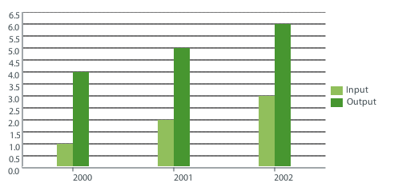
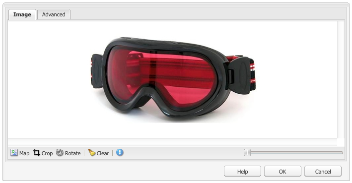
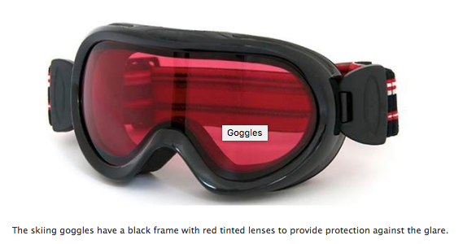
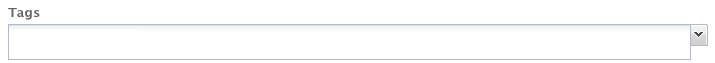

# 頁面創作元件{#components-for-page-authoring}

在為標準網頁創作內容時，以下元件將供使用。 它們構成了可用元件的子集，可用於標準安裝的出廠AEM設定。

有些可立即通過旁邊站獲得，其他各種也可通過 [設計模式](/help/sites-classic-ui-authoring/classic-page-author-design-mode.md) 啟用/禁用它們。

>[!CAUTION]
>
>本節僅討論標準安裝中現成的元件AEM。
>
>根據您的實例，您可能已根據您的要求明確開發了自定義元件。 這些元件甚至可能與此處討論的某些元件具有相同的名稱。

元件在 [編輯頁面](/help/sites-classic-ui-authoring/classic-page-author-edit-content.md) 從 **元件** 和 **插入新元件** 選擇器(在 **將元件或資產拖到此處** )的正平方根。

您可以選擇一個元件並將其拖到頁面上的所需位置，然後 [編輯內容和屬性](/help/sites-classic-ui-authoring/classic-page-author-edit-content.md#editing-a-component-content-and-properties)。

元件按各種類別（元件組）排序，包括（用於頁面創作）:

* [常規](#general):包括基本元件，包括文本、影像、表、圖表等。
* [列](#columns):包括組織內容佈局所需的元件。
* [窗體](#formgroup):包括建立表單所需的所有元件。

## 一般 {#general}

「常規」(General)元件是用於建立內容的基本元件。

### 帳戶項目 {#account-item}

您可以定義包含標題和說明的連結。


### 自我調整影像 {#adaptive-image}

自適應影像基礎元件生成影像，這些影像的大小適合開啟網頁的窗口。 要使用元件，請從檔案系統或DAM提供映像資源。 當網頁開啟時，Web瀏覽器下載已調整大小的影像的副本，以便它適合當前窗口。

以下特徵可確定窗口的大小：

* 設備螢幕：移動設備通常顯示網頁，以便其跨整個螢幕延伸。
* Web瀏覽器窗口大小：筆記型電腦和台式電腦的用戶可以調整Web瀏覽器窗口的大小。

例如，當在手機上開啟網頁時，該元件生成小影像，當在平板電腦上開啟中等尺寸影像。 在膝上型電腦上，當在最大化的Web瀏覽器中開啟頁面時，元件會建立並傳送大影像。 當調整Web瀏覽器的大小以適應螢幕的一部分時，元件通過提供較小的影像和刷新視圖來適應。

#### 支援的影像格式 {#supported-image-formats}

可以將以下檔案副檔名的影像檔案與Adaptive Image元件一起使用：

* .jpg
* .jpeg
* .PNG
* .gif &#42;&#42;

>[!CAUTION]
>
>&#42;&#42; 對於自適應格式副本，不支AEM持動畫.gif檔案。

#### 影像大小和質量 {#images-sizes-and-quality}

下表列出了為給定視區寬度生成的影像的寬度。 計算所生成的影像的高度以保持恆定的長寬比，並且在影像邊緣內不出現空白。 裁剪可用於避免空白。

當影像為JPEG影像時，視區大小也會影響JPEG質量。 可能具有以下JPEG品質：

* 低(0.42)
* 中(0.82)
* 高(1.00)

| 視區寬度範圍（像素） | 影像寬度（像素） | JPEG 品質 | 目標設備類型 |
|---|---|---|---|
| 寬度&lt;= 319 | 320 | 低 |  |
| 寬度= 320 | 320 | 中 | 手機（縱向） |
| 320 &lt;寬&lt; 481 | 480 | 中 | 手機（橫向） |
| 480 &lt;寬&lt; 769 | 476 | 高 | 平板電腦（縱向） |
| 768 &lt;寬&lt; 1025 | 620 | 高 | 平板（橫向） |
| 寬度&lt;= 1025 | 完全（原始大小） | 高 | 桌面 |

#### 屬性 {#properties}

該對話框允許您編輯自適應影像元件實例的屬性，其中許多屬性與其所基於的影像元件相同。 屬性可在以下兩個頁籤中使用：

* **影像**

   * **影像**
從內容查找器中拖動影像，或按一下以開啟可載入影像的瀏覽窗口。 載入影像後，可裁剪影像、旋轉影像或刪除影像。 要放大和縮小影像，請使用影像下方的幻燈片欄（在「確定」和「取消」按鈕上方）

   * **裁剪**
裁剪影像。 拖動邊框以裁剪影像。

   * **旋轉**
重複按一下「旋轉」(Rotate)，直到影像按需要旋轉。

   * **清除**
刪除當前映像。

* **進階**

   * **標題**
Adaptive Image元件不使用此屬性。

   * **替代文字**
用於影像的替代文本。

   * **連結至**
Adaptive Image元件不使用此屬性。

   * **說明**
Adaptive Image元件不使用此屬性。

#### 擴展自適應影像元件 {#extending-the-adaptive-image-component}

有關自定義Adaptive Image元件的資訊，請參見 [瞭解自適應影像元件](/help/sites-developing/responsive.md#using-adaptive-images)。

### 傳送 {#carousel}

「旋轉軸元件」允許您顯示與單個頁面關聯的影像：

* 一次一個
* 短暫
* 按您指定的順序
* 具有您指定的延遲

點擊式控制項還允許用戶根據需要即時循環瀏覽顯示的頁面。 按一下當前可見的頁面影像將帶您進入該頁面。 換句話說，旋轉木馬充當導航控制。

#### 屬性 {#properties-1}

以下頁籤提供：

* **旋轉木馬**
在此指定旋轉傳送帶的操作方式：

   * 播放速度顯示下一張幻燈片之前的時間（毫秒）。
   * 轉換時間兩個幻燈片之間轉換的時間（毫秒）。
   * 控制項樣式各種選項可從下拉菜單獲得；例如，Prev/Next按鈕，Top-Right開關。

* **清單**
在此，您可以指定在旋轉傳送過程中如何包括頁面：

   * **生成清單使用**
生成頁面清單的方法有多種 — 子頁、固定清單、搜索或高級搜索（下面都介紹）。
請注意，無論您選擇哪種方法，您清單中包括的頁面都應該已經有一個與頁面關聯的影像，但是該影像將顯示在旋轉傳送器中。 如果該頁面的「頁面屬性」下沒有給定頁面的影像，則應在開始前將影像與頁面相關聯，否則，旋轉傳送將顯示空白（或大多為空白）頁面。 請參閱 [編輯頁面屬性](/help/sites-classic-ui-authoring/classic-page-author-edit-page-properties.md)。
根據您選擇的項目，將出現以下新面板：

      * **子頁面的選項**

         * **父頁**
手動或使用選擇器指定路徑。 留空以將當前頁用作父頁。
      * **固定清單的選項**

         * **頁面**
選擇頁面清單。 使用 
`+` 按鈕來調整順序。
      * **搜尋選項**

         * **開始於**
輸入起始路徑（手動或使用選擇器）。

         * **搜索查詢**
您可以輸入純文字檔案搜索查詢。
      * **進階搜尋的選項**

         * **查詢生成器謂語表示法**
您可以使用Querybuilder謂詞表示法輸入搜索查詢。 例如，您可以輸入&quot;fulltext=Marketing&quot;，使其內容中包含&quot;Marketing&quot;的所有頁面都顯示在旋轉木馬中。
請參閱 [QueryBuilder API](/help/sites-developing/querybuilder-api.md) 的子菜單。
   * **排序依據**
選擇 
`jcr:title`。 `jcr:created`。 `cq:lastModified`或 `cq:template` 的下界。

   * **限制**
您希望在旋轉木馬中使用的最大項目數；這是可選的。


>[!NOTE]
>
>您可以為Adobe Experience Manager建立一個自定義旋轉木馬元件，該元件顯示位於DAM中的數AEM字資產。 有關資訊，請參見 [為Adobe Experience Manager建立定制旋轉木馬元件](https://helpx.adobe.com/experience-manager/using/custom-carousel-components.html)。

### 圖表 {#chart}

圖表元件允許您添加條形圖、折線圖或餅圖。 根AEM據您提供的資料建立圖表。 通過直接在「資料」頁籤中鍵入或通過複製和貼上電子錶格來提供資料。

* **資料**

   * **圖表資料**
使用CSV格式輸入圖表資料；逗號分隔值格式使用逗號(&quot;,&quot;)作為欄位分隔符。

* **進階**

   * **圖表類型**
從餅圖、折線圖和條形圖中選擇。

   * **備選文本**
顯示的替代文本，而不是圖表。

   * **寬度**
圖表寬度（以像素為單位）。

   * **高度**
圖表高度（以像素為單位）。

下面顯示圖表資料的示例，後面是結果條形圖：

 

>[!NOTE]
>
>您可以建立一個自AEM定義圖表控制項，該控制項顯示JCR中的AEM資料。 有關資訊，請參見 [在圖表中顯示Adobe Experience Manager資料](https://helpx.adobe.com/experience-manager/using/displaying-experience-manager-data-chart.html)。

### 內容片段 {#content-fragment}

>[!CAUTION]
>
>內容片段管理的全部功能僅在觸控優化的UI中可用。
>
>在經典UI側腳中可以看到內容片段元件，但沒有其他功能。

[內容片段](/help/sites-classic-ui-authoring/classic-page-author-content-fragments.md) 建立並管理為獨立於頁面的資產。 然後，在創作內容頁面時，可以使用這些片段及其變體。

### Design Importer {#design-importer}

這允許您上載包含設計包的zip檔案。

### 下載 {#download}

下載元件在所選網頁上建立一個連結以下載特定檔案。 您可以從Content Finder中拖動資產或上載檔案。

* **下載**

   * **說明**
隨下載連結顯示的簡短說明。

   * **檔案**
可在生成的網頁上下載的檔案。 從內容查找器中拖動資產，或按一下區域以上載可供下載的檔案。

下面的示例在Geometrixx中顯示Download元件：


### 外部 {#external}

外部應用程式整合元件(**外部**)使您能夠使用iframe將外部應AEM用程式嵌入到頁中。

* **外部**

   * **目標應用程式**

      指定要整合的Web應用程式的URL;例如：

      ```
      https://en.wikipedia.org/wiki/Main_Page
      ```

   * **傳遞參數**

      在需要時，選中要傳遞給應用程式的參數框。

   * **寬度和高度**

      定義iframe的大小

將外部申請納入本頁段AEM制；例如，當使用 `https://en.wikipedia.org/wiki/Main_Page`:


>[!NOTE]
>
>根據您的使用案例，其他選項可用於整合外部應用程式。 這樣 [Portlet的整合](/help/sites-administering/aem-as-portal.md)。

### 閃光燈 {#flash}

Flash元件允許您載入Flash影片。 您可以將Flash資產從內容查找器拖到元件上，或者可以使用以下對話框：

* **閃光燈**

   * **Flash 影片**

      Flash電影檔案。 從內容查找器中拖動資產，或按一下以開啟瀏覽窗口。

   * **大小**

      Dimension（以像素為單位），顯示區域保持影片。

* **替代影像**

   要顯示的替代影像

* **進階**

   * **上下文功能表**

      指示應顯示還是隱藏上下文菜單。

   * **窗口模式**

      窗口的顯示方式，例如不透明、透明或作為不同（實體）窗口。

   * **背景色彩**

      從提供的顏色圖表中選擇的背景顏色。

   * **最低版本**

      運行影片所需的AdobeFlash Player的最低版本。 預設值為9.0.0。

   * **屬性**

      需要任何其他屬性。

### 影像 {#image}

影像元件根據指定的參數顯示影像和附帶的文本。

您可以上載影像，然後編輯和操作影像（例如裁剪、旋轉、添加連結/標題/文本）。

可以從 [內容查找器](/help/sites-classic-ui-authoring/classic-page-author-env-tools.md#the-content-finder) 直接到元件或其「編輯」(Edit)對話框。 也可以按兩下「編輯」對話框的中央區域以瀏覽本地檔案系統並上載影像。 「編輯」(Edit)對話框的兩個頁籤還控制影像的所有定義和操作：



>[!NOTE]
>
>無法使用Internet Explorer監視上載的進度。
>
>Internet Explorer用戶需要上載映像並按一下 **確定** 然後重新開啟影像，以在預覽中查看上載的檔案並能夠執行修改（即裁剪）。
>
>查看 [認證平台](/help/release-notes/release-notes.md#certifiedplatforms) 的子菜單AEM。

載入映像時，可以配置以下內容：

* **地圖**

   要映射影像，請選擇映射。 您可以指定要如何建立影像映射（矩形、多邊形等）以及區域應指向的位置。

* **裁切**

   選擇「裁剪」以裁剪影像。 使用滑鼠裁剪影像。

* **旋轉**

   要旋轉影像，請選擇「旋轉」。 重複使用，直到影像按所需方式旋轉。

* **清除**

   刪除當前映像。

* **縮放欄**

   要放大和縮小影像，請使用影像下方的幻燈片欄（在「確定」和「取消」按鈕上方）

* **標題**

   影像的標題。

* **替代文字**

   建立可訪問內容時使用的替代文本。

* **連結至**

   建立指向網站中資產或其他頁面的連結。

* **說明**

   影像的說明。

* **大小**

   設定影像的高度和寬度。

最終影像(與 **標題** 和 **說明**)可顯示為：



### 配置容器 {#layout-container}

>[!CAUTION]
>
>儘管「佈局」容器元件在標準UI中可用，但其全部功能僅在啟用觸摸的UI中可用。 有關詳細資訊，請參閱 [響應佈局](/help/sites-classic-ui-authoring/classic-page-author-responsive-layout.md)。

### 清單 {#list}

「清單」元件允許您配置顯示清單的搜索條件：

* **清單**

   * **使用以下方式產生清單**

      在此指定清單將檢索其內容的位置。 有幾種方法：

   * 根據您選擇的項目，將出現以下新面板：

      * **子頁面的選項**

         * **兒童** （父頁）手動或使用選擇器指定路徑。 留空以將當前頁用作父頁。
      * **固定清單的選項**

         * **頁面**

            選擇頁面清單。 使用+添加更多條目和上/下按鈕來調整順序。
      * **搜尋選項**

         * **開始**

            輸入起始路徑（手動或使用選擇器）。

         * **搜尋查詢**

            您可以輸入純文字檔案搜索查詢。
      * **進階搜尋的選項**

         * **QueryBuilder 述詞記號**

            您可以使用Querybuilder謂詞表示法輸入搜索查詢。 例如，您可以輸入&quot;fulltext=Marketing&quot;，使其內容中包含&quot;Marketing&quot;的所有頁面都顯示在旋轉木馬中。

            請參閱 [QueryBuilder API](/help/sites-developing/querybuilder-api.md) 的子菜單。
      * **標記**

         指定 **父頁**。 **標籤/關鍵字** 和你所需的匹配條件。
   * **顯示為**

      您希望項目列出的方式；包括連結、續簽和新聞。

   * **排序方式**

      是否對清單進行排序，如果排序，則列出用於排序的條件。 您可以輸入條件或從提供的下拉清單中選擇一個條件。

   * **限制**

      指定要在清單中顯示的最大項目數。

   * **啟用資訊源**

      指示是否應為清單激活RSS源。

   * **每頁顯示項目數**

      在此可以指定要一次顯示的清單項數。 項數超過指定的清單將使用分頁方式在多個部分中顯示清單。


以下示例顯示 **清單** 元件顯示子頁清單的方式（設計由站點設計的自定義CSS定義控制）。


### 登入 {#login}

這些欄位提供「用戶名」和「密碼」欄位。


您可以配置：

* 登入

   * 區域標籤

      輸入欄位的導入文本。

   * 使用者名稱標籤

      標籤用戶名欄位的文本。

   * 密碼標籤

      標籤密碼欄位的文本。

   * 登入按鈕標籤

      登錄按鈕的文本。

   * 重定向至

      您可以在您的網站上指定用戶登錄後應開啟的頁面。

* 已登入

   * 繼續按鈕標籤

      用於指示用戶已登錄的文本。

### 訂單狀態 {#order-status}

* **標題**

   * **標題**

      指定要顯示的標題文本。

   * **連結**

      指定應顯示訂單狀態的頁面（產品）。

   * **類型/大小**

      從提供的選擇中選擇。


### 引用 {#reference}

的 **引用** 元件，用於引用網站的另一頁AEM（在當前實例內）中的文本。 然後，所引用段落的內容會像出現在當前頁面上一樣出現。 當源段落更改時（可能需要刷新頁面）將更新內容。

* **段落引用**

   * **引用**

      指定要引用的頁面和段落的路徑（包括內容）。

要指定段落的路徑，您需要將路徑（頁面）尾碼為：

`.../jcr:content/par/<paragraph-ID>`

例如：

`/content/geometrixx-outdoors/en/equipment/biking/cajamara/jcr:content/par/similar-products`

除了引用特定段落外，還可以修改路徑以指定整個par-system。 通過在路徑上添加以下內容，可以執行此操作：

`/jcr:content/par`

例如：

`/content/geometrixx-outdoors/en/equipment/biking/cajamara/jcr:content/par`

配置完後，內容將與源頁面上的內容完全相同。 僅當開啟元件進行編輯時，才會看到它是引用：


### 搜尋 {#searching}

「搜索」元件將搜索功能添加到頁面。

您可以配置：

* 搜尋

   * **節點類型**

      如果搜索範圍限於特定節點類型，請在此處列出這些搜索；比如說， `cq:Page`。

   * **搜尋路徑:**

      指定要搜索的分支的根頁。

   * **搜尋按鈕文字**

      實際搜索按鈕上顯示的名稱。

   * **統計文本**

      搜索結果上方顯示的文本。

   * **無結果文字**

      如果沒有結果，則顯示此處輸入的文本。

   * **拼寫檢查文字**

      如果輸入了類似的術語，則此文本將顯示在術語之前。
例如，如果鍵入geometrixxe，系統將顯示「您是說？ 幾何」。

   * **類似頁面文本**

      顯示在類似頁面結果旁邊的文本。 按一下此連結可查看內容類似的頁面。

   * **相關搜索文本**

      在搜索相關術語和主題旁邊顯示的文本。

   * **搜索趨勢文本**

      用戶輸入的搜索詞上方的標題。

   * **結果頁標籤**

      此清單底部顯示的文本，其中包含指向其他結果頁的連結。

   * **上一個標籤**

      顯示在前一個搜索頁的連結上的名稱。

   * **下一標籤**

      顯示在後續搜索頁連結上的名稱。

下面的示例顯示搜索單詞後的Search元件 *幾何* 從標準安裝的根目錄。 這還說明了結果的分頁：


以下示例顯示拼寫錯誤且不可用的搜索詞：


### Sitemap {#sitemap}

自動站點地圖清單（具有預設設定）列出當前網站中的所有頁面（作為活動連結）。 例如，抽取顯示：


如果需要，您可以配置：

* **Sitemap**

   * **根路徑**

      清單的起始路徑。

### Slideshow {#slideshow}

此元件允許您載入一系列影像，以作為幻燈片在頁面上顯示。您可以添加或刪除影像，並為每個影像分配標題。 在「高級」(Advanced)下，還可指定顯示區域的大小。

您可以配置：

* **幻燈片**

   * **新增幻燈片**

      可以使用 **添加** (和 **刪除**)按鈕。

   * **標題**

      如果需要，請指定標題。 這個重疊在適當的幻燈片上。

* **進階**

   * **大小**

      指定寬度和高度（以像素為單位）。

然後，幻燈片放映元件會在一段較短的時間內反複按順序顯示每個元件，然後才會逐次淡出到下一張幻燈片：


### 表格 {#table}

>[!NOTE]
>
>的 **表格** 元件基於 [富格文本編輯器](/help/sites-classic-ui-authoring/classic-page-author-rich-text-editor.md)的 **[文本](#text)** 元件。
>
>建議使用 **表格** 表的元件，但也可以使用 **文本** 元件。

的 **表格** 已預配置元件，以便構建、填充和格式化表。 使用對話框，您可以通過以下任一方法配置表並建立內容：

* 從頭開始
* 從外部編輯器（如Excel、OpenOffice、記事本等）複製和貼上電子錶格或表。


以下螢幕快照顯示了表格元件的示例；設計由站點特定的CSS確定：


### 標記雲 {#tag-cloud}

標籤雲以圖形方式顯示了應用於網站內容的標籤選擇：


配置標籤雲元件時，可以指定：

* **要顯示的標籤**
要顯示的標籤從中收集。 從頁面、包含所有子項或所有標籤的頁面中選擇。

* **頁面**
選擇要引用的頁面。

* **標籤上沒有連結**
顯示的標籤是否應用作連結。

有關應用標籤的詳細資訊，請訪問 [使用標籤](/help/sites-classic-ui-authoring/classic-feature-tags.md)。

### 文字 {#text}

>[!NOTE]
>
>的 **文本** 元件基於 [富格文本編輯器](/help/sites-classic-ui-authoring/classic-page-author-rich-text-editor.md)的 **[表格](#table)** 元件。
>
>建議使用 **表格** 表的元件，但也可以使用 **文本** 元件。

「文本」元件允許您使用WYSIWYG編輯器輸入文本塊，並提供 [富格文本編輯器](/help/sites-classic-ui-authoring/classic-page-author-rich-text-editor.md)。 通過選擇表徵圖，可以格式化文本，包括字型特徵、對齊方式、連結、清單和縮進。


開啟 **樣式** 頁籤 **編輯** 對話框：

* **空格字元**
* **文字樣式**

格式化的文本將顯示在頁面上；實際設計將取決於站點CSS:


有關「文本」元件和「富格文本」編輯器提供的功能的詳細資訊，請參見 [富格文本編輯器](/help/sites-classic-ui-authoring/classic-page-author-rich-text-editor.md) 的子菜單。

#### 原位編輯 {#inplace-editing}

除了基於對話框的富格文本編輯模式之外，還AEM提供 [原位編輯](/help/sites-authoring/editing-content.md)，允許在頁面佈局中顯示文本時直接編輯文本。

### 文字和影像 {#text-image}

「文本和影像」元件添加文本塊和影像。 還可以單獨添加和編輯文本和影像。 查看 [文本](#text) 和 [影像](#image) 元件，以獲取詳細資訊。

 

您可以配置：

* **元件樣式** (**樣式**)

   這裡，您可以左對齊或右對齊影像。 預設值為 **左** 與左側的影像對齊。

* **影像屬性** (**高級映像屬性**)

   允許您指定以下內容：

   * **影像資產**

      上載所需的映像。

   * **標題**

      塊名；將由mouseover顯示。

   * **替代文字**

      如果無法顯示影像，則要顯示的替代文本。 如果保留為空，則使用標題。

   * **連結到**

      指定目標路徑。

   * **說明**

      影像的說明。

   * **大小**

      設定影像的高度和寬度。

以下示例顯示顯示左對齊影像的文本影像元件：


### 標題 {#title}

標題元件可以：

* 顯示當前頁面的名稱；通過將「標題」欄位留空來完成此操作
* 顯示在「標題」欄位中指定的文本。

您可以配置：

* **標題**

   如果要使用頁面標題以外的名稱，請在此處輸入。

* **連結**

   如果標題將作為連結操作，則URI。

* **類型/大小**

   從下拉清單中選擇「小」或「大」。 小是作為影像生成的。 「大」(Large)生成為文本。

以下示例顯示 **標題** 顯示元件；設計由特定於站點的CSS確定。


### 影片 {#video}

的 **視頻** 元件允許您將預定義的現成視頻元素放置在頁面上。

另請參閱 [配置視頻配置檔案](/help/sites-administering/config-video.md#configuringvideoprofiles) 用於HTML5元素。

在頁面上放置元件實例後，可以配置：

* 影片

   * **視訊資產**

      上載或刪除視頻資產。

   * **大小**

      視頻的本機大小(寬度x高度（像素）)將顯示在「大小」(Size)旁邊的框中（請參閱上面）。 如果要覆蓋視頻的本機尺寸，請在此處手動輸入寬度和高度尺寸。 按一下 **確定** 取消對話。

>[!NOTE]
>
>支援的格式包括：
>
>* `.mp4`
>* `Ogg`
>* `FLV` (Flash視頻)
>


## 欄 {#columns}

列是控制中內容佈局的機AEM制。 在用於建立兩列和/或三列的標準安裝元件中提供。

以下示例顯示了正在使用的2列和3列元件。 可將佔位符用於新元件：


### 2 欄 {#columns-1}

列控制元件，預設為2個等於的列。

### 3 欄 {#columns-2}

預設為3個等於列的列控制元件。

### 欄控制項 {#column-control}

「列控制」元件允許用戶選擇如何將網頁主面板中的內容拆分為多列。 用戶可以選擇所需的列數（從預定義清單中），然後在每列中建立、刪除或移動內容。

* **欄控制項**

   * **欄配置**

      選擇要呈現的列數。 建立後，每列都有其自己的連結，用於在添加內容時拖動元件或資產。

## 表單 {#form}

表單元件用於為訪問者建立表單以提交輸入。 Forms和表單元件可用於收集包括用戶反饋（例如，客戶滿意度調查表）和用戶資訊（例如，用戶註冊）的資訊。

>[!NOTE]
>
>請參閱 [AEM Forms幫助](/help/forms/home.md) 有關AEM Forms的資訊。

Forms由幾個不同的部分組成：

* **表單**

   表單元件定義頁面上新表單的開始和結束。 然後，可以將其它元件放置在這些元素之間，如表、下載等。

* **窗體域和元素**

   表單域和元素可以包括文本框、單選按鈕、影像等。 用戶通常在表單域中完成操作，如鍵入文本。 有關詳細資訊，請參閱單個窗體元素。

* **配置檔案元件**

   配置檔案元件與用於社會協作的訪問者配置檔案以及需要訪問者個性化的其他區域相關。

下面是示例表單；它由 **窗體** 元件（起始和終止），帶兩個 **窗體** **文本** 用於輸入的欄位， a **常規** **文本** 用於導入文本和 **提交** 按鈕


>[!NOTE]
>
>有關進一步開發和自定義表單的資訊，請參閱 [開發Forms頁](/help/sites-developing/developing-forms.md)。 這包括添加操作、約束、預載入欄位和使用指令碼調用服務以採取操作等。

### 對（多）窗體元件公用的設定 {#settings-common-to-many-form-components}

雖然每個表單元件都有不同的用途，但許多元件都由相似的選項和參陣列成。

配置任何表單元件時，對話框中都提供以下頁籤：

* **標題和文字**

   在此，您需要指定基本資訊，如表單的標題和隨附的文本。 在適當情況下，它還允許您定義其它關鍵資訊，例如欄位是否是多選項和可供選擇的項目。

* **初始值**

   允許您指定預設值。

* **限制**

   在此，您可以指定是否需要欄位，並將約束放在該欄位上（例如，必須是數字，等等）。

* **樣式**

   指示欄位的大小和樣式。

>[!NOTE]
>
>您看到的欄位會因各個元件而顯著不同。

這些頁籤為您提供了必要的參數；這些可能取決於單個元件類型，但可能包括：

* **標題和文字**

   * **元素名稱**

      窗體元素的名稱。 這表示在儲存庫中儲存資料的位置。
這是必填欄位，只應包含以下字元：

      * 字母數字字元
      * `_ . / : -`
   * **標題**

      與欄位一起顯示的標題。 如果留空，則顯示預設標題。

   * **說明**

      允許您根據需要為用戶提供其他資訊。 在窗體中，該欄位以比標題小的字型顯示。

   * **顯示/隱藏**

      確定欄位的可見時間。


* **初始值**

   * **預設值**

      開啟表單時在欄位中顯示的值；即在用戶進行任何輸入之前。

* **限制**

   * **必要**

      這取決於表單元件類型，但提供了一個或多個按一下框以指示此欄位或此欄位的某些部分是必需的。

   * **必要訊息**

      一條消息，通知用戶需要此欄位；必填欄位也將標籤為星號和星號。

   * **限制**

      可用於選擇的約束取決於窗體元件類型。

   * **限制訊息**

      一條消息，通知用戶需要什麼。

* **樣式**

   * **大小**

      在行和列中。

   * **寬度**

      以像素顯示。

   * **CSS**

### 窗體（元件） {#form-component}

「表單」元件使用 **窗體開始** 和 **表單結束** 元素。 這些檔案始終成對，以確保正確定義表單。


在表單的開始和結束之間，您可以添加為用戶定義實際輸入欄位的表單元件。

#### 表單開始 {#start-of-form}

需要此元件來定義頁面上新表單的開始。 您可以配置：

* **表單**

   * **感謝頁面**

      要引用的頁面感謝訪問者提供他們的輸入。 如果留空，則提交後將重新顯示表單。

   * **啟動工作流程**

      確定提交表單後觸發的工作流。

* **進階**

   * **動作類型**

      表單需要操作。 該操作定義用用戶提交的資料觸發的用於執行的操作(類似於HTML中的操作=)。 有些人需要 **操作配置**。

      標準安裝中包括操作類型的選AEM擇：

      * **帳戶請求**
      * **建立內容**
      * **建立銷售機會**
      * **建立和更新帳戶**
      * **電子郵件服務: 建立訂閱者並新增到清單**
      * **電子郵件服務: 傳送自動回應的電子郵件**
      * **電子郵件服務: 將使用者從清單中取消訂閱**
      * **編輯社群**
      * **編輯資源**
      * **編輯工作流程控制的資源**
      * **郵件**
      * **已下單的訂單詳細資訊**
      * **設定檔更新**
      * **重設密碼**
      * **設定密碼**
      * **存放區內容**

         這是預設的操作類型。

      * **使用上載儲存內容**
      * **提交訂單**
      * **取消訂閱者的訂閱**
      * **更新訂單**
   * **表單識別碼**

      表單標識符唯一地標識表單。 如果單頁上有多個表單，請使用表單標識符；確保它們有不同的標識符。

   * **載入路徑**

      用於將預定義值載入到表單域中的節點屬性的路徑。
這是一個可選欄位，它指定儲存庫中節點的路徑。 如果此節點具有與欄位名稱匹配的屬性，則表單上的相應欄位將預先載入這些屬性的值。 如果不存在匹配項，則欄位包含預設值。
使用 **載入路徑** 可以使用必填欄位中的值預載入窗體。 請參閱 [預載入窗體值](/help/sites-developing/developing-forms.md#preloading-form-values)。

   * **用戶端驗證**

      指示此表單是否需要客戶端驗證（伺服器驗證） *總是* 發生。) 這可以與 **Forms卡普查** 元件。

   * **驗證資源類型**

      如果要驗證整個表單（而不是單個欄位），請定義表單驗證資源類型。 如果要驗證完整表單，還應包括以下內容之一：

      * 客戶端驗證指令碼：

         `/apps/<myApp>/form/<myValidation>/formclientvalidation.jsp`

      * 用於伺服器端驗證的指令碼：

         `/apps/<myApp>/form/<myValidation>/formservervalidation.jsp`
   * **動作設定**

      中提供的選項 **操作配置** 取決於 **操作類型** 選定：

      * **帳戶請求**

         * **「建立帳戶」頁**
建立新帳戶時使用的頁。
      * **建立內容**

         * 內容路徑表單轉儲的任何內容的內容路徑。 輸入以斜槓結尾的路徑 `/`。 斜線表示，對於每個表單埠，在給定位置建立一個新節點；例如：
            `/forms/feedback/`

         * **類型**

            選擇所需類型。

         * **表單**

            指定窗體。

         * **轉譯工具**

            從清單中選擇所需選項。

         * **資源類型**

            如果設定，則將此項添加到每個注釋中，作為 `sling:resourceType`

         * **檢視選擇器**
      * **建立銷售機會**

         * **潛在客戶將添加到此清單**
指定所需的潛在顧客清單。
      * **建立和更新帳戶**

         * **初始群組**

            要將新用戶分配給的組。

         * **首頁**

            成功登錄後顯示的頁面。

         * **路徑**

            建立和儲存新帳戶的路徑（相對）。

         * **檢視資料...**

            按一下此按鈕可訪問批量編輯器中有關表單結果的資訊。 從此處，您可以將資訊導出到 `.tsv` （以制表符分隔）檔案（例如，在Excel電子錶格中使用）。
      * **郵件**

         * **從**

            輸入電子郵件應來自的電子郵件地址。

         * **Mailto**

            輸入表單要發送到的電子郵件地址。

         * **CC**

            輸入抄送電子郵件地址。

         * **BCC**

            輸入密件抄送電子郵件地址。

         * **主旨**

            輸入電子郵件的主題。
      * **重設密碼**

         * **變更密碼頁面**

            更改密碼時使用的頁。
      * **存放區內容**

         * **內容路徑**

            表單轉儲的任何內容的內容路徑。 輸入以斜槓結尾的路徑 `/`。 斜線表示，對於每個表單埠，在給定位置建立一個新節點；例如：
            `/forms/feedback/`

         * **檢視資料...**

            按一下此按鈕可訪問批量編輯器中有關表單結果的資訊。 在此處，可以將資訊導出到.tsv（以制表符分隔）檔案（例如，在Excel電子錶格中使用）。
      * **透過上傳存放內容**

         此選項與 **儲存內容**。

      * **取消訂閱者的訂閱**

         * **銷售機會將從此清單中刪除**

            指定所需的潛在顧客清單。


#### 表單結尾 {#end-of-form}

這標籤了表格的結尾。 您可以配置：

* **表單結尾**

   * **顯示提交按鈕**

      指示是否應顯示「提交」按鈕。

   * **提交名稱**

      如果在表單中使用多個提交按鈕，則為標識符。

   * **提交標題**

      按鈕上顯示的名稱，如提交或發送。

   * **顯示重設按鈕**

      選中複選框可使「重置」按鈕可見。

   * **重設標題**

      「重置」按鈕上顯示的名稱。

   * **說明**

      按鈕下方顯示的資訊。

### 帳戶名稱 {#account-name}

這允許用戶輸入帳戶名：


### 地址 {#address}

這允許您添加具有以下格式的國際地址欄位：


該元件已配置為立即使用，但您可以根據需要更改配置。 例如，可以為地址的各個元素添加約束。 將欄位留空將使用預設設定。

### Captcha {#captcha}

驗證碼元件要求用戶鍵入螢幕上顯示的字母數字字串。 每次刷新都會更改字串。


您可以為此元件配置各種參數，包括在驗證碼字串無效時顯示的消息。

### 核取方塊群組 {#checkbox-group}

通過複選框，可以生成多個複選框中的一個的清單，其中幾個可以同時選中。


可以指定各種參數，包括標題、說明和元素名稱。 使用+和 — 按鈕可以添加或刪除項目，然後使用向上和向下箭頭來定位項目。

>[!NOTE]
>
>使用 **項目載入路徑** 可以使用值預載入複選框組清單。
>
>請參閱 [預載入具有多個值的表單域](/help/sites-developing/developing-forms.md#preloading-form-fields-with-multiple-values)。

### 信用卡詳細資料 {#credit-card-details}

這允許您提供輸入信用卡詳細資訊所需的欄位。 您可以配置它以指定接受的卡類型和所需資訊（例如安全代碼）。


### 下拉式清單 {#dropdown-list}

可以配置下拉清單，為您提供一系列值供選擇：


您可以指定要顯示在清單中的標題和項。 使用+和 — 按鈕，您可以添加或刪除清單項，然後使用「上」和「下」按鈕來定位它們。 您可以指定是否允許用戶從清單中選擇多個項目，以及首次開啟清單時應自動選擇的任何項目（初始值）。

>[!NOTE]
>
>使用 **項目載入路徑** 可以使用值預載入下拉清單。
>
>請參閱 [預載入具有多個值的表單域](/help/sites-developing/developing-forms.md#preloading-form-fields-with-multiple-values)。

### 檔案上傳 {#file-upload}

檔案上載元件為用戶提供了用於選擇和上載檔案的機制。


>[!NOTE]
>
>您可以建立自定義上載元件以將檔案上載到Sling Servlet。 有關資訊，請參見 [正在將檔案上載到Adobe Experience Manager](https://helpx.adobe.com/experience-manager/using/uploading-files-aem1.html)。

### 隱藏欄位 {#hidden-field}

此元件允許您建立隱藏欄位。 可用於各種用途；例如，在提交表單後需要執行操作，或在後處理中需要隱藏資料時。


>[!NOTE]
>
>您還可以根據表單中其他欄位的值自定義表單以顯示或隱藏特定表單元件。 僅在特定條件下需要更改表單域的可見性時，更改表單域的可見性非常有用。
>
>請參閱 [顯示和隱藏窗體元件](/help/sites-developing/developing-forms.md#showing-and-hiding-form-components)。

### 影像按鈕 {#image-button}

影像按鈕允許您使用自己的影像和文本建立按鈕：


### 影像上載 {#image-upload}

所述影像上載元件為用戶提供用於選擇和上載影像檔案的機制。


### 連結欄位 {#link-field}

連結欄位允許用戶指定URL:


最常用於日曆事件表單，其中用於事件的URL/連結欄位。

### 密碼欄位 {#password-field}

這用於允許用戶輸入其密碼：


### 密碼重設 {#password-reset}

此元件為用戶提供了兩個欄位：

* 密碼的輸入
* 重複輸入密碼以檢查輸入是否正確。

使用預設設定，元件將顯示為：


### 選項按鈕群組 {#radio-group}

無線電組為您提供了多個無線電複選框之一的清單，在任何特定時間都只能選擇其中一個複選框。

您可以指定元素名稱以及標題和說明使用+和 — 按鈕可以添加或刪除項目，使用向上和向下箭頭定位項目，並根據需要指定預設值：


>[!NOTE]
>
>使用 **項目載入路徑** 可以使用值預載入無線電組。
>
>請參閱 [預載入具有多個值的表單域](/help/sites-developing/developing-forms.md#preloading-form-fields-with-multiple-values)。

### 提交按鈕 {#submit-button}

此元件允許您使用以下任一預設文本建立提交按鈕：


或者用你自己的簡訊：


### 標記欄位 {#tags-field}

此欄位允許您選擇標籤：



可以指定各種參數，包括可使用專用頁籤使用的命名空間：

* **標記欄位**

   * **允許的命名空間**

      * **Geometrixx Outdoors**
      * **工作流程**
      * **論壇**
      * **股票攝影**
      * **Geometrixx媒體**
      * **標準標記**
      * **營銷**
      * **資產屬性**
   * **寬度 (以像素為單位)**
   * **快顯視窗大小**


### 文字欄位 {#text-field}

標準文本欄位可以配置為您所需的大小，並在消息中使用您自己的提示：


### 工作流程提交按鈕 {#workflow-submit-button-s}

這允許您建立「提交」按鈕以在工作流中使用。


